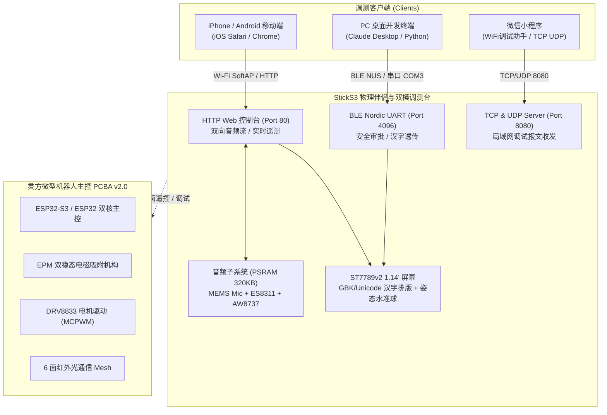

# yunyu-esp32

<div align="center">

[](https://opensource.org/licenses/Apache-2.0)
[](https://platformio.org/)
[](https://www.python.org/)
[](./hardware/)
[](./.github/workflows/ci.yml)

**灵方 (LingCube) 微型自重构机器人生态官方开源硬件、嵌入式固件与地面调测终端套件**  
*Official Open-Source Hardware, Firmware & Ground HIL Terminal for the LingCube Robotics Ecosystem*

[English](#english-summary) | [简体中文](#核心特性) | [快速起步](#快速起步-quick-start) | [硬件引脚](#硬件定义与引脚映射) | [文档目录](#文档与开发指南)

</div>

---

## 📖 项目简介 (Overview)

`yunyu-esp32` 是灵方微型自重构机器人生态系统的核心物理中枢与固件基座。本项目深度整合了：
1. **M5Stack StickS3 物理伴侣与双模调测终端 (`firmware/m5sticks3_buddy`)**：
   基于 ESP32-S3-PICO-1（8MB Flash + 8MB PSRAM），集成了 BLE Nordic UART 物理网关、2.4GHz Wi-Fi (SoftAP/Web/TCP/UDP) 全互通、10 秒 16kHz WAV 双向音频流互传与高保真回放、全集 23,940 条目 GBK-to-Unicode Flash 字库、BMI270 六轴姿态水准仪。
2. **灵方微型机器人主控 PCBA v2.0 (`hardware/`)**：
   包含 4 层沉金工业级 PCB 原理图与版图（KiCad）、量产 Gerber 光绘、SMT 表面贴装坐标 (CPL)、物料清单 (BOM)、3D CAD 装配模型（OpenSCAD）及 6 回路 SPICE 严苛仿真引擎。
3. **自主点亮与回归验证流水线 (`scripts/` & `tests/`)**：
   提供 6 步骤全自主芯片握手、1.5MBaud 极速固件写入与引导自愈代理、端到端 Wi-Fi 音频流全自动化验收套件与 27 项工程级测试。

---

## 🚀 核心特性 (Key Features)

### 1. 双向低延迟音频流互传 (Bidirectional Audio Stream)
- **设备端 16kHz 录音**：按压正面按键 A 触发 10 秒 16kHz 16-bit 单声道录音（板载 MEMS 硅麦 + ES8311 Codec），数据存入 8MB PSRAM 缓冲（320KB），自动封装标准 44 字节 RIFF WAV 标头；
- **网页端原生无缝回放**：手机接入免密热点 `StickS3-Buddy` 访问 `http://192.168.4.1`，通过标准流式 HTTP GET 直接拉取设备端 WAV 文件并播放，解决冲突标头与解码报错；
- **移动端 (iOS Safari / Android) 音频下发**：针对 iOS Safari 纯 HTTP 禁用 `getUserMedia` 的安全限制，采用原生音频与语音备忘录选取通道（彻底规避相机调用误触），前端自动重采样至 16kHz 并 POST 上传，驱动 StickS3 AW8737 功放与板载喇叭高保真回放。

### 2. 多通道全互联无线通信 (Tri-Mode Wireless)
- **BLE Nordic UART Service (NUS)**：广播包严控在 30 字节合规尺寸内（UUID `6e400001-...`），可与 Claude Desktop 上位机无缝建立物理安全审批长连接；
- **2.4GHz Wi-Fi SoftAP**：默认热点 SSID=`StickS3-Buddy`，IP=`192.168.4.1`，支持手机免密秒连；
- **局域网多协议并发**：TCP Server (Port 8080)、UDP Server (Port 8080) 与 HTTP Web Server (Port 80) 并行工作，支持微信小程序“WiFi调试助手”与网页端即连即显。

### 3. 全编码中文字符排版与字库自愈 (GBK-Unicode Engine)
- 提取全集 23,940 条目国标汉字与常用标点 Flash 映射表；
- 支持微信端 GBK、网页端 UTF-8 与 Python 字节序无感透传，彻底杜绝汉字方格子乱码。

### 4. 工业级 4 层 PCBA 与 SPICE 严苛仿真
- 4 层板叠层拓扑（Sig - GND - Power - Sig），高低压走线完全电气隔离；
- EPM 双稳态电磁铁 15A 瞬态放电退耦与 TVS 钳位保护；
- 6 回路 SPICE 仿真：电源跌落、退磁反向感应电动势、RC 硬件看门狗、PPTC 自恢复保险丝、地弹抑制与 IMU PMOS 冷启动隔离。

---

## 📐 系统架构 (Architecture)



---

## ⚡ 硬件定义与引脚映射 (Pinout Specifications)

### M5Stack StickS3 板载外设电气配置

| 外设模块 | 核心芯片 / 组件 | ESP32-S3 GPIO 引脚 | 驱动方式与通信协议 | 说明 |
| :--- | :--- | :--- | :--- | :--- |
| **电源门控** | M5PM1 PMIC | I2C (SDA: G10, SCL: G9) | I2C Addr `0x6E` | GPIO2: LCD 3.3V, GPIO3: 功放使能 |
| **正面按键 A** | 主功能按键 | **GPIO 11** | 内部上拉输入 | 单击录音 10 秒 / 再次单击停止 |
| **侧面按键 B** | 辅助控制按键 | **GPIO 12** | 内部上拉输入 | 切换显示看板与辅助控制 |
| **彩色屏幕** | ST7789v2 1.14" LCD | SPI3 (SCLK: G17, MOSI: G18, DC: G15, CS: G14, RST: G21) | SPI (27MHz DMA) | 135 × 240 分辨率，全色彩虹与中文渲染 |
| **6轴姿态计** | Bosch BMI270 | I2C (SDA: G10, SCL: G9) | I2C Addr `0x69` | 8KB 微码自愈，动态水准平衡算法 |
| **音频编解码** | ES8311 + AW8737 PA | I2S0 (LRCK: G7, BCLK: G8, DOUT: G6, DIN: G5) | I2S (16kHz 16bit Mono) | 板载 MEMS 硅麦采集 + 扬声器回放 |
| **外扩动力接口** | Grove 4-Pin 接口 | GPIO 1 / GPIO 2, 5V, GND | M5PM1 门控 5V | 驱动外部伺服与灵方单体 |

---

## 🛠️ 快速起步 (Quick Start)

### 1. 环境准备 (Prerequisites)
- Python 3.10+ 环境；
- [PlatformIO Core (CLI)](https://platformio.org/)；
- 安装项目依赖：
  ```bash
  pip install -r requirements.txt
  ```

### 2. 固件本地编译 (Local Build)
编译 M5Stack StickS3 固件：
```bash
python -m platformio run -d firmware/m5sticks3_buddy
```

### 3. 一键全自主烧录与硬件点亮 (Autonomous Bring-Up)
将 StickS3 插入电脑 USB 口（如 `COM3`），执行全自主极速烧录代理：
```bash
python scripts/autonomous_bringup_agent.py
```
*代理将自动检测端口、嗅探 ESP32-S3-PICO-1 芯片特征、调用 PlatformIO 构建镜像、以 1,500,000 Baud 写入 Flash，并监听重启引导日志。*

### 4. 双向音频流与硬件端到端自测 (E2E Verification)
电脑 Wi-Fi 连接 `StickS3-Buddy` 热点后，运行全自动端到端验收脚本：
```bash
python scripts/verify_audio_e2e_hardware.py
```

### 5. 执行单元与集成测试套件 (Pytest Suite)
```bash
pytest tests/ -v
```
*(27 项工程单测全绿通过，包括 WAV 头对齐、重采样算法、驱动回归、DRC与电路仿真)*

---

## 📱 手机端控制台交互指南 (Mobile Web Console)

1. **连接热点**：打开手机 Wi-Fi，搜索并连接 `StickS3-Buddy`（开放式免密热点）；
2. **访问控制台**：使用手机浏览器访问 `http://192.168.4.1`；
3. **播放设备端录音**：
   - 在 StickS3 上按下正面按键 A（或网页端点击【🔴 远程控制录音】）；
   - 设备屏幕显示红色 `● 正在录音 (REC)` 与倒计时；
   - 录制完毕后，网页端自动同步最新录音信息，点击【▶ 播放 StickS3 录音】即可直接聆听；
4. **网页端给 StickS3 发声**：
   - **极速试听**：点击【🎵 生成 16kHz 和弦测试音下发】，无需任何授权，StickS3 喇叭即刻响铃；
   - **手机传语音**：点击【📁 选取音频文件 / 语音备忘录上传】，调起系统语音备忘录或本地音频，网页自动重采样至 16kHz 上传，StickS3 喇叭即刻发声回放。

---

## 📂 仓库目录结构 (Directory Structure)

```
yunyu-esp32/
├── .github/workflows/ci.yml       # GitHub Actions 自动化 CI 脚本
├── firmware/
│   ├── m5sticks3_buddy/           # StickS3 物理伴侣与双模地面调测台工程 (PlatformIO)
│   │   ├── include/               # 音频流、Wi-Fi、BLE、GBK字库、HAL 驱动头文件
│   │   ├── src/                   # main.cpp, sticks3_hal.cpp, buddy_protocol.cpp
│   │   └── platformio.ini         # PlatformIO 编译构建配置
│   └── esp32_msrr_firmware/       # 灵方微型机器人主控嵌入式微内核工程
├── hardware/
│   ├── kicad/                     # KiCad 原理图与 4 层 PCB 版图源文件
│   ├── gerber/                    # 工业级量产 Gerber 光绘与钻孔文件
│   ├── bom/                       # 元器件采购选型与 BOM 清单
│   ├── cpl/                       # SMT 表面贴装贴片坐标清单
│   ├── cad/                       # OpenSCAD 3D 机械装配模型
│   └── scripts/                   # SPICE 电路仿真、热分布与容灾检验脚本
├── scripts/
│   ├── autonomous_bringup_agent.py# 6 步骤全自主硬件点亮与高速烧录代理
│   ├── verify_audio_e2e_hardware.py# Wi-Fi SoftAP 双向音频流硬件端到端自测套件
│   ├── sticks3_bringup_manager.py # 方案 1/2/3 综合 CLI 调测管理工具
│   ├── test_ble_encoding.py       # 蓝牙 NUS 多编码汉字收发测试脚本
│   └── gen_gbk_header.py          # 23,940 条目 GBK-Unicode Flash 映射生成器
├── tests/
│   ├── test_audio_stream_pipeline.py # 16kHz WAV 头部与重采样测试
│   ├── test_sticks3_three_schemes.py # 三方案自动化验证
│   ├── test_firmware_driver_suite.py # 嵌入式全驱动回归套件
│   └── test_pcb_design_and_verification.py # 电路网表与 SPICE 仿真验证
├── docs/                          # 硬件规格、引脚图谱与交接提示词标准库
├── CONTRIBUTING.md                # 开源项目代码贡献准则
├── LICENSE                        # Apache License 2.0 开源许可协议
├── README.md                      # 本文档
├── pyproject.toml                 # 现代化 Python 包元数据
└── requirements.txt               # Python 运行与构建依赖
```

---

## 📄 开源许可证 (License)

本项目遵循 [Apache License 2.0](./LICENSE) 协议开源。无论是软件代码、硬件设计（原理图/PCB/CAD），均保障商业友好与学术研究自由。

---

<div id="english-summary">

### English Summary

`yunyu-esp32` is the open-source hardware, firmware, and Ground Hardware-in-the-Loop (HIL) terminal ecosystem for the **LingCube (灵方) modular self-reconfigurable robot (MSRR)**.

**Key Highlights**:
- **M5Stack StickS3 Companion Terminal**: ESP32-S3-PICO-1 with 8MB Flash + 8MB PSRAM, Bluetooth Low Energy Nordic UART Service (30B compliant advertising), 2.4GHz Wi-Fi (SoftAP `StickS3-Buddy` 192.168.4.1 / Web / TCP / UDP 8080), 10s 16kHz 16-bit mono bidirectional audio streaming with AW8737 PA & ES8311 Codec, 23,940-glyph GBK-Unicode Flash font engine, and BMI270 dynamic attitude leveling bubble.
- **Robot Controller PCBA v2.0**: 4-layer industrial KiCad schematic and PCB layout, production Gerber deliverables, CPL pick-and-place, BOM, OpenSCAD CAD models, and 6-loop ngspice circuit simulations.
- **Autonomous Bring-up Pipeline**: 6-step zero-friction agent for flashing at 1.5MBaud, hardware self-healing reset, and automated end-to-end Python hardware test suite.

</div>
