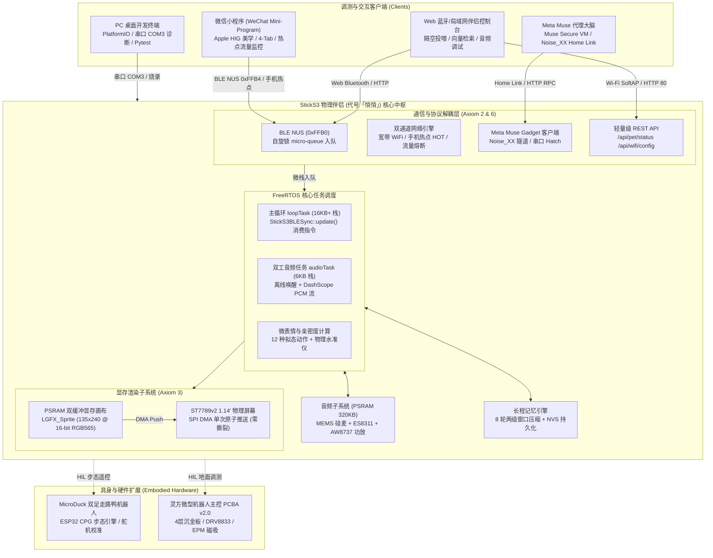

# yunyu-esp32: 灵伴·悄悄 (LingBuddy) 物理具身智能伴侣与 ESP32 开源硬件套件

<div align="center">

[](https://opensource.org/licenses/Apache-2.0)
[](https://platformio.org/)
[](https://www.python.org/)
[](./wechat_miniprogram/)
[](./tests/)
[](./docs/30_PROJECT_AXIOMS_AND_HANDOVER.md)

**全栈独立、开箱即用的随身/桌面具身 AI 伴侣、微信小程序终端、Meta Muse Gadgets 生态与开源机器人硬件基座**  
*Full-Stack Independent Physical AI Voice Companion, WeChat Mini-Program Suite, Meta Muse Gadgets & Embedded Robotics*

[English](#english-summary) | [核心特性](#-核心特性-key-features) | [系统架构](#-系统架构-architecture) | [六大公理](#-不可违背的六大工程公理-the-6-constitutional-axioms) | [工程知识库](#-项目工程知识库-project-engineering-documentation) | [技能扩展](#-标准化技能扩展-standardized-skills) | [快速起步](#-快速起步-quick-start)

</div>

---

## 📖 项目简介 (Overview)

`yunyu-esp32` 是一个**完全独立自洽的物理具身 AI 伴侣与开源硬件生态工程**。本项目将前沿大语言模型与多模态情感计算深度融入嵌入式物理实体，构建了涵盖**嵌入式固件、微信小程序客户端、桌面 Web 伴侣、Meta Muse 具身代理接入、开源机器人机电控制及严格工程测试**的全栈闭环：

1. **灵伴·悄悄 (LingBuddy / Qiaoqiao) 嵌入式固件 (`firmware/m5sticks3_buddy`)**：
   运行在 M5Stack StickS3（ESP32-S3-PICO-1，8MB Flash + 8MB PSRAM）硬件底座上。内置离线声学唤醒词「悄悄」匹配引擎、阿里云百炼实时语音大模型全双工流式问答、正面按键 A 毫秒级物理打断（Barge-In）、12 种迪士尼拟态矢量微表情与 Tamagotchi 亲密度系统、8 轮长程记忆滑动压缩与 NVS 持久化、PSRAM 135×240 零撕裂双缓冲显存、异步 BLE 指令队列以及网络多态徽章。
2. **微信小程序端产品套件 (`wechat_miniprogram/`)**：
   秉持 Apple Human Interface Guidelines (HIG) 原生极简美学打造。涵盖 4 大核心 Tab（首页动态表情与心声、投喂互动中心、心声日记流、设置与配网面板）；支持蓝牙 BLE NUS 多包流式组包通讯、双通道配网（常规宽带 Wi-Fi 与手机共享移动热点自适应切换）、热点流量配额监控与超额自动熔断防护、DPR 自适应 `<avatar-canvas>` 动态微表情渲染、Taptic 触觉反馈震动以及离线优先本地存储。
3. **桌面与 Web 伴侣控制台 (`web/` & `scripts/`)**：
   提供基于 Web Bluetooth API 的隔空投喂中心 (`web/lingbuddy_companion.html`)、双向音频测试网关、以及两级语义向量检索记忆知识库 (`scripts/lingbuddy_vector_store.py`)。
4. **Meta Muse Gadgets 生态原生接入 (`external_repos/muse-gadget-sdk`, `include/muse_gadget_client.h`, Doc 31)**：
   深度研学并接入 Meta 官方开源的 Muse Gadgets 框架。通过 Noise_XX 全双工加密隧道和 Home Link 建立与云端 Muse Secure VM 的持久连接，支持 Push-to-Talk 24kHz 流式交互与本地具身 RPC 控制。
5. **开源机器人硬件扩展 (`microduck/` & `hardware/`)**：
   包含 MicroDuck 双足走路鸭机器人（基于 ESP32 的 CPG 步态引擎与舵机标定系统）、以及灵方微型机器人主控 PCBA v2.0（4层沉金 PCB、SPICE 多回路严苛仿真验证）。
6. **自动化工程测试与持续集成 (`tests/`)**：
   内置 80 项覆盖声学唤醒、音频管道、微表情动力学、BLE NUS 分包重组、热点配额熔断、驱动 Hub、硬件自测的自动化回归测试，100% 绿色通过。

---

## 🚀 核心特性 (Key Features)

### 1. 全双工大模型语音交互与离线唤醒
- **离线声学唤醒词「悄悄」**：基于板载 MEMS 硅麦 + ES8311 音频前端，毫秒级快速声学特征匹配，抗噪免疫；
- **阿里云百炼实时大模型 (DashScope Realtime WSS)**：16kHz 16-bit Mono PCM 双向双工流式传输，低延迟语音合成回放（AW8737 功放驱动）；
- **物理打断 (Barge-In)**：语音回放过程中随时按下正面按键 A，瞬时中断服务端合成与硬件回放，即刻重置拾音。

### 2. 迪士尼拟态微表情与情感动力学系统 (Tamagotchi Engine)
- **12 种拟态微表情**：涵盖开心、好奇、思考、眨眼、睡觉、惊讶、撒娇等细腻情感，具备凝视追踪与眨眼物理衰减阻尼；
- **Tamagotchi 亲密度系统**：记录投喂、抚摸与对话频次，数值随时间平滑演化，驱动微表情与交互心声动态进阶；
- **PSRAM 显存零撕裂双缓冲 (Axiom 3)**：开辟 135×240 @ 16-bit RGB565 精灵显存画布（仅占 64.8KB PSRAM），离线合成后经 SPI DMA 单次原子性推送，彻底根除 15Hz 物理闪烁与背光撕裂。

### 3. 跨端自适应通讯与双通道安全配网
- **BLE Nordic UART Service (NUS)**：广播合规 30 字节，特征值支持高速无应答写入；
- **双通道智能配网**：
  - **常规宽带 Wi-Fi 模式**：局域网高速通道，设备徽章亮绿底 **"WiFi"**；
  - **手机共享热点模式**：顶部与设备端徽章显示暖橙底 **"HOT"**，小程序实时统计已用流量 MB，支持配额设定与超额硬件级断网熔断保护；
  - **断网警示**：网络异常时设备显示亮红底 **"!NET"**。
- **防截断多包分片流 (Axiom 6)**：长文本与记忆 JSON 经自适应分片流传输，内置 `safeTruncateUtf8` 字符级边界保护器，杜绝非法字节导致的 WebSocket 1007 协议违规或解析异常。

### 4. Apple HIG 人文美学微信小程序
- **iOS 原生质感**：纯黑背景 (`#000000`)、层级卡片 (`#1C1C1E` / `#2C2C2E`)、SF Pro / PingFang 规范排版、0.5px 极细微边框；
- **四 Tab 完整产品布局**：首页微表情、隔空投喂甜品货架、Notes 风格心声随笔、iOS 设置分组配网；
- **微信上线保障**：内置离线仿真模式（Demo Mode）与硬件视频指引，轻松应对微信平台审核。

---

## 📐 系统架构 (Architecture)



---

## ⚖️ 不可违背的六大工程公理 (The 6 Constitutional Axioms)

依据 [`docs/30_PROJECT_AXIOMS_AND_HANDOVER.md`](./docs/30_PROJECT_AXIOMS_AND_HANDOVER.md)，在 `yunyu-esp32` 的持续演进中，**以下六大公理为不可违背的最高工程基石**：

1. **【公理一：真实硬件烧录验证公理】(Strict Hardware Verification Law)**  
   固件改动绝不能停留在“代码编写完成”或“本地编译通过”，必须经由 PlatformIO 烧录至真实连接的物理硬件（`COM3`），触发 RTS/DTR 硬件级硬重启，实测阅读 10~15 秒串口日志确认自检全项通过。
2. **【公理二：中断与通讯协议栈异步解耦公理】(Interrupt & Protocol Task Decoupling Law)**  
   在 ESP-IDF 底层任务（特别是堆栈仅 3KB 的 `BTC_TASK`）中严禁执行 NVS 读写、Wi-Fi 切换或阻塞计算；所有下发指令仅在自旋锁临界区向微栈队列入队，并在拥有 16KB+ 栈空间的 `loopTask` 中异步消费。
3. **【公理三：显存零撕裂双缓冲物理公理】(Zero-Tear Double-Buffering Law)**  
   杜绝物理屏直写清屏。必须利用 8MB PSRAM 开辟 135×240 精灵画布（`LGFX_Sprite`），所有汉字、微表情与水准仪在显存中无缝合成后经 SPI DMA 单次原子推送，彻底消除频闪。
4. **【公理四：网络模式显式区分与端到端一致性公理】(Explicit Network Mode & Coherence Law)**  
   严格区分手机热点（橙色 "HOT" / 流量监控看板与熔断保护）与常规宽带（绿色 "WiFi"），断网亮红底 "!NET"；小程序主页与设置页数据源 100% 一致。
5. **【公理五：零功能回退与渐进加固公理】(Non-Regression & Progressive Hardening Law)**  
   任何新增功能不得导致已有基线特性（离线唤醒词「悄悄」、阿里百炼流式语音、按键打断、12种微表情、8轮记忆压缩、I2C互斥锁）发生任何劣化。
6. **【公理六：跨端自适应协议与防截断编码公理】(Adaptive Multi-Chunk & Robust Encoding Law)**  
   跨端通信长文本必须支持多包分片流与接收端组包拼帧；文本截断必须使用字符级算法（`safeTruncateUtf8`），严禁跨字节撕裂导致解析崩溃或 WebSocket 1007 协议违规。

---

## ⚡ 硬件定义与引脚映射 (Pinout Specifications)

### M5Stack StickS3 板载核心外设映射

| 外设模块 | 核心芯片 / 组件 | ESP32-S3 GPIO 引脚 | 驱动方式与通信协议 | 说明 |
| :--- | :--- | :--- | :--- | :--- |
| **电源门控** | M5PM1 PMIC | I2C (SDA: G10, SCL: G9) | I2C Addr `0x6E` | GPIO2: LCD 3.3V, GPIO3: 功放使能 |
| **正面按键 A** | 主功能实体按键 | **GPIO 11** | 内部上拉输入 | 语音物理打断 (Barge-In) / 录音触发 |
| **侧面按键 B** | 辅助控制实体按键 | **GPIO 12** | 内部上拉输入 | 页面轮换与辅助功能切换 |
| **彩色屏幕** | ST7789v2 1.14" LCD | SPI3 (SCLK: G17, MOSI: G18, DC: G15, CS: G14, RST: G21) | SPI (27MHz DMA) | 135 × 240 分辨率，PSRAM 双缓冲显存 |
| **6轴姿态计** | Bosch BMI270 | I2C (SDA: G10, SCL: G9) | I2C Addr `0x69` | 姿态角感应与动态水准球平衡算法 |
| **音频前端** | ES8311 + AW8737 PA | I2S0 (LRCK: G7, BCLK: G8, DOUT: G6, DIN: G5) | I2S (16kHz 16bit Mono) | 板载 MEMS 硅麦采集 + 喇叭流式回放 |
| **外扩动力接口** | Grove 4-Pin 接口 | GPIO 1 / GPIO 2, 5V, GND | M5PM1 门控 5V | 外接 MicroDuck 舵机或机器人 HIL 调测 |

---

## 📚 项目工程知识库 (Project Engineering Documentation)

本项目建立了完备、专业的技术文档体系，全部文档归档于 [`docs/`](./docs/)：

| 专案分类 | 文档名称与索引 | 核心论证与工程规范 |
| :--- | :--- | :--- |
| **最高工程基石** | [**30_PROJECT_AXIOMS_AND_HANDOVER.md**](./docs/30_PROJECT_AXIOMS_AND_HANDOVER.md) | 六大不可违背工程公理、实机监控基线、全套工具链验证命令与会话交接指南 |
| **提示词标准库** | [**AGENT_CONTINUATION_PROMPTS.md**](./docs/AGENT_CONTINUATION_PROMPTS.md) | 跨生命周期 AI Agent 通用母版、细分研发方向（审批终端/地面台/菜单）提示词模板 |
| **微信小程序端** | [**28_M5StickS3微信小程序对接架构与通信协议工程指南.md**](./docs/28_M5StickS3微信小程序对接架构与通信协议工程指南.md)<br/>[**29_微信小程序与移动端研发交接指南_HANDOVER_MOBILE.md**](./docs/29_微信小程序与移动端研发交接指南_HANDOVER_MOBILE.md) | 小程序 4-Tab 完整架构、BLE NUS 分包重组、热点配额监控熔断、上线审核攻略 |
| **Meta Muse 接入** | [**31_Meta_Muse_Gadgets微型自重构机器人与物理伴侣全栈接入方案与工程实施详案.md**](./docs/31_Meta_Muse_Gadgets微型自重构机器人与物理伴侣全栈接入方案与工程实施详案.md) | Meta 2026-10-02 开源 `muse-gadget-sdk` 研学、Noise_XX 隧道、具身技能标准与实施详案 |
| **伴侣与表情架构** | [**27_基于MuseCharm哲学的M5StickS3灵宠伴侣软硬件架构与工程论证大案.md**](./docs/27_基于MuseCharm哲学的M5StickS3灵宠伴侣软硬件架构与工程论证大案.md)<br/>[**27_StickS3物理伴侣全流程对话开发实录与教学手册.md**](./docs/27_StickS3物理伴侣全流程对话开发实录与教学手册.md) | 迪士尼微表情动力学、Tamagotchi 亲密度系统、长程记忆压缩与对话实录教程 |
| **硬件与调测基线** | [**01_StickS3_Hardware_and_Bringup_Guide.md**](./docs/01_StickS3_Hardware_and_Bringup_Guide.md)<br/>[**03_StickS3_Three_Schemes_Verification.md**](./docs/03_StickS3_Three_Schemes_Verification.md)<br/>[**25_M5Stack_StickS3物理伴侣与地面调测终端开发全流程及三方案验证详案.md**](./docs/25_M5Stack_StickS3物理伴侣与地面调测终端开发全流程及三方案验证详案.md) | M5StickS3 硬件上电流程、三大方案（M5Burner / PlatformIO / Claude Buddy）全面验证 |
| **双向语音与资源** | [**HANDOVER_VOICE_DIALOGUE_AND_RESOURCE_MANAGEMENT.md**](./docs/HANDOVER_VOICE_DIALOGUE_AND_RESOURCE_MANAGEMENT.md)<br/>[**RELEASE_NOTES_v1.0.0.md**](./docs/RELEASE_NOTES_v1.0.0.md) | 百炼实时语音流、双向音频协议、内存防溢出与 v1.0.0 稳定生产基线发布记录 |

---

## 🛠️ 标准化技能扩展 (Standardized Skills)

项目所有专属专业技能均统一梳理并保存在根目录 `skills/` 下，已配置 `.agents/skills.json` 支持 Antigravity 全自动化识别与调度：

1. **[skills/lingbuddy-firmware-ops/](./skills/lingbuddy-firmware-ops/SKILL.md)**：  
   StickS3 嵌入式固件编译、极速烧录（`COM3`）、硬重启检验与六大公理违规审计技能；
2. **[skills/wechat-miniprogram-companion/](./skills/wechat-miniprogram-companion/SKILL.md)**：  
   微信小程序伴侣研发、Apple HIG 视觉规范审查、BLE NUS 多包通信协议、双通道配网与发布上线技能；
3. **[skills/muse-gadget-companion/](./skills/muse-gadget-companion/SKILL.md)**：  
   Meta Muse Gadgets 接入与具身技能管理（Noise_XX 隧道、Home Link 穿透、Push-to-Talk 24kHz 流）；
4. **[skills/public-service-tunnel/](./skills/public-service-tunnel/SKILL.md)**：  
   本地伴侣控制台与 Web 预览在线穿透管理技能（ngrok、Cloudflare Quick Tunnel 自适应容灾切换）；
5. **[skills/document-content-verifier/](./skills/document-content-verifier/SKILL.md)**：  
   第一性原理与公理化文档内容交叉复核技能（自然科学公理、量纲齐次性、多模态交付）；
6. **[skills/open-source-repo-analyzer/](./skills/open-source-repo-analyzer/SKILL.md)**：  
   自主开源项目研学、AST 源码分析与跨项目接口适配器生成技能；
7. **[skills/pcb-design-verifier/](./skills/pcb-design-verifier/SKILL.md)**：  
   KiCad 原理图/PCB 审查与多回路 SPICE 瞬态电路仿真技能；
8. **[skills/gadget-lingcube-msrr/](./skills/gadget-lingcube-msrr/SKILL.md)** & **[skills/gadget-lingmatrix-sim/](./skills/gadget-lingmatrix-sim/SKILL.md)**：  
   Meta Muse 具身物理机器人控制与数字孪生仿真技能。

---

## 🛠️ 快速起步 (Quick Start)

### 1. 环境准备与依赖安装
```bash
# 1. 安装 Python 核心依赖 (包含 platformio, pytest, bleak, numpy 等)
pip install -r requirements.txt

# 2. 安装小程序端构建依赖 (若需运行微信开发者工具自动化)
npm install
```

### 2. 固件编译与真实硬件烧录 (践行公理一)
```bash
# 本地编译固件
python -m platformio run -e m5sticks3_buddy

# 烧录固件至物理硬件 (本地串口 COM3)
python -m platformio run -e m5sticks3_buddy -t upload

# 触发 RTS/DTR 硬件级硬重启并读取实时串口自检日志 (运行 10~15 秒)
python -c "import serial, time; ser = serial.Serial('COM3', 115200, timeout=1); ser.setDTR(False); ser.setRTS(True); time.sleep(0.1); ser.setRTS(False); time.sleep(0.2); start = time.time(); [print(ser.readline().decode('utf-8', errors='replace').strip()) for _ in iter(lambda: ser.readline() if time.time()-start < 10 else None, None)]; ser.close()"
```

### 3. 执行全套 80 项自动化回归测试
```bash
pytest tests/ -v
```
*(80 项声学唤醒、百炼双工、微表情动力学、BLE多包拼帧、热点配额熔断、驱动 Hub、硬件自测全部通过)*

### 4. 微信小程序开发与预览
1. 打开**微信开发者工具**；
2. 导入项目目录：`D:\workspace\code\yunyu-esp32\wechat_miniprogram`；
3. 输入测试 AppID 或使用已有的小程序账号；
4. 即可在模拟器中体验暗黑 Apple HIG 美学界面、4 大 Tab、微表情渲染与仿真交互模式；连接真实 StickS3 时自动开启 BLE NUS 双向通信。

### 5. 桌面 Web 蓝牙伴侣与向量知识库
```bash
# 启动本地伴侣控制台 Web 服务
python scripts/lingbuddy_companion.py
# 浏览器访问: http://127.0.0.1:8000 (支持 Chrome / Edge Web Bluetooth 直连)

# 启动向量记忆知识库查询
python scripts/lingbuddy_vector_store.py
```

---

## 📂 仓库目录结构 (Directory Structure)

```
yunyu-esp32/
├── .agents/                       # Antigravity Agent 技能索引配置 (skills.json)
├── .github/                       # GitHub Actions CI 流水线
├── docs/                          # 项目最高公理、工程交接、提示词库与全套技术详案 (Docs 01~31)
├── firmware/
│   └── m5sticks3_buddy/           # StickS3 物理伴侣与双模地面调测台工程 (PlatformIO)
│       ├── include/               # 离线唤醒、音频驱动、微表情、BLE同步、百炼Client、MuseClient
│       ├── src/                   # main.cpp, sticks3_hal.cpp, buddy_protocol.cpp
│       └── platformio.ini         # PlatformIO 编译构建配置
├── wechat_miniprogram/            # 微信小程序端 4-Tab 完整产品套件
│   ├── pages/                     # index (首页), feed (投喂), diary (日记), settings (设置配网)
│   ├── components/avatar-canvas/  # DPR 自适应矢量微表情渲染组件
│   ├── utils/                     # BLE 通信、Wi-Fi/热点管理、触觉反馈、离线存储、加密防护
│   └── assets/tabbar/             # 苹果暗黑高保真 TabBar 图标资产
├── web/
│   └── lingbuddy_companion.html   # Web Bluetooth / Wi-Fi 隔空投喂伴侣控制台
├── external_repos/
│   └── muse-gadget-sdk/           # Meta Muse Gadgets 官方开源硬件与通信 SDK
├── microduck/                     # MicroDuck 双足走路鸭机器人机电步态工程
├── hardware/                      # 灵方微型机器人主控 PCBA v2.0 与硬件设计资产
├── scripts/                       # 自动化点亮代理、向量检索、对话压测、音频自测脚本
├── skills/                        # 8 项标准化 Antigravity 专属技能扩展
├── tests/                         # 80 项全自动化回归测试套件 (Pytest)
├── package.json                   # 小程序与前端构建工具链配置
├── pyproject.toml                 # 现代化 Python 包元数据与 pytest 配置
├── requirements.txt               # Python 运行与构建依赖
├── CONTRIBUTING.md                # 代码贡献与工程准则
├── LICENSE                        # Apache License 2.0 开源协议
└── README.md                      # 本文档
```

---

## 📄 开源许可证 (License)

本项目遵循 [Apache License 2.0](./LICENSE) 协议开源。软件源码、固件代码、微信小程序套件及硬件工程设计均保障商业友好与学术研究自由。

---

<div id="english-summary">

### English Summary

`yunyu-esp32` is a fully decoupled, standalone open-source physical AI voice companion and embodied robotics hardware ecosystem.

**Core Highlights**:
- **LingBuddy (悄悄) Companion Firmware**: Running on M5Stack StickS3 (ESP32-S3), featuring offline acoustic wakeword "悄悄", Alibaba Bailian DashScope Realtime full-duplex voice streaming, physical button barge-in, 12 Disney-inspired parametric avatar emotions, Tamagotchi intimacy engine, 8-turn long-horizon memory compaction, zero-tear PSRAM double-buffering (Axiom 3), and async spinlock BLE queue (Axiom 2).
- **WeChat Mini-Program Product Suite**: Built with Apple Human Interface Guidelines (HIG) aesthetic, offering 4 primary tabs (Avatar & Thoughts, Feeding Center, Heartfelt Diary, and Network Settings), BLE Nordic UART Service multi-chunk streaming, dual-channel network provisioning (broadband Wi-Fi + mobile hotspot with quota cutoff protection), DPR-aware `<avatar-canvas>`, and haptic feedback.
- **Meta Muse Gadgets Ecosystem Integration**: Native compliance with Meta's open-source Muse Gadget SDK, supporting Noise_XX encrypted Home Link tunneling, Push-to-Talk 24kHz audio, and embodied robotics skill dispatching.
- **MicroDuck Bipedal Robotics**: CPG locomotion gait controller, servo calibration, and hardware kinematics.
- **6 Constitutional Axioms**: Strict adherence to hardware-verified releases, task decoupling, anti-flicker double-buffering, network coherence, non-regression, and safe Unicode-boundary encoding.

</div>
