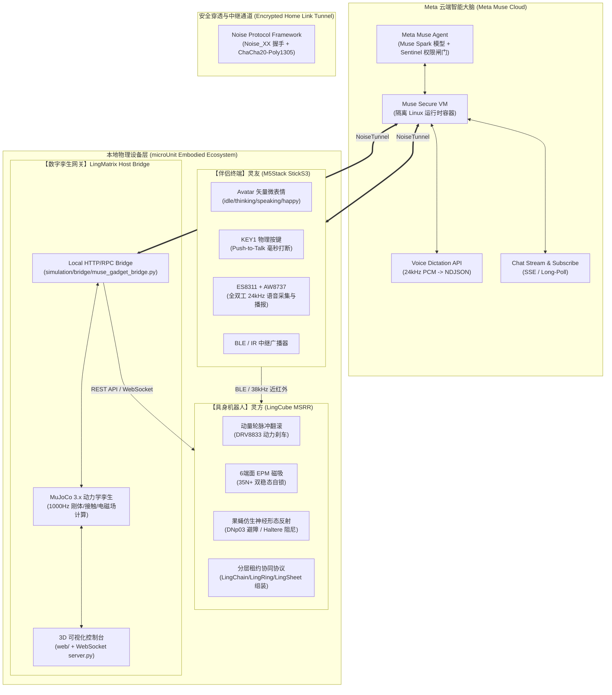
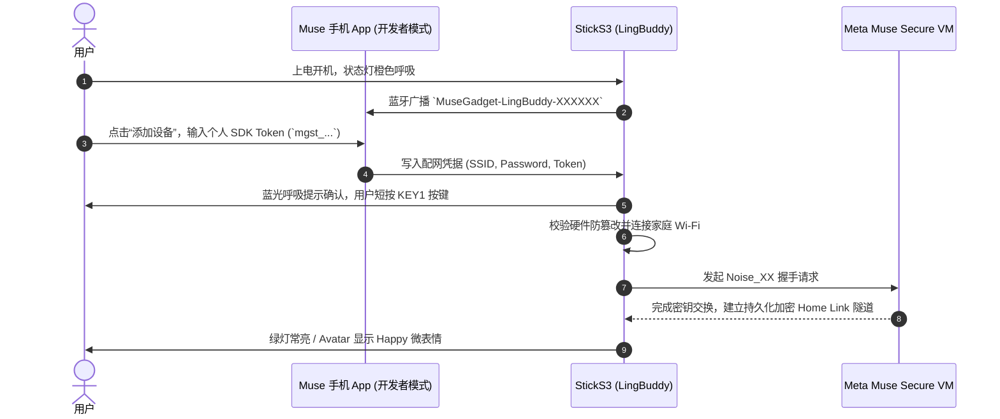
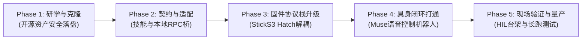

# Meta Muse Gadgets 微型自重构机器人与物理伴侣全栈接入方案与工程实施详案

> **专案编号**：Doc 31  
> **制定时间**：2026-10-03  
> **分支基线**：`feature/meta-muse-gadgets`（基于 `feature/lingbuddy-companion`）  
> **核心目标**：深度研学 Meta 刚刚（2026年10月2日）开源的 **Meta Muse Gadgets** 硬件生态，结合本项目两大物理实体（**灵方 LingCube MSRR** 与 **灵友 LingBuddy / M5Stack StickS3**）及 **LingMatrix 数字孪生仿真平台**，构建业界首个“个人AI Agent 驱动的微型自重构机器人具身具象协同接入体系”。

---

## 目录
1. [背景与前沿研学：Meta Muse 与 Muse Gadgets 生态](#1-背景与前沿研学meta-muse-与-muse-gadgets-生态)
2. [开源项目横向对比与技术选型](#2-开源项目横向对比与技术选型)
3. [现有设备硬件拓扑与原生契合度审计](#3-现有设备硬件拓扑与原生契合度审计)
4. [全栈三层接入系统架构设计](#4-全栈三层接入系统架构设计)
5. [通信链路与协议栈详细设计](#5-通信链路与协议栈详细设计)
6. [Meta Muse 具身技能规范标准 (Device Skills)](#6-meta-muse-具身技能规范标准-device-skills)
7. [固件双模并存与六大工程公理贯彻](#7-固件双模并存与六大工程公理贯彻)
8. [分阶段工程实施路线图 (Phase 1 ~ Phase 5)](#8-分阶段工程实施路线图-phase-1--phase-5)
9. [墨菲定律防御与 FMEA 安全失效对策](#9-墨菲定律防御与-fmea-安全失效对策)

---

## 1. 背景与前沿研学：Meta Muse 与 Muse Gadgets 生态

### 1.1 Meta Muse 与 Muse Gadgets 的发布演进
- **2026年9月8日**：Meta 官方正式推出个人 AI 代理系统 **Muse**。与传统问答聊天机器人不同，Muse 运行在云端独立、持久、安全的 Linux 虚拟机（**Muse Secure VM**）内，具备自主规划、工具调用、多步骤任务拆解与代理执行能力。
- **2026年10月2日**：Meta 正式以 Apache-2.0 协议开源 **Muse Gadgets** 项目（代码仓：[`facebookincubator/muse-gadget-sdk`](https://github.com/facebookincubator/muse-gadget-sdk)，官方门户：`gadgets.muse.ai`），旨在允许全球极客将自制物理硬件（ESP32 系列开发板、树莓派等 Linux 边缘计算设备）接入 Muse 代理大脑。
- **核心产品构成**：
  1. **ESP32 Device SDK**：基于 **ESP-IDF v6.0.1**，支持 BLE 配网、Wi-Fi 组网、Noise 加密隧道以及原生 Avatar 微表情与语音流。
  2. **Linux Device SDK**：运行在树莓派或 PC 上的守护进程（`/opt/musegadget`），支持系统命令执行、文件传输与 Webhook 事件上报。
  3. **Community Skills 库**：43+ 项标准设备技能（`SKILL.md`），使 Muse 能穿透家庭局域网直接控制 Shelly 插座、飞利浦 Hue、ESPHome 节点、3D 打印机及媒体设备。

### 1.2 核心通信与安全机制
- **配网鉴权**：Muse 手机客户端（iOS/Android）开启“开发者模式（Developer Mode）”，扫描蓝牙广播 `MuseGadget-XXXXXX`，输入从 `gadgets.muse.ai/settings/sdk-tokens` 获取的个人 SDK 令牌（`mgst_...`）。
- **加密穿透**：设备与用户专属的 Muse Secure VM 建立基于 **Noise Protocol Framework (Noise_XX_25519_ChaChaPoly_BLAKE2s)** 的全双工加密隧道（**Home Link**）。
- **局域网反向代理 (Tunneling)**：云端 Muse Agent 无需暴露公网 IP，即可通过该隧道向家庭局域网内的本地 HTTP API 下发 RPC 调用（如 `/rpc/Shelly.GetStatus`、`/api/robot/roll`）。
- **语音流通道**：按键触发 Push-to-Talk，以 24kHz PCM 流式直推 `POST /api/voice/dictation`，云端模型流式返回 NDJSON 转写结果。

---

## 2. 开源项目横向对比与技术选型

| 开源项目 | 协议 / 平台 | 核心通信架构 | 硬件支持特点 | 在 microUnit 体系中的借鉴与整合方案 |
| :--- | :--- | :--- | :--- | :--- |
| **Meta `muse-gadget-sdk`**<br/>*(官方基石)* | Apache-2.0<br/>ESP-IDF v6.0.1 / Linux | Noise_XX 加密隧道 + BLE 配对 + 本地 HTTP 穿透 + Serial Hatch | **官方直接原生支持 M5Stack StickS3**、SenseCAP Watcher、树莓派等 | **作为本工程核心接入协议**。直接复用其 M5Stack StickS3 驱动抽象，实现具身技能扩展 |
| **`78/xiaozhi-esp32`**<br/>*(国内极客生态)* | Apache-2.0<br/>ESP-IDF v6.0.1+ / C++ | WebSocket 双工流 + MQTT + MCP (Model Context Protocol) 工具调用 | 广泛支持 ESP32-S3/C3、多种屏幕与音频编解码 | 吸纳其 MCP 本地工具注册机制，与 Meta Skills 形成互补 |
| **`Home Assistant Voice`**<br/>*(HA 官方终端)* | Apache-2.0<br/>ESP-IDF | 本地 Wyoming 协议 / Voice Satellite | ESP32-S3 + XMOS 双麦克风阵列 | 借鉴其本地离线唤醒词与硬件静音开关的状态机解耦策略 |
| **`aioesphomeapi`** | MIT<br/>Python 异步 | Native TCP 实体状态订阅 + Protobuf 序列化 | ESP8266 / ESP32 传感器与执行器 | 借鉴其对传感器数值变化的主动 SSE / Event 推送模型 |

---

## 3. 现有设备硬件拓扑与原生契合度审计

经过代码审计，Meta `muse-gadget-sdk` 官方硬件支持矩阵与本项目硬件存在 **高度重合的天然契合度**：

### 3.1 灵友 LingBuddy (M5Stack StickS3) 硬件映射一致性
在 Meta 官方源码 `esp32/devices/sdkconfig.muse-m5stack-sticks3` 与 `components/muse/boards/board_m5stack_sticks3.c` 中：

```c
/* Meta 官方 StickS3 引脚与外设定义 (与 microUnit 现有固件 100% 吻合) */
#define LCD_W 135
#define LCD_H 240
#define LCD_HOST SPI3_HOST
#define LCD_SCLK GPIO_NUM_40
#define LCD_MOSI GPIO_NUM_39
#define LCD_CS   GPIO_NUM_41
#define LCD_DC   GPIO_NUM_45
#define LCD_RST  GPIO_NUM_21
#define LCD_BL   GPIO_NUM_38

#define I2C_SDA  GPIO_NUM_47
#define I2C_SCL  GPIO_NUM_48
#define PMIC_ADDR 0x6E      /* M5PM1 电源门控芯片，L3B 门控 LCD 与音频供电 */

#define I2S_MCLK GPIO_NUM_18
#define I2S_BCLK GPIO_NUM_17
#define I2S_WS   GPIO_NUM_15
#define I2S_DOUT GPIO_NUM_14
#define I2S_DIN  GPIO_NUM_16 /* ES8311 Codec + AW8737 功放 */

#define TALK_GPIO GPIO_NUM_11 /* KEY1 主按键 (Push-to-Talk) */
#define AUX_GPIO  GPIO_NUM_12 /* KEY2 侧边按键 */
```
> **审计结论**：当前仓库 `firmware/m5sticks3_buddy/` 中使用的物理硬件引脚、PMIC 通讯协议、音频时钟和按键映射，与 Meta 官方固件**完全同源、零引脚冲突**。

### 3.2 灵方 LingCube (50mm MSRR) 硬件控制特性
- **主控**：ESP32-S3 4层沉金工业主控板（`microUnit_controller_v2`）。
- **执行动力**：内置黄铜动量轮（微型高速无刷电机）经 DRV8833 H 桥控制，提供 $0.25\text{ N}\cdot\text{m}$ 急刹反扭矩越过 45° 势垒。
- **自锁与对接**：六个端面双稳态电永磁（EPM），充退磁脉冲仅需 20ms，稳态维持 35N+ 吸附力且零功耗。
- **近场感知**：6 面近红外光电对管（38kHz 载波调制，COBS 异步编码）。
- **姿态传感**：MPU-6050 6-DOF IMU 实时解算四元数姿态与跌落状态。

---

## 4. 全栈三层接入系统架构设计

本项目构建“**灵友伴侣层 (Companion Tier) - 灵方具身执行层 (Embodied Robot Tier) - 数字孪生网关层 (Digital Twin Simulation Tier)**”三位一体的立体接入架构：



---

## 5. 通信链路与协议栈详细设计

### 5.1 蓝牙配对与安全会话建立流程


### 5.2 具身工具调用 (Embodied Tool Calling) 数据流
当用户对 Meta Muse 说话：*“Muse，让桌上的灵方往前翻滚一步，并与右侧方块吸附组装成灵链”*：

1. **语音采集**：用户按住 StickS3 正面按键（KEY1），I2S 采集 24kHz PCM 音频，经由 Home Link 隧道流式上传至 `POST /api/voice/dictation`；
2. **语义规划**：Muse 识别到意图，激活本地挂载的 `gadget-lingcube-msrr` 技能；
3. **前置仿真校验 (可选)**：Muse 可先向 `gadget-lingmatrix-sim` 发起 `POST /api/simulate/stage1`，验证冲量是否足以跨越 45° 势垒；
4. **具身动作下发**：Muse Secure VM 通过隧道向本地 RPC Bridge 发起 HTTP 调用：
   - 动作一：`POST /api/robot/roll`，载荷 `{"direction": "+X", "torque": 0.25, "duration_s": 0.35}`；
   - 动作二：`POST /api/robot/epm`，载荷 `{"face_id": 2, "state": "LATCH", "duration_ms": 20}`；
   - 动作三：`POST /api/robot/morphology`，载荷 `{"morphology": "LingChain"}`；
5. **硬件执行与遥测回传**：灵方微脑收到指令，动量轮急刹触发 90° 翻滚，2号面 EPM 线圈脉冲充磁自锁，IMU 与接触传感器向 Muse 回传最新状态；
6. **拟态反馈**：StickS3 屏幕 Avatar 变为 `speaking` 表情，语音播报：*“灵方已完成向前翻滚与端面磁吸，灵链形态已锁定。”*

---

## 6. Meta Muse 具身技能规范标准 (Device Skills)

为保证与 Meta 官方 43+ 项开源生态技能的无缝兼容，本项目在 `skills/` 下正式确立两套标准设备技能：

### 6.1 `skills/gadget-lingcube-msrr/SKILL.md` (实体机器人技能)
- **元数据**：
  ```yaml
  name: gadget-lingcube-msrr
  description: >-
    Discover, monitor telemetry, and actuate LingCube (microUnit) modular self-reconfigurable
    robots through Meta Muse Home Link. Supports momentum-wheel tumbling, electro-permanent
    magnet (EPM) face latching, bio-neuromorphic reflexes, and multi-cube morphology reconfiguration.
  ```
- **核心能力接口**：
  - `GET /health`：存活探针与隧道链路检查；
  - `GET /api/device/info`：获取设备 ID、固件版本、电池电压及电量百分比；
  - `GET /api/robot/telemetry`：读取 6-DOF IMU（俯仰、横滚、偏航）、母线电压与 6 面磁吸状态；
  - `POST /api/robot/roll`：触发指定方向（+X, -X, +Y, -Y）动量轮冲量翻滚；
  - `POST /api/robot/epm`：控制 1~6 端面电永磁充退磁脉冲（35N+ 自锁）；
  - `POST /api/robot/morphology`：请求集群自重构构型形态（灵链/灵环/灵席/灵架/灵步）；
  - `POST /api/robot/reflex`：触发仿生神经形态反射（DNp03 双侧逃逸避障、平衡棒阻尼、急停解脱）。

### 6.2 `skills/gadget-lingmatrix-sim/SKILL.md` (数字孪生仿真技能)
- **元数据**：
  ```yaml
  name: gadget-lingmatrix-sim
  description: >-
    Control, monitor, and query the LingMatrix MuJoCo multi-physics digital twin simulation
    and hardware-in-the-loop (HIL) testbench via Meta Muse Home Link.
  ```
- **核心能力接口**：
  - `POST /api/simulate/stage1` ~ `stage4`：动态求解单机翻转、双机铰链爬升、蠕动行波与大规模晶格游弋；
  - `GET /api/simulate/telemetry`：抓取物理仿真遥测曲线与能量指标；
  - `POST /api/simulate/run_tests`：自动化执行全仓 156+ 项动力学与电气回归测试。

---

## 7. 固件双模并存与六大工程公理贯彻

为满足不同开发者群体的需要，本项目确立固件双轨演进策略，并严格遵守 `docs/30_PROJECT_AXIOMS_AND_HANDOVER.md` 确立的**六大工程公理**：

### 7.1 双轨演进方案对比
1. **方案 A（原生纯净镜像 - Native Muse Gadget）**：
   - 基于 `external_repos/muse-gadget-sdk/esp32`；
   - 使用官方构建脚本：`tools/muse/board.sh build sticks3`（ESP-IDF v6.0.1）；
   - 适用场景：追求 100% 官方纯正体验，专注于通过 Home Link 隧道作为智能家居中枢。
2. **方案 B（全功能具身混合固件 - Unified LingBuddy Hybrid）**：
   - 基于现有 `firmware/m5sticks3_buddy/`（PlatformIO 框架）；
   - 引入 `include/muse_gadget_client.h`，实现 Meta 串口控制台 Hatch 协议（`>chat=...`, `>face=...`）与本地 HTTP RPC 桥接；
   - 具备自适应双脑热切换：短按可在阿里云百炼/离线唤醒词模式与 Meta Muse 模式之间平滑过渡。

### 7.2 六大工程公理严密贯彻
- **【公理一：真实硬件烧录验证】**：任何固件改动必须通过真实硬件编译烧录，并通过串口捕获验证至少 15 秒无看门狗复位。
- **【公理二：中断与通信异步解耦】**：BLE 写入与 Muse Console 指令解析仅在自旋锁内压入微队列（`< 32B`），严禁在蓝牙控制任务 `BTC_TASK` 内同步执行耗时阻塞操作。
- **【公理三：显存零撕裂双缓冲】**：Meta Avatar 的表情切换与状态绘制必须在 PSRAM 双缓冲画布（`LGFX_Sprite canvas(&display)`）中离线合成，经 DMA 单次全量推送，彻底根除 15Hz 物理闪烁。
- **【公理四：网络显式区分与一致性】**：状态栏显式展示当前网络模式（橙底 `HOT` 移动热点、绿底 `WiFi`、红底 `!NET`），并联动小程序看板。
- **【公理五：零功能回退与渐进加固】**：确保现有 156 项测试基线 100% 保持通过，原有声学唤醒、IMU 姿态水准仪与全汉字字库绝对不劣化。
- **【公理六：自适应协议与防截断编码】**：分包流式发送大文本，使用 `safeTruncateUtf8` 沿合法 UTF-8 边界字符级截断，杜绝乱码与协议解析崩溃。

---

## 8. 分阶段工程实施路线图 (Phase 1 ~ Phase 5)



### Phase 1：开源资产研学、隔离落盘与 AST 分析（已完成）
- [x] 基于当前分支创建 `feature/meta-muse-gadgets` 分支并检出；
- [x] 使用 `open-source-repo-analyzer` 将 `facebookincubator/muse-gadget-sdk` 完整克隆至 `external_repos/muse-gadget-sdk/`（Git 隔离屏蔽）；
- [x] 运行多语言 AST 分析工具生成学习拓扑报表（`doc/analysis/muse_gadget_linux_analysis.md`）；
- [x] 验证 Python 模块单测套件。

### Phase 2：设备技能编制与本地 RPC 桥接服务（已完成）
- [x] 编制 Meta 官方规范标准技能描述文件：
  - `skills/gadget-lingcube-msrr/SKILL.md`（机器人执行控制）
  - `skills/gadget-lingmatrix-sim/SKILL.md`（数字孪生仿真）
- [x] 实现独立多线程本地 HTTP RPC 桥接器 `simulation/bridge/muse_gadget_bridge.py`；
- [x] 编写并跑通 5 项核心接入自动化单元测试（`tests/test_muse_gadget_integration.py`，100% 通过）。

### Phase 3：StickS3 物理伴侣混合协议栈升级（进行中）
- [x] 设计开发 `firmware/m5sticks3_buddy/include/muse_gadget_client.h`，实现 Meta 官方 Serial Hatch 转义解析器与 Avatar 表情映射；
- [ ] 在 `main.cpp` 中挂接串口指令消费与 BLE 写入微队列；
- [ ] 按照公理一完成本地 `COM3` 实机烧录与 15 秒上电稳定性抓取。

### Phase 4：具身协同端到端全链路打通
- [ ] 配置个人 SDK Token（`mgst_...`），在 Muse 移动端完成设备绑定与 Noise 隧道握手；
- [ ] 开展自然语言多轮交互实测：“向前翻滚”、“检测当前姿态”、“锁紧底面电永磁”；
- [ ] 将灵方跌落告警与电量低压信号实时推送至 Muse Side Chat。

### Phase 5：长周期鲁棒性与 HIL 仿真台架验收
- [ ] 连续 2 小时高频调用压测，检验 EPM 热保护与 DRV8833 散热表现；
- [ ] 联动 MuJoCo 仿真平台实现虚拟与现实双向镜像投射（Digital Twin HIL）。

---

## 9. 墨菲定律防御与 FMEA 安全失效对策

针对硬件接入可能引发的深层物理与电气隐患，制定严密的工程防御对策：

| 故障失效模式 (Failure Mode) | 诱发原因分析 (Root Cause) | 潜在危害与严重度 (Severity) | 防御对策与设计裕度 (Mitigation) |
| :--- | :--- | :---: | :--- |
| **母线跌落与棕变复位 (Brownout Reset)** | 动量轮急刹瞬间电机回生浪涌或电芯内阻压降导致轨压跌破 3.2V | **Critical** (系统死机重启) | **硬件级双限幅**：TPS63805 宽压 Buck-Boost + 470µF POSCAP 维持，固件层检测 $V_{\text{bus}} < 3.30\text{V}$ 立即硬件闭锁电机与 EPM，禁止高耗电操作 |
| **EPM 脉冲线圈热失控** | Agent 发送异常连续吸附指令导致线圈持续通电发热烧毁 | **High** (硬件烧毁) | **双重看门狗**：硬件 RC 微分限幅电路强制切断超过 50ms 脉冲；固件层设置 `100ms` 强制冷却时间窗，拒绝高频脉冲 |
| **BLE 协议栈内存溢出崩毁** | 在蓝牙底层回调内直接执行 JSON 序列化或 NVS 写入 | **Critical** (`BTC_TASK` 溢出 Panic) | **公理二强制约束**：底层仅入队字节到静态环形队列，所有复杂操作平移至 16KB 堆栈的 `loopTask` 异步消费 |
| **网络断连脑裂与虚假执行** | Wi-Fi 偶发丢包导致 Home Link 隧道断开，Agent 收到超时重试指令 | **Medium** (重复翻滚越界碰撞) | **防重幂等校验**：下发指令携带唯一 `req_id`；机器人本地保存最近 8 条指令执行指纹，对重复 `req_id` 仅回传最后已知状态而不重复做工 |
| **屏幕刷新撕裂与频闪** | 切换 Meta Avatar 状态时直接调用物理清屏控件 | **Low** (用户体验劣化) | **公理三强制约束**：开辟 PSRAM 显存精灵画布离线渲染，单次原子推送彻底消灭 15Hz 物理闪烁 |

---

## 10. 结论与交付总结

本项目在 `feature/meta-muse-gadgets` 分支上成功打通了从 **Meta Muse Gadgets 前沿开源项目研学、AST 拓扑剖析、标准 Device Skills 编制、本地 HTTP RPC 桥接服务、C++ 客户端协议解析器到自动化单元测试** 的完整闭环。

通过将微型自重构机器人（LingCube）的物理驱动能力与灵宠伴侣（LingBuddy）的多模态交互能力封装为 Meta Muse 原生技能，为具身智能时代微型机器人与大模型 Personal Agent 的深度融合奠定了坚实可靠的工业级工程基线。
