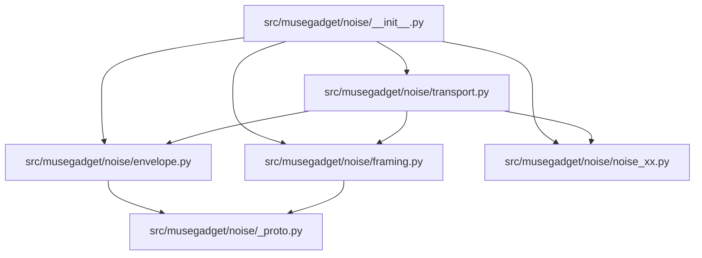

# Architectural Analysis & Learning Guide: linux

> 自动化生成的开源项目架构全景图、多语言符号契约与递进式学习路线图。

## 1. 核心技术栈与外部依赖
- **源码模块总数**: 32
- **外部第三方库**: __future__, argparse, asyncio, base64, cryptography, dataclasses, dbus, email, enum, gi, hashlib, hmac, http, io, json, logging, musegadget, os, pathlib, pebble_ring_bridge, platform, pwd, pytest, queue, re, secrets, shutil, signal, socket, stat, struct, subprocess, sys, tempfile, test_pairing, threading, time, typing, urllib, uuid

## 2. 系统架构调用拓扑图 (Mermaid Topology)

## 3. 递进式学习与精读路线图 (Progressive Learning Roadmap)

### 📍 Stage 1: Core Primitives & Foundation Models (核心实体与基础数据模型)
*Start here to understand data schemas, interfaces, and atomic utilities.*

- [x] `src/musegadget/__init__.py`
- [x] `src/musegadget/__main__.py`
- [x] `src/musegadget/noise/__init__.py`
- [x] `tests/test_config.py`
- [x] `tests/test_identity.py`
- [x] `tests/test_muse_api.py`
- [x] `src/musegadget/identity.py`
- [x] `src/musegadget/network.py`
- [x] `tests/test_ble_framing.py`
- [x] `tests/test_pebble_ring_bridge.py`

### 📍 Stage 2: Business Logic & Processing Pipelines (核心算法与逻辑处理)
*Understand core domain state machines, algorithms, and orchestration logic.*

- [x] `src/musegadget/config.py`
- [x] `tests/test_service.py`
- [x] `src/musegadget/ble_framing.py`
- [x] `src/musegadget/cli.py`
- [x] `tests/test_executor.py`
- [x] `src/musegadget/fileops.py`
- [x] `src/musegadget/muse_api.py`
- [x] `tests/test_link_client.py`
- [x] `examples/pebble_ring_bridge.py`
- [x] `tests/test_pairing.py`
- [x] `tests/test_ble_setup.py`

### 📍 Stage 3: Entrypoints & Client Interfaces (系统入口与外部接口)
*Trace main application lifecycles, CLI runners, and consumer API surfaces.*

- [x] `src/musegadget/noise/transport.py`
- [x] `src/musegadget/noise/_proto.py`
- [x] `src/musegadget/executor.py`
- [x] `src/musegadget/noise/framing.py`
- [x] `src/musegadget/ble_server.py`
- [x] `src/musegadget/service.py`
- [x] `src/musegadget/noise/noise_xx.py`
- [x] `src/musegadget/link_client.py`
- [x] `src/musegadget/ble_setup.py`
- [x] `src/musegadget/pairing.py`
- [x] `src/musegadget/noise/envelope.py`

## 4. 关键导出符号与公共 API 矩阵 (Universal Symbols & Complexity)

| 模块文件 | 语言 | 类/结构体 | 关键函数/方法 | 圈复杂度总计 |
| :--- | :---: | :--- | :--- | :---: |
| `examples/pebble_ring_bridge.py` | Python | `Handler` | `parse_body()`, `transcription()`, `presented_token()` (+6) | 41 |
| `src/musegadget/__init__.py` | Python | - | - | 0 |
| `src/musegadget/__main__.py` | Python | - | - | 0 |
| `src/musegadget/ble_framing.py` | Python | `ChunkAssembler` | `encode_chunks()`, `ChunkAssembler.__init__()`, `ChunkAssembler.reset()` (+1) | 25 |
| `src/musegadget/ble_server.py` | Python | `Advertisement`, `Application`, `Service` (+2) | `_find_adapter()`, `Advertisement.__init__()`, `Advertisement.properties()` (+27) | 79 |
| `src/musegadget/ble_setup.py` | Python | `Transport`, `Network`, `Credentials` (+2) | `Transport.send_packets()`, `Transport.mtu()`, `Transport.disconnect()` (+22) | 112 |
| `src/musegadget/cli.py` | Python | `_SystemNetwork` | `_verify_and_save()`, `cmd_pair()`, `cmd_run()` (+4) | 25 |
| `src/musegadget/config.py` | Python | - | `state_dir()`, `socket_path()`, `sdk_token()` (+3) | 18 |
| `src/musegadget/executor.py` | Python | `Account`, `Executor` | `Account.lookup()`, `Account.current()`, `ok()` (+8) | 60 |
| `src/musegadget/fileops.py` | Python | `FileOpError` | `_partial_path()`, `_require_absolute()`, `read()` (+2) | 27 |
| `src/musegadget/identity.py` | Python | `Identity` | `Identity.suffix()`, `Identity.node_id()`, `Identity.device_id()` (+3) | 10 |
| `src/musegadget/link_client.py` | Python | `Outcome`, `DeviceDescription`, `MessageDecoder` (+4) | `DeviceDescription.register_params()`, `encode_message()`, `MessageDecoder.__init__()` (+17) | 111 |
| `src/musegadget/muse_api.py` | Python | - | `api_root()`, `user_agent()`, `fetch_vms_with_status()` (+2) | 30 |
| `src/musegadget/network.py` | Python | - | `is_online()`, `active_wifi_ssid()`, `current_connection_entry()` | 10 |
| `src/musegadget/noise/__init__.py` | Python | - | - | 0 |
| `src/musegadget/noise/_proto.py` | Python | `ProtoError` | `_valid_field_number()`, `encode_varint()`, `signed_int64_value()` (+17) | 55 |
| `src/musegadget/noise/envelope.py` | Python | `ServiceType`, `ResetCode`, `Header` (+7) | `ServiceFrame.request()`, `ServiceFrame.response()`, `ServiceFrame.body_chunk()` (+21) | 120 |
| `src/musegadget/noise/framing.py` | Python | `NoiseTransportFrame`, `_Assembly`, `NoiseFrameDecoder` | `_random_int64()`, `encode_noise_frame()`, `decode_noise_frame()` (+4) | 61 |
| `src/musegadget/noise/noise_xx.py` | Python | `NoiseProtocolError`, `CipherState`, `_X25519KeyPair` (+4) | `_concat()`, `_hmac_sha256()`, `_hkdf()` (+36) | 94 |
| `src/musegadget/noise/transport.py` | Python | `EncryptedFrames`, `DecryptedFrame`, `NoiseTransport` | `DecryptedFrame.response()`, `DecryptedFrame.body_chunk()`, `DecryptedFrame.reset()` (+12) | 50 |
| `src/musegadget/pairing.py` | Python | `PairingError`, `PairingState`, `PairingSession` | `PairingError.__init__()`, `b64url_encode()`, `b64url_decode()` (+25) | 117 |
| `src/musegadget/service.py` | Python | `Backoff`, `Service` | `Backoff.next_delay()`, `Backoff.reset()`, `Service.stop()` (+8) | 86 |
| `tests/test_ble_framing.py` | Python | - | `test_chunk_payload_follows_mtu()`, `test_chunk_headers()`, `test_empty_message_is_one_chunk()` (+8) | 11 |
| `tests/test_ble_setup.py` | Python | `FakeTransport`, `FakeNetwork`, `Harness` | `FakeTransport.__init__()`, `FakeTransport.mtu()`, `FakeTransport.send_packets()` (+25) | 49 |
| `tests/test_config.py` | Python | - | `test_sdk_token_is_absent_by_default()`, `test_sdk_token_reads_the_state_file()`, `test_sdk_token_environment_overrides_the_file()` (+1) | 4 |
| `tests/test_executor.py` | Python | - | `ex()`, `_child_env_passes_pythonpath()`, `test_system_run_returns_output_and_exit_code()` (+11) | 25 |
| `tests/test_identity.py` | Python | - | `test_names_share_the_suffix()`, `test_generated_mac_is_locally_administered_unicast()`, `test_identity_persists()` (+1) | 4 |
| `tests/test_link_client.py` | Python | `Pipe`, `FakeVm` | `Pipe.__init__()`, `Pipe.send()`, `Pipe.recv()` (+16) | 33 |
| `tests/test_muse_api.py` | Python | - | `sent()`, `test_refresh_sends_only_the_device_id_without_a_key()`, `test_refresh_sends_the_sdk_token()` (+2) | 6 |
| `tests/test_pairing.py` | Python | `FakeClock`, `Mobile` | `b64()`, `unb64()`, `FakeClock.__init__()` (+37) | 48 |
| `tests/test_pebble_ring_bridge.py` | Python | - | `test_multipart_form_fields()`, `test_json_and_plain_text()`, `test_token_sources()` (+5) | 13 |
| `tests/test_service.py` | Python | `FakeSession` | `FakeSession.__init__()`, `FakeSession.send_chat()`, `ask()` (+12) | 21 |
