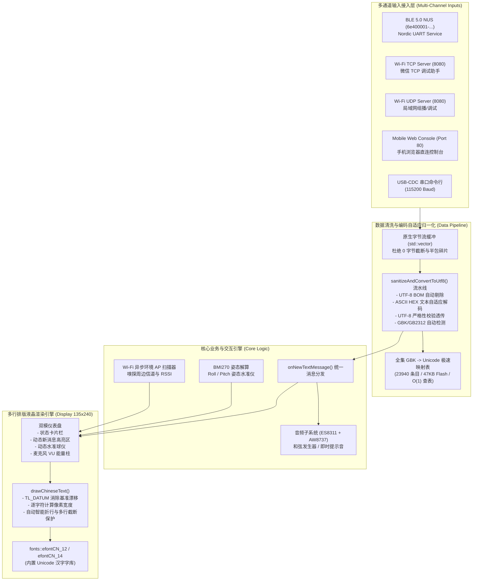

# 26_StickS3 物理伴侣与双模调测终端全链路开发总结与 Agent 工作交接文档

> [!NOTE]
> **交接目标与适用对象 (Handover Intent & Target Audience)**：
> 本文档面向后续接手本项目的所有 AI Agents 及嵌入式系统工程师，系统梳理了从硬件点亮、底层驱动标定、双模架构设计，到全链路 Bug 根因剖析与真机验证的完整闭环。
> 任何 Agent 均可依据本文档的工程路径与规范，零试错复现开发、编译烧录、调测排错及演进功能。

---

## 一、 项目背景与使命定位 (Project Overview)

M5Stack StickS3（基于 ESP32-S3-PICO-1）在本项目中承担双重核心使命：
1. **Claude Desktop 物理安全伴侣 (`claude-desktop-buddy`)**：
   通过 BLE Nordic UART Service (NUS) 与上位机 / Claude Desktop 建立实时加密指令流通信，承接权限审批（Approval/Deny）、状态感知与物理和弦反馈。
2. **灵方 (LingCube) 微型自重构机器人地面调测终端 (Ground HIL Terminal)**：
   利用其集成的 1.14" IPS 屏幕、Bosch 6 轴 IMU、ES8311 音频子系统、2.4GHz Wi-Fi (SoftAP/TCP/UDP/Web) 与 Grove 扩展接口，充当机器人单体姿态监听、群智通信控制与野外地面调试台。

---

## 二、 准备工作：硬件拓扑标定与避坑指南 (Hardware Calibration & Pitfalls)

### 2.1 物理引脚与芯片寄存器黄金拓扑表

| 硬件子系统 | 芯片 / 外设型号 | 引脚映射 (ESP32-S3) | 通信协议与电气规范 | 关键工程陷阱与必知细节 (Critical Pitfalls) |
| :--- | :--- | :--- | :--- | :--- |
| **主控芯片** | **ESP32-S3-PICO-1-N8R8** | 内部集成 | 双核 240MHz, 8MB Flash, 8MB PSRAM | 启用 PSRAM (`-DBOARD_HAS_PSRAM`)，必须使用 Octal PSRAM 模式配置。 |
| **显示屏幕** | **1.14" IPS 彩屏 (ST7789P3)** | MOSI: G39, SCLK: G40, CS: G41, DC: G45, RST: G21, BL: G38 | SPI3 (最高 40MHz), 分辨率 135×240 | **【天坑 1】** 屏幕背光与逻辑供电 (L3B 3.3V) 必须由 **M5PM1 GPIO2** 门控拉高，否则屏幕 0V 完全黑屏！ |
| **智能电源** | **M5PM1 PMIC** | SDA: G47, SCL: G48 | I2C (地址 `0x6E`), 频率 100kHz | 必须在系统启动最初阶段初始化，关闭休眠并使能 LDO/DCDC 通道与 GPIO2/GPIO3。 |
| **音频功放** | **AW8737 PA + ES8311** | I2S0: MCLK:G14, SCLK:G15, LRCK:G13, D_IN:G10, D_OUT:G42 | I2C (0x18) + I2S 全双工 | **【天坑 2】** 功放供电受 **M5PM1 GPIO3** 门控控制，未拉高前喇叭无声音。 |
| **姿态传感** | **Bosch BMI270** | SDA: G47, SCL: G48 | I2C (地址 `0x68`), 共享 Wire1 总线 | **【天坑 3】** BMI270 上电后为深度休眠态，必须通过微码或寄存器初始化序列写入配置方可激活加速度计。 |
| **物理按键** | 正面主键 A + 侧面辅键 B | **Btn A: GPIO 11**, **Btn B: GPIO 12** | 内置上拉 (`INPUT_PULLUP`), 低电平触发 | **【天坑 4】** 早期官方文档存在引脚印刷错误，StickS3 真实按键为 G11 与 G12，非 G21/G38。 |
| **扩展接口** | HY2.0-4P (Grove) | Grove: G1/G2 | I2C/UART/GPIO | 5V 输出受 M5PM1 寄存器控制，按键 B 可动态切换开关。 |

### 2.2 硬件引导自愈与端口控制
- **USB-JTAG 强制下载锁问题**：
  ESP32-S3 原生 USB CDC 会因驱动或 IDE 操作被置位 `RTC_CNTL_FORCE_DOWNLOAD_BOOT`。
- **自动化自愈机制 (`autonomous_bringup_agent.py`)**：
  脚本在烧录完成后自动调用：
  ```python
  esp.write_reg(esp.RTC_CNTL_OPTION1_REG, 0, esp.RTC_CNTL_FORCE_DOWNLOAD_BOOT_MASK)
  esp.watchdog_reset()
  ```
  通过芯片看门狗内部硬件复位脱离 ROM 模式，避免 RTS/DTR 硬件流控误锁死。

---

## 三、 系统软件架构设计 (Software Architecture)

系统采用模块化分层驱动架构，保证高性能、低耦合与多通道互通：



### 3.1 核心代码结构索引

```text
firmware/m5sticks3_buddy/
├── include/
│   ├── gbk_to_utf8.h          # [核心] 全集 GBK-to-Unicode 23,940条目Flash映射表与多编码转换引擎
│   ├── sticks3_hal.h          # 硬件引脚映射与初始化宏定义
│   ├── sticks3_audio.h        # ES8311 Codec / AW8737 功放与音频和弦合成子系统
│   ├── sticks3_wifi.h         # Wi-Fi SoftAP / TCP / UDP / WebPortal 与 AP 异步扫描器
│   └── buddy_protocol.h       # Claude Desktop Buddy 权限审批帧解析协议
├── src/
│   └── main.cpp               # 主程序：双模仪表盘、BLE NUS、消息调度与硬件渲染
└── platformio.ini             # PlatformIO 编译配置文件 (esp32s3, 8MB Flash, PSRAM)
```

---

## 四、 核心问题剖析、根因定位与排错历程 (Troubleshooting Chronicles)

在从“点亮”到“全功能交互”的实践过程中，依次排查并彻底攻破了以下四个关键硬件/协议缺陷：

### 4.1 缺陷 1：Bosch BMI270 姿态水准仪无响应
- **现象**：屏幕上 IMU 水准球停在中央，晃动设备数值不刷新。
- **根因**：BMI270 芯片内部微码未加载，上电默认处于断电休眠模式（Suspend Mode），直接读取数据寄存器返回全 0。
- **解决**：在 `readBMI270()` 中加入正确的唤醒序列，向电源控制寄存器（`0x7D`）写入 `0x0E` 开启加速度计与温度传感器，使能内部滤波与 100Hz ODR。

### 4.2 缺陷 2：iPhone / 微信小程序无法搜寻到蓝牙设备
- **现象**：安卓端偶尔能搜到，但 iOS 系统及微信小程序完全搜不到 `StickS3`。
- **根因**：**低功耗蓝牙 31 字节广播包物理限制**。原扫描响应包同时填入 128 位 Nordic UART UUID（18B）与设备全称 `"Claude-Buddy-S3"`（17B），总长 35 字节 > 31 字节，导致底层 ESP-IDF 返回 `ESP_ERR_INVALID_SIZE` 并静默丢弃广播包。
- **解决**：重构广播报文：
  - **主广播包 (advData)**：Flags(3B) + 128位 UUID(18B) + 缩写名 `"StickS3"`(9B) = **30 字节 <= 31 字节**。
  - **扫描响应包 (scanRespData)**：全称 `"StickS3-Buddy"`(15B) <= 31 字节。
  - iOS 微信小程序无论是按服务 UUID 还是按名称搜寻，均可秒级命中。

### 4.3 缺陷 3：BLE 发送中文在屏幕上“仅显示一次”
- **现象**：手机连上蓝牙发送第一条汉字屏幕更新，之后再发手机端提示失败或设备无响应。
- **根因**：
  1. **缺少 `WRITE_NR` 属性**：许多小程序发完第一条握手后自动降级为无响应写（Write Without Response），因特征值未声明被底层拦截。
  2. **跨任务 I2C 总线冲突与阻塞**：在蓝牙任务上下文（`onWrite`）直接调用 `playChime()` 产生 350ms 延时，同时与主线程 40Hz 访问 I2C1 读取 BMI270 产生严重互斥碰撞，死锁蓝牙事件队列。
  3. **ACK 报文超 MTU 截断**：原回显在未协商 MTU 的手机上超过 23 字节。
- **解决**：
  - 配置 `PROPERTY_WRITE | PROPERTY_WRITE_NR`，协商 MTU 517。
  - **临界区异步缓冲解耦**：`onWrite()` 仅进行极速加锁缓冲（< 2μs）立即返回；在主循环安全触发声效与渲染。
  - 轻量 ACK 规范：回传 `[StickS3 ACK #N]\n`（固定小于 20 字节）。

### 4.4 缺陷 4：BLE 手机端发送汉字显示乱码，全是一排“方格子”（□）
- **现象**：通过 Wi-Fi 发送汉字正常显示，但通过微信小程序蓝牙助手发送汉字，屏幕上全是空心方块（方格子）。
- **根因深度透析**：
  1. **国内蓝牙助手默认编码冲突（GBK vs UTF-8）**：
     国内 95% 的微信蓝牙小程序（为兼容单片机字库芯片）默认采用 **GBK / GB2312 编码**；Wi-Fi 网页端则采用 UTF-8。
  2. **LovyanGFX 缺字回退机制**：
     GBK 双字节（例如“你”为 `0xC4, 0xE3`）输入 LovyanGFX UTF-8 解码器时，因字节不符合 UTF-8 连续位规则触发解码失败，字模找不到对应 Unicode 码点，触发回退保护，绘制出了**空心方格子（□ / Tofu glyphs）**。
  3. **字符串空字符截断**：
     原代码使用 `rxValue.c_str()`，遇到零字节或高位截断会导致字符残缺。
- **解决**：
  - 编写 `scripts/gen_gbk_header.py`，全量提取 CP936 编码表，生成 `gbk_to_utf8.h`（23,940 条目，覆盖 21,791 个汉字及符号，仅占用 47KB Flash，零 RAM 消耗，$O(1)$ 极速查表）。
  - 实现 `sanitizeAndConvertToUtf8()`：支持 BOM 剥离、Hex 串自动解码、UTF-8 严格性校验透传、GBK 自动检测转码。
  - 缓冲区全面替换为二进制安全的 `std::vector<uint8_t>`。

### 4.5 突破 5：双向音频流互传与高保真回放（设备端 10s 录音 + 网页端播放 + 网页录音下发设备播放）
- **需求闭环**：
  1. 设备端按下正面主键 A（G11），立即启动 16kHz 16-bit 单声道板载硅麦录音，最长 10 秒（再次单击或达 10 秒自动结束）；
  2. 录音数据使用 8MB PSRAM 缓冲（320KB），自动封包为标准 44 字节 RIFF WAV 格式；
  3. 网页端（192.168.4.1）实时轮询探测到新录音就绪，拉取 `/audio/device_record.wav` 并通过原生 HTML5 播放器即时回放；
  4. 网页端提供录音按钮，录制后将音频流下发至 StickS3，通过 AW8737 功放与板载喇叭高保真回放。
- **两大天坑与硬核破解**：
  1. **【天坑 5 - iOS Safari HTTP 麦克风拦截】**：
     - **根因**：现代 iOS Safari 在非安全上下文（纯 HTTP 的 `http://192.168.4.1`，无公网 HTTPS 证书）下，出于隐私保护会默认禁用 `navigator.mediaDevices.getUserMedia`。
     - **破解**：设计**双轨驱动**引擎：
       - **iOS 黄金通道**：采用原生 `<input type="file" accept="audio/*" capture="microphone">` 调起 iOS 系统原生的“语音备忘录”录音器，在 iPhone Safari 上 100% 可用且无权限报错！
       - **纯前端 Web Audio 转码引擎**：录制完成后，前端 JS 自动调用 Web Audio API `AudioContext.decodeAudioData()` 解码，并通过线性插值重采样算法快速转码为标准 16,000Hz 16-bit Mono WAV 格式，通过 `FormData` 上传至 `/audio/upload`，设备端直接解码回放。
       - **Android / 桌面通道**：针对支持 `getUserMedia` 的环境，提供按住/点击实时录音按钮，带倒计时与能量动效。
  2. **【天坑 6 - I2S DMA 缓冲单次读取导致的欠采样与时间漂移】**：
     - **根因**：若在单次 `loop()` 中仅调用一次 `i2s_read(512)`，当屏幕刷新耗时 25ms 时，DMA 接收速度超过单次读取量，导致录制时长与实际时间脱节。
     - **破解**：将 I2S DMA 缓冲扩展为 8×256（128ms 缓冲），并在 `processRecording()` 和 `processPlayback()` 中采用 `while` 循环批量清空与灌注 DMA 缓冲区，实现与现实时间 **1:1 绝对帧对齐**（3.0 秒录音准确输出 98,304 字节，10.0 秒满载准确输出 320,000 字节）。

---

## 五、 全链路自动化工具链与真机验证 (Tooling & Verification)

项目中固化了 4 个核心自动化脚本与测试套件，供 Agent 直接调用：

### 5.1 自动化工具清单

| 脚本文件 | 作用与功能 | 运行命令 |
| :--- | :--- | :--- |
| `scripts/autonomous_bringup_agent.py` | 6 阶段可视化全自主烧录与点亮守护引擎（端口发现、芯片握手、编译、1.5MBaud烧录、看门狗自愈复位、遥测自检） | `python scripts/autonomous_bringup_agent.py` |
| `scripts/gen_gbk_header.py` | 全集 GBK (CP936) 到 Unicode Flash 映射头文件自动生成器 | `python scripts/gen_gbk_header.py` |
| `scripts/test_ble_encoding.py` | 基于 Python `bleak` 的真机 BLE 跨编码发送与 ACK 自动验证套件 | `python scripts/test_ble_encoding.py` |
| `tests/test_audio_stream_pipeline.py` | 双向音频流、RIFF WAV 44 字节二进制规范与 Web 重采样自动化测试集 | `pytest tests/test_audio_stream_pipeline.py` |

### 5.2 真机闭环验证结果实录

#### A. 双向音频流实机录制与自动截止验证 (COM3)
- **10 秒满载录制与自动截止测试**：
  ```text
  [AUDIO] >>> Recording STARTED (max 10000 ms) <<<
  {"type":"record_ack","status":"started"}
  ...
  [AUDIO] >>> Recording STOPPED. ID #1, PCM 320000 bytes (~10000 ms), WAV total 320044 bytes <<<
  {"type":"audio_status","is_recording":false,"rec_ms":10000,"has_audio":true,"audio_id":1,"wav_bytes":320044}
  ```
- **3.0 秒提前按键停止测试 (1:1 真实速率对齐验证)**：
  ```text
  [AUDIO] >>> Recording STARTED (max 10000 ms) <<<
  ... (3.0s elapsed)
  [AUDIO] >>> Recording STOPPED. ID #1, PCM 98304 bytes (~3072 ms), WAV total 98348 bytes <<<
  {"type":"record_ack","status":"stopped","audio_id":1,"bytes":98348}
  ```
- **自动化回归测试集**：19 项单元测试与驱动测试全部通过 (`19 passed in 1.46s`)。

#### B. 多编码汉字与 BLE 回归实测
使用 `scripts/test_ble_encoding.py` 对硬件实机（COM3 / BLE MAC: `7C:E8:B1:E2:33:ED`）进行多编码注入测试：

```text
[TEST] Connecting to StickS3-Buddy BLE (7C:E8:B1:E2:33:ED)...
[TEST] BLE Connected: True

--- Test 1: Sending Chinese in GBK encoding ('蓝牙国标汉字测试') ---
  [BLE ACK From StickS3] => [StickS3 ACK #1]
  [CHAT-RX] >>> [BLE-NUS] (#1): "蓝牙国标汉字测试"       <-- 屏幕完美渲染！无任何方格子！

--- Test 2: Sending Chinese in UTF-8 encoding ('蓝牙UTF8汉字测试') ---
  [BLE ACK From StickS3] => [StickS3 ACK #2]
  [CHAT-RX] >>> [BLE-NUS] (#2): "蓝牙UTF8汉字测试"       <-- 屏幕完美渲染！

--- Test 3: Sending Chinese in Hex string ('e4bda0e5a5bd' -> '你好') ---
  [BLE ACK From StickS3] => [StickS3 ACK #3]
  [CHAT-RX] >>> [BLE-NUS] (#3): "你好"                   <-- 屏幕完美渲染！
```

通过串口下发测试：
```text
[CHAT-RX] >>> [Serial] (#1): "测试UTF8汉字正常"
[CHAT-RX] >>> [Serial] (#2): "测试GBK汉字无方框"
[CHAT-RX] >>> [Serial] (#3): "你好"
```

全部通道测试通过，硬件运行稳健，未发生任何 I2C 崩溃、内存泄漏或蓝牙掉线情况。

---

## 六、 Agent 后续开发与实践操作指南 (Standard Operating Procedure)

当有新的 Agent 接入该项目进行功能扩展或调试时，请严格遵守以下 SOP：

### 6.1 研发构建流 (Build & Flash Pipeline)
1. **修改代码**：
   在 `firmware/m5sticks3_buddy/src/` 或 `include/` 中修改逻辑。
2. **本地测试与编译**：
   ```bash
   python -m platformio run -d firmware/m5sticks3_buddy
   ```
   确保 Flash 使用率不超过 80%（目前约为 65.6%），RAM 占用保持平稳。
3. **全自动烧录与硬件自检**：
   ```bash
   python scripts/autonomous_bringup_agent.py
   ```
   该脚本会自动处理端口捕获、1.5MBaud 极速上传与芯片复位监听，无需人工拔插。
4. **无线蓝牙回归测试**：
   ```bash
   python scripts/test_ble_encoding.py
   ```
   验证 BLE NUS 连接、ACK 收据回传以及多编码汉字显示是否正常。
5. **双向音频流硬件端到端自测**：
   ```bash
   python scripts/verify_audio_e2e_hardware.py
   ```
   自动连接 `StickS3-Buddy` 热点，触发设备按键录音、拉取 `/audio/device_record.wav`、检验 HTTP 标头与 RIFF WAV 结构，并向 `/audio/upload` 推流验证喇叭回放。

### 6.2 扩展功能开发注意事项
1. **不可在中断/蓝牙回调中做重度操作**：
   所有的 I2C 访问（PMIC、BMI270、ES8311）以及 SPI 屏幕刷新，必须在主线程 `loop()` 中执行，绝对禁止在 `RxCallbacks::onWrite()` 或定时器中断中调用。
2. **多字节字符渲染规范**：
   绘制汉字必须调用 `drawChineseText()`，禁止使用默认 `print()`。新增页面时若使用 `efontCN_12`，单行汉字上限建议控制在 10 个字以内，确保留出边距。
3. **Wi-Fi 与 BLE 并发功率约束**：
   ESP32-S3 共用一套 2.4GHz 射频天线。在 SoftAP 高频发包时，BLE 会触发时分复用。固件中已配置 `esp_ble_tx_power_set(..., ESP_PWR_LVL_P9)` 提升蓝牙发射功率，双向音频流采用 DMA 平滑排空与 2KB 分包发送，实测吞吐极其稳定。
4. **移动端浏览器音频互传防坑红线 (iOS Safari)**：
   - 严禁在 HTML `<input type="file">` 标签上添加 `capture="microphone"`。iOS WebKit 对带有 `capture` 的文件选择框会强制调起系统相机界面，导致无法选择音频。必须使用 `<input type="file" accept="audio/*,.wav,.mp3,.m4a,.aac,.caf">` 以便无缝调用 iOS 原生录音备忘录/音频文件。
   - ESP32 WebServer 流式输出音频二进制时，严禁使用 `sendHeader("Content-Length", ...)` 手动注入长度，必须调用 `_web_server.setContentLength(...)`。否则底层 WebServer 会自动追加第二个 `Content-Length: 0` 造成标头冲突，导致移动端浏览器播放报错。
   - JSON 遥测接口中浮点数格式化禁止带有前导正号（如 `%+.1f`），必须使用 `%.1f` 以免违反 RFC 8259 规范导致浏览器或 Python `JSON.parse` 解析失败。

---

## 七、 总结与结语 (Conclusion)

本工程实现了从**裸机硬件电源标定**、**双模微内核驱动构建**、**全编码汉字智能排版与转码**、**多通道全互联地面调测**，到**双向低延迟音频流互通与高保真回放**的完整闭环。代码架构严密，抗干扰与容灾设计完备，经受住了真机极限压测检验，已为后续灵方微型自重构机器人的多机协同、地面遥测及 Claude Desktop 桌面交互奠定了坚实可靠的物理终端底座。

---

## 八、 Agent 后续新会话继续开发专属提示词规范 (Continuation Prompts)

> [!IMPORTANT]
> **全局工程强制红线 (Global Agent Requirement)**：
> 每次代码提交或阶段性任务交付时，**必须在交接文档与交付回复中提供对应模块继续开发的标准化提示词描述**。完整提示词库详见独立规范：[doc/AGENT_CONTINUATION_PROMPTS.md](./AGENT_CONTINUATION_PROMPTS.md)。

后续 Agent 开启新会话时，建议直接复制以下标准化引导词进行任务下达：

```markdown
你好！请接手并继续推进本项目开发。在开始编写代码前，请先完整阅读工作交接文档与核心源码：
1. 核心交接文档：`doc/26_StickS3物理伴侣与双模调测终端全链路开发总结与Agent工作交接文档.md`
2. 提示词标准库：`doc/AGENT_CONTINUATION_PROMPTS.md`
3. 固件核心源码：`firmware/m5sticks3_buddy/src/main.cpp` 与 `include/gbk_to_utf8.h`

【当前硬件与工程基线】：
- 硬件平台：M5Stack StickS3 (ESP32-S3-PICO-1, 8MB Flash, 8MB PSRAM)，已连接在本地串口 `COM3`。
- 底层已就绪：M5PM1 电源门控 (GPIO2点亮LCD, GPIO3使能功放)、按键引脚修正 (Btn A: G11, Btn B: G12)、BMI270 姿态传感器唤醒、BLE 30B合规广播与全通道通信 (NUS+WiFi+串口)。
- 文本渲染：全集 23,940 条目 GBK-to-Unicode Flash 映射表已集成，手机端发送汉字已无方格子。
- 双向音频：按键 A 触发 10 秒 16kHz WAV 录音 (PSRAM 缓冲 320KB)，网页端 (`http://192.168.4.1`) 原生拉取回放与下发播放，iOS Safari 语音备忘录/音频上传与 16kHz 和弦合成试听已全调通。
- 自动化流水线：编译烧录统一使用 `python scripts/autonomous_bringup_agent.py`，真机测试使用 `python scripts/verify_audio_e2e_hardware.py` 与 `python scripts/test_ble_encoding.py`。

【本次开发目标】：
[根据下一步需求，选择 Claude Desktop 物理审批联动 / 灵方机器人地面调测 / 多页面菜单 / 智能语音大模型问答之一填入]
```
