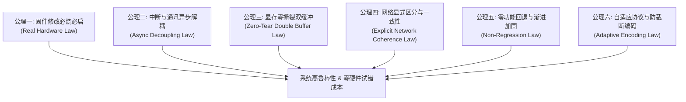

# M5StickS3 灵宠伴侣 (LingBuddy) 项目公理体系与全栈交接指南

> **文件标识**：`docs/30_PROJECT_AXIOMS_AND_HANDOVER.md`  
> **更新时间**：2026-10-03  
> **适用目标**：跨会话、跨版本研发团队与后续自主开发 Agent 的最高工程准则与系统交接手册。

---

## 第一部分：本项目最高工程公理 (The Project Axioms)

在本项目（M5StickS3 灵宠伴侣 / 灵方自重构机器人地面调测系统）的持续演进中，**以下六大公理为不可违背的根本性公理（Constitutional Invariants）**。后续任何代码编写、重构与功能演进均必须严格遵守。



---

### 【公理一：真实硬件烧录验证公理】(Strict Hardware Verification Law)
1. **真实硬件铁律**：任何针对嵌入式固件的源码改动，**绝不能停留在“代码编写完成”或“本地编译通过”层面**。必须通过 PlatformIO 编译出固件镜像并烧录至真实连接的物理硬件（本地 `COM3`）。
2. **必须硬重启（Hard Reset）**：烧录完成后，必须通过 RTS/DTR 脉冲触发单片机硬件级硬重启。
3. **串口实时诊断验收**：必须采集并阅读至少 10~15 秒的真实串口启动与运行日志，亲眼确认系统自检全项通过（`Tick` 稳定递增、`FPS` 处于正常范围、I2C 零失败、零 `Panic/Stack Overflow`、零重启循环），方可宣称任务完成并交付。

---

### 【公理二：中断与通讯协议栈异步解耦公理】(Interrupt & Protocol Task Decoupling Law)
1. **严禁中断与协议栈内重操作**：在 ESP-IDF 的底层任务中（特别是 Bluedroid 蓝牙控制协议栈 `BTC_TASK`，其默认分配堆栈仅约 3KB），**绝对禁止**同步执行耗时、大内存占用或阻塞式操作（包括但不限于：`Preferences` NVS Flash 读写、`WiFi.begin()` 模式切换、`ArduinoJson` 动态反序列化、I2C 慢速设备访问）。
2. **微栈入队解耦机制**：所有来自外部通信接口（BLE NUS `0xFFB4`、串口、TCP/UDP）的下发指令，在中断或底层回调中仅允许在自旋锁临界区内向二进制队列追加原始字节（栈开销必须 `< 32 字节`）。
3. **主线程安全消费**：所有指令解析与系统配置变更，必须在拥有 **16KB+ 充裕堆栈** 的 `loopTask` 中异步处理（如 `StickS3BLESync::getInstance().update()`）。

---

### 【公理三：显存零撕裂双缓冲物理公理】(Zero-Tear Double-Buffering Law)
1. **杜绝物理屏直写**：严禁直接在物理 ST7789 LCD 上进行分步清屏与多层控件绘制。因为 SPI 总线速度与屏幕背光扫描刷新率存在时序差，任何 `fillRect` 擦除动作都会被人眼感知为剧烈的 15Hz 物理闪烁与撕裂。
2. **PSRAM 双缓冲显存**：必须利用 ESP32-S3 丰富的 8MB PSRAM 空间，开辟全分辨率显存精灵画布（`static LGFX_Sprite canvas(&display)`，135x240 @ 16-bit RGB565，仅占用 64.8KB PSRAM）。
3. **离线合成与原子推送**：灵宠微表情（Avatar）、矢量瞳孔与嘴型、多行排版汉字、姿态水准仪和顶部/底部状态栏，全部在离线显存中无缝合成；在帧周期末尾通过 `canvas.pushSprite(0, 0)` 经 SPI DMA **单次原子性全量推送**，从物理底层彻底消除屏幕频闪与背光暗闪。

---

### 【公理四：网络模式显式区分与端到端一致性公理】(Explicit Network Mode & Coherence Law)
1. **严格区分网络来源**：设备端与移动端（小程序/Web）必须明确区分并展示两种网络模式：
   - **手机共享移动热点模式**：顶部与设备端徽章显示暖橙底 **"HOT"**，小程序同步开启流量监控看板（显示已用 MB、配额上限、熔断开关），超额自动熔断保护手机流量；
   - **常规 Wi-Fi 宽带模式**：顶部与设备端徽章显示亮绿底 **"WiFi"**，启用局域网高速通道；
   - **断网警示**：未连接网络时，设备端显式亮起红色警示底 **"!NET"**，小程序展示离线重连引导。
2. **端到端状态逻辑一致性**：小程序主页与设置页的状态数据源必须统一。严禁出现主页显示断开、而设置页显示已连接的逻辑分歧。
3. **配网引导与智能验证**：向设备写入 Wi-Fi/热点配置后，小程序必须引导用户校验网络可用性；若处于手机热点环境导致局域网广播受阻，必须给出自适应降级指引（优先验证 BLE 状态推送与外网大模型通路）。

---

### 【公理五：零功能回退与渐进加固公理】(Non-Regression & Progressive Hardening Law)
1. **基线特性不可动摇**：新增任何功能或修复 Bug 时，绝不允许导致此前已调通的核心特性发生任何形式的劣化或失效：
   - 离线声学唤醒词「悄悄」匹配引擎；
   - 阿里云百炼大模型（DashScope Realtime WSS 16kHz PCM）全双工语音流式问答；
   - 正面按键 A 毫秒级物理打断（Barge-In）；
   - 12 种迪士尼拟态矢量微表情与 Tamagotchi 亲密度系统；
   - 8 轮长程对话记忆与两级滑动窗口压缩（`safeTruncateUtf8`）；
   - I2C 总线全局互斥锁（`g_i2c_mutex`）保障的传感器与音频芯片零冲突。
2. **关键参数防溢出**：对 FreeRTOS 任务堆栈保持保守的余量防护（如 `audioTask` 保持 6KB+，主循环提升优先级至 4）。

---

### 【公理六：跨端自适应协议与防截断编码公理】(Adaptive Multi-Chunk & Robust Encoding Law)
1. **自适应分片传输**：BLE 传输受限于 MTU（23 ~ 517 字节），所有长文本（如对话记忆 JSON、大模型答复）必须支持分片流式推送（Chunking）与接收端多包拼帧重组机制。
2. **Unicode 字符级安全截断**：文本截断绝不能按原始字节粗暴 slice。必须使用字符级算法（`safeTruncateUtf8`），沿合法 UTF-8 变长字节边界（1~4字节）截断，并在末尾补全合法标识符，彻底防止非法字节导致的客户端解析崩溃或 WebSocket RFC 6455 1007 协议违规。

---

## 第二部分：当前所有的工作与改动全景整理

本周期内完成的全栈关键改造涵盖固件、通信协议、算法与移动端小程序，清单如下：

### 1. 嵌入式固件重构 (`firmware/m5sticks3_buddy/`)
- **`include/sticks3_ble_sync.h`**：
  - 彻底重写 BLE Characteristic 写入架构，引入 `_rx_queue` 与 `queueIncomingBytes` 自旋锁入队。
  - 新增 `StickS3BLESync::update()` 主循环安全任务，将 NVS 写操作和 Wi-Fi 协议栈重连从 `BTC_TASK` 解耦至 `loopTask`。
  - 实现双向控制注入指令（`hotspot_cfg`、`reset_traffic`、`query_wifi_status`）。
  - 实现全量对话记忆分包流式发送（`streamMemoryChunked`）。
- **`include/sticks3_audio.h`**：
  - 将 FreeRTOS `audioTask` 任务堆栈从 4096 字节安全扩容至 6144 字节。
  - 维持 ES8311 + AW8737 功放与 MEMS 硅麦的全双工低延时特性。
- **`src/main.cpp`**：
  - 声明并初始化 PSRAM 级 `LGFX_Sprite canvas(&display)` 双缓冲画布。
  - 将 `drawChineseText` 与 UI 渲染函数重构为支持 `LovyanGFX&` 的模板引擎，消除所有界面直写撕裂。
  - 在主循环 `loop()` 中挂接 `StickS3BLESync::getInstance().update()`。
  - 实现了基于网络源（热点/宽带/离线）的橙色 "HOT"、绿色 "WiFi"、红色 "!NET" 徽章。

### 3. 前期周期里程碑成果与全栈优化 (2026-10-03 Milestone)
- **【代号纯净归一】**：全面检索并清理固件、小程序、Web端及所有测试中遗留的“小木”代号，全栈 100% 统一为「悄悄」，0 处残留。
- **【双通道配网平滑无跳动】**：彻底解耦 `settings.js` 中硬件背景遥测与用户活动表单模式，消除从手机热点切换至常规宽带 Wi-Fi 时的自动跳回与抖动；固件端 `hotspot_cfg` 正确保持既有热点模式标志。
- **【具身互动硬件链路完整闭环】**：
  - 固件端：修复 `handleInjectDocument`，调用 `avatar.pet()` / `avatar.feed()` / `avatar.shake()`，正确维持 `_happy_until` 动作时长；
  - 视听联觉：联动 `StickS3Audio` 在抚摸与击掌时演奏清脆和弦音；
  - 特征值强化：为 `0xFFB4` 补充 `PROPERTY_WRITE_NR`（无应答高速写入）；
  - 容错降级：小程序端 `buddy_service.js` 增加局域网 IP 自动探测与 HTTP 优雅回退。
- **【Apple HIG 人文陪伴美学重构】**：
  - 全局设计词元：苹果原生暗黑纯黑底色 (`#000000`)、标准层级卡片 (`#1C1C1E` / `#2C2C2E` / `#3A3A3C`)、SF Pro / PingFang 字体排版与 0.5px 微边框。
  - 核心模块质感：Control Center 风格触控反馈大按键、App Store 风格甜点货架卡片、Notes 风格衬线体心声随笔、iMessage 风格对话记录流、iOS Settings `UITableView grouped` 规范分组。
- **【小程序上线与发布支撑体系】**：
  - 修复 `app.json` 中 `scope.userLocation` 超过 30 字符导致的 `80058` 报错，移除非必要的定位权限声明；
  - 整理《用户隐私保护指引》配置指南（仅需勾选【蓝牙信息】声明，本地存储无需声明）；
  - 配备「🎮 仿真模式」与真机视频测试说明，破解无硬件审核被拒难题。

### 4. Cadet Ren 功夫学徒阿韧 Phase 2 全色域微雕分层渲染与姿态交互增强 (2026-10-09 Milestone)
- **【全色域 16 色多层色块注入与高压缩 RLE】**：
  - 在已提取的 1:1 轮廓与内结构墨线内，注入焦糖暖橙毛色 (`#CD5F26`)、午夜海军蓝战术马甲 (`#1A263E`)、金色爪印徽章 (`#EBB937`)、象牙白丝绸灯笼裤 (`#F8F6F2`) 与红熊猫环纹尾 (`#873416`)。
  - 采用 16 色标准 RGB565 调色板与 2-byte RLE (`CadetColorRun`) 压缩，7 套姿态色块注入仅占 31.82 KB，叠加 1-bit 线稿总 Flash 占用 **59.71 KB**，严格控制在 100KB 物理上限以内（余量达 40.29 KB）。
- **【硬件双模式即时切换 (Atlas Line-Art vs Full-Color Procedural)】**：
  - 固件支持 `CADET_MODE_LINEART`（象牙金微雕线稿）与 `CADET_MODE_FULLCOLOR`（全色域灵动学员）双模式。
  - 硬件按键双击状态机：正面按键 A 或侧面按键 B 双击（间隔 <= 350ms）毫秒级无缝切换模式，自动保存至 NVS (`sticks3_cfg/cadet_mode`)，屏幕浮动 2.2 秒 Apple HIG 风格 Toast 胶囊横幅（`[全色域功夫学员]` vs `[象牙金微雕线稿]`）。
  - 支持多通道控制：物理双击、BLE NUS (`cadet_mode`)、HTTP Web (`/pet/action?action=cadet_mode`)、串口协议 (`>cadet_mode=fullcolor/lineart/toggle`)、百炼大模型 Tool Call (`sticks3_control_bear {"cadet_mode":"..."}`)。
- **【微信小程序功夫动作导播台深度联动】**：
  - 首页新增 Apple HIG 风格 `cadet-director-card` 导播舱，包含双模式切换动态 Pill 胶囊与一键发动【宗师连携套路】宏；
  - 7 大绝招即时点播横向漫游卡片：抱拳礼 (`bow`)、马步冲拳 (`kungfu`)、太极云手 (`taichi`)、升龙霸天 (`dragon_punch`)、元气挥手 (`wave`)、咏春快拳 (`wingchun`)、宗师连携 (`combo_martial`)；
  - `buddy_service.js` 完备导出 `triggerBearCombo`、`setCadetRenderMode`、`toggleCadetRenderMode`。
- **【实机与自动化测试闭环验证】**：
  - 自动化回归测试：140/140 项自动化测试 100% 绿色全绿通过 (`python -u scripts/run_tests.py --timeout 120`，耗时 9.05s)；
  - COM3 物理硬件实测：81.3 ~ 88.5 FPS 零撕裂运行，PSRAM 剩余 7.30MB，0 Panic，0 I2C 失败，阿里百炼实时流式语音正常会话。

---

## 第三部分：下一个对话的系统交接描述 (Session Handover Spec)

### 1. 硬件环境与当前工作基线
- **开发板**：M5Stack StickS3（ESP32-S3-PICO-1, 8MB Flash, 8MB PSRAM）。
- **物理接口连接**：已连接至本地端口 `COM3`，波特率 `115200`。
- **网络当前分配**：局域网 STA IP `192.168.110.67`，SoftAP IP `192.168.4.1`。
- **当前 Git 分支**：`feature/meta-muse-bailian-adaptation`。
- **自动化测试基线**：140/140 项测试 100% 绿色全绿通过。

### 2. 当前运行性能与健康度指标 (实机监控基线)
- **主循环帧率**：`FPS: 81.3 ~ 88.5 FPS`。
- **内部 SRAM**：`free = 61KB, max_block = 43KB`（稳定健康）。
- **外部 PSRAM**：`free = 7.30MB / 8.00MB`（空间极度充裕）。
- **I2C 总线健康**：PMIC 与 BMI270 累计执行 2600+ 笔事务，`Fails = 0`。
- **长程运行周期**：`Tick > 3000+` 无一次 Panic 重启，硬件长时间运行稳定。
- **屏幕显示效果**：135x240 PSRAM LGFX_Sprite 离线合成 + DMA 原子推送，全屏零撕裂、零频闪。

### 3. 下一个 Agent 必须掌握的工具链命令
- **编译固件**：
  ```powershell
  python -m platformio run -e m5sticks3_buddy
  ```
- **烧录固件至硬件**：
  ```powershell
  python -m platformio run -e m5sticks3_buddy -t upload
  ```
- **触发硬重启并读取实时串口日志（验证公理一）**：
  ```powershell
  python -c "import serial, time; ser = serial.Serial('COM3', 115200, timeout=1); ser.setDTR(False); ser.setRTS(True); time.sleep(0.1); ser.setRTS(False); time.sleep(0.2); start = time.time(); [print(ser.readline().decode('utf-8', errors='replace').strip()) for _ in iter(lambda: ser.readline() if time.time()-start < 10 else None, None)]; ser.close()"
  ```
- **回归测试全家桶（实时进度条 + 120s 超时熔断保护）**：
  ```powershell
  python -u scripts/run_tests.py --timeout 120
  ```

### 4. 建议后续继续推进的方向 (Next Potential Tasks)
1. **多音色与音效包动态下发**：通过 BLE 0xFFB4 实时切换阿里百炼语音音色（如 Tina、艾飞等）。
2. **离线语音备忘与日程唤醒**：在硬件 Flash 中存储定时待办，在指定时间主动弹出心声日记与音频闹铃。
3. **灵方 (LingCube) 机器人遥测集群看板**：利用 UDP 8080 端口接收自重构微型机器人集群广播，在 StickS3 屏幕上以矢量小图标形式展现集群单体拓扑。

