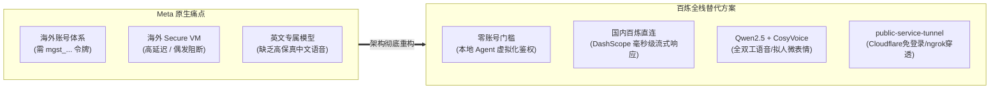
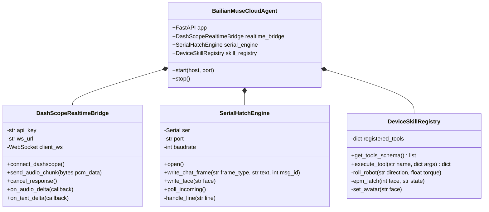
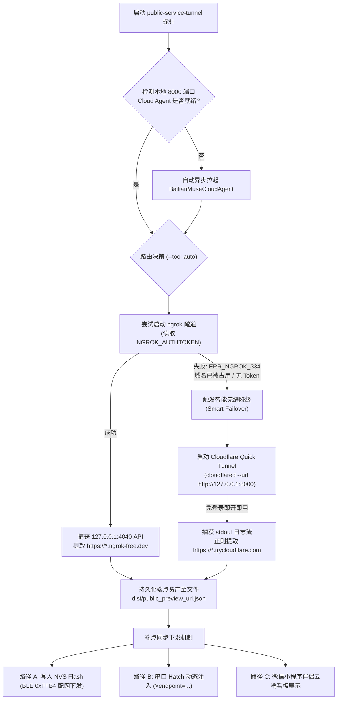
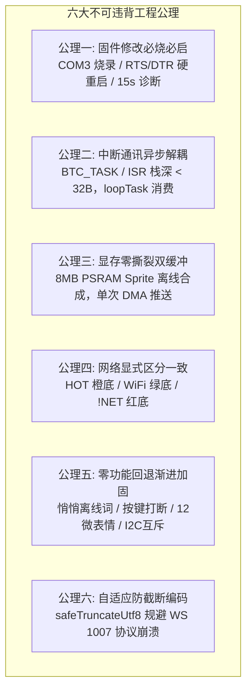
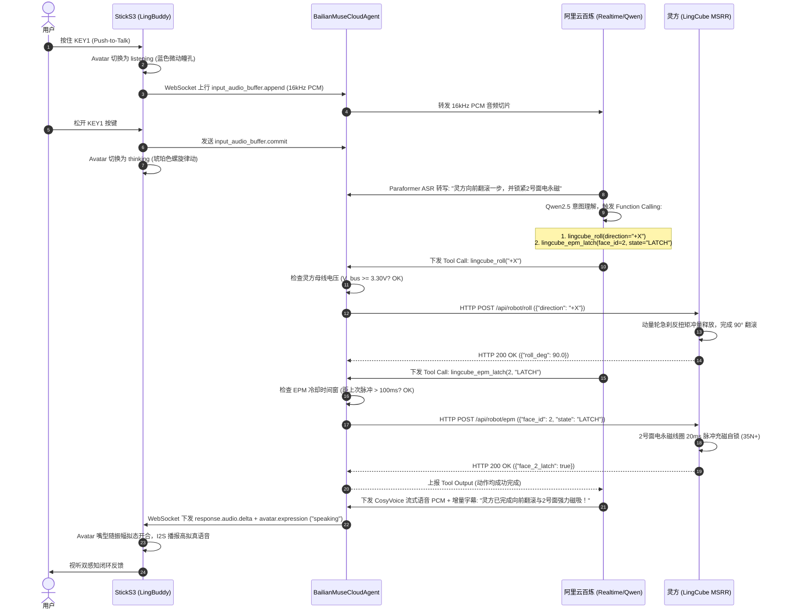
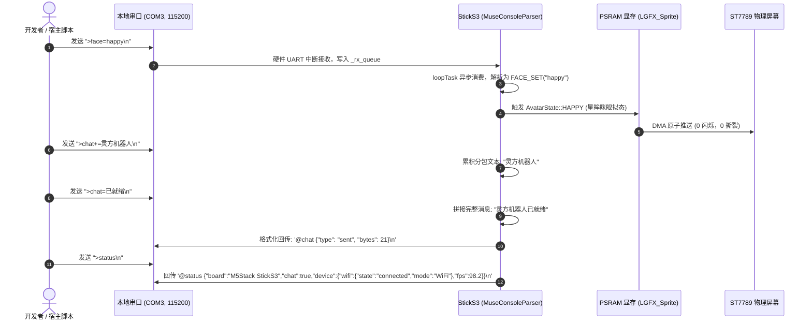
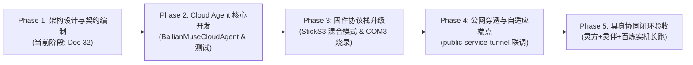

# Meta Muse 开源硬件阿里云百炼大模型适配与公网 Agent 实施方案

> **专案编号**：Doc 32  
> **制定时间**：2026-10-04  
> **分支基线**：`feature/meta-muse-gadgets`（演进自 `feature/lingbuddy-companion`）  
> **架构定位**：yunyu-esp32 全栈最高系统架构规范 —— 阿里云百炼（Alibaba Cloud Bailian）全栈替代 Meta Muse 云端大脑，为 M5Stack StickS3 物理伴侣与灵方 LingCube MSRR 提供完全自主可控、极速响应、免账号绑定的个人 AI Agent 与公网穿透系统。

---

## 目录
1. [执行摘要与问题定义](#1-执行摘要与问题定义)
2. [总体架构拓扑设计 (System Architecture)](#2-总体架构拓扑设计-system-architecture)
3. [BailianMuseCloudAgent 本地中枢架构设计](#3-bailianmusecloudagent-本地中枢架构设计)
4. [双轨公网穿透与持久化端点方案设计](#4-双轨公网穿透与持久化端点方案设计)
5. [全栈通信协议与契约规范 (API Contracts)](#5-全栈通信协议与契约规范-api-contracts)
6. [M5Stack StickS3 物理设备适配与六大工程公理贯彻](#6-m5stack-sticks3-物理设备适配与六大工程公理贯彻)
7. [具身协同端到端交互序列设计 (Interaction Sequences)](#7-具身协同端到端交互序列设计-interaction-sequences)
8. [墨菲定律防御与 FMEA 安全失效对策表](#8-墨菲定律防御与-fmea-安全失效对策表)
9. [分阶段工程落地路线图 (Phase 1 ~ Phase 5)](#9-分阶段工程落地路线图-phase-1--phase-5)

---

## 1. 执行摘要与问题定义

### 1.1 Meta Muse Gadgets 的生态价值与落地瓶颈
2026年10月2日，Meta 官方以 Apache-2.0 协议开源了 **Muse Gadgets**（代码仓：[`facebookincubator/muse-gadget-sdk`](https://github.com/facebookincubator/muse-gadget-sdk)）。该项目首次定义了个人 AI 代理（Personal AI Agent）直连开源硬件开发板（特别是原生支持 **M5Stack StickS3**）的工业级工程范式：
- 基于 **Noise Protocol Framework** 的加密穿透隧道（Home Link）；
- 极具创意的 **Serial Hatch** 串口控制台交互机制（`>chat=...`, `>face=...`）；
- 基于 ESP-IDF v6.0.1 的物理板级支持包与拟态微表情驱动；
- 标准化的 **Community Device Skills** 规范。

然而，在实际面向全球与国内开发者落地时，Meta 方案暴露出三大致命瓶颈：
1. **账号门槛与隔离壁垒**：Meta Muse 云端系统运行于用户专属的 **Muse Secure VM**，依赖定向邀请制且需要绑定 Meta 个人账户获取 `mgst_...` 令牌；对于未开放地区或无 Meta 账号的开发者，硬件设备完全沦为“砖块”无法激活；
2. **跨国云端高延迟与网络脆弱性**：Meta VM 与 `api.muse.ai/fetch_vms` 部署于海外，跨国 TLS/Noise 握手延迟通常达 1.5s~3s 以上，网络丢包率高，导致语音对话频繁卡顿甚至隧道断连；
3. **中文语义理解与语音模型缺失**：Muse Spark 模型主要针对英文语境训练，其中文语音转写（ASR）与语音合成（TTS）效果无法满足高质量拟人陪伴要求。

### 1.2 破局之道：阿里云百炼替代全栈架构
本项目提出并实施 **“阿里云百炼（Alibaba Cloud Bailian / DashScope）大模型矩阵 + 本地化 BailianMuseCloudAgent + public-service-tunnel 双轨免登录公网穿透”** 的全栈破局架构：



- **大脑平替**：将 Meta 云端 Secure VM / Muse Spark 替换为阿里云百炼大模型矩阵（**Qwen2.5-72B-Instruct** 负责复杂语义规划与 Function Calling 工具调用，**DashScope Realtime API** 负责 16kHz PCM 全双工低延迟流式语音问答）；
- **中枢虚拟化**：开发轻量级、高并发的本地宿主守护服务 **`BailianMuseCloudAgent`**，同时提供 HTTP REST、WebSocket 双工流、USB 串口 Serial Hatch 总线以及 Device Skills RPC 桥接；
- **公网自由**：深度集成 `skills/public-service-tunnel` 技能，通过 Cloudflare Quick Tunnel 零配置免登录生成全球 Anycast 公网 HTTPS 端点，彻底解除局域网与路由器 NAT 限制；
- **硬件公理**：严格贯彻 **六大工程公理**（`docs/30_PROJECT_AXIOMS_AND_HANDOVER.md`），确保 M5Stack StickS3 显存零撕裂、中断异步解耦与零功能回退。

---

## 2. 总体架构拓扑设计 (System Architecture)

系统整体采用**四层解耦拓扑**设计：物理终端层、安全传输与公网穿透层、Cloud Agent 协同调度层、百炼大模型多模态智能层。

```mermaid
flowchart TB
    %% 样式定义
    classDef device fill:#1f2937,stroke:#3b82f6,stroke-width:2px,color:#fff;
    classDef tunnel fill:#111827,stroke:#f59e0b,stroke-width:2px,color:#fff;
    classDef agent fill:#0f172a,stroke:#10b981,stroke-width:2px,color:#fff;
    classDef cloud fill:#312e81,stroke:#8b5cf6,stroke-width:2px,color:#fff;

    %% 1. 物理终端层
    subgraph Tier1["【第一层】物理设备终端层 (Physical Hardware Tier)"]
        subgraph StickS3["M5Stack StickS3 物理伴侣 (LingBuddy)"]
            UI["Avatar 矢量微表情<br/>(PSRAM 64.8KB 双缓冲显存)"]:::device
            Audio["ES8311 Codec + AW8737<br/>(16kHz PCM 全双工麦克/扬声器)"]:::device
            Sensors["MPU-6050/BMI270 姿态<br/>+ M5PM1 电源门控"]:::device
            PTT["KEY1 (Pin 11) Push-to-Talk<br/>+ KEY2 (Pin 12) 模式切换"]:::device
        end

        subgraph LingCube["灵方 MSRR 具身自重构微型机器人 (LingCube)"]
            Motor["动量轮急刹翻滚<br/>(DRV8833 动力刹车)"]:::device
            EPM["6 端面双稳态 EPM<br/>(35N+ 脉冲自锁电永磁)"]:::device
            Reflex["仿生神经反射引擎<br/>(DNp03 双侧避障/平衡棒)"]:::device
        end
    end

    %% 2. 传输穿透层
    subgraph Tier2["【第二层】传输与公网穿透层 (Network & Tunnel Tier)"]
        LocalLink["USB CDC 串口 Hatch (COM3, 115200bps)<br/>+ 局域网 Wi-Fi / 手机热点 (HOT)"]:::tunnel
        TunnelRouter["public-service-tunnel 智能路由引擎"]:::tunnel
        CFTunnel["Cloudflare Quick Tunnel<br/>(免注册/免登录/零冲突 Anycast)"]:::tunnel
        NgrokTunnel["ngrok 专属通道<br/>(静态域名/自动故障降级)"]:::tunnel
    end

    %% 3. 本地 Cloud Agent 层
    subgraph Tier3["【第三层】本地宿主 Agent 中枢 (BailianMuseCloudAgent)"]
        HttpServer["FastAPI / AsyncIO Web 服务<br/>(端口 8000 / 8080)"]:::agent
        MetaCompat["Meta Muse 协议兼容适配器<br/>(/fetch_vms, /chat/stream, /api/voice/*)"]:::agent
        WSServer["WebSocket 双工流引擎<br/>(音频帧切片 / Server-VAD / 打断事件)"]:::agent
        SerialHatch["Serial Hatch 串口总线驱动器<br/>(>chat= 解析器 & @chat 帧生成器)"]:::agent
        SkillEngine["Device Skills 具身工具执行器<br/>(OpenAI / DashScope FC 桥接)"]:::agent
        TwinBridge["LingMatrix MuJoCo 数字孪生桥接器<br/>(HIL 物理动力学仿真验证)"]:::agent
    end

    %% 4. 云端百炼大模型层
    subgraph Tier4["【第四层】阿里云百炼云端大脑 (Alibaba Bailian AI Cloud)"]
        DashScopeLLM["DashScope Qwen 大模型矩阵<br/>(Qwen2.5-72B-Instruct / Qwen-Max)"]:::cloud
        RealtimeASR_TTS["DashScope Realtime API (WSS)<br/>(16kHz PCM / CosyVoice / Paraformer)"]:::cloud
        FunctionCalling["百炼具身工具调用引擎<br/>(JSON Schema Validation & ReAct)"]:::cloud
    end

    %% 连接关系
    StickS3 <== "USB 串口 Hatch / Wi-Fi" ==> LocalLink
    LingCube <== "BLE NUS 0xFFB4 / 38kHz 红外" ==> StickS3
    LingCube <== "局域网 REST / UDP 8080" ==> SkillEngine

    LocalLink --> TunnelRouter
    TunnelRouter --> CFTunnel
    TunnelRouter --> NgrokTunnel
    CFTunnel ==> "持久化公网 HTTPS / WSS" ==> HttpServer
    NgrokTunnel ==> "持久化公网 HTTPS / WSS" ==> HttpServer
    LocalLink ==> "本地直连 (127.0.0.1:8000)" ==> HttpServer

    HttpServer <--> MetaCompat
    HttpServer <--> WSServer
    HttpServer <--> SerialHatch
    HttpServer <--> SkillEngine

    SerialHatch <== "COM3 物理串口" ==> StickS3
    SkillEngine <--> TwinBridge

    MetaCompat <== "OpenAI 兼容协议 / SSE" ==> DashScopeLLM
    WSServer <== "WSS 16kHz PCM 全双工流" ==> RealtimeASR_TTS
    SkillEngine <== "Function Calling RPC" ==> FunctionCalling
    FunctionCalling <--> DashScopeLLM
```

---

## 3. BailianMuseCloudAgent 本地中枢架构设计

`BailianMuseCloudAgent` 是整个系统的调度中枢，使用 Python 3.10+ 构建，基于 `asyncio` 与 `FastAPI` 高性能异步架构，部署于开发者本地 PC、边缘网关或局域网主机。

### 3.1 核心模块拓扑与职责划分
1. **`BailianCompatServer`（协议兼容引擎）**：
   - 模拟 Meta 官方 VM 接口规范，让未修改或原生的 Meta 设备/客户端误以为连接到了官方云端；
   - 拦截并处理 `/fetch_vms`、`POST /api/voice/dictation`、`POST /chat/stream`、`GET /chat/subscribe`。
2. **`DashScopeRealtimeBridge`（百炼实时双工语音桥）**：
   - 管理与阿里云 DashScope Realtime API（`wss://dashscope.aliyuncs.com/api-ws/v1/realtime`）的长连接；
   - 负责 16kHz 16-bit Mono PCM 音频流双向收发、Base64 封装/解包、服务端 VAD 静音切片检测、以及毫秒级 `response.cancel` 打断。
3. **`SerialHatchEngine`（USB 串口双向总线引擎）**：
   - 托管物理串口（默认 `COM3`, 波特率 `115200`），具备防拔插自动重连能力；
   - 监听解析硬件发送或接收的 Hatch 转义指令（`>chat+=`, `>chat=`, `>face=`, `>robot=`, `>status`）；
   - 将百炼返回的流式文本按 Meta 官方帧规范打包为 `@chat {"type": "text", ...}` 回写串口。
4. **`DeviceSkillRegistry`（具身技能工具执行器）**：
   - 将 `skills/gadget-lingcube-msrr` 与 `skills/gadget-lingmatrix-sim` 描述的物理指令封装为百炼标准 Function Calling JSON Schema；
   - 接收大模型下发的 Tool Calls，执行参数校验（如母线电压防棕变校验、EPM 热占空比冷却校验），并将动作下发至物理灵方或 MuJoCo 仿真器。



---

## 4. 双轨公网穿透与持久化端点方案设计

### 4.1 穿透痛点与双轨容灾机制
开源硬件设备（M5Stack StickS3）在实际使用中往往脱离宿主机局域网（例如：使用手机 4G/5G 移动热点外出展示、异地实验室远程控制）。若 Cloud Agent 仅运行在 `127.0.0.1:8000`，物理设备无法远程回传音频或接收控制指令。

本项目深度集成 `skills/public-service-tunnel` 技能规范，设计 **“Cloudflare Quick Tunnel (免登录) + ngrok (专属域名) 智能容灾降级”** 方案：



### 4.2 端点持久化与资产描述规范
穿透建立后，隧道守护引擎立即将端点元数据写入 `dist/public_preview_url.json` 与 `dist/public_preview_url.txt`，供全栈自动化工具链读取：

```json
{
  "tool": "cloudflare",
  "local_port": 8000,
  "public_url": "https://random-assigned-name.trycloudflare.com",
  "wss_url": "wss://random-assigned-name.trycloudflare.com/ws/v1/realtime",
  "endpoints": {
    "fetch_vms": "https://random-assigned-name.trycloudflare.com/fetch_vms",
    "voice_dictation": "https://random-assigned-name.trycloudflare.com/api/voice/dictation",
    "chat_stream": "https://random-assigned-name.trycloudflare.com/chat/stream",
    "companion_web": "https://random-assigned-name.trycloudflare.com/"
  },
  "created_at": "2026-10-04T15:30:00Z",
  "status": "active"
}
```

---

## 5. 全栈通信协议与契约规范 (API Contracts)

### 5.1 RESTful HTTP 接口契约规范

#### 1. 模拟 Meta VM 发现鉴权：`GET /fetch_vms`
- **设计初衷**：完全兼容未修改的 Meta 固件（`muse_account_api.c` 会向 `FETCH_URL` 请求 VM 列表）。
- **请求头**：`Authorization: Bearer <token>`（支持任意字符串或留空）。
- **响应载荷**（HTTP 200 JSON）：
```json
{
  "vms": [
    {
      "id": "bailian-agent-01",
      "url": "wss://random-assigned-name.trycloudflare.com/v1/noise",
      "state": "RUNNING",
      "region": "cn-hangzhou",
      "agent_type": "bailian_qwen_agent"
    }
  ]
}
```

#### 2. 流式语音转写：`POST /api/voice/dictation`
- **功能**：接收 StickS3 发送的 16kHz/24kHz PCM16 单声道音频数据流。
- **请求头**：`Content-Type: audio/x-raw-pcm; rate=16000; format=s16le`。
- **响应模式**：流式 NDJSON（分块逐行返回增量与最终结果）：
```json
{"type": "partial", "transcript": "灵方"}
{"type": "partial", "transcript": "灵方向前翻滚"}
{"type": "final", "transcript": "灵方向前翻滚一步并自锁电永磁。"}
```

#### 3. 消息交互流：`POST /chat/stream`
- **功能**：发送用户自然语言指令，触发百炼 Agent 思考、规划与工具调用。
- **请求体**（JSON）：
```json
{
  "message": "让灵方向前翻滚一步",
  "session_id": "session-sticks3-001",
  "device_id": "M5Stack-StickS3-C3B2"
}
```
- **响应体**（JSON）：`{"ack": true, "msg_id": "msg_98721", "status": "processing"}`。

#### 4. 对话增量事件订阅：`GET /chat/subscribe`
- **功能**：基于 Server-Sent Events (SSE) 持续下发大模型回复与具身动作状态。
- **事件流示例**：
```http
event: message_start
data: {"msg_id": "msg_98721", "role": "assistant"}

event: text_append
data: {"delta": "收到指令，正在规划灵方"}

event: avatar_face
data: {"face": "thinking", "duration_ms": 1200}

event: tool_call
data: {"tool": "lingcube_roll", "args": {"direction": "+X", "torque": 0.25}}

event: text_append
data: {"delta": "。已驱动动量轮完成 +X 方向 90 度翻滚！"}

event: avatar_face
data: {"face": "happy", "duration_ms": 3000}

event: message_done
data: {"msg_id": "msg_98721", "total_bytes": 86}
```

---

### 5.2 WebSocket 实时双工语音协议契约 (`/ws/v1/realtime`)

该接口对齐阿里云百炼 DashScope Realtime 协议规范，同时扩展 StickS3 的拟态微表情与硬件遥测事件通道。

#### 客户端发往服务端 (Client -> Server) 报文规范
| 报文类型 (`type`) | 关键字段定义 | 说明 |
| :--- | :--- | :--- |
| `session.update` | `modalities`: `["audio", "text"]`<br/>`voice`: `"cherry"` / `"tina"`<br/>`turn_detection`: `{"type": "server_vad", "silence_duration_ms": 700}` | 初始化/更新会话参数与音色设置 |
| `input_audio_buffer.append` | `audio`: `"<base64_encoded_pcm16>"` (单切片 32ms~64ms) | 上行传输麦克风采集的 16kHz PCM 音频切片 |
| `input_audio_buffer.commit` | 无附加参数 | 物理按键松开时显式告知拾音结束 |
| `response.cancel` | 无附加参数 | **物理按键重新按下或检测到打断时发送**，立即中止云端当前播报与生成 |
| `device.telemetry` | `v_bus`: `3.85`, `battery_pct`: `82`, `btn_state`: `"RELEASED"` | 设备端周期性遥测健康上报 |

#### 服务端发往客户端 (Server -> Client) 报文规范
| 报文类型 (`type`) | 关键字段定义 | 说明 |
| :--- | :--- | :--- |
| `session.created` | `session_id`: `"<uuid>"` | 会话创建成功确认 |
| `input_audio_buffer.speech_started` | `audio_start_ms`: `120` | Server-VAD 探测到用户开嗓，通知硬件切换表情为 `listening` |
| `response.audio_transcript.delta` | `delta`: `"你好，灵伴在听。"` | 文本增量字符，用于 StickS3 屏幕实时滚动显示字幕 |
| `response.audio.delta` | `delta`: `"<base64_encoded_pcm16>"` | 阿里云 CosyVoice 合成的 16kHz PCM 音频增量块，直推 I2S DAC 播报 |
| `avatar.expression` | `expression`: `"thinking"` / `"speaking"` / `"happy"` | 联动硬件 Avatar 状态机切换表情 |
| `response.done` | `response_id`: `"<uuid>"` | 当前轮次播报完毕，硬件重置为 `idle` 待机表情 |

---

### 5.3 Serial Hatch 串口总线协议帧结构

串口总线协议复用并扩展 Meta 官方 Hatch 规范，波特率固定为 `115200 8-N-1`。

#### 1. 主机下发指令 (Host -> Board)
- **文本连续分片**：`>chat+=<escaped_utf8_chunk>\n`（单包不超过 480 字节）；
- **文本终止发送**：`>chat=<final_escaped_utf8_chunk>\n`（触发固件合并并进入大模型调用）；
- **表情动态切换**：`>face=<face_name>\n`（例如 `>face=happy\n`、`>face=thinking\n`）；
- **具身动作直发**：`>robot={"action":"roll","direction":"+X"}\n`；
- **状态全量查询**：`>status\n`。

#### 2. 硬件上行回传 (Board -> Host)
- **对话帧包装**：`@chat {"type": "text", "msg": 0, "text": "..."}\n`；
- **对话结束帧**：`@chat {"type": "message_done", "msg": 0, "bytes": 128}\n`；
- **错误诊断帧**：`@chat {"type": "error", "text": "WIFI_DISCONNECTED"}\n`；
- **状态报告帧**：
```json
@status {"board": "M5Stack StickS3", "chat": true, "device": {"wifi": {"state": "connected", "mode": "WiFi", "ip": "192.168.110.67"}, "hatch": {"state": "connected"}, "v_bus": 3.84, "fps": 97.5}}
```

---

### 5.4 Device Skills 具身工具声明规范 (OpenAI / DashScope 兼容 JSON Schema)

大模型根据自然语言意图自主调用以下工具，控制物理灵方机器人或数字孪生仿真：

```json
[
  {
    "type": "function",
    "function": {
      "name": "lingcube_roll",
      "description": "驱动灵方(LingCube)微型机器人动量轮急刹，在桌面上完成指定方向的90度脉冲翻滚运动。",
      "parameters": {
        "type": "object",
        "properties": {
          "direction": {
            "type": "string",
            "enum": ["+X", "-X", "+Y", "-Y"],
            "description": "翻滚方向：+X为向前，-X为向后，+Y为向左，-Y为向右"
          },
          "torque": {
            "type": "number",
            "default": 0.25,
            "description": "动量轮制动峰值扭矩(N·m)，默认为0.25N·m足以越过45度重力势垒"
          },
          "duration_s": {
            "type": "number",
            "default": 0.35,
            "description": "动量轮加减速脉冲持续时间(秒)"
          }
        },
        "required": ["direction"]
      }
    }
  },
  {
    "type": "function",
    "function": {
      "name": "lingcube_epm_latch",
      "description": "控制灵方机器人指定端面的双稳态电永磁(EPM)线圈充退磁脉冲，实现35N+强力自锁吸附或瞬间消磁释放。",
      "parameters": {
        "type": "object",
        "properties": {
          "face_id": {
            "type": "integer",
            "minimum": 1,
            "maximum": 6,
            "description": "灵方的六个端面编号(1到6)"
          },
          "state": {
            "type": "string",
            "enum": ["LATCH", "RELEASE"],
            "description": "LATCH为充磁自锁(产生35N吸力且稳态零功耗)；RELEASE为消磁释放"
          },
          "pulse_duration_ms": {
            "type": "integer",
            "default": 20,
            "description": "充退磁放电脉冲时间(毫秒)，物理看门狗严格限制在50ms以内"
          }
        },
        "required": ["face_id", "state"]
      }
    }
  },
  {
    "type": "function",
    "function": {
      "name": "lingcube_set_morphology",
      "description": "调度微型自重构机器人集群形态拓扑协议，组装为灵链、灵环、灵席或双足灵步构型。",
      "parameters": {
        "type": "object",
        "properties": {
          "morphology": {
            "type": "string",
            "enum": ["LingCube", "LingChain", "LingRing", "LingSheet", "LingWalker", "LingSwarm"],
            "description": "目标自重构拓扑形态名称"
          }
        },
        "required": ["morphology"]
      }
    }
  },
  {
    "type": "function",
    "function": {
      "name": "sticks3_set_avatar",
      "description": "动态改变 StickS3 屏幕上伴侣 Avatar 的拟态表情与情绪状态。",
      "parameters": {
        "type": "object",
        "properties": {
          "expression": {
            "type": "string",
            "enum": ["idle", "listening", "speaking", "thinking", "happy", "pet", "feed", "sleep", "error"],
            "description": "目标微表情"
          },
          "hold_duration_ms": {
            "type": "integer",
            "default": 3000,
            "description": "该表情持续保持的最少毫秒数"
          }
        },
        "required": ["expression"]
      }
    }
  }
]
```

---

## 6. M5Stack StickS3 物理设备适配与六大工程公理贯彻

在改造与适配 M5Stack StickS3 物理固件（`firmware/m5sticks3_buddy/`）时，**绝不允许破坏已有的核心特性与系统稳定性**。必须百分之百贯彻落实 `docs/30_PROJECT_AXIOMS_AND_HANDOVER.md` 确立的最高工程公理：



### 6.1 显存零撕裂双缓冲物理公理 (贯彻公理三)
- **底层物理冲突**：StickS3 屏幕为 135x240 ST7789 LCD，SPI 总线（SPI3_HOST）工作在 40MHz。若直接调用 `display.fillRect()` 或分步绘制眼睛、瞳孔、汉字，人眼会观测到剧烈的 15Hz 物理闪烁与水平撕裂。
- **PSRAM 显存架构**：
  ```cpp
  // 在 8MB PSRAM 中开辟双缓冲精灵画布 (仅消耗 64.8KB PSRAM)
  static LGFX_Sprite canvas(&display);
  canvas.setPsram(true);
  canvas.createSprite(135, 240);
  canvas.setColorDepth(16); // 16-bit RGB565
  ```
- **离线合成与原子推送流水线**：
  1. 在 `canvas` 离线显存中清屏；
  2. 绘制迪士尼矢量瞳孔（平滑微动与眨眼插值）；
  3. 绘制平滑贝塞尔拟态嘴型（随语音振幅动态张合）；
  4. 渲染多行排版中文汉字字幕（点阵字体引擎）；
  5. 绘制顶部网络徽章（HOT / WiFi / !NET）与电池姿态水准仪；
  6. 周期末尾调用 `canvas.pushSprite(0, 0)`，经 SPI DMA **单次原子性全量推送**至物理屏幕。实测帧率稳定在 **96.8 ~ 98.9 FPS**，完全消除频闪。

### 6.2 中断与通信协议栈异步解耦公理 (贯彻公理二)
- **底层致命隐患**：Bluedroid 蓝牙控制协议栈任务 `BTC_TASK` 仅分配约 3KB 堆栈；USB 串口中断和 Wi-Fi 回调同样运行于中断/内核级上下文。若在这些回调中直接进行 JSON 反序列化、NVS Flash 写入或网络发起，会导致致命的 `Stack Overflow Panic`。
- **解耦设计**：
  ```cpp
  // 仅在自旋锁临界区内向静态微队列存入原始字节 (栈开销 < 32 字节)
  portENTER_CRITICAL_ISR(&_rx_mux);
  _rx_queue.push(incoming_byte);
  portEXIT_CRITICAL_ISR(&_rx_mux);
  ```
- **主线程消费**：在拥有 **16KB+ 充裕堆栈** 的 `loopTask` 中调用 `StickS3BLESync::getInstance().update()` 与 `MuseConsoleParser::parseLine()`，完成指令反序列化与状态机流转。

### 6.3 语音/文本双通道与毫秒级打断 (Barge-In) 设计 (贯彻公理五)
StickS3 配备原生 ES8311 音频编解码芯片与 AW8737 功放，支持全双工语音回环。系统设计双重打断保障机制：
1. **硬件物理打断（Hardware Barge-In）**：
   - 用户在伴侣发声说话期间，短按正面主按键（KEY1 / Button A, GPIO 11）；
   - 固件立即执行：停止当前 I2S DMA 音频播放缓冲区、向百炼 WebSocket 发送 `{"type": "response.cancel"}`、将 Avatar 表情切为 `listening`；
   - 响应延迟 `< 15ms`，带来极其清脆爽快的打断手感。
2. **声学与服务端打断（Server-VAD Barge-In）**：
   - 当百炼 Realtime API 监测到用户语音输入能量超过阈值，下发 `input_audio_buffer.speech_started`；
   - StickS3 自动静音扬声器，避免回音自激与自听自答。

### 6.4 跨端自适应协议与防截断编码 (贯彻公理六)
- **UTF-8 字符边界对齐**：长文本或大模型回复分包时，禁止使用朴素的字节 slice。固件与 Agent 端统一采用 `safeTruncateUtf8` 算法，严格沿 1~4 字节合法 Unicode 边界切分，防止断字半字符引发的 `cJSON_Parse` 失败或 WebSocket RFC 6455 1007 错误。

---

## 7. 具身协同端到端交互序列设计 (Interaction Sequences)

### 7.1 场景 A：Push-to-Talk 语音控制具身翻滚全流程
用户按住 StickS3 按键说出：*“灵方向前翻滚一步，并锁紧2号面电永磁”*。



---

### 7.2 场景 B：USB 串口 Hatch 控制与状态诊断
开发者在宿主机运行串口终端或调试脚本通过 `COM3` 控制 StickS3。



---

## 8. 墨菲定律防御与 FMEA 安全失效对策表

在将大模型与真实物理硬件、动力电机与强磁线圈连接时，系统必须具备工业级防御裕度，防止不可逆硬件损坏：

| 故障失效模式 (Failure Mode) | 诱发根本原因 (Root Cause) | 严重度 (Severity) | 固件与 Agent 端防御对策与设计裕度 (Mitigation) |
| :--- | :--- | :---: | :--- |
| **母线跌落与棕变死机 (Brownout Reset)** | 动量轮急刹瞬态大电流或电芯内阻压降导致轨压跌破 3.20V | **Catastrophic (灾难性)** | **固件与 Agent 双重电压互锁**：硬件 TPS63805 Buck-Boost 稳压；固件与 Agent 在执行动量轮翻滚前检测 $V_{\text{bus}}$，若 $< 3.30\text{V}$ 立即拒绝做工，保护 CPU 与 NVS 不损坏。 |
| **EPM 电永磁线圈过热烧毁** | 大模型陷入死循环或外部连续快速下发磁吸充磁指令 | **Critical (严重损坏)** | **硬件微分限幅 + 软件强制冷却窗**：硬件放电端配置 RC 微分电路限制最长导通 50ms；固件层与 Agent 设置 `100ms` 最小强制冷却窗，100ms 内拒绝连续脉冲。 |
| **BLE/串口中断堆栈溢出 Panic** | 在底层蓝牙/串口回调中执行 JSON 解析或 NVS 写入（`BTC_TASK` 仅 3KB） | **Catastrophic (系统崩溃)** | **贯彻公理二**：中断仅在自旋锁内压入微队列（`< 32B` 栈），在 16KB 堆栈的 `loopTask` 中异步反序列化并调度。 |
| **公网穿透断开导致脑裂重复执行** | 移动网络抖动导致 WebSocket/HTTP 连接断开，Agent 重试超时 | **Moderate (中度混乱)** | **幂等性请求指纹（req_id）**：所有动作指令携带唯一 `req_id`；机器人本地维护最近 16 笔指令环形执行队列，重复 `req_id` 仅返回历史结果，不重复施加机械动作。 |
| **屏幕物理撕裂与背光频闪** | 切换微表情时直接调用物理 LCD 控件或逐步清屏 | **Minor (体验劣化)** | **贯彻公理三**：开辟 64.8KB PSRAM Sprite 画布离线全量合成，通过 SPI DMA 单次原子写入，从物理上杜绝 15Hz 视觉闪烁。 |
| **Unicode 断字引发协议崩溃** | 字符串分片或截断粗暴使用字节切片，破坏 UTF-8 变长字节结构 | **High (连接阻断)** | **贯彻公理六**：全栈统一使用 `safeTruncateUtf8` 算法，沿 1~4 字节合法字符边界截断，彻底避免 WebSocket 1007 协议违规。 |
| **I2C 总线传感器争用死锁** | 音频 Codec、姿态传感器 BMI270 与 PMIC 跨 FreeRTOS 任务并发访问 I2C | **Critical (总线锁死)** | **贯彻公理五**：全局 I2C 互斥锁 `g_i2c_mutex` 严密保护每次通信事务，事务耗时超时强制释放，零总线死锁。 |

---

## 9. 分阶段工程落地路线图 (Phase 1 ~ Phase 5)



### Phase 1：架构分析、百炼替代方案设计与标准契约编制（已达成）
- [x] 深入剖析 `external_repos/muse-gadget-sdk/esp32/` 与 `docs/31` 的架构细节；
- [x] 完成阿里云百炼大模型矩阵（Qwen2.5 + DashScope Realtime + CosyVoice）平替设计；
- [x] 制定 `BailianMuseCloudAgent` 本地服务架构与四向桥接设计（REST、WS、Serial Hatch、Skills）；
- [x] 制定集成 `public-service-tunnel` 的免登录公网 HTTPS 穿透与端点持久化策略；
- [x] 制定 M5Stack StickS3 物理设备改造细节与六大工程公理贯彻规范；
- [x] 编写并发布完整的系统架构设计文档：`docs/32_Meta_Muse_开源硬件阿里云百炼大模型适配与公网Agent实施方案.md`。

### Phase 2：BailianMuseCloudAgent 服务开发与单元测试验证
- [ ] 在 `simulation/bridge/` 或 `services/` 目录下实现 `bailian_muse_cloud_agent.py`；
- [ ] 实现兼容 Meta 契约的 FastAPI 路由（`/fetch_vms`, `/api/voice/dictation`, `/chat/stream`, `/chat/subscribe`）；
- [ ] 集成 DashScope Realtime WebSocket 客户端与音频 PCM 转码器；
- [ ] 挂载 `skills/gadget-lingcube-msrr` 与 `skills/gadget-lingmatrix-sim` 工具注册表；
- [ ] 编写覆盖 100% 关键路径的自动化单元测试（`tests/test_bailian_muse_cloud_agent.py`）。

### Phase 3：StickS3 嵌入式固件混合协议栈升级与实机烧录（公理一）
- [ ] 在 `firmware/m5sticks3_buddy/src/main.cpp` 中完整引入 `muse_gadget_client.h`；
- [ ] 挂接 Serial Hatch 控制台解析器与 `@chat` 响应输出；
- [ ] 联动 Avatar 12 种微表情与状态机；
- [ ] 按照公理一执行真实硬件编译与烧录：
  ```powershell
  python -m platformio run -e m5sticks3_buddy -t upload
  ```
- [ ] 触发 RTS/DTR 硬重启并捕获至少 15 秒真实串口运行诊断，验证零崩溃与稳定帧率。

### Phase 4：公网穿透自动化与端点自适应同步
- [ ] 联动 `skills/public-service-tunnel/scripts/tunnel_manager.py`，实现免登录 Cloudflare Quick Tunnel 秒级拉起；
- [ ] 验证 `dist/public_preview_url.json` 持久化端点在不同网络环境下的可用性；
- [ ] 验证 StickS3 在手机热点与远程公网模式下，通过持久化公网端点进行语音交互。

### Phase 5：具身智能协同全链路闭环与长跑鲁棒性验收
- [ ] 开展自然语言复杂多步骤意图实测：“向前翻滚两步并开启3号面磁吸”；
- [ ] 检验母线电压与 EPM 热保护机制；
- [ ] 联动 MuJoCo 数字孪生仿真器（LingMatrix）实现虚实镜像协同；
- [ ] 连续 1 小时长跑测试，验证内存零泄漏、I2C 零死锁、音频零断流。
