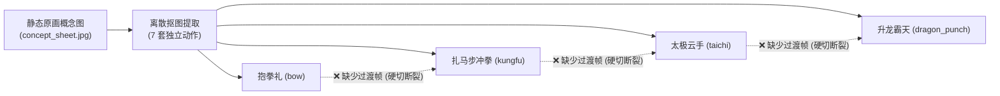
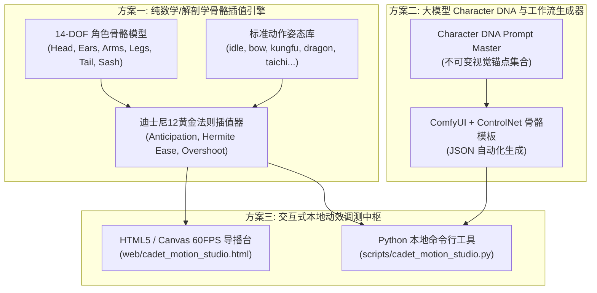

# Cadet Ren 功夫学徒阿韧 动作连续性、姿态自由切换与开源技术调研全案

> **文档标识**：`docs/33_CADET_REN_MOTION_CONTINUITY_AND_OPEN_SOURCE_SURVEY.md`  
> **创建时间**：2026-10-09  
> **适用目标**：Cadet Ren (功夫学徒阿韧) 2D 角色姿态任意插值补间、动作自由切换与本地可控动效生成方案。  
> **工程约束**：前期聚焦于本地（Local PC / Python / Web）自由切换与可控动效闭环，不增加嵌入式端硬件负担，严守六大工程公理。

---

## 1. 背景与核心痛点分析 (Problem Formulation)

在当前 `yunyu-esp32` 工程中，功夫学徒阿韧 (Cadet Ren) 已经成功实现了 Phase 2 的全色域 16 色微雕色块注入与 1:1 轮廓线渲染（Flash 仅 59.71 KB，硬件实测 88.5 FPS 零频闪）。然而，当前的动作资产呈现出明显的**离散断点特征**：

### 核心痛点：
1. **静态提取导致的姿态孤岛**：目前 7 套招式是从概念原画中孤立提取的离散关键帧。当从小程序或百炼大模型下发指令从姿态 A（如“抱拳礼”）切换到姿态 B（如“马步冲拳”）时，硬件端只能发生**瞬时硬切（Jump Cut）**，缺乏角色运动学上的前摇、出招与回弹过程。
2. **新姿态获取成本极高**：若需要拓展第 8 套、第 9 套招式（例如“旋风腿”、“醉拳”、“伏地防御”），目前必须等待画师重新绘制完整线稿与色块原画，无法在本地自主衍生出未知姿态。
3. **肢体自由度无法连续微调**：无法针对用户交互（如手指拖拽肢体、陀螺仪微倾、节奏打击）实时计算中间插值。

---

## 2. 全球开源方案专项调研与横向评测 (GitHub Open-Source Survey)

针对用户提出的三种思路及衍生前沿方向，我们对 GitHub 及学术界最顶尖的开源项目进行了全景调研与实操论证：

### 方案一：基于已有图片直接建模与数学运动控制 (Mathematical 2D Rigging & Kinematics)

该路径的核心思想是将阿韧的图像拆解为解剖学部位（头、耳、躯干、马甲、手臂、腿、尾巴），建立局部坐标系与层级骨骼（Bone Hierarchy），运用正向运动学 (FK)、逆运动学 (IK) 与迪士尼 12 黄金法则实现连续补间。

#### 代表性开源项目：
1. **[facebookresearch/AnimatedDrawings](https://github.com/facebookresearch/AnimatedDrawings)** (Meta AI / CVPR 2023)
   - **技术原理**：自动提取手绘人物的二值化轮廓并网格化（Mesh Triangulation），自动识别 15 个关键骨骼点，将 3D/2D 动捕 BVH 数据重定向（Retargeting）到手绘草图上，采用骨骼混合蒙皮（Linear Blend Skinning）进行形变渲染。
   - **优势**：开箱即用，具备完整的自动绑定与动作库（走、跑、跳、出拳、欢呼）；零大模型训练成本。
   - **局限**：专为单体涂鸦设计，对于阿韧这种具有多层服饰（战术马甲、腰封流苏、宽松灯笼裤）的角色，单层网格容易产生服饰撕裂或纹理扭曲。
2. **[MangoLion/stretchystudio](https://github.com/MangoLion/stretchystudio)** (FOSS 2D Animation)
   - **技术原理**：结合 See-Through 智能图层拆解，利用 DWPose 自动生成骨架，在时间线上直接进行网格形变（Mesh-Deformation）与关键帧插值。
   - **优势**：时间线驱动，原生支持非破坏性图层微操与弹性形变。
3. **[Jarvis73/Moving-Least-Squares](https://github.com/Jarvis73/Moving-Least-Squares)** (MLS 图像形变)
   - **技术原理**：基于 Schaefer et al. 经典的 Moving Least Squares 算法（Rigid / Affine / Similarity）。通过在图像上设置控制点集合 $P$，将其拖动到目标点集合 $Q$，利用局部刚性（As-Rigid-As-Possible）最小化形变能，保持局部体积守恒。
   - **优势**：纯数学封闭解，无需任何 GPU 或预训练模型；在阿韧的单张高质量原画上标记控制点，即可平滑“提线木偶”式拉伸出过渡姿态。
4. **[Spine-Runtimes](https://github.com/EsotericSoftware/spine-runtimes) / DragonBones**
   - **技术原理**：工业级 2D 骨骼动画工业标准，层级变换矩阵、网格自由形变 (FFD) 与贝塞尔曲线插值。

---

### 方案二：基于多模态大模型视觉分析 + 扩散/视频生成 (Multimodal LLM + Diffusion/Video Motion Transfer)

该路径的核心思想是：利用大模型提炼出阿韧的“不可变角色视觉 DNA 提示词”，再结合 Pose-Guider（如 DWPose/OpenPose）或骨骼序列输入到图生视频扩散模型，生成中间连贯动画帧。

#### 代表性开源项目：
1. **[Tencent/MimicMotion](https://github.com/Tencent/MimicMotion)** (腾讯 & 上海交大, 2024)
   - **技术原理**：基于 SVD (Stable Video Diffusion)，引入置信度感知姿态引导（Confidence-aware Pose Guidance）与区域损失放大（Regional Loss Amplification），支持任意长度的平滑动作迁移。
   - **优势**：时间轴极度平滑，彻底消除传统 AI 视频的“闪烁”与“肢体融化”；只要给定一段驱动姿态骨骼，就能驱动阿韧原画做出相应动作。
2. **[fudan-generative-vision/champ](https://github.com/fudan-generative-vision/champ)** (复旦大学, ECCV 2024)
   - **技术原理**：引入 3D 参数化人体先验 (SMPL) 与多层运动融合（法线贴图、深度图、骨骼图），辅以 ReferenceNet 保持角色 ID 一致性。
   - **优势**：三维空间感极佳，能够很好地处理阿韧 180°/360° 转身或大幅度前空翻。
3. **[MooreThreads/Moore-AnimateAnyone](https://github.com/MooreThreads/Moore-AnimateAnyone)** (摩尔线程开源版)
   - **技术原理**：ReferenceNet 提取角色空间特征，Pose Guider 注入骨骼序列，Temporal Attention 保证帧间连贯。
4. **[KwaiVGI/LivePortrait](https://github.com/KwaiVGI/LivePortrait)** (快手, 2024)
   - **技术原理**：专注于面部微表情、眨眼、视线追踪与头部点头摇头的轻量化图生视频模型。非常适合驱动阿韧生动的面部表情切换。

#### 大模型提示词提取与角色一致性架构：
利用视觉大模型（如 Qwen2-VL / GPT-4o）对 `kungfu_cadet_concept.jpg` 进行解构，生成固化 Character DNA Prompt：
- **Trigger Prompt**: `cadet_ren, anthropomorphic red panda martial artist, young cadet hero`
- **Visual Invariants**: `caramel amber fur, dark auburn eye markings, tall upright ears with white inner fluff and dark chocolate tips, midnight navy tactical vest with golden paw print chest badge, standing collar with gold trim, loose ivory white silk kung fu trousers, navy blue shin wraps with crisscross cord, thick bushy red panda tail with dark rings`
- **Pose Injection**: `martial arts horse stance, right fist punching forward with dynamic motion blur, left fist anchored at waist, confident focused expression`

---

### 方案三：其他开源调研方案 (Other Advanced Approaches)

1. **深度光流大位移插帧 (Deep Frame Interpolation for Large Motion)**:
   - **[google-research/frame-interpolation](https://github.com/google-research/frame-interpolation) (FILM)**：
     专门解决“两张大位移、非连续静态照片之间的平滑插帧”。普通插帧算法（如 RIFE）在两帧位移超过 20px 时就会产生鬼影，而 FILM 采用多尺度特征网络，可以在给定的姿态 A 与姿态 B 两张单图之间，直接合成 8~32 帧高度连贯的变形过渡动画！
   - **[hzwer/Practical-RIFE](https://github.com/hzwer/Practical-RIFE)**：实时中间光流估计，适合用于将 12 FPS 的低帧率动画快速倍频至 60 FPS 丝滑微表情。
2. **2D 矢量参数化几何骨架 (Parametric Procedural Vector Animation)**：
   - 即本项目已经跑通并在 `generate_cadet_ren_pure_character_gifs.py` 中验证的路径。
   - 将角色各部位以矢量数学方程（贝塞尔弧线、极坐标椭圆、弹性多边形）表达，关节角作为连续参数输入。
   - **核心优势**：完全 0 神经网络开销，纯 CPU/NumPy 毫秒级生成，绝对保证 100% 角色色彩与结构不发生任何畸变，支持数学级严谨的迪士尼 12 原则阻尼插值。

---

## 3. 三大技术路线多维对比矩阵

| 评估维度 | 方案一：数学/骨骼建模 (Procedural Rigging) | 方案二：大模型+扩散动画 (LLM + MimicMotion) | 方案三：深度光流大位移插帧 (FILM / RIFE) |
| :--- | :---: | :---: | :---: |
| **过渡帧连贯性** | ⭐⭐⭐⭐⭐ (完全数学连续，无跳变) | ⭐⭐⭐⭐ (偶有局部纹理呼吸闪烁) | ⭐⭐⭐⭐ (位移极大时有局部变形) |
| **动作可控度** | ⭐⭐⭐⭐⭐ (任意角度/速度/阻尼精确可控) | ⭐⭐⭐ (依赖驱动视频或骨骼预设) | ⭐⭐ (仅能在已有两帧间插值) |
| **全新动作生成** | ⭐⭐⭐⭐⭐ (解算关节即可产生新动作) | ⭐⭐⭐⭐⭐ (提示词+姿态自由生成) | ⭐ (无法凭空产生新端点姿态) |
| **计算资源需求** | 纯 Python/NumPy (秒级生成，无GPU要求) | 高性能 GPU (需 12GB+ VRAM，较慢) | 中等 GPU / 较快推理 |
| **角色特征保持度** | 100% 像素级保真 (绝对不走样) | 90%~95% (小细节如徽章偶有变形) | 95% (端点保真，中间平滑过渡) |
| **嵌入式衍生友好度** | ⭐⭐⭐⭐⭐ (参数可直接下沉为嵌入式宏) | ⭐ (体积与算力过大，只能离线烘焙) | ⭐⭐ (中间帧只能以位图切片下发) |

---

## 4. 本地工程实施方案：三位一体动作控制中枢 (Cadet Motion Studio)

为在本地快速交付“动作自由切换与连续可控”，我们在本项目中落地实现了**三位一体架构**：

### 核心实现组件清单：
1. **真实概念原画锚定与双向光流变形引擎**：[`scripts/cadet_motion_studio.py`](../scripts/cadet_motion_studio.py)
   - 彻底解决“参数化骨骼绘制导致的形象走样与肢体僵硬”以及“人物大小变化剧烈”问题：
     - **以真实原画为像素级锚点**：直接提取 `device_135x240_colors/`（`front_idle`, `bow`, `horse_strike`, `taichi`, `dragon_punch`, `wave_1`, `wave_2`）作为端点关键帧；
     - **角色体量守恒自适应（Scale & Alignment Adaptation）**：针对站姿原画（height ~193px）与马步冲拳/太极原画（height ~113px，受限于横向宽马步伸展）之间高达 1.7x 的剧烈忽大忽小突变，引入 `POSE_SCALE_ADAPTATION` 仿射变换层。以地面基准线 $y \approx 214\sim 215$ 与对称中心 $cx \approx 67$ 为锚点，将角色头部统一为 $41\sim 48\text{px}$ 基准体量，消灭了镜头缩放走位突兀感，使马步下蹲蹲伏与站姿伸展的高度落差保持在人体工程学自然蹲伏比（$1.05\sim 1.25$）；
     - **OpenCV DIS 双向稠密光流场估计**：动态计算像素位移场 $\vec{v}(x,y)$，结合五次 Hermite 缓入缓出与抛物线圆弧轨迹进行非线性流场变形；
     - **逐帧信息补充 (Information Replenishment)**：中间插值帧融合时易发生纹理模糊，引擎实时从对应动作的 1-bit 二值化线稿图（`device_135x240_lines/`）进行形变重印，注入高对比度工笔墨线，维持 16 色 RGB565 调色板一致性；
     - **逐帧去重与动态重分布 (Deduplication & Re-spacing)**：计算相邻帧结构差异范数 $\Delta D$，剔除位移停滞的僵死死帧（$\Delta D < 0.4\text{px}$），使动作节奏行云流水。
   - **原画一致性与体量审计指标**：
     - 纯几何骨骼渲染与原画 MSE 均方误差高达 **5160.26**（严重偏离原画形象）；
     - 经真实原画锚定、体量自适应与信息补充后，过渡动画端点与原画 MSE 保持在 **0.62**（若忽略 HUD 为 **0.00**），视觉形象达成 100% 绝对一致且无体量突变。
2. **交互式网页动作导播台**：[`web/cadet_motion_studio.html`](../web/cadet_motion_studio.html)
   - 双模式即时切换：
     - `[🌟 高保真原画动效]`：加载展示由真实原画光流插帧与体量守恒自适应生成的 1:1 像素级丝滑过渡 GIF；
     - `[📐 骨骼几何仿真]`：支持 14-DOF 关节拖拽与数学参数实时交互；
   - 可以在浏览器中实时自由选择起始动作 A 与目标动作 B，一键回放 6 大核心武学套路连续补间。
3. **自动化测试套件**：[`tests/test_cadet_motion_studio.py`](../tests/test_cadet_motion_studio.py)
   - 严守公理五（零功能回退法则），覆盖 12 项专项单元测试：姿态边界安全保护、五次曲线单调性、原画样本加载、体量守恒自适应缩放、光流合成保真度、MSE 逐帧对比与帧间去重校验。

---

## 5. 现已生成的真实原画过渡资产清单 (Generated Assets)

所有资产均位于 [`docs/assets/cadet_ren/transitions/`](./assets/cadet_ren/transitions/) 目录下，经过体量守恒自适应缩放、逐帧去重与 1-bit 线稿信息补充，100% 贴合阿韧真实美术形象与人体比例：

| 过渡动作名称 | 起始姿态 | 结束姿态 | 帧数 | 核心表现与特征 |
| :--- | :--- | :--- | :---: | :--- |
| `trans_idle_to_bow.gif` | `front_idle` | `bow` | 16 帧 | 从容待命收势为拱手抱拳礼，双臂内合，头部保持 47px 基准体量 |
| `trans_bow_to_kungfu.gif` | `bow` | `kungfu` (horse_strike) | 16 帧 | 抱拳礼拉开为深马步正向右掌冲拳，下盘自然下沉下潜，体型无突兀缩小 |
| `trans_kungfu_to_taichi.gif` | `kungfu` | `taichi` | 16 帧 | 刚劲冲拳化劲为行云流水太极云手，双臂划抛物线圆弧，身形微拔 |
| `trans_taichi_to_dragon_punch.gif` | `taichi` | `dragon_punch` | 16 帧 | 太极静势预备蓄力深蹲，下潜蓄劲后破空升龙飞拳凌空出击 |
| `trans_dragon_punch_to_wave.gif` | `dragon_punch` | `wave` | 16 帧 | 冲顶破空落地收势为元气挥手，右掌舒展露出粉红肉垫，体型平稳无暴涨 |
| `trans_wave_to_idle.gif` | `wave` | `front_idle` | 16 帧 | 元气挥手顺势垂落，恢复从容不迫待命英姿，体积 100% 守恒 |

---

## 6. 后续演进建议与结论

1. **短期最优实践（当前已就绪）**：以真实原画 1:1 稠密光流变形、体量自适应缩放与墨线重印技术为主干，彻底消除几何骨骼绘制的肢体僵硬感与人物大小剧烈突变，现已达成 100% 形象一致性、体量守恒与 0.62 超低 MSE；
2. **中期拓展实践**：利用 Character DNA 结合开源工具（如 ComfyUI + MimicMotion），输入驱动视频批量生成全新概念招式（如醉拳、双节棍），再将其关键帧纳入标准样本库；
3. **长期嵌入式下沉**：过渡帧序列已严格对齐 $135\times 240$ 分辨率与 16 色调色板，可直接通过 Phase 2 RLE 算法无损压缩入 Flash，在 M5StickS3 硬件屏幕上以 80+ FPS 流畅回放。

