# yunyu-esp32 项目工程知识库全景索引 (Master Engineering Knowledge Base)

> **知识库版本**：V2.1.0  
> **更新时间**：2026-10-03  
> **工程定位**：`yunyu-esp32` 物理具身智能终端、灵伴悄悄 (LingBuddy)、微信小程序套件、Meta Muse Gadgets 生态与开源硬件核心知识底座。

---

## 🏛️ 知识库六大工程支柱 (Six Architectural Pillars)

```mermaid
graph TD
    Root["yunyu-esp32 知识库体系"]
    
    Root --> P1["支柱一: 最高工程公理与交接基线<br/>(Axioms & Session Continuity)"]
    Root --> P2["支柱二: 灵伴悄悄微表情与具身架构<br/>(Avatar & Empathy Dynamics)"]
    Root --> P3["支柱三: 微信小程序与移动端套件<br/>(WeChat Mini-Program & Mobile)"]
    Root --> P4["支柱四: Meta Muse Gadgets 具身生态<br/>(Meta Muse Ecosystem Integration)"]
    Root --> P5["支柱五: M5StickS3 硬件底座与调测<br/>(Hardware Bringup & Ground HIL)"]
    Root --> P6["支柱六: 语音双工流与资源治理<br/>(Bailian Voice & Memory Management)"]

    P1 --> Doc30["Doc 30: 六大不可违背公理与交接规范"]
    P1 --> DocPrompt["Doc Prompt: 跨会话 Agent 提示词模板库"]
    P1 --> DocRel["Doc Release: v1.0.0 稳定基线发布说明"]

    P2 --> Doc27A["Doc 27: 基于MuseCharm哲学的软硬件大案"]
    P2 --> Doc27B["Doc 27-2: 全流程对话开发实录与教学手册"]
    P2 --> DocCharm["Analysis: Muse Charm 深度拆解与研学"]

    P3 --> Doc28["Doc 28: 微信小程序通信协议工程指南"]
    P3 --> Doc29["Doc 29: 小程序与移动端研发交接指南"]

    P4 --> Doc31["Doc 31: Meta Muse Gadgets 全栈接入详案"]
    P4 --> DocMuseLinux["Analysis: Muse Gadget Linux 守护进程分析"]

    P5 --> Doc01["Doc 01: StickS3 硬件点亮与引脚指南"]
    P5 --> Doc03["Doc 03: 三大实施方案对比与验证报告"]
    P5 --> Doc25["Doc 25: 伴侣与地面终端全流程详案"]
    P5 --> Doc26["Doc 26: 双模终端开发总结与交接文档"]
    P5 --> Doc02["Doc 02: 灵方 PCBA 工业设计规范"]

    P6 --> DocVoice["Handover: 百炼实时语音与长程记忆交接"]
```



---

## 📑 专案技术文档全景索引表 (Document Catalog)

| 编号 | 专案文档文件 | 核心技术要点与工程产出 | 领域标签 |
| :---: | :--- | :--- | :--- |
| **30** | [**30_PROJECT_AXIOMS_AND_HANDOVER.md**](./30_PROJECT_AXIOMS_AND_HANDOVER.md) | **最高工程公理**：六大不可违背公理（真实硬件烧录验证、中断通讯异步解耦、显存零撕裂双缓冲、网络显式区分一致、零功能回退渐进加固、自适应协议防截断）、实机监控基线与交接规范 | `最高工程宪章` `六大公理` `会话交接` |
| **Prompt** | [**AGENT_CONTINUATION_PROMPTS.md**](./AGENT_CONTINUATION_PROMPTS.md) | **Agent 提示词库**：跨生命周期 AI Agent 通用母版、细分研发方向（Claude 审批终端、地面遥控台、多页菜单）提示词规范 | `Agent继续开发` `通用母版` `提示词库` |
| **31** | [**31_Meta_Muse_Gadgets微型自重构机器人与物理伴侣全栈接入方案与工程实施详案.md**](./31_Meta_Muse_Gadgets微型自重构机器人与物理伴侣全栈接入方案与工程实施详案.md) | **Meta Muse 接入**：研学 Meta 2026-10-02 开源 `muse-gadget-sdk`、Noise_XX 加密隧道、串口 Hatch 协议、具身技能规范 (`gadget-lingcube-msrr` / `gadget-lingmatrix-sim`)、三层协同架构 | `MetaMuse` `Noise_XX` `具身智能` `三层架构` |
| **29** | [**29_微信小程序与移动端研发交接指南_HANDOVER_MOBILE.md**](./29_微信小程序与移动端研发交接指南_HANDOVER_MOBILE.md) | **小程序移动交接**：Apple HIG 暗黑美学、4-Tab 产品架构、热点配额监控熔断、DPR 自适应微表情 Canvas、上线审核避坑指南 | `微信小程序` `AppleHIG` `流量监控` `审核规范` |
| **28** | [**28_M5StickS3微信小程序对接架构与通信协议工程指南.md**](./28_M5StickS3微信小程序对接架构与通信协议工程指南.md) | **小程序通信协议**：BLE Nordic UART Service (NUS) 分包重组、局域网 TCP/UDP 并发、Direct Wi-Fi 配网协议、双向指令帧格式 | `BLE-NUS` `分包重组` `配网协议` `通信安全` |
| **27** | [**27_基于MuseCharm哲学的M5StickS3灵宠伴侣软硬件架构与工程论证大案.md**](./27_基于MuseCharm哲学的M5StickS3灵宠伴侣软硬件架构与工程论证大案.md) | **灵伴悄悄架构**：借鉴 Muse Charm 哲学、12 种拟态微表情、Tamagotchi 亲密度引擎、两级记忆压缩、隔空投喂中心 | `灵伴悄悄` `微表情动力学` `亲密度系统` `记忆存储` |
| **27-2** | [**27_StickS3物理伴侣全流程对话开发实录与教学手册.md**](./27_StickS3物理伴侣全流程对话开发实录与教学手册.md) | **实战开发实录**：10 万字全流程研发对话录、真实开发排坑经验、嵌入式与移动端调试案例集 | `教学实录` `排坑指南` `工程实战` |
| **26** | [**26_StickS3物理伴侣与双模调测终端全链路开发总结与Agent工作交接文档.md**](./26_StickS3物理伴侣与双模调测终端全链路开发总结与Agent工作交接文档.md) | **双模终端交接**：开发全链路总结、软硬件交互时序、串口与蓝牙透传、Agent 工作交接检查清单 | `终端交接` `全链路时序` `排错清单` |
| **25** | [**25_M5Stack_StickS3物理伴侣与地面调测终端开发全流程及三方案验证详案.md**](./25_M5Stack_StickS3物理伴侣与地面调测终端开发全流程及三方案验证详案.md) | **地面终端全流程**：M5Stack StickS3 硬件底座开发、三方案全面验证（M5Burner 零代码 / PlatformIO 深度定制 / Claude Buddy 审批）、全套自动化测试 | `StickS3` `三大方案` `地面调测` `ClaudeBuddy` |
| **03** | [**03_StickS3_Three_Schemes_Verification.md**](./03_StickS3_Three_Schemes_Verification.md) | **三方案验证报告**：方案一（M5Burner 固件库探针）、方案二（PlatformIO 驱动栈）、方案三（Claude 桌面伴侣与 BLE 网关）闭环测试实测数据 | `方案对比` `固件选型` `测试报告` |
| **01** | [**01_StickS3_Hardware_and_Bringup_Guide.md**](./01_StickS3_Hardware_and_Bringup_Guide.md) | **硬件点亮指南**：ESP32-S3-PICO-1 外设电气引脚（M5PM1、ST7789v2、BMI270、ES8311）、串口引导时序、常见供电门控排障 | `引脚定义` `M5PM1门控` `硬件点亮` `排障手册` |
| **02** | [**02_LingCube_PCBA_Design_Spec.md**](./02_LingCube_PCBA_Design_Spec.md) | **PCBA 设计规范**：4 层沉金 PCB 叠层设计、高低压隔离、EPM 脉冲放电保护与 SPICE 仿真规范 | `4层PCB` `EPM保护` `SPICE仿真` |
| **Voice** | [**HANDOVER_VOICE_DIALOGUE_AND_RESOURCE_MANAGEMENT.md**](./HANDOVER_VOICE_DIALOGUE_AND_RESOURCE_MANAGEMENT.md) | **语音流与内存管理**：阿里云百炼实时语音 WSS、16kHz PCM、滑动窗口上下文压缩、NVS 分区保护与 FreeRTOS 堆栈水位监控 | `百炼实时语音` `双向音频` `内存防溢出` |
| **Release** | [**RELEASE_NOTES_v1.0.0.md**](./RELEASE_NOTES_v1.0.0.md) | **版本发布说明**：v1.0.0 稳定生产基线发布特性、自动化测试验收指标与里程碑交付记录 | `版本发布` `基线验收` `更新日志` |

---

## 🔬 专题研报与拆解分析 (`docs/analysis/`)

1. [**muse_charm_study_and_teardown.md**](./analysis/muse_charm_study_and_teardown.md)：
   - 深度研学海外爆款 AI 硬件 Muse Charm（灵犀挂坠）的产品美学、拟态微表情渲染架构与心理学共情机制。
2. [**muse_gadget_linux_analysis.md**](./analysis/muse_gadget_linux_analysis.md)：
   - Meta Muse Gadget SDK 的 Linux 守护进程（`/opt/musegadget`）架构分析、Systemd 守护单元、D-Bus 信号与局域网反向代理机制。

---

## 🛠️ 开发与交接必备命令速查 (Quick Reference Commands)

```powershell
# 1. 编译 M5StickS3 嵌入式固件
python -m platformio run -e m5sticks3_buddy

# 2. 烧录固件至物理硬件 (COM3)
python -m platformio run -e m5sticks3_buddy -t upload

# 3. 硬件硬重启并采集 10~15 秒实时串口自检日志 (公理一)
python -c "import serial, time; ser = serial.Serial('COM3', 115200, timeout=1); ser.setDTR(False); ser.setRTS(True); time.sleep(0.1); ser.setRTS(False); time.sleep(0.2); start = time.time(); [print(ser.readline().decode('utf-8', errors='replace').strip()) for _ in iter(lambda: ser.readline() if time.time()-start < 10 else None, None)]; ser.close()"

# 4. 执行全套 80 项自动化回归测试
pytest tests/ -v

# 5. 启动桌面 Web 伴侣与隔空投喂中心
python scripts/lingbuddy_companion.py

# 6. 执行第一性原理公理化文档交叉复核
python skills/document-content-verifier/scripts/verify_pipeline.py --input docs/30_PROJECT_AXIOMS_AND_HANDOVER.md --mode all
```
