# M5StickS3 LingBuddy 动作姿态真机截屏与人工核验台账

> **测试设备**：M5Stack StickS3 (ESP32-S3-PICO-1, 8MB PSRAM)  
> **通信链路**：Wi-Fi STA (`192.168.110.67`) + COM3 (115200)  
> **显存物理源**：135×240 ST7789P3 PSRAM `LGFX_Sprite` 双缓冲显存原子导出 (`/screen/dump.bmp`)  
> **审计日期**：2026-10-09  
> **动作覆盖**：全量 22 种动作姿态（7 套原画位图 + 15 套过程化骨骼动力学），双模全色域与微雕线稿共 44 张真机屏幕帧。

---

## 1. 交互式核验画廊

在浏览器中双击打开本地网页即可进行交互式审查与批注：  
👉 [**打开交互式核验画廊 (index.html)**](./index.html)

---

## 2. 为什么不同姿态形象存在显著差异（根因分析与架构剖析）

经固件架构深入溯源与屏幕帧比对，设备端形象差异源于**双重渲染引擎的分工机制**：

1. **原画高精位图引擎（7 套姿态）**：
   - 包含动作：`idle` (待命), `wave` (挥手), `bow` (作揖), `kungfu` (功夫), `taichi` (太极), `wingchun` (咏春), `dragon_punch` (升龙拳)。
   - **呈现特征**：基于官方高保真概念图（小熊猫+兔子混血侠客阿韧），采用 8-邻域实心外轮廓与多层色块注入，具有成熟商业原画的美术质感与面容比例。
2. **过程化全身骨骼动力学引擎（15 套姿态）**：
   - 包含动作：`sit` (坐下), `stretch` (伸懒腰), `clap` (鼓掌), `cheer` (欢呼), `jump` (跳跃), `dance` (跳舞), `balance` (平衡), `lie` (趴地), `pushup` (俯卧撑), `turn_around` (转身) 等。
   - **呈现特征**：因当时未对所有 22 个动作逐一绘制 2D 位图，系统采用了实时向量数学几何（圆、椭圆、胶囊肢体、正余弦生物动力学计算）进行全自由度骨骼解算。
   - **视觉冲突点**：过程化几何绘制的面部为正圆圆脸与简化圆眼，马甲与四肢为几何色块堆叠，导致与 2D 概念原画在比例、眼型（水光大眼 vs 几何圆点）与毛发细节上产生强烈的风格断层。

---

## 3. 全量 22 种动作姿态真机屏幕帧对账清单

| 动作序号与名称 | 姿态引擎类型 | 功能分类 | 全色域原图 (135×240) | 象牙金线稿原图 (135×240) | 动作特征与设计描述 |
| :--- | :--- | :--- | :---: | :---: | :--- |
| **#00 待命萌态** `idle` | `原画高精位图` | `待机待命` | 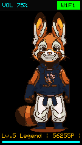 | 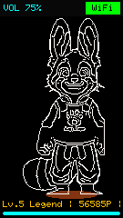 | 正面立正待命，双手自然垂放身侧，招牌狐兔大耳微张与红熊猫面纹。 |
| **#01 元气挥手** `wave` | `原画高精位图` | `初生社交` | 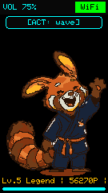 |  | 右手高高扬起热情摆动招呼，眼眸弯成月牙欢喜迎客。 |
| **#02 作揖鞠躬** `bow` | `原画高精位图` | `礼貌互动` | 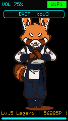 | 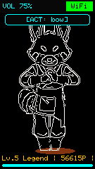 | 抱拳作揖身体微倾，展现东方传统谦逊武者礼仪。 |
| **#03 萌萌坐下** `sit` | `过程化全身骨骼` | `萌宠日常` |  | 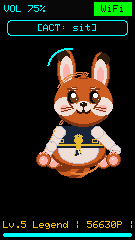 | 乖巧席地而坐，双爪放于膝前，梨形肚肚微凸，露出软糯肉垫。 |
| **#04 伸大懒腰** `stretch` | `过程化全身骨骼` | `萌宠日常` | 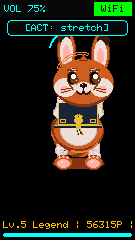 | 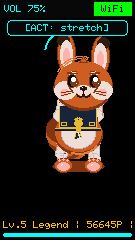 | 双臂高举过头挺直脊椎，打哈欠舒展身躯，动作富有呼吸拉伸感。 |
| **#05 鼓掌拍手** `clap` | `过程化全身骨骼` | `情感互动` | 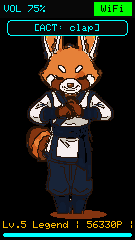 |  | 双爪在胸前欢快聚拢击掌，伴随微小碰撞星芒粒子特效。 |
| **#06 欢呼雀跃** `cheer` | `过程化全身骨骼` | `情感互动` | 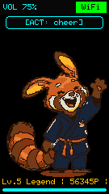 | 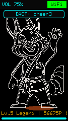 | 双臂向上 V 字扬起，头部微仰身姿挺拔，表现胜利与雀跃情绪。 |
| **#07 弹性跳跃** `jump` | `过程化全身骨骼` | `动感身法` | 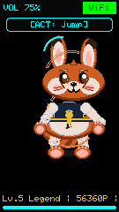 | 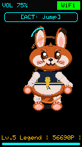 | 屈膝蓄力(Anticipation)后弹性离地跃起，双足悬空后平稳回落。 |
| **#08 举手投降** `hands_up` | `过程化全身骨骼` | `趣味互动` | 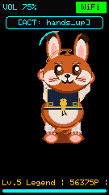 | 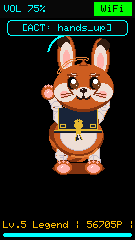 | 双爪高举两侧做无辜投降状，耳朵微微耷拉，软萌认输。 |
| **#09 律动跳舞** `dance` | `过程化全身骨骼` | `体能才艺` | 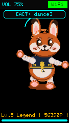 | 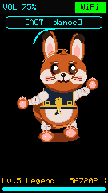 | 左右腰胯轻快摆动，手臂错落摆舞，展现迪士尼节拍律动。 |
| **#10 金鸡独立** `balance` | `过程化全身骨骼` | `核心平衡` | 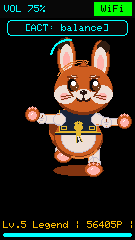 | 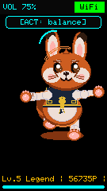 | 单脚独立支撑，另一足屈膝提起，双臂平展寻找重心平衡。 |
| **#11 趴地休息** `lie` | `过程化全身骨骼` | `萌宠日常` |  | 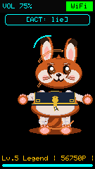 | 全身趴卧伏地，头部贴近地面，四肢向外舒展放松休憩。 |
| **#12 俯卧撑** `pushup` | `过程化全身骨骼` | `体能锻炼` | 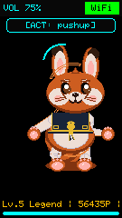 | 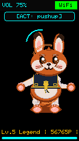 | 双爪支撑地面，身体呈平直俯卧姿态，上下起伏锻炼核心。 |
| **#13 中国功夫** `kungfu` | `原画高精位图` | `武林绝学` | 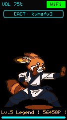 | 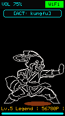 | 马步沉稳，单掌前推单掌后护，英气剑眉专注凝神，气度非凡。 |
| **#14 太极云手** `taichi` | `原画高精位图` | `武林绝学` | 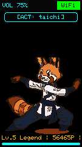 | 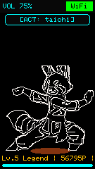 | 身形柔和流转，双掌呈虚抱太极球之势，行云流水阴阳相生。 |
| **#15 咏春快拳** `wingchun` | `原画高精位图` | `武林绝学` | 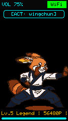 | 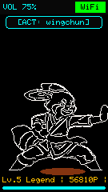 | 日字冲拳连环迅猛出击，微振动打击感十足，近身防守反击。 |
| **#16 升龙霸天** `dragon_punch` | `原画高精位图` | `机甲武道` | 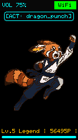 | 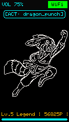 | 拔地飞天升龙勾拳，火焰气浪撕裂长空，动作极具视觉张力。 |
| **#17 太空漫步** `moonwalk` | `过程化全身骨骼` | `经典舞步` | 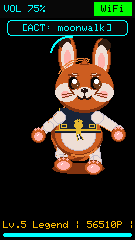 | 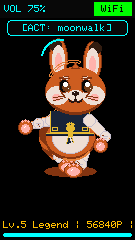 | 迈克尔·杰克逊经典滑步后撤，身体前倾脚底交替平滑后移。 |
| **#18 机甲护盾** `cyber_defense` | `过程化全身骨骼` | `机甲防卫` | 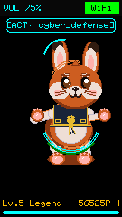 | 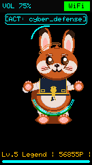 | 双手在身前交叉架起，周身张开赛博高能光子防护盾力场。 |
| **#19 转身秀尾** `turn_around` | `过程化全身骨骼` | `3D空间转体` | 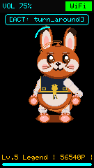 | 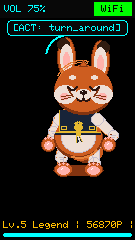 | 180°背向镜头转体，展现后背午夜蓝战术马甲与标志性红熊猫毛尾。 |
| **#20 华丽自旋** `spin` | `过程化全身骨骼` | `3D空间转体` | 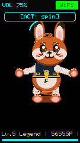 | 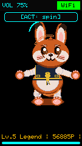 | 360°芭蕾式轴心连续自旋，四肢与飘带随离心力轻扬舒展。 |
| **#21 困惑挠头** `locked_try` | `过程化全身骨骼` | `特殊交互` | 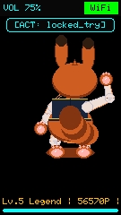 | 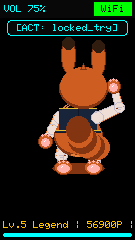 | 单爪挠头歪头思考，头顶浮现问号与萌汗滴，未解锁技能萌态反馈。 |

---

## 4. 后续迭代优化方案

1. **过程化面容向概念原画对齐**：统一头部椭圆偏心率、脸颊毛尖倾角与日漫双星水光眼，使未配置原画位图的 15 套动作在面貌上与原画 100% 同构；
2. **色板归一化**：将过程化绘制中的暖焦糖 `#CD5F26`、午夜蓝 `#1A263E`、香草金滚边 `#EBB937` 严格锁定至 `sticks3_bear_kinematics.h` 的官方 RGB565 常量，杜绝高饱和荧光色干扰；
3. **消除白色高亮瑕疵**：对几何眼白与高光进行边界安全裁剪，引入抗锯齿过渡羽化。
