# Architectural Analysis & Learning Guide: Open_Duck_Mini_Runtime

> 自动化生成的开源项目架构全景图、多语言符号契约与递进式学习路线图。

## 1. 核心技术栈与外部依赖
- **源码模块总数**: 35
- **外部第三方库**: FramesViewer, adafruit_bno055, argparse, base64, board, busio, cv2, digitalio, io, json, math, matplotlib, numpy, onnxruntime, openai, os, picamzero, pickle, pwmio, pygame, pypot, queue, random, rustypot, scipy, socket, threading, time, traceback, typing, v2_rl_walk_mujoco

## 2. 系统架构调用拓扑图 (Mermaid Topology)

```mermaid
graph TD
    mini_bdx_runtime_mini_bdx_runtime___init___py["mini_bdx_runtime/mini_bdx_runtime/__init__.py"] --> mini_bdx_runtime_mini_bdx_runtime_onnx_infer_py["mini_bdx_runtime/mini_bdx_runtime/onnx_infer.py"]
    mini_bdx_runtime_mini_bdx_runtime_rustypot_position_hwi_py["mini_bdx_runtime/mini_bdx_runtime/rustypot_position_hwi.py"] --> mini_bdx_runtime_mini_bdx_runtime_duck_config_py["mini_bdx_runtime/mini_bdx_runtime/duck_config.py"]
    mini_bdx_runtime_mini_bdx_runtime_xbox_controller_py["mini_bdx_runtime/mini_bdx_runtime/xbox_controller.py"] --> mini_bdx_runtime_mini_bdx_runtime_buttons_py["mini_bdx_runtime/mini_bdx_runtime/buttons.py"]
    scripts_antennas_controller_test_py["scripts/antennas_controller_test.py"] --> mini_bdx_runtime_mini_bdx_runtime_antennas_py["mini_bdx_runtime/mini_bdx_runtime/antennas.py"]
    scripts_antennas_controller_test_py["scripts/antennas_controller_test.py"] --> mini_bdx_runtime_mini_bdx_runtime_xbox_controller_py["mini_bdx_runtime/mini_bdx_runtime/xbox_controller.py"]
    scripts_calibrate_imu_py["scripts/calibrate_imu.py"] --> mini_bdx_runtime_mini_bdx_runtime_raw_imu_py["mini_bdx_runtime/mini_bdx_runtime/raw_imu.py"]
    scripts_check_motors_py["scripts/check_motors.py"] --> mini_bdx_runtime_mini_bdx_runtime_duck_config_py["mini_bdx_runtime/mini_bdx_runtime/duck_config.py"]
    scripts_check_motors_py["scripts/check_motors.py"] --> mini_bdx_runtime_mini_bdx_runtime_rustypot_position_hwi_py["mini_bdx_runtime/mini_bdx_runtime/rustypot_position_hwi.py"]
    scripts_fc_test_py["scripts/fc_test.py"] --> mini_bdx_runtime_mini_bdx_runtime_camera_py["mini_bdx_runtime/mini_bdx_runtime/camera.py"]
    scripts_find_soft_offsets_py["scripts/find_soft_offsets.py"] --> mini_bdx_runtime_mini_bdx_runtime_duck_config_py["mini_bdx_runtime/mini_bdx_runtime/duck_config.py"]
    scripts_find_soft_offsets_py["scripts/find_soft_offsets.py"] --> mini_bdx_runtime_mini_bdx_runtime_rustypot_position_hwi_py["mini_bdx_runtime/mini_bdx_runtime/rustypot_position_hwi.py"]
    scripts_head_puppet_py["scripts/head_puppet.py"] --> mini_bdx_runtime_mini_bdx_runtime_antennas_py["mini_bdx_runtime/mini_bdx_runtime/antennas.py"]
    scripts_head_puppet_py["scripts/head_puppet.py"] --> mini_bdx_runtime_mini_bdx_runtime_duck_config_py["mini_bdx_runtime/mini_bdx_runtime/duck_config.py"]
    scripts_head_puppet_py["scripts/head_puppet.py"] --> mini_bdx_runtime_mini_bdx_runtime_eyes_py["mini_bdx_runtime/mini_bdx_runtime/eyes.py"]
    scripts_head_puppet_py["scripts/head_puppet.py"] --> mini_bdx_runtime_mini_bdx_runtime_projector_py["mini_bdx_runtime/mini_bdx_runtime/projector.py"]
    scripts_head_puppet_py["scripts/head_puppet.py"] --> mini_bdx_runtime_mini_bdx_runtime_rustypot_position_hwi_py["mini_bdx_runtime/mini_bdx_runtime/rustypot_position_hwi.py"]
    scripts_head_puppet_py["scripts/head_puppet.py"] --> mini_bdx_runtime_mini_bdx_runtime_sounds_py["mini_bdx_runtime/mini_bdx_runtime/sounds.py"]
    scripts_head_puppet_py["scripts/head_puppet.py"] --> mini_bdx_runtime_mini_bdx_runtime_xbox_controller_py["mini_bdx_runtime/mini_bdx_runtime/xbox_controller.py"]
    scripts_imu_server_py["scripts/imu_server.py"] --> mini_bdx_runtime_mini_bdx_runtime_imu_py["mini_bdx_runtime/mini_bdx_runtime/imu.py"]
    scripts_turn_off_py["scripts/turn_off.py"] --> mini_bdx_runtime_mini_bdx_runtime_duck_config_py["mini_bdx_runtime/mini_bdx_runtime/duck_config.py"]
    scripts_turn_off_py["scripts/turn_off.py"] --> mini_bdx_runtime_mini_bdx_runtime_rustypot_position_hwi_py["mini_bdx_runtime/mini_bdx_runtime/rustypot_position_hwi.py"]
    scripts_turn_on_py["scripts/turn_on.py"] --> mini_bdx_runtime_mini_bdx_runtime_duck_config_py["mini_bdx_runtime/mini_bdx_runtime/duck_config.py"]
    scripts_turn_on_py["scripts/turn_on.py"] --> mini_bdx_runtime_mini_bdx_runtime_rustypot_position_hwi_py["mini_bdx_runtime/mini_bdx_runtime/rustypot_position_hwi.py"]
    scripts_v2_rl_walk_mujoco_py["scripts/v2_rl_walk_mujoco.py"] --> mini_bdx_runtime_mini_bdx_runtime_antennas_py["mini_bdx_runtime/mini_bdx_runtime/antennas.py"]
    scripts_v2_rl_walk_mujoco_py["scripts/v2_rl_walk_mujoco.py"] --> mini_bdx_runtime_mini_bdx_runtime_duck_config_py["mini_bdx_runtime/mini_bdx_runtime/duck_config.py"]
    scripts_v2_rl_walk_mujoco_py["scripts/v2_rl_walk_mujoco.py"] --> mini_bdx_runtime_mini_bdx_runtime_eyes_py["mini_bdx_runtime/mini_bdx_runtime/eyes.py"]
    scripts_v2_rl_walk_mujoco_py["scripts/v2_rl_walk_mujoco.py"] --> mini_bdx_runtime_mini_bdx_runtime_feet_contacts_py["mini_bdx_runtime/mini_bdx_runtime/feet_contacts.py"]
    scripts_v2_rl_walk_mujoco_py["scripts/v2_rl_walk_mujoco.py"] --> mini_bdx_runtime_mini_bdx_runtime_onnx_infer_py["mini_bdx_runtime/mini_bdx_runtime/onnx_infer.py"]
    scripts_v2_rl_walk_mujoco_py["scripts/v2_rl_walk_mujoco.py"] --> mini_bdx_runtime_mini_bdx_runtime_poly_reference_motion_py["mini_bdx_runtime/mini_bdx_runtime/poly_reference_motion.py"]
    scripts_v2_rl_walk_mujoco_py["scripts/v2_rl_walk_mujoco.py"] --> mini_bdx_runtime_mini_bdx_runtime_projector_py["mini_bdx_runtime/mini_bdx_runtime/projector.py"]
    scripts_v2_rl_walk_mujoco_py["scripts/v2_rl_walk_mujoco.py"] --> mini_bdx_runtime_mini_bdx_runtime_raw_imu_py["mini_bdx_runtime/mini_bdx_runtime/raw_imu.py"]
    scripts_v2_rl_walk_mujoco_py["scripts/v2_rl_walk_mujoco.py"] --> mini_bdx_runtime_mini_bdx_runtime_rl_utils_py["mini_bdx_runtime/mini_bdx_runtime/rl_utils.py"]
    scripts_v2_rl_walk_mujoco_py["scripts/v2_rl_walk_mujoco.py"] --> mini_bdx_runtime_mini_bdx_runtime_rustypot_position_hwi_py["mini_bdx_runtime/mini_bdx_runtime/rustypot_position_hwi.py"]
    scripts_v2_rl_walk_mujoco_py["scripts/v2_rl_walk_mujoco.py"] --> mini_bdx_runtime_mini_bdx_runtime_sounds_py["mini_bdx_runtime/mini_bdx_runtime/sounds.py"]
    scripts_v2_rl_walk_mujoco_py["scripts/v2_rl_walk_mujoco.py"] --> mini_bdx_runtime_mini_bdx_runtime_xbox_controller_py["mini_bdx_runtime/mini_bdx_runtime/xbox_controller.py"]
```

> ℹ️ *已截取前 35 条关键依赖边以保证前端 Mermaid 渲染稳定性。*

## 3. 递进式学习与精读路线图 (Progressive Learning Roadmap)

### 📍 Stage 1: Core Primitives & Foundation Models (核心实体与基础数据模型)
*Start here to understand data schemas, interfaces, and atomic utilities.*

- [x] `mini_bdx_runtime/__init__.py`
- [x] `mini_bdx_runtime/mini_bdx_runtime/__init__.py`
- [x] `scripts/antennas_controller_test.py`
- [x] `scripts/calibrate_imu.py`
- [x] `scripts/cam_test.py`
- [x] `scripts/check_voltage.py`
- [x] `scripts/configure_all_motors.py`
- [x] `scripts/find_soft_offsets.py`
- [x] `scripts/head_puppet.py`
- [x] `scripts/plot_recorded_data.py`
- [x] `scripts/record_data.py`

### 📍 Stage 2: Business Logic & Processing Pipelines (核心算法与逻辑处理)
*Understand core domain state machines, algorithms, and orchestration logic.*

- [x] `scripts/turn_off.py`
- [x] `scripts/turn_on.py`
- [x] `scripts/new_record_data.py`
- [x] `scripts/configure_motor.py`
- [x] `mini_bdx_runtime/mini_bdx_runtime/feet_contacts.py`
- [x] `mini_bdx_runtime/mini_bdx_runtime/projector.py`
- [x] `mini_bdx_runtime/mini_bdx_runtime/onnx_infer.py`
- [x] `mini_bdx_runtime/mini_bdx_runtime/camera.py`
- [x] `mini_bdx_runtime/mini_bdx_runtime/antennas.py`
- [x] `mini_bdx_runtime/mini_bdx_runtime/eyes.py`
- [x] `scripts/imu_server.py`
- [x] `mini_bdx_runtime/mini_bdx_runtime/duck_config.py`

### 📍 Stage 3: Entrypoints & Client Interfaces (系统入口与外部接口)
*Trace main application lifecycles, CLI runners, and consumer API surfaces.*

- [x] `scripts/imu_client.py`
- [x] `mini_bdx_runtime/mini_bdx_runtime/rustypot_position_hwi.py`
- [x] `scripts/fc_test.py`
- [x] `mini_bdx_runtime/mini_bdx_runtime/buttons.py`
- [x] `mini_bdx_runtime/mini_bdx_runtime/rl_utils.py`
- [x] `mini_bdx_runtime/mini_bdx_runtime/sounds.py`
- [x] `scripts/check_motors.py`
- [x] `mini_bdx_runtime/mini_bdx_runtime/imu.py`
- [x] `mini_bdx_runtime/mini_bdx_runtime/poly_reference_motion.py`
- [x] `mini_bdx_runtime/mini_bdx_runtime/raw_imu.py`
- [x] `mini_bdx_runtime/mini_bdx_runtime/xbox_controller.py`
- [x] `scripts/v2_rl_walk_mujoco.py`

## 4. 关键导出符号与公共 API 矩阵 (Universal Symbols & Complexity)

| 模块文件 | 语言 | 类/结构体 | 关键函数/方法 | 圈复杂度总计 |
| :--- | :---: | :--- | :--- | :---: |
| `mini_bdx_runtime/__init__.py` | Python | - | - | 0 |
| `mini_bdx_runtime/mini_bdx_runtime/__init__.py` | Python | - | - | 0 |
| `mini_bdx_runtime/mini_bdx_runtime/antennas.py` | Python | `Antennas` | `value_to_duty_cycle()`, `Antennas.__init__()`, `Antennas.set_position_left()` (+3) | 9 |
| `mini_bdx_runtime/mini_bdx_runtime/buttons.py` | Python | `Button`, `Buttons` | `Button.__init__()`, `Button.update()`, `Buttons.__init__()` (+1) | 18 |
| `mini_bdx_runtime/mini_bdx_runtime/camera.py` | Python | `Cam` | `Cam.__init__()`, `Cam.get_encoded_image()`, `Cam.encode_image()` | 6 |
| `mini_bdx_runtime/mini_bdx_runtime/duck_config.py` | Python | `DuckConfig` | `DuckConfig.__init__()` | 12 |
| `mini_bdx_runtime/mini_bdx_runtime/eyes.py` | Python | `Eyes` | `Eyes.__init__()`, `Eyes._set_eyes()`, `Eyes.run()` (+1) | 9 |
| `mini_bdx_runtime/mini_bdx_runtime/feet_contacts.py` | Python | `FeetContacts` | `FeetContacts.__init__()`, `FeetContacts.get()`, `FeetContacts.stop()` | 4 |
| `mini_bdx_runtime/mini_bdx_runtime/imu.py` | Python | `Imu` | `Imu.__init__()`, `Imu.convert_axes()`, `Imu.imu_worker()` (+1) | 31 |
| `mini_bdx_runtime/mini_bdx_runtime/onnx_infer.py` | Python | `OnnxInfer` | `OnnxInfer.__init__()`, `OnnxInfer.infer()` | 5 |
| `mini_bdx_runtime/mini_bdx_runtime/poly_reference_motion.py` | Python | `PolyReferenceMotion` | `PolyReferenceMotion.__init__()`, `PolyReferenceMotion.process()`, `PolyReferenceMotion.vel_to_index()` (+2) | 32 |
| `mini_bdx_runtime/mini_bdx_runtime/projector.py` | Python | `Projector` | `Projector.__init__()`, `Projector.switch()`, `Projector.stop()` | 4 |
| `mini_bdx_runtime/mini_bdx_runtime/raw_imu.py` | Python | `Imu` | `Imu.__init__()`, `Imu.tare_x()`, `Imu.imu_worker()` (+1) | 35 |
| `mini_bdx_runtime/mini_bdx_runtime/rl_utils.py` | Python | `ActionFilter`, `LowPassActionFilter` | `isaac_to_mujoco()`, `mujoco_to_isaac()`, `action_to_pd_targets()` (+9) | 18 |
| `mini_bdx_runtime/mini_bdx_runtime/rustypot_position_hwi.py` | Python | `HWI` | `HWI.__init__()`, `HWI.set_kps()`, `HWI.set_kds()` (+7) | 15 |
| `mini_bdx_runtime/mini_bdx_runtime/sounds.py` | Python | `Sounds` | `Sounds.__init__()`, `Sounds.play()`, `Sounds.play_random_sound()` (+1) | 21 |
| `mini_bdx_runtime/mini_bdx_runtime/xbox_controller.py` | Python | `XBoxController` | `XBoxController.__init__()`, `XBoxController.commands_worker()`, `XBoxController.get_commands()` (+1) | 47 |
| `scripts/antennas_controller_test.py` | Python | - | - | 0 |
| `scripts/calibrate_imu.py` | Python | - | - | 0 |
| `scripts/cam_test.py` | Python | - | - | 0 |
| `scripts/check_motors.py` | Python | - | `main()` | 21 |
| `scripts/check_voltage.py` | Python | - | - | 0 |
| `scripts/configure_all_motors.py` | Python | - | - | 0 |
| `scripts/configure_motor.py` | Python | - | `scan()` | 3 |
| `scripts/fc_test.py` | Python | `Tools` | `Tools.__init__()`, `Tools.move_forward()`, `Tools.turn_left()` (+5) | 15 |
| `scripts/find_soft_offsets.py` | Python | - | - | 0 |
| `scripts/head_puppet.py` | Python | - | - | 0 |
| `scripts/imu_client.py` | Python | `IMUClient` | `IMUClient.__init__()`, `IMUClient.imu_worker()`, `IMUClient.get_imu()` | 14 |
| `scripts/imu_server.py` | Python | `IMUServer` | `IMUServer.__init__()`, `IMUServer.run()` | 11 |
| `scripts/new_record_data.py` | Python | - | `convert_load()` | 2 |
| `scripts/plot_recorded_data.py` | Python | - | - | 0 |
| `scripts/record_data.py` | Python | - | - | 0 |
| `scripts/turn_off.py` | Python | - | - | 0 |
| `scripts/turn_on.py` | Python | - | - | 0 |
| `scripts/v2_rl_walk_mujoco.py` | Python | `RLWalk` | `RLWalk.__init__()`, `RLWalk.get_obs()`, `RLWalk.start()` (+2) | 80 |
