# Architectural Analysis & Learning Guide: Open_Duck_Playground

> 自动化生成的开源项目架构全景图、多语言符号契约与递进式学习路线图。

## 1. 核心技术栈与外部依赖
- **源码模块总数**: 23
- **外部第三方库**: abc, argparse, brax, datetime, etils, flax, functools, jax, matplotlib, ml_collections, mujoco, mujoco_playground, numpy, onnxruntime, orbax, os, pathlib, pickle, pygame, scipy, sys, tensorboardX, tensorflow, tf2onnx, time, typing

## 2. 系统架构调用拓扑图 (Mermaid Topology)

```mermaid
graph TD
    playground_common_runner_py["playground/common/runner.py"] --> playground_common_export_onnx_py["playground/common/export_onnx.py"]
    playground_open_duck_mini_v2_joystick_py["playground/open_duck_mini_v2/joystick.py"] --> playground_common_poly_reference_motion_py["playground/common/poly_reference_motion.py"]
    playground_open_duck_mini_v2_joystick_py["playground/open_duck_mini_v2/joystick.py"] --> playground_common_rewards_py["playground/common/rewards.py"]
    playground_open_duck_mini_v2_joystick_py["playground/open_duck_mini_v2/joystick.py"] --> playground_open_duck_mini_v2_custom_rewards_py["playground/open_duck_mini_v2/custom_rewards.py"]
    playground_open_duck_mini_v2_mujoco_infer_py["playground/open_duck_mini_v2/mujoco_infer.py"] --> playground_common_onnx_infer_py["playground/common/onnx_infer.py"]
    playground_open_duck_mini_v2_mujoco_infer_py["playground/open_duck_mini_v2/mujoco_infer.py"] --> playground_common_poly_reference_motion_numpy_py["playground/common/poly_reference_motion_numpy.py"]
    playground_open_duck_mini_v2_mujoco_infer_py["playground/open_duck_mini_v2/mujoco_infer.py"] --> playground_common_utils_py["playground/common/utils.py"]
    playground_open_duck_mini_v2_mujoco_infer_py["playground/open_duck_mini_v2/mujoco_infer.py"] --> playground_open_duck_mini_v2_mujoco_infer_base_py["playground/open_duck_mini_v2/mujoco_infer_base.py"]
    playground_open_duck_mini_v2_ref_motion_viewer_py["playground/open_duck_mini_v2/ref_motion_viewer.py"] --> playground_common_poly_reference_motion_numpy_py["playground/common/poly_reference_motion_numpy.py"]
    playground_open_duck_mini_v2_standing_py["playground/open_duck_mini_v2/standing.py"] --> playground_common_poly_reference_motion_py["playground/common/poly_reference_motion.py"]
    playground_open_duck_mini_v2_standing_py["playground/open_duck_mini_v2/standing.py"] --> playground_common_rewards_py["playground/common/rewards.py"]
```

## 3. 递进式学习与精读路线图 (Progressive Learning Roadmap)

### 📍 Stage 1: Core Primitives & Foundation Models (核心实体与基础数据模型)
*Start here to understand data schemas, interfaces, and atomic utilities.*

- [x] `playground/__init__.py`
- [x] `playground/common/__init__.py`
- [x] `playground/common/plot_saved_obs.py`
- [x] `playground/open_duck_mini_v2/__init__.py`
- [x] `playground/common/randomize.py`
- [x] `playground/open_duck_mini_v2/constants.py`
- [x] `playground/open_duck_mini_v2/custom_rewards.py`

### 📍 Stage 2: Business Logic & Processing Pipelines (核心算法与逻辑处理)
*Understand core domain state machines, algorithms, and orchestration logic.*

- [x] `playground/open_duck_mini_v2/custom_rewards_numpy.py`
- [x] `playground/common/onnx_infer.py`
- [x] `playground/common/utils.py`
- [x] `playground/open_duck_mini_v2/runner.py`
- [x] `playground/common/runner.py`
- [x] `playground/open_duck_mini_v2/ref_motion_viewer.py`
- [x] `playground/common/export_onnx.py`
- [x] `playground/common/rewards.py`

### 📍 Stage 3: Entrypoints & Client Interfaces (系统入口与外部接口)
*Trace main application lifecycles, CLI runners, and consumer API surfaces.*

- [x] `playground/common/rewards_numpy.py`
- [x] `playground/common/poly_reference_motion.py`
- [x] `playground/common/poly_reference_motion_numpy.py`
- [x] `playground/open_duck_mini_v2/standing.py`
- [x] `playground/open_duck_mini_v2/joystick.py`
- [x] `playground/open_duck_mini_v2/base.py`
- [x] `playground/open_duck_mini_v2/mujoco_infer_base.py`
- [x] `playground/open_duck_mini_v2/mujoco_infer.py`

## 4. 关键导出符号与公共 API 矩阵 (Universal Symbols & Complexity)

| 模块文件 | 语言 | 类/结构体 | 关键函数/方法 | 圈复杂度总计 |
| :--- | :---: | :--- | :--- | :---: |
| `playground/__init__.py` | Python | - | - | 0 |
| `playground/common/__init__.py` | Python | - | - | 0 |
| `playground/common/export_onnx.py` | Python | - | `export_onnx()` | 14 |
| `playground/common/onnx_infer.py` | Python | `OnnxInfer` | `OnnxInfer.__init__()`, `OnnxInfer.infer()` | 5 |
| `playground/common/plot_saved_obs.py` | Python | - | - | 0 |
| `playground/common/poly_reference_motion.py` | Python | `PolyReferenceMotion` | `PolyReferenceMotion.__init__()`, `PolyReferenceMotion.process()`, `PolyReferenceMotion.vel_to_index()` (+2) | 30 |
| `playground/common/poly_reference_motion_numpy.py` | Python | `PolyReferenceMotion` | `PolyReferenceMotion.__init__()`, `PolyReferenceMotion.process()`, `PolyReferenceMotion.vel_to_index()` (+2) | 32 |
| `playground/common/randomize.py` | Python | - | `domain_randomize()` | 1 |
| `playground/common/rewards.py` | Python | - | `reward_tracking_lin_vel()`, `reward_tracking_ang_vel()`, `cost_lin_vel_z()` (+20) | 24 |
| `playground/common/rewards_numpy.py` | Python | - | `reward_tracking_lin_vel()`, `reward_tracking_ang_vel()`, `cost_lin_vel_z()` (+20) | 24 |
| `playground/common/runner.py` | Python | `BaseRunner` | `BaseRunner.__init__()`, `BaseRunner.progress_callback()`, `BaseRunner.policy_params_fn()` (+1) | 9 |
| `playground/common/utils.py` | Python | `LowPassActionFilter` | `LowPassActionFilter.__init__()`, `LowPassActionFilter.compute_alpha()`, `LowPassActionFilter.push()` (+1) | 5 |
| `playground/open_duck_mini_v2/__init__.py` | Python | - | - | 0 |
| `playground/open_duck_mini_v2/base.py` | Python | `OpenDuckMiniV2Env` | `get_assets()`, `OpenDuckMiniV2Env.__init__()`, `OpenDuckMiniV2Env.get_actuator_id_from_name()` (+31) | 43 |
| `playground/open_duck_mini_v2/constants.py` | Python | - | `task_to_xml()` | 1 |
| `playground/open_duck_mini_v2/custom_rewards.py` | Python | - | `reward_imitation()` | 2 |
| `playground/open_duck_mini_v2/custom_rewards_numpy.py` | Python | - | `reward_imitation()` | 2 |
| `playground/open_duck_mini_v2/joystick.py` | Python | `Joystick` | `default_config()`, `Joystick.__init__()`, `Joystick._post_init()` (+6) | 36 |
| `playground/open_duck_mini_v2/mujoco_infer.py` | Python | `MjInfer` | `MjInfer.__init__()`, `MjInfer.get_obs()`, `MjInfer.key_callback()` (+1) | 51 |
| `playground/open_duck_mini_v2/mujoco_infer_base.py` | Python | `MJInferBase` | `MJInferBase.__init__()`, `MJInferBase.get_actuator_id_from_name()`, `MJInferBase.get_joint_id_from_name()` (+25) | 43 |
| `playground/open_duck_mini_v2/ref_motion_viewer.py` | Python | - | `key_callback()`, `handle_joystick()` | 12 |
| `playground/open_duck_mini_v2/runner.py` | Python | `OpenDuckMiniV2Runner` | `OpenDuckMiniV2Runner.__init__()`, `main()` | 5 |
| `playground/open_duck_mini_v2/standing.py` | Python | `Standing` | `default_config()`, `Standing.__init__()`, `Standing._post_init()` (+6) | 34 |
