# Architectural Analysis & Learning Guide: Open_Duck_reference_motion_generator

> 自动化生成的开源项目架构全景图、多语言符号契约与递进式学习路线图。

## 1. 核心技术栈与外部依赖
- **源码模块总数**: 8
- **外部第三方库**: FramesViewer, argparse, concurrent, flask, glob, json, matplotlib, numpy, os, pickle, placo, placo_utils, placo_walk_engine, re, scipy, subprocess, threading, time, warnings, webbrowser

## 2. 系统架构调用拓扑图 (Mermaid Topology)

```mermaid
graph TD
    open_duck_reference_motion_generator_gait_generator_py["open_duck_reference_motion_generator/gait_generator.py"]
    open_duck_reference_motion_generator_gait_playground_py["open_duck_reference_motion_generator/gait_playground.py"]
    open_duck_reference_motion_generator_placo_walk_engine_py["open_duck_reference_motion_generator/placo_walk_engine.py"]
    scripts_auto_waddle_py["scripts/auto_waddle.py"]
    scripts_fit_poly_py["scripts/fit_poly.py"]
    scripts_plot_poly_fit_py["scripts/plot_poly_fit.py"]
```

## 3. 递进式学习与精读路线图 (Progressive Learning Roadmap)

### 📍 Stage 1: Core Primitives & Foundation Models (核心实体与基础数据模型)
*Start here to understand data schemas, interfaces, and atomic utilities.*

- [x] `scripts/replay_motion.py`
- [x] `scripts/fit_poly.py`

### 📍 Stage 2: Business Logic & Processing Pipelines (核心算法与逻辑处理)
*Understand core domain state machines, algorithms, and orchestration logic.*

- [x] `scripts/plot_poly_fit.py`
- [x] `open_duck_reference_motion_generator/gait_generator.py`
- [x] `scripts/auto_waddle.py`

### 📍 Stage 3: Entrypoints & Client Interfaces (系统入口与外部接口)
*Trace main application lifecycles, CLI runners, and consumer API surfaces.*

- [x] `scripts/replay_sweep.py`
- [x] `open_duck_reference_motion_generator/gait_playground.py`
- [x] `open_duck_reference_motion_generator/placo_walk_engine.py`

## 4. 关键导出符号与公共 API 矩阵 (Universal Symbols & Complexity)

| 模块文件 | 语言 | 类/结构体 | 关键函数/方法 | 圈复杂度总计 |
| :--- | :---: | :--- | :--- | :---: |
| `open_duck_reference_motion_generator/gait_generator.py` | Python | `RoundingFloat` | `open_browser()`, `compute_angular_velocity()`, `steps_to_vel()` | 7 |
| `open_duck_reference_motion_generator/gait_playground.py` | Python | `GaitParameters` | `open_browser()`, `GaitParameters.__init__()`, `GaitParameters.reset()` (+20) | 52 |
| `open_duck_reference_motion_generator/placo_walk_engine.py` | Python | `PlacoWalkEngine` | `PlacoWalkEngine.__init__()`, `PlacoWalkEngine.load_defaults()`, `PlacoWalkEngine.load_parameters()` (+7) | 59 |
| `scripts/auto_waddle.py` | Python | - | `run_command_with_logging()`, `numeric_prefix_sort_key()`, `main()` | 26 |
| `scripts/fit_poly.py` | Python | - | `fit_ref_motion()` | 2 |
| `scripts/plot_poly_fit.py` | Python | - | `sample_polynomial()` | 3 |
| `scripts/replay_motion.py` | Python | - | - | 0 |
| `scripts/replay_sweep.py` | Python | `ReferenceMotion` | `ReferenceMotion.__init__()`, `ReferenceMotion.process()`, `ReferenceMotion.vel_to_index()` (+2) | 34 |
