# Architectural Analysis & Learning Guide: duck_detector

> 自动化生成的开源项目架构全景图、多语言符号契约与递进式学习路线图。

## 1. 核心技术栈与外部依赖
- **源码模块总数**: 19
- **外部第三方库**: PIL, __future__, aiortc, argparse, asyncio, collections, contextlib, dataclasses, datetime, duck_detector, http, io, itertools, json, logging, os, pathlib, pytest, random, secrets, shutil, signal, socket, subprocess, sys, tempfile, time, types, typing, urllib, webbrowser

## 2. 系统架构调用拓扑图 (Mermaid Topology)

```mermaid
graph TD
    scripts_to_rknn_py["scripts/to_rknn.py"]
    src_duck_detector___init___py["src/duck_detector/__init__.py"]
    src_duck_detector_agreement_py["src/duck_detector/agreement.py"]
    src_duck_detector_autolabel_py["src/duck_detector/autolabel.py"]
    src_duck_detector_capture_py["src/duck_detector/capture.py"]
    src_duck_detector_dataset_py["src/duck_detector/dataset.py"]
```

## 3. 递进式学习与精读路线图 (Progressive Learning Roadmap)

### 📍 Stage 1: Core Primitives & Foundation Models (核心实体与基础数据模型)
*Start here to understand data schemas, interfaces, and atomic utilities.*

- [x] `src/duck_detector/__init__.py`
- [x] `src/duck_detector/model.py`
- [x] `tests/test_watch.py`
- [x] `tests/test_hub.py`
- [x] `src/duck_detector/train.py`
- [x] `src/duck_detector/triage.py`

### 📍 Stage 2: Business Logic & Processing Pipelines (核心算法与逻辑处理)
*Understand core domain state machines, algorithms, and orchestration logic.*

- [x] `src/duck_detector/torchsetup.py`
- [x] `tests/test_pipeline.py`
- [x] `src/duck_detector/agreement.py`
- [x] `src/duck_detector/autolabel.py`
- [x] `tests/test_capture.py`
- [x] `tests/test_robot.py`

### 📍 Stage 3: Entrypoints & Client Interfaces (系统入口与外部接口)
*Trace main application lifecycles, CLI runners, and consumer API surfaces.*

- [x] `scripts/to_rknn.py`
- [x] `src/duck_detector/hub.py`
- [x] `src/duck_detector/dataset.py`
- [x] `src/duck_detector/capture.py`
- [x] `src/duck_detector/watch.py`
- [x] `src/duck_detector/review.py`
- [x] `src/duck_detector/robot.py`

## 4. 关键导出符号与公共 API 矩阵 (Universal Symbols & Complexity)

| 模块文件 | 语言 | 类/结构体 | 关键函数/方法 | 圈复杂度总计 |
| :--- | :---: | :--- | :--- | :---: |
| `scripts/to_rknn.py` | Python | - | `letterbox()`, `calibration_set()`, `decode()` (+4) | 33 |
| `src/duck_detector/__init__.py` | Python | - | - | 0 |
| `src/duck_detector/agreement.py` | Python | - | `iou()`, `yolo_to_xyxy()`, `compare()` (+1) | 18 |
| `src/duck_detector/autolabel.py` | Python | - | `load()`, `selected_frames()`, `suppress()` (+5) | 19 |
| `src/duck_detector/capture.py` | Python | `Session`, `Receiver` | `Session.write()`, `lan_address()`, `Receiver.__init__()` (+7) | 64 |
| `src/duck_detector/dataset.py` | Python | `Labelled` | `Labelled.boxes()`, `select()`, `session_tag()` (+3) | 41 |
| `src/duck_detector/hub.py` | Python | - | `api()`, `ensure_repo()`, `local_sessions()` (+9) | 37 |
| `src/duck_detector/model.py` | Python | - | `main()` | 2 |
| `src/duck_detector/review.py` | Python | `Client` | `local_files_url()`, `ensure_prepared()`, `prepare()` (+17) | 78 |
| `src/duck_detector/robot.py` | Python | `RobotError`, `RpcError`, `Producer` (+1) | `patch_dtls_ciphers()`, `RpcError.__init__()`, `Producer.name()` (+22) | 150 |
| `src/duck_detector/torchsetup.py` | Python | - | `missing()`, `prepare_cuda()` | 9 |
| `src/duck_detector/train.py` | Python | - | `main()` | 8 |
| `src/duck_detector/triage.py` | Python | `Scored` | `score()`, `triage()`, `main()` | 8 |
| `src/duck_detector/watch.py` | Python | `Detector`, `Viewer`, `Live` | `weights_of()`, `Detector.__init__()`, `Detector.boxes()` (+12) | 64 |
| `tests/test_capture.py` | Python | `FakeLane` | `jpeg()`, `FakeLane.__init__()`, `FakeLane.call()` (+9) | 26 |
| `tests/test_hub.py` | Python | - | `make()`, `test_sessions_are_read_off_the_hub_listing()`, `test_a_push_plans_new_frames_and_replaces_labels()` (+1) | 5 |
| `tests/test_pipeline.py` | Python | - | `make_session()`, `test_one_session_cannot_be_split_by_session()`, `test_a_split_holds_whole_sessions()` (+2) | 12 |
| `tests/test_robot.py` | Python | `FakeMediad` | `FakeMediad.__init__()`, `FakeMediad.__aenter__()`, `FakeMediad.__aexit__()` (+9) | 32 |
| `tests/test_watch.py` | Python | - | `test_the_score_matches_boxes_at_iou_half()`, `test_the_held_out_session_comes_from_the_run()` | 3 |
