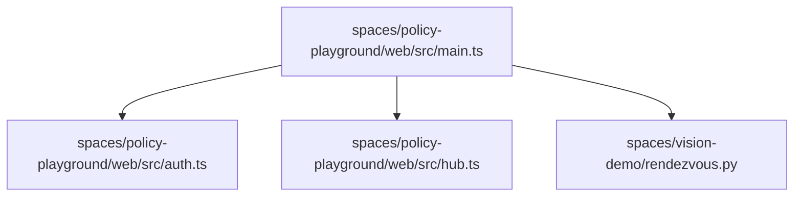

# Architectural Analysis & Learning Guide: microduck

> 自动化生成的开源项目架构全景图、多语言符号契约与递进式学习路线图。

## 1. 核心技术栈与外部依赖
- **源码模块总数**: 176
- **外部第三方库**: --fake"), .iter()
            .any(|p| std, = Some(value.to_owned()),
                _ => {}
            }
        }
        crumb
    }
}

 
 
 
 
 
 
pub struct BootCounter {
    path: PathBuf,
}

 
pub struct PendingUpdate {
    pub component: String,
    pub version: semver, = c.source(), = crumb.because.as_deref().unwrap_or("(unrecorded)"),
            "this board was rescued to golden since the last start"
        ), = format!(
                    "boot recovery swapped to golden without updaterd ({})",
                    crumb.because.as_deref().unwrap_or("no reason recorded")
                ), = self.robot.policy_paths(ROBOT_QUERY_TIMEOUT).await, = std, = vec![old.join("policy.onnx").display().to_string()], @huggingface, Hugging Face sends no complete one and its device page ignores a \
         `?user_code=` query — so no URL carries the code and a client has to show it"
    ), Lane, Service, __future__, `rest`".into()))?, `robotctl update apply`."
            ), `systemctl` or `systemd-run -p SupplementaryGroups=video`.",
            failures.join("\n  ")
        ), a robot \
         serving one central advertises non-connectably and is listed without being reachable. \
         Otherwise: if macOS shows it as paired, forget it there and retry, a robot that already has a release live"
    ), a skill"), anchors, anyhow, arc_swap, async_trait, asyncio, axum, bluer, bmi088, btd, btleplug, clap, collections, concurrent, config must be \
                  reachable when the robot is not."
)]
struct Args {
     
    socket: PathBuf,

     
     
     
    state_dir: PathBuf,

     
     
     
     
     
     
     
    allow_user: Vec<String>,

     
     
    allow_group: Vec<String>,

     
     
     
     
     
    fake_net: bool,

     
     
     
     
     
     
     
     
     
    fake_pads: bool,

     
     
     
     
     
     
     
     
     
     
     
     
     
     
     
     
     
    simulated: Option<String>,
}

 
 
 
 
 
 
 
 
 
struct PeerPolicy {
    owner_uid: u32,
    allow_uids: Vec<u32>,
    allow_gids: Vec<u32>,
}

impl PeerPolicy {
    fn may_mutate(&self, peer: Option<&tokio, configd, contextlib, control, copy, cv2, dataclasses, duck_ble, duck_control, duck_detect, duck_ipc_proto, duck_ipc_proto as proto, else {
        tracing, evdev, eventsource_stream, fastapi, filters, for gravity"), futures, futures_util, gilrs, github, gradio, gst, gst_app, gst_webrtc, gstreamer, gstreamer as gst, gstreamer_app as gst_app, gstreamer_video as gst_video, gstreamer_webrtc as gst_webrtc, has to survive to the log line: {error}"
        ), hf_hub, hf_robot_account, image, imu, intents, io, it was"
            ), it",
                call.method()
            ), itertools, json, kinematics, linux_embedded_hal, local, logging, math, minisign_verify, mjcf, model, numpy, obs, only."
        ), onnx, ort, os, pad_imu, params, pathlib, personality, pet_detect, proto, queue, radio, ratatui, receiver, rendezvous, requests, resets"
        ), restarts, so updates will be held off"), robotctl on the robot",
            call.method()
        ),
    )
}

 
mod tests {
    use super, robotd_params, rustfft, rustypot, semver, sensor, serde, serde_json, sha2, sounds, status, std, stream, struct, subprocess, synth, sys, test_support, the exact framing is then the boot mode's (same ~62 deg field, different \
             4:3->16:9 crop) rather than the pinned mode the calibration is for"
        ), the installed \
                 updaterd is too old to accept the release, stop robotd and re-run with \
                 --force."
            ), the new name here.{}",
            names.len(),
            names.join(", "),
            target.provenance(),
        )), the one before it performs that. The next update \
                 will have one.",
                if n == 1 { "" } else { "s" }
            ),
        }, the only thing\n  \
                 that fails is the check. {why}",
                component.name
            ))
        })
        .collect()
}

 
 
 
 
 
 
 
 
 
 
 
 
 
 
 
 
 
 
 
 
 
 
 
 
 
 
 
 
fn render_units(units: &[proto, thiserror, threading, time, tokio, tokio_tungstenite, toml_edit, torch, traceback, typing, updater, uyvy, vite, vite-plugin-singlefile, wire, xml, zbus, {
        let text = c.to_string(), {url}"), },
                    run: rec.run(),
                }, — `robotctl system pin` on the robot says what it is."
                    )
                    .into())

## 2. 系统架构调用拓扑图 (Mermaid Topology)

## 3. 递进式学习与精读路线图 (Progressive Learning Roadmap)

### 📍 Stage 1: Core Primitives & Foundation Models (核心实体与基础数据模型)
*Start here to understand data schemas, interfaces, and atomic utilities.*

- [x] `btd/src/lib.rs`
- [x] `configd/src/lib.rs`
- [x] `duck-ble/src/lib.rs`
- [x] `duck-control/src/lib.rs`
- [x] `mediad/src/lib.rs`
- [x] `robotd/src/params.rs`
- [x] `spaces/policy-playground/web/vite.config.ts`
- [x] `spaces/vision-demo/boot.py`
- [x] `duck-ble/src/gatt.rs`
- [x] `duck-control/examples/policy-rehearsal.rs`
- [x] `duckctl/examples/advwatch.rs`
- [x] `kinematics/tests/perf_probe.rs`
- [x] `odometry/src/anchors.rs`
- [x] `pet-detect/src/bin/detect.rs`
- [x] `pet-detect/src/bin/features.rs`
- [x] `robotctl/src/cells.rs`
- [x] `spaces/hello/app.py`
- [x] `test-support/examples/fake-release.rs`
- [x] `tof/build.rs`
- [x] `updater/src/spawn.rs`
- [x] `configd/src/power.rs`
- [x] `duck-detect/src/onnx.rs`
- [x] `updater/src/unix.rs`
- [x] `btd/src/link.rs`
- [x] `kinematics/tests/fk_against_mujoco.rs`
- [x] `mediad/src/main.rs`
- [x] `tof/src/config.rs`
- [x] `updater/src/fsutil.rs`
- [x] `btd/src/pairing.rs`
- [x] `duck-control/tests/fixtures/generate.py`
- [x] `mediad/src/snapshot.rs`
- [x] `btd/src/main.rs`
- [x] `test-support/examples/systemd-fixture.rs`
- [x] `updater/src/lib.rs`
- [x] `duck-ble/src/adv.rs`
- [x] `mediad/src/config.rs`
- [x] `sounds/src/personality.rs`
- [x] `duck-detect/src/bin/duck-bench.rs`
- [x] `robotctl/src/frame.rs`
- [x] `sounds/src/lib.rs`
- [x] `sounds/src/main.rs`
- [x] `spaces/policy-playground/web/src/rendezvous.ts`
- [x] `tof/src/status.rs`
- [x] `updater/src/faults.rs`
- [x] `xtask/tests/sideload.rs`
- [x] `tof/src/lib.rs`
- [x] `configd/src/identity.rs`
- [x] `robotd-params/src/registry.rs`
- [x] `updater/src/account.rs`
- [x] `updater/src/source/mod.rs`
- [x] `xtask/tests/artifact.rs`
- [x] `duck-control/tests/recurrent_policy.rs`
- [x] `duck-detect/src/lib.rs`
- [x] `mediad/src/producer.rs`
- [x] `configd/src/units.rs`
- [x] `kinematics/src/mjcf.rs`
- [x] `mediad/src/route.rs`

### 📍 Stage 2: Business Logic & Processing Pipelines (核心算法与逻辑处理)
*Understand core domain state machines, algorithms, and orchestration logic.*

- [x] `mediad/src/upstream.rs`
- [x] `pet-detect/training/train.py`
- [x] `spaces/policy-playground/web/src/hub.ts`
- [x] `tof/src/imu.rs`
- [x] `btd/src/bluez.rs`
- [x] `duck-detect/src/rknn.rs`
- [x] `mediad/src/detect.rs`
- [x] `mediad/src/web.rs`
- [x] `uyvy/src/lib.rs`
- [x] `duck-control/src/model.rs`
- [x] `sounds/src/rng.rs`
- [x] `sounds/src/voices.rs`
- [x] `robotctl/src/imu_view.rs`
- [x] `spaces/policy-playground/web/src/auth.ts`
- [x] `kinematics/src/head.rs`
- [x] `mediad/src/frame.rs`
- [x] `robotctl/src/camera.rs`
- [x] `sounds/src/chorale/text.rs`
- [x] `spaces/vision-demo/filters.py`
- [x] `updater/src/orphan.rs`
- [x] `updater/src/source/hf_hub.rs`
- [x] `updater/tests/download.rs`
- [x] `btd/src/chorale.rs`
- [x] `btd/src/upstream.rs`
- [x] `configd/src/main.rs`
- [x] `duck-control/src/fall.rs`
- [x] `duck-ether/src/main.rs`
- [x] `kinematics/src/math.rs`
- [x] `kinematics/src/tof.rs`
- [x] `robotd/tests/single_instance.rs`
- [x] `sounds/src/synth.rs`
- [x] `updater/src/reconcile.rs`
- [x] `updater/src/source/http.rs`
- [x] `kinematics/src/hand.rs`
- [x] `pet-detect/src/lib.rs`
- [x] `robotctl/src/path_map.rs`
- [x] `robotd/src/soc.rs`
- [x] `updater/src/manifest.rs`
- [x] `updater/src/source/local.rs`
- [x] `duck-control/src/imu.rs`
- [x] `test-support/src/lib.rs`
- [x] `configd/src/logs.rs`
- [x] `mediad/src/camera.rs`
- [x] `duck-control/src/obs.rs`
- [x] `kinematics/src/lib.rs`
- [x] `odometry/src/lib.rs`
- [x] `robotd/tests/updater_gate.rs`
- [x] `scripts/bake-duck-mesh.py`
- [x] `updater/src/ipc.rs`
- [x] `robotd/src/theremin.rs`
- [x] `configd/src/store.rs`
- [x] `pet-detect/src/worker.rs`
- [x] `spaces/policy-playground/web/src/main.ts`
- [x] `tof/src/main.rs`
- [x] `updater/src/hooks.rs`
- [x] `duck-ble/src/framing.rs`
- [x] `mediad/src/session.rs`
- [x] `sounds/src/chorale/beat.rs`

### 📍 Stage 3: Entrypoints & Client Interfaces (系统入口与外部接口)
*Trace main application lifecycles, CLI runners, and consumer API surfaces.*

- [x] `updater/src/transcript.rs`
- [x] `robotctl/src/show.rs`
- [x] `updater/tests/install.rs`
- [x] `btd/src/route.rs`
- [x] `duck-control/src/sim.rs`
- [x] `configd/src/net.rs`
- [x] `mediad/src/turn.rs`
- [x] `sounds/src/stream.rs`
- [x] `robotd/src/control.rs`
- [x] `updater/src/main.rs`
- [x] `updater/src/preflight.rs`
- [x] `btd/src/session.rs`
- [x] `configd/src/pad.rs`
- [x] `updater/src/store.rs`
- [x] `duck-control/src/bus.rs`
- [x] `mediad/src/exposure.rs`
- [x] `sounds/src/chorale/midi.rs`
- [x] `updater/src/config.rs`
- [x] `robotd/src/sound.rs`
- [x] `updater/src/verify.rs`
- [x] `xtask/tests/rescue.rs`
- [x] `duck-control/src/policy.rs`
- [x] `robotctl/src/configure.rs`
- [x] `mediad/src/stream.rs`
- [x] `updater/src/robot.rs`
- [x] `updater/src/source/github.rs`
- [x] `pad-imu/src/lib.rs`
- [x] `spaces/shared/control.py`
- [x] `duck-control/src/io.rs`
- [x] `padd/src/main.rs`
- [x] `robotctl/src/duck.rs`
- [x] `robotd/src/chorale.rs`
- [x] `spaces/shared/rendezvous.py`
- [x] `tof/src/sensor.rs`
- [x] `spaces/vision-demo/receiver.py`
- [x] `configd/src/bluez.rs`
- [x] `configd/src/nm.rs`
- [x] `duck-control/src/safety.rs`
- [x] `robotd/src/intents.rs`
- [x] `updater/tests/ipc.rs`
- [x] `padd/src/tap.rs`
- [x] `spaces/vision-demo/app.py`
- [x] `updater/src/journal.rs`
- [x] `sounds/src/chorale/mod.rs`
- [x] `xtask/src/main.rs`
- [x] `robotd-params/src/edit.rs`
- [x] `mediad/src/pipeline.rs`
- [x] `updater/src/policy.rs`
- [x] `mediad/src/relay.rs`
- [x] `spaces/shared/wire.py`
- [x] `duckctl/src/main.rs`
- [x] `updater/src/engine.rs`
- [x] `updater/tests/apply.rs`
- [x] `robotd-params/src/lib.rs`
- [x] `robotctl/src/monitor.rs`
- [x] `robotd/src/main.rs`
- [x] `robotctl/src/main.rs`
- [x] `duck-ipc-proto/src/lib.rs`

### ⚠️ 异常隔离模块 (Malformed Modules - Needs Repair)
- [ ] `spaces/vision-demo/control.py`
- [ ] `spaces/vision-demo/rendezvous.py`
- [ ] `spaces/vision-demo/wire.py`

## 4. 关键导出符号与公共 API 矩阵 (Universal Symbols & Complexity)

| 模块文件 | 语言 | 类/结构体 | 关键函数/方法 | 圈复杂度总计 |
| :--- | :---: | :--- | :--- | :---: |
| `btd/src/bluez.rs` | Rust | `AbortOnDrop`, `Advertised` | `drop()`, `serving()`, `serve()` (+8) | 13 |
| `btd/src/chorale.rs` | Rust | `Sighting` | `scan_pattern()`, `beacon_data()`, `beacon_in()` (+13) | 17 |
| `btd/src/lib.rs` | Rust | - | - | 0 |
| `btd/src/link.rs` | Rust | `Link` | `pair()`, `pair_sharing_mtu()`, `mtu()` | 4 |
| `btd/src/main.rs` | Rust | `Args` | `hostname()`, `main()`, `run()` (+2) | 6 |
| `btd/src/pairing.rs` | Rust | - | `pin()`, `a_pin_with_leading_zeros_is_the_right_passkey()`, `an_absent_configd_fails_rather_than_hanging()` (+2) | 5 |
| `btd/src/route.rs` | Rust | - | `try_from()`, `permits()`, `destination_for()` (+22) | 27 |
| `btd/src/session.rs` | Rust | `Outcome`, `FakeDaemon` | `run()`, `nothing()`, `reply()` (+27) | 32 |
| `btd/src/upstream.rs` | Rust | `NameChoice`, `Sockets`, `Conn` (+1) | `path()`, `ask()`, `ask_now()` (+10) | 17 |
| `configd/src/bluez.rs` | Rust | `PairingAgent`, `Snapshot`, `Found` (+1) | `start_discovery()`, `stop_discovery()`, `remove_device()` (+39) | 49 |
| `configd/src/identity.rs` | Rust | - | `serial()`, `serial_at()`, `default_name()` (+7) | 10 |
| `configd/src/lib.rs` | Rust | - | - | 0 |
| `configd/src/logs.rs` | Rust | - | `loggable()`, `resolve()`, `refusal()` (+18) | 21 |
| `configd/src/main.rs` | Rust | `Args`, `PeerPolicy`, `Service` | `may_mutate()`, `resolve_uid()`, `resolve_gid()` (+11) | 17 |
| `configd/src/net.rs` | Rust | `UnavailableNet`, `FakeNet`, `FakeState` | `status()`, `scan()`, `connect()` (+21) | 28 |
| `configd/src/nm.rs` | Rust | `NetworkManager` | `get_devices()`, `add_and_activate_connection()`, `device_type()` (+37) | 50 |
| `configd/src/pad.rs` | Rust | `FakePads`, `FakeState` | `status()`, `pair()`, `forget()` (+25) | 32 |
| `configd/src/power.rs` | Rust | - | `schedule()`, `reboot()`, `reboot()` | 3 |
| `configd/src/store.rs` | Rust | `Config`, `Store` | `new()`, `name()`, `set_name()` (+19) | 24 |
| `configd/src/units.rs` | Rust | - | `state()`, `all()`, `describe()` (+9) | 12 |
| `duck-ble/src/adv.rs` | Rust | - | `address_data()`, `address_in()`, `has_address_field()` (+4) | 7 |
| `duck-ble/src/framing.rs` | Rust | `Reassembler` | `notification_payload()`, `default()`, `fmt()` (+20) | 25 |
| `duck-ble/src/gatt.rs` | Rust | - | `the_uuids_are_distinct()` | 1 |
| `duck-ble/src/lib.rs` | Rust | - | - | 0 |
| `duck-control/examples/policy-rehearsal.rs` | Rust | - | `main()` | 1 |
| `duck-control/src/bus.rs` | Rust | `StaleImuTracker`, `DynamixelIo` | `observe()`, `open()`, `check_registers()` (+28) | 33 |
| `duck-control/src/fall.rs` | Rust | `FallPredictorConfig`, `FallPredictor` | `default()`, `new()`, `gravity_z_rate()` (+12) | 17 |
| `duck-control/src/imu.rs` | Rust | `ImuData`, `SflpDecoder` | `default()`, `default()`, `new()` (+15) | 20 |
| `duck-control/src/io.rs` | Rust | `Sensors`, `JointTargets`, `SlowSensors` (+2) | `default()`, `new()`, `read()` (+30) | 40 |
| `duck-control/src/lib.rs` | Rust | - | - | 0 |
| `duck-control/src/model.rs` | Rust | - | `mouth_target()`, `joint_index()`, `battery_percent()` (+11) | 14 |
| `duck-control/src/obs.rs` | Rust | `Command`, `BodyPose`, `Observation` | `twist_magnitude()`, `policy_joints()`, `joint_of()` (+16) | 22 |
| `duck-control/src/policy.rs` | Rust | `PolicyPaths`, `Policy`, `Network` (+1) | `path()`, `dylib_name()`, `ensure_runtime()` (+27) | 36 |
| `duck-control/src/safety.rs` | Rust | `SafetyConfig`, `Applied`, `LimitRuns` (+1) | `default()`, `limited_by()`, `worth_logging()` (+42) | 50 |
| `duck-control/src/sim.rs` | Rust | `Hello`, `SensorFrame`, `ImuFrame` (+4) | `at()`, `connect()`, `tag()` (+16) | 27 |
| `duck-control/tests/fixtures/generate.py` | Python | - | `info()`, `save()`, `variant()` (+1) | 5 |
| `duck-control/tests/recurrent_policy.rs` | Rust | - | `fixture()`, `load()`, `obs()` (+8) | 11 |
| `duck-detect/src/bin/duck-bench.rs` | Rust | `Args` | `cpu_seconds()`, `libc_sysconf_clk_tck()`, `sysconf()` (+4) | 8 |
| `duck-detect/src/lib.rs` | Rust | `Detection` | `width()`, `height()`, `bearing()` (+7) | 11 |
| `duck-detect/src/onnx.rs` | Rust | `Model` | `open()`, `infer()` | 3 |
| `duck-detect/src/rknn.rs` | Rust | `RknnInputOutputNum`, `RknnTensorAttr`, `RknnInput` (+3) | `why_init_failed()`, `open()`, `infer()` (+4) | 13 |
| `duck-ether/src/main.rs` | Rust | `Args`, `Weather`, `Duck` (+1) | `noise()`, `parse_duck()`, `main()` (+10) | 17 |
| `duck-ipc-proto/src/lib.rs` | Rust | `Request`, `Response`, `Error` (+123) | `identity_path()`, `runtime_root()`, `method()` (+122) | 271 |
| `duckctl/examples/advwatch.rs` | Rust | `Device` | `main()` | 2 |
| `duckctl/src/main.rs` | Rust | `Seen`, `Target`, `Cli` | `read()`, `note()`, `identity()` (+95) | 109 |
| `kinematics/src/hand.rs` | Rust | `Config`, `Hand`, `Tracker` | `default()`, `believes()`, `new()` (+13) | 19 |
| `kinematics/src/head.rs` | Rust | `HeadFk`, `Gaze` | `new()`, `alpha()`, `camera_in_trunk_cv2()` (+11) | 16 |
| `kinematics/src/lib.rs` | Rust | `SiteId`, `Link`, `Model` | `parse()`, `alpha()`, `num_joints()` (+16) | 22 |
| `kinematics/src/math.rs` | Rust | `Quat`, `Pose` | `new()`, `normalized()`, `from_axis_angle()` (+12) | 17 |
| `kinematics/src/mjcf.rs` | Rust | `Body`, `Joint`, `Site` (+1) | `parse()`, `walk_body()`, `collect_sites()` (+4) | 12 |
| `kinematics/src/tof.rs` | Rust | `Posture`, `Reprojector` | `default()`, `new()`, `alpha()` (+11) | 17 |
| `kinematics/tests/fk_against_mujoco.rs` | Rust | `Fixture`, `Sample`, `SitePose` | `alpha_matches_mujoco_on_every_site_of_64_random_poses()` | 4 |
| `kinematics/tests/perf_probe.rs` | Rust | - | `time_site_pose()`, `time_tof_reprojection()` | 2 |
| `mediad/src/camera.rs` | Rust | `SensorMode`, `Intrinsics` | `nominal_focal_px()`, `nominal()`, `scaled_from()` (+15) | 21 |
| `mediad/src/config.rs` | Rust | - | `default_path()`, `load()`, `write()` (+4) | 7 |
| `mediad/src/detect.rs` | Rust | `Sighting`, `Detector` | `counters()`, `open()`, `input()` (+7) | 13 |
| `mediad/src/exposure.rs` | Rust | `Controls`, `Ae`, `Stop` | `starting_at()`, `step()`, `current()` (+26) | 33 |
| `mediad/src/frame.rs` | Rust | - | `bind()`, `serve()`, `handle()` (+13) | 16 |
| `mediad/src/lib.rs` | Rust | - | - | 0 |
| `mediad/src/main.rs` | Rust | `Args` | `sockets()`, `main()`, `main()` | 4 |
| `mediad/src/pipeline.rs` | Rust | `Settings`, `Camera`, `Frame` (+10) | `from_degrees()`, `video_direction()`, `output()` (+53) | 71 |
| `mediad/src/producer.rs` | Rust | `Producer` | `local()`, `learn()`, `fields()` (+7) | 11 |
| `mediad/src/relay.rs` | Rust | `Timings`, `Meta`, `Welcome` (+12) | `default()`, `of()`, `read_machine_id()` (+72) | 93 |
| `mediad/src/route.rs` | Rust | - | `permits()`, `route_for()`, `refusal()` (+8) | 12 |
| `mediad/src/session.rs` | Rust | `Video`, `Media`, `Harness` | `video_notification()`, `video_params()`, `run()` (+18) | 25 |
| `mediad/src/snapshot.rs` | Rust | - | `fetch()`, `response()`, `png()` (+2) | 5 |
| `mediad/src/stream.rs` | Rust | `Unit`, `Config`, `Counters` (+5) | `wire_name()`, `parse()`, `interval()` (+24) | 38 |
| `mediad/src/turn.rs` | Rust | `Credentials`, `IceServer`, `Relays` | `parse_endpoint()`, `iter()`, `empty()` (+21) | 28 |
| `mediad/src/upstream.rs` | Rust | `Sockets`, `Conn`, `Pool` | `default()`, `path()`, `new()` (+6) | 12 |
| `mediad/src/web.rs` | Rust | - | `page()`, `serve()`, `router()` (+10) | 13 |
| `odometry/src/anchors.rs` | Rust | `AnchorSet` | `foot()` | 2 |
| `odometry/src/lib.rs` | Rust | `Odometry` | `new()`, `alpha()`, `alpha_with()` (+18) | 22 |
| `pad-imu/src/lib.rs` | Rust | `Imu`, `Bias` | `new()`, `observe()`, `reset_window()` (+34) | 39 |
| `padd/src/main.rs` | Rust | `Tap`, `Args`, `SelectButton` (+1) | `serve()`, `watch()`, `idle()` (+30) | 40 |
| `padd/src/tap.rs` | Rust | `Tap`, `Shared`, `State` (+2) | `serve()`, `watch()`, `idle()` (+49) | 57 |
| `pet-detect/src/bin/detect.rs` | Rust | `Args` | `main()` | 2 |
| `pet-detect/src/bin/features.rs` | Rust | `Args` | `main()` | 2 |
| `pet-detect/src/lib.rs` | Rust | `MelExtractor`, `PettingDetector`, `PettingDetectorConfig` | `new()`, `log_mel()`, `default()` (+12) | 19 |
| `pet-detect/src/worker.rs` | Rust | `SoundSentry`, `PetConfig`, `PetHandle` | `new()`, `audible()`, `push()` (+17) | 24 |
| `pet-detect/training/train.py` | Python | `TinyAudioCNN` | `extract_blocks()`, `load_class()`, `TinyAudioCNN.__init__()` (+2) | 12 |
| `robotctl/src/camera.rs` | Rust | `Shot`, `CameraView` | `absorb()`, `lost()`, `forget()` (+11) | 16 |
| `robotctl/src/cells.rs` | Rust | - | `blit()`, `rgb()` | 2 |
| `robotctl/src/configure.rs` | Rust | `Plan` | `unit()`, `apply_for()`, `is_quiet()` (+29) | 36 |
| `robotctl/src/duck.rs` | Rust | `Mesh`, `Body`, `Part` (+5) | `model()`, `take()`, `u16()` (+30) | 41 |
| `robotctl/src/frame.rs` | Rust | - | `run()`, `fetch()`, `failed()` (+5) | 8 |
| `robotctl/src/imu_view.rs` | Rust | `Segment`, `Canvas` | `draw()`, `new()`, `colour()` (+9) | 15 |
| `robotctl/src/main.rs` | Rust | `Cli`, `StatusArgs`, `Client` (+6) | `run_quack()`, `note_interrupt()`, `run_theremin()` (+207) | 230 |
| `robotctl/src/monitor.rs` | Rust | `PadView`, `View` | `toggled()`, `angle()`, `rate()` (+155) | 164 |
| `robotctl/src/path_map.rs` | Rust | `PathMap`, `Grid` | `new()`, `observe()`, `extent_m()` (+14) | 19 |
| `robotctl/src/show.rs` | Rust | - | `worth_splicing()`, `render()`, `event_line()` (+23) | 26 |
| `robotd-params/src/edit.rs` | Rust | `Row`, `Model` | `effective()`, `overridden()`, `differs()` (+59) | 65 |
| `robotd-params/src/lib.rs` | Rust | `Params`, `PadImuHeadControlParams`, `PadParams` (+20) | `default()`, `default()`, `skill()` (+123) | 155 |
| `robotd-params/src/registry.rs` | Rust | `Entry` | `entry()`, `feature()`, `entry_for()` (+5) | 10 |
| `robotd/src/chorale.rs` | Rust | `Peer`, `Tick`, `Chorale` | `known_piece()`, `piece_catalogue()`, `piece()` (+38) | 45 |
| `robotd/src/control.rs` | Rust | `Tuning`, `SkillTuning`, `Step` (+2) | `default()`, `default()`, `fmt()` (+19) | 30 |
| `robotd/src/intents.rs` | Rust | `Stamped`, `PoseIntent`, `SkillRequests` (+2) | `default()`, `any()`, `requested()` (+41) | 52 |
| `robotd/src/main.rs` | Rust | `Landing`, `Args`, `PolicyNames` (+7) | `observe()`, `pose_target()`, `parse_duration()` (+207) | 223 |
| `robotd/src/params.rs` | Rust | - | - | 0 |
| `robotd/src/soc.rs` | Rust | - | `hottest_zone_c()`, `cpu_throttle()`, `throttle_in()` (+16) | 19 |
| `robotd/src/sound.rs` | Rust | `Live`, `Sound` | `block_sigpipe()`, `new()`, `set_position()` (+29) | 35 |
| `robotd/src/theremin.rs` | Rust | `Frame`, `Note`, `Theremin` | `spawn()`, `new()`, `active()` (+17) | 23 |
| `robotd/tests/single_instance.rs` | Rust | `Robotd` | `spawn()`, `wait_for_exit()`, `assert_refused()` (+13) | 17 |
| `robotd/tests/updater_gate.rs` | Rust | `Robotd`, `Fixture` | `robotd_bin()`, `spawn()`, `wait_until_answering()` (+17) | 22 |
| `scripts/bake-duck-mesh.py` | Python | - | `load_stl()`, `decimate()`, `flat_coords()` (+3) | 22 |
| `sounds/src/chorale/beat.rs` | Rust | `Conductor`, `Heard`, `Follower` (+1) | `new()`, `due()`, `position_beats()` (+18) | 25 |
| `sounds/src/chorale/midi.rs` | Rust | `Import`, `Raw`, `Reader` (+1) | `fmt()`, `parse()`, `push()` (+26) | 34 |
| `sounds/src/chorale/mod.rs` | Rust | `Note`, `SoloNote`, `Score` (+2) | `as_str()`, `register()`, `ensemble()` (+51) | 62 |
| `sounds/src/chorale/text.rs` | Rust | `ParseError` | `fmt()`, `parse()`, `solo()` (+12) | 16 |
| `sounds/src/lib.rs` | Rust | - | `variant_count()`, `render()`, `to_wav()` (+5) | 8 |
| `sounds/src/main.rs` | Rust | `Args` | `resolve_seed()`, `show()`, `play_pcm()` (+3) | 8 |
| `sounds/src/personality.rs` | Rust | `Personality` | `from_seed()`, `variant_rng()`, `harmonics()` (+3) | 7 |
| `sounds/src/rng.rs` | Rust | `Rng` | `from_seed()`, `next_u64()`, `random()` (+10) | 14 |
| `sounds/src/stream.rs` | Rust | `Stream` | `new()`, `wheee()`, `choral()` (+24) | 28 |
| `sounds/src/synth.rs` | Rust | - | `t_axis()`, `lerp()`, `expdecay()` (+14) | 17 |
| `sounds/src/voices.rs` | Rust | - | `attack()`, `voice()`, `alarm()` (+11) | 14 |
| `spaces/hello/app.py` | Python | - | `env()`, `frames()` | 2 |
| `spaces/policy-playground/web/src/auth.ts` | TypeScript/JavaScript | `SignedIn`, `Named` | `hfVariables()`, `clientId()`, `scopes()` (+8) | 15 |
| `spaces/policy-playground/web/src/hub.ts` | TypeScript/JavaScript | `Policy` | `notATrick()`, `isATrick()`, `needsALength()` (+8) | 12 |
| `spaces/policy-playground/web/src/main.ts` | TypeScript/JavaScript | `State` | `note()`, `connect()`, `disconnect()` (+17) | 24 |
| `spaces/policy-playground/web/src/rendezvous.ts` | TypeScript/JavaScript | `RendezvousError`, `Robot`, `Envelope` (+2) | `robotFrom()`, `listDucks()` | 8 |
| `spaces/policy-playground/web/vite.config.ts` | TypeScript/JavaScript | - | - | 0 |
| `spaces/shared/control.py` | Python | `RpcError`, `Rpc` | `RpcError.__init__()`, `Rpc.__init__()`, `Rpc.bound_to()` (+4) | 39 |
| `spaces/shared/rendezvous.py` | Python | `RendezvousError`, `Robot` | `Robot.__init__()`, `Robot.label()`, `_who_answered()` (+1) | 45 |
| `spaces/shared/wire.py` | Python | `WireError`, `WsConsumer` | `WsConsumer.__init__()`, `WsConsumer.start()`, `WsConsumer.stop()` (+8) | 101 |
| `spaces/vision-demo/app.py` | Python | `Ring`, `Link` | `Ring.__init__()`, `Ring.emit()`, `default_receiver()` (+11) | 58 |
| `spaces/vision-demo/boot.py` | Python | - | - | 0 |
| `spaces/vision-demo/control.py` | Python | - | - | 0 |
| `spaces/vision-demo/filters.py` | Python | - | `upright()`, `edges()`, `motion()` (+2) | 16 |
| `spaces/vision-demo/receiver.py` | Python | `Stream`, `Frames` | `Stream.fps()`, `Stream.stale()`, `Frames.__init__()` (+10) | 47 |
| `spaces/vision-demo/rendezvous.py` | Python | - | - | 0 |
| `spaces/vision-demo/wire.py` | Python | - | - | 0 |
| `test-support/examples/fake-release.rs` | Rust | `Cli` | `main()` | 2 |
| `test-support/examples/systemd-fixture.rs` | Rust | `Cli` | `updaterd_unit()`, `fake_btd_unit()`, `main()` (+2) | 6 |
| `test-support/src/lib.rs` | Rust | `Publisher`, `Release` | `new()`, `key_file()`, `public_key()` (+15) | 20 |
| `tof/build.rs` | Rust | `Generation` | `main()` | 2 |
| `tof/src/config.rs` | Rust | - | `default_path()`, `load()`, `the_head_imu_is_off_by_default_and_on_an_unprovisioned_board()` (+1) | 4 |
| `tof/src/imu.rs` | Rust | `ImuStatus`, `Inner` | `new()`, `found()`, `off()` (+7) | 12 |
| `tof/src/lib.rs` | Rust | `Frame` | `zone()`, `zones()`, `valid_count()` (+4) | 9 |
| `tof/src/main.rs` | Rust | `Args`, `SimDepth` | `parse_address()`, `main()`, `quiet_period()` (+19) | 24 |
| `tof/src/sensor.rs` | Rust | `Sensor`, `Sensor` | `tof_probe_id()`, `vl8_open()`, `vl8_close()` (+39) | 46 |
| `tof/src/status.rs` | Rust | `Status`, `Inner` | `new()`, `up()`, `down()` (+3) | 8 |
| `updater/src/account.rs` | Rust | - | `account()`, `account_at()`, `account_for_test()` (+7) | 10 |
| `updater/src/config.rs` | Rust | `Config`, `ComponentConfig` | `default_keep_previous()`, `permits()`, `default_ref_tag_prefix()` (+25) | 34 |
| `updater/src/engine.rs` | Rust | `DownloadProgress`, `Engine`, `Recorder` (+2) | `started()`, `admit()`, `flush()` (+115) | 124 |
| `updater/src/faults.rs` | Rust | `Faults` | `none()`, `any_enabled()`, `from_names()` (+4) | 8 |
| `updater/src/fsutil.rs` | Rust | - | `fsync_parent()`, `write_atomic()`, `write_atomic_replaces_contents()` (+1) | 4 |
| `updater/src/hooks.rs` | Rust | `HookContext`, `HookOutcome`, `Collected` | `relative_path()`, `env()`, `run()` (+17) | 24 |
| `updater/src/ipc.rs` | Rust | `PeerPolicy`, `Server` | `new()`, `may_mutate()`, `new()` (+17) | 22 |
| `updater/src/journal.rs` | Rust | `Journal`, `UpdateLock`, `Pins` (+4) | `now_unix()`, `open()`, `append()` (+51) | 61 |
| `updater/src/lib.rs` | Rust | - | `from()`, `code()`, `to_rpc_error()` (+2) | 6 |
| `updater/src/main.rs` | Rust | `Args`, `Loaded`, `Unreadable` | `robot_is_answering()`, `resolve_uid()`, `resolve_gid()` (+23) | 30 |
| `updater/src/manifest.rs` | Rust | `Manifest`, `Capabilities` | `one()`, `compatibility()`, `is_mandatory_for()` (+13) | 19 |
| `updater/src/orphan.rs` | Rust | `Orphan` | `would_orphan()`, `execs_under()`, `logical_lines()` (+12) | 16 |
| `updater/src/policy.rs` | Rust | `Source`, `PolicyManifest`, `ManifestCommand` (+2) | `parse()`, `render()`, `installed()` (+67) | 76 |
| `updater/src/preflight.rs` | Rust | `CheckResult`, `Report`, `Preflight` (+1) | `passed()`, `first_failure()`, `run()` (+22) | 30 |
| `updater/src/reconcile.rs` | Rust | `Finding` | `verdict_for()`, `stale_units()`, `check()` (+12) | 17 |
| `updater/src/robot.rs` | Rust | `HealthReport`, `SocketRobotClient`, `AbsentRobot` | `permits_restart()`, `is_healthy()`, `report()` (+29) | 38 |
| `updater/src/source/github.rs` | Rust | `GithubReleases`, `Release`, `Asset` | `new()`, `tag_for()`, `ref_tag_for()` (+32) | 38 |
| `updater/src/source/hf_hub.rs` | Rust | `HfHub`, `RepoRefs`, `GitRef` | `new()`, `resolve_url()`, `tag_for()` (+10) | 16 |
| `updater/src/source/http.rs` | Rust | `AttemptError` | `classify()`, `user_agent()`, `client()` (+12) | 17 |
| `updater/src/source/local.rs` | Rust | `LocalDir` | `new()`, `manifest_path()`, `versions()` (+15) | 19 |
| `updater/src/source/mod.rs` | Rust | `SignedBytes`, `FetchedArtifact` | `latest_manifest()`, `manifest_for()`, `manifest_at_ref()` (+4) | 10 |
| `updater/src/spawn.rs` | Rust | - | `retrying_busy()`, `every_spawn_in_the_crate_goes_through_the_retry()` | 2 |
| `updater/src/store.rs` | Rust | `Store` | `new()`, `releases_dir()`, `link_path()` (+28) | 32 |
| `updater/src/transcript.rs` | Rust | `Transcript`, `Caps` | `begin()`, `id()`, `record()` (+20) | 25 |
| `updater/src/unix.rs` | Rust | - | `user_id()`, `group_id()`, `a_name_that_does_not_exist_is_none()` | 3 |
| `updater/src/verify.rs` | Rust | `ArchiveLimits`, `TrustedKey`, `KeyRing` | `default()`, `fmt()`, `load()` (+29) | 35 |
| `updater/tests/apply.rs` | Rust | `FakeRobot`, `DeadThenHealthy`, `DegradedRobot` (+2) | `healthy()`, `unhealthy()`, `safe_to_restart()` (+136) | 144 |
| `updater/tests/download.rs` | Rust | `Counters` | `body()`, `ranged()`, `ignores_range()` (+12) | 16 |
| `updater/tests/install.rs` | Rust | `FreshRobot` | `new()`, `write_config()`, `config_path()` (+22) | 26 |
| `updater/tests/ipc.rs` | Rust | `FakeRobot`, `Harness`, `Client` (+1) | `safe_to_restart()`, `health()`, `model_api()` (+48) | 55 |
| `uyvy/src/lib.rs` | Rust | `Letterbox` | `from_degrees()`, `upright()`, `source()` (+8) | 13 |
| `xtask/src/main.rs` | Rust | `Cli`, `PackageArgs` | `main()`, `run()`, `package()` (+55) | 62 |
| `xtask/tests/artifact.rs` | Rust | - | `root()`, `staged_binaries()`, `includes()` (+7) | 10 |
| `xtask/tests/rescue.rs` | Rust | `Board`, `Rescue` | `with_releases()`, `install()`, `state()` (+30) | 35 |
| `xtask/tests/sideload.rs` | Rust | - | `root()`, `read()`, `code()` (+5) | 8 |
