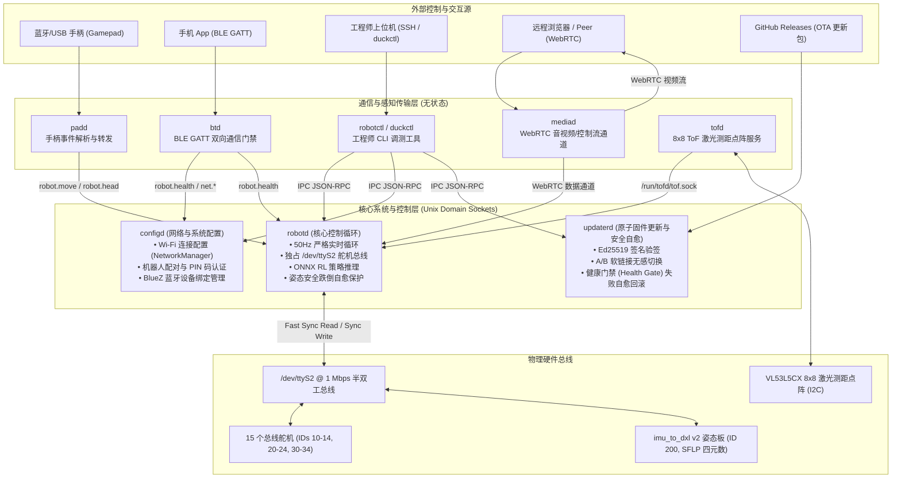

# Microduck 机器人全景架构与软件栈深度剖析

> 本文档由 `open-source-repo-analyzer` 工具链对官方仓库源码剖析后提炼，为 `yunyu-esp32` 接入与移植 Microduck 提供第一手架构全景。

---

## 1. 机器人物理规格与系统定位

**Microduck**（及开源原形 **Open Duck Mini v2**，灵感源自迪士尼 BDX Droid）是一台高度约 25cm、全重约 800g 的微型双足双轮自适应机器人。其运动控制由强化学习（RL）策略直接驱动，摆脱了传统复杂的状态机与逆运动学硬编码。

| 物理参数 | 规格指标 | 架构说明 |
| :--- | :--- | :--- |
| **高度** | ~25 cm (站立) / ~42 cm (双腿完全伸展) | 桌面级灵巧微型机器人 |
| **全重** | ~800 g (含电池与机壳) | 适合轻量化 3D 打印结构 |
| **自由度 (DoF)** | 14 ~ 15 个舵机 | 左右腿各 5 自由度，头部与脖颈 4~5 自由度（含可动鸟喙） |
| **控制频率** | 50.0 Hz (周期严格 20.0 ms) | 策略推理与总线读写严格同步 |
| **主控平台 (官方)** | Rockchip RK3566 (四核 Cortex-A55 @ 1.8GHz, NPU 0.8 TOPS) | 运行定制 Linux + Rust 守护进程栈 |
| **主控平台 (移植目标)** | ESP32-S3 (双核 Xtensa LX7 @ 240MHz, 8MB PSRAM, 矢量 SIMD) | `yunyu-esp32` 项目嵌入式移植基座 |
| **通信总线** | 半双工 UART @ 1.000.000 Baud (1 Mbps) | 兼容 Dynamixel Protocol 2.0 / Feetech STS |

---

## 2. 软件子系统：七大守护进程解耦设计

官方 `pollen-robotics/microduck` 采用“**无集中单体，单一职责微服务，Unix Socket 解耦**”的极简 Rust 架构。7 个守护进程彼此独立，通过 `/run/<service>.sock` 的 **JSON-RPC 2.0 (NDJSON 单行 JSON)** 进行通信。



---

## 3. 核心设计哲学与安全容灾法则

### 3.1 独占硬件原则 (Single Owner of the Bus)
- **`robotd` 是全系统中唯一能够接触舵机总线的进程**。任何其他进程（包括手柄、手机、远程控制）只能向 `robotd` 发送**意图 (Intent)**（例如："期望前进速度 0.2m/s", "头部俯仰 15 度"）。
- `robotd` 内部的 Safety Layer 评估当前机器人倾角、速度加速度极限、关节物理边界，裁定最终合规的目标关节角度。任何第三方指令无法直接给舵机灌写 PWM 或死区破坏姿态。

### 3.2 故障隔离与幸存者准则 (Survivor Principle)
- 如果运动控制算法异常崩溃，**`configd`、`updaterd` 和 `btd` 必须能够存活**。
- 这三个进程完全不依赖 ML 运行时（ONNX Runtime / Torch），不依赖音视频栈（GStreamer / FFmpeg）。
- **设计初衷**：当机器人的步态策略崩溃、舵机锁死甚至摔倒时，工程师仍然可以通过手机蓝牙、Wi-Fi 或 SSH 连接到设备，执行配置修改、OTA 修复或者一键回滚。

### 3.3 无损原子更新与金样自愈 (Atomic Update & Golden Rollback)
- 更新包以完整文件夹形式解压至 `/opt/robot/daemon/releases/<version>/`。
- `updaterd` 校验 minisign 签名，切换 `/opt/robot/daemon/current` 软链接。
- 重启服务后，`updaterd` 向 `robotd` 轮询 `robot.health`。如果 30 秒内未能通过健康检查，立即自动回滚软链接至上一版本并重启。
- 引导计数器（Boot Counter）防御：连续 3 次引导失败直接触发硬件级 Golden 镜像重置。

---

## 4. 进程通信协议契约 (IPC JSON-RPC 2.0)

所有守护进程对外暴露的 Unix 域套接字统一采用 **JSON-RPC 2.0 NDJSON (一行一个 JSON 结构体)**：

### 4.1 典型调用请求与响应

**手柄发送速度意图 (padd -> robotd)**:
```json
{"jsonrpc":"2.0","method":"robot.move","params":{"vx":0.25,"vy":0.0,"vyaw":-0.1},"id":101}
```

**响应确认**:
```json
{"jsonrpc":"2.0","result":{"accepted":true,"mode":"walking"},"id":101}
```

**遥测订阅与广播 (Decimated State Stream)**:
```json
{"jsonrpc":"2.0","method":"robot.subscribe","params":{"fields":["battery","temperature","imu","pose"]},"id":102}
```
`robotd` 以 10Hz（原 50Hz 降采样 5 倍）向该连接持续推送通知事件：
```json
{"jsonrpc":"2.0","method":"robot.state","params":{"battery_v":7.6,"pitch":0.02,"roll":-0.01,"temp_c":38.5}}
```

---

## 5. 项目子工程资产索引

在当前工作区 `D:\workspace\code\yunyu-esp32\microduck\` 中，各子项目职责清晰：

1. **`microduck/`**：官方 Rust 核心工程，包含 `robotd`, `duck-control`, `duck-ble`, `configd`, `updaterd`, `mediad`, `duckctl` 等全部生产级代码；
2. **`microduck_rl/`**：强化学习训练中心，基于 MuJoCo Warp (`mjlab`) + PPO 实现全自动 Sim-to-Real 训练与 ONNX 导出；
3. **`microduck-gst-plugins/`**：专为 RK3566 硬件编解码加速设计的 GStreamer 插件与 WebRTC 编译补丁；
4. **`duck_detector/`**：端侧视觉检测模型，在 RKNN NPU 上以 INT8 精度检测周围同类 Microduck；
5. **`Open_Duck_Blender/`**：Blender 3D 骨骼绑定（FK/IK）、动作捕捉与强化学习参考轨迹记录器；
6. **`Open_Duck_Mini/`**：硬件开源源头，包含结构 STL/STEP 3D 打印模型、全量物料清单 (BOM)、装配接线图与基线走路 ONNX 权重；
7. **`Open_Duck_Mini_Runtime/`**：轻量级 Python/C 运行环境，包含 Feetech STS 舵机驱动与 BNO055/BMI088 IMU 解算；
8. **`Open_Duck_Playground/`**：MuJoCo 动力学微型游乐场与基准仿真环境；
9. **`Open_Duck_reference_motion_generator/`**：多项式拟合参考步态生成器。
