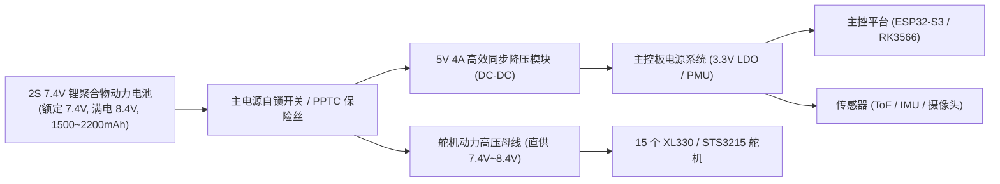

# Microduck 硬件执行机构、总线拓扑与电气规范

> 本文档由 `open-source-repo-analyzer` 对 `duck-control/src/bus.rs`、`model.rs` 及硬件设计文档提炼，详述总线时序与物理接口。

---

## 1. 关节拓扑与舵机物理分配 (Actuation Matrix)

Microduck 全身共有 **15 个智能总线舵机**与 **1 个挂载在总线上的智能 IMU 板**。总线统一采用半双工 UART，波特率为 **1,000,000 Baud (1 Mbps)**。

### 1.1 舵机 ID、关节名称与物理定义表

| 分组 | 舵机 ID | 关节代码名 (Canonical Name) | 物理位置说明 | 标称回零基准弧度 (Home Rad) | 运动学正向定义 |
| :--- | :---: | :--- | :--- | :---: | :--- |
| **左腿** | `20` | `left_hip_yaw` | 左髋偏航关节 | `0.0000` | 腿部向外展为正 |
| **左腿** | `21` | `left_hip_roll` | 左髋滚转关节 | `-0.0873` (-5.0°) | 身体侧向摆动 |
| **左腿** | `22` | `left_hip_pitch` | 左髋俯仰关节 | `-0.4579` (-26.2°) | 大腿向前摆动为负 |
| **左腿** | `23` | `left_knee` | 左膝关节 | `-0.0049` (-0.28°) | 膝部弯曲 |
| **左腿** | `24` | `left_ankle` | 左踝关节 | `+0.4530` (+25.9°) | 脚掌俯仰接地配合 |
| **颈头部** | `30` | `neck_pitch` | 颈部俯仰关节 | `+0.3491` (+20.0°) | 头部整体向上仰 |
| **颈头部** | `31` | `head_pitch` | 头部独立俯仰关节 | `+0.3491` (+20.0°) | 头部面部倾角调节 |
| **颈头部** | `32` | `head_yaw` | 头部水平偏航关节 | `0.0000` | 左右转头观望 |
| **颈头部** | `33` | `head_roll` | 头部倾斜滚转关节 | `0.0000` | 歪头表情动作 |
| **喙部** | `34` | `mouth` | 可动鸟喙张合关节 | `0.0000` (闭合) | 咬合抓取 (-5° ~ +30°) |
| **右腿** | `10` | `right_hip_yaw` | 右髋偏航关节 | `0.0000` | 腿部向外展为正 |
| **右腿** | `11` | `right_hip_roll` | 右髋滚转关节 | `+0.0873` (+5.0°) | 身体侧向摆动 (与左对称) |
| **右腿** | `12` | `right_hip_pitch` | 右髋俯仰关节 | `+0.4579` (+26.2°) | 大腿向前摆动 (符号与左相反) |
| **右腿** | `13` | `right_knee` | 右膝关节 | `+0.0049` (+0.28°) | 膝部弯曲 |
| **右腿** | `14` | `right_ankle` | 右踝关节 | `-0.4530` (-25.9°) | 脚掌俯仰接地配合 |
| **姿态板**| `200` | `imu_to_dxl` | 躯干核心姿态解算板 | — | 挂载于同一总线，地址 124 |

> [!IMPORTANT]
> **关于鸟喙 (mouth, ID 34)**：在官方生产级强化学习策略中，RL 策略网络输出维度为 **14 维**，直接跳过了鸟喙（`MOUTH_INDEX = 9`）。鸟喙由独立的抓取意图通道或表情接口直接指定目标角度（闭合 -5° 到张开 +30°），不干扰步态训练。

---

## 2. 串行总线物理层与协议设计

### 2.1 硬件总线拓扑
- **物理接口**：单总线半双工 UART（3-Pin 连接器：`GND`、`VCC (7.4V)`、`DATA`）；
- **主板端口**：Linux 下映射为 `/dev/ttyS2`（在 ESP32 上对应 `UART1` 或 `UART2`，配合单引脚开漏或 RS-485 方向控制引脚）；
- **工作波特率**：标称 `1,000,000 Baud`（1 Mbps）。每个 bit 耗时 1 微秒，每字节传输耗时 10 微秒（1 Start + 8 Data + 1 Stop）。

### 2.2 Dynamixel Protocol 2.0 帧时序优化

传统逐个舵机读取（`Read` 指令）在 16 个设备上会带来 16 次来回握手与包头冗余。Microduck 采用了极其激进的时序优化：

1. **快速同步读 (Fast Sync Read, 指令代码 `0x8A`)**：
   - 主控广播一条 `Fast Sync Read` 指令，一次性指定读取设备列表 `[200, 20..24, 30..34, 10..14]`；
   - 读取寄存器起始地址：`Address = 124`，读取长度：`Length = 12 字节`；
   - **这 12 个字节包含了**：`present_pwm` (2B), `present_current` (2B), `present_velocity` (4B), `present_position` (4B)；
   - **IMU 板在同一地址巧妙适配**：`imu_to_dxl` 板被设计为在地址 124 同样返回 12 字节（包含其硬件 SFLP 算出的机体四元数与角速度）；
   - **时钟耗时评估**：
     - 指令包下发：约 25 字节 $\approx 250\,\mu\text{s}$；
     - 16 个设备串行连续应答（无包头重复碰撞）：$16 \times (12 + 6) = 288\text{ 字节} \approx 2.88\,\text{ms}$；
     - **总读取耗时稳定在 3.5ms 以内**！

2. **同步写 (Sync Write, 指令代码 `0x83`)**：
   - 策略计算完成后，主控广播一条 `Sync Write` 指令，将 15 个舵机的新 `goal_position`（每个舵机 4 字节）一次性灌入总线；
   - 指令包尺寸：包头 + 15 * (1 ID + 4 Data) $\approx 85\text{ 字节} \approx 850\,\mu\text{s}$；
   - 舵机接收后无需应答（No Status Packet），执行硬件锁步更新。

```text
20ms 控制周期时间切片 (50Hz Tick Budget):
├─ [0.0ms ~ 3.5ms]   Fast Sync Read 读取 16 个设备 (IMU + 15 舵机) ──── 耗时 3.5ms
├─ [3.5ms ~ 5.5ms]   观测向量组装 (61 维) + ONNX 神经网络推理 ────────── 耗时 2.0ms
├─ [5.5ms ~ 6.5ms]   安全边界裁决 (Safety Filter) + 目标插值 ──────────── 耗时 1.0ms
├─ [6.5ms ~ 7.5ms]   Sync Write 广播目标位置 ─────────────────────────── 耗时 1.0ms
└─ [7.5ms ~ 20.0ms]  空闲等待 (7.5ms / 20.0ms = 37.5% 占空比，裕量极其充裕)
```

---

## 3. 关键寄存器与 EEPROM 出厂矫正规范

新换舵机出厂默认波特率为 `57,600`，ID 为 `1`。`robotd` 或配置脚本必须完成以下参数固化：

1. **`return_delay_time` 强制写 0**：
   - XL330 出厂默认延时为 `250`（对应 $500\,\mu\text{s}$）。如果 16 个设备都延时 500us，仅仅等待应答就要消耗 $16 \times 0.5 = 8.0\,\text{ms}$，直接爆掉 40% 的控制周期；
   - 必须写入 `0`，让舵机在收到读取指令后以硬件最快速度应答。

2. **`shutdown` 寄存器保护位配置（关键安全点）**：
   - 舵机默认 `shutdown = 53`，当检测到过压（`Max Voltage Limit` 默认 7.0V）时会自动切断扭矩；
   - Microduck 采用 2S 锂电池供电，充满电电压高达 **8.4V**！
   - 若不修改，充满电开机时 15 个舵机会立即因为“过压故障”全体自锁脱开；
   - 因此必须将 `shutdown` 寄存器写入 **`52` (0b110100)**，**清除输入电压保护位**，仅保留过载（Overload）、电击保护（Electrical Shock）与过温（Overheating）保护。

---

## 4. 电源供给与动力电气设计



- **大电流母线与逻辑完全退耦**：舵机满载急停或大动态起跳时瞬间峰值电流可达 **4A ~ 6A**。5V 逻辑降压模块必须配备大容量固态电容（$\ge 470\,\mu\text{F}$ 低 ESR），杜绝因舵机反电动势或电压跌落导致 ESP32 发生低压复位（Brownout Reset）。
