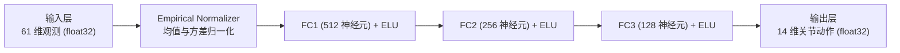

# Microduck 强化学习训练与 Sim-to-Real 动力学流水线

> 本文档深入解剖 `microduck_rl`、`mjlab` 与 `export.py`，提炼官方步态训练、域随机化与端侧 ONNX 部署方案。

---

## 1. 强化学习技术栈与训练框架

Microduck 的运动能力来自近端策略优化（PPO）算法在动力学仿真器中的大规模端到端训练。

| 模块 | 官方选型与技术路径 | 核心优势 |
| :--- | :--- | :--- |
| **物理引擎** | **MuJoCo Warp (`mjlab`)** | 借助 NVIDIA Warp 在 GPU 上并行模拟数万个机器人环境，训练速度较 CPU 提升数百倍 |
| **RL 算法核心** | **RSL-RL (ETH 瑞士联邦理工开源 PPO)** | 专为足式机器人设计（支持非对称 Critic、历史时序缓冲、域随机化） |
| **导出格式** | **ONNX (Open Neural Network Exchange)** | 跨平台工业标准，可在 Linux ONNX Runtime、RKNN NPU、ESP-NN/TFLite Micro 上无缝加载 |
| **控制环路** | **50 Hz (20 ms 步长)** | 兼顾物理带宽、低算力开销与执行机构惯性响应 |

---

## 2. 观测空间 (Observation Space) 与动作空间 (Action Space)

观测向量由 `duck-control/src/obs.rs` 与 `microduck_rl` 严格一致约束，是保证 Sim-to-Real 能够成功落地的核心契约。

### 2.1 61 维平坦观测向量布局 (`OBS_LEN = 61`)

整个观测向量是一组由 61 个 `float32` 构成的平坦数组：

```text
[0..3]    (3维) : 机体坐标系下的三轴陀螺仪角速度 (rad/s)
[3..6]    (3维) : 机体坐标系下的重力投影单位向量 (Projected Gravity)
[6..20]  (14维) : 当前 14 个关节位置相对于 Home Pose 的偏差角 (rad，跳过鸟喙)
[20..34] (14维) : 当前 14 个关节实际角速度 (rad/s，跳过鸟喙)
[34..48] (14维) : 上一控制步 (t-1) 的动作输出缓存 (Previous Action)
[48..61] (13维) : 用户/上位机当前意图控制块 (Command Block)
```

#### 指令控制块 (48..61 细分切片)：
- `48..51` (3维): 期望平移与偏航速度 $[v_x, v_y, v_{\text{yaw}}]$ (例如 $v_x \in [-0.4, 0.4]\,\text{m/s}$)；
- `51..55` (4维): 头部期望姿态目标 $[\theta_{\text{neck\_pitch}}, \theta_{\text{head\_pitch}}, \theta_{\text{head\_yaw}}, \theta_{\text{head\_roll}}]$；
- `55..57` (2维): 躯干水平位移 $x, y$（训练中固定为 0）；
- `57` (1维): 躯干站立高度偏置 $z$（用于蹲姿与站姿调节）；
- `58` (1维): 躯干滚转偏置 $\text{roll}$；
- `59` (1维): 躯干俯仰偏置 $\text{pitch}$；
- `60` (1维): 躯干偏航偏置 $\text{yaw}$（固定为 0）。

> [!CAUTION]
> **切勿双重累加头部偏置**：
> 官方策略网络在训练时，头部关节目标角已经作为**输入观测指令**喂给了神经网络！因此，神经网络输出的动作直接已经包含了头部姿态响应，在主控底层**切勿在输出动作上再次追加头部角度**，否则会导致脖颈双重弯曲或超出机械极限！

### 2.2 动作空间 (`ACTION_LEN = 14`)

- 策略网络输出 14 维连续浮点数，代表各关节相对标称位置的目标增量；
- **PD 控制器目标位置转换**：
  $$\theta_{\text{target}} = \theta_{\text{home}} + \text{action} \times \text{action\_scale}$$
- 其中标称比例因子 `action_scale = 0.25`。

---

## 3. 策略网络架构与算力评估

官方导出的 Actor 策略模型为标准多层感知机（MLP）：



### 3.1 参数量与内存开销分析

- **FC1**: $61 \times 512 + 512 = 31,744$ 权重
- **FC2**: $512 \times 256 + 256 = 131,328$ 权重
- **FC3**: $256 \times 128 + 128 = 32,896$ 权重
- **Output**: $128 \times 14 + 14 = 1,806$ 权重
- **总参数量**: $\approx 197,774$ 个参数
- **存储占用**:
  - `Float32` 模式下仅需 **~791 KB**
  - `INT8` 量化模式下仅需 **~198 KB**
  - 完全适配 ESP32-S3 的 8MB PSRAM，甚至可常驻极速 SRAM 中！

---

## 4. 域随机化 (Domain Randomization) 秘籍

微型机器人在真实物理世界中最容易因摩擦力不均、质心偏移与舵机齿隙导致步态发散。`microduck_rl` 在训练时注入了极其详尽的扰动课程：

1. **质心 (CoM) 动态漂移**：
   - 躯干质心施加 $\pm 3\text{mm}$ 至 $\pm 15\text{mm}$ 的三维偏置；
   - 头部组件施加 $\pm 3\text{mm}$ 至 $\pm 10\text{mm}$ 偏置，迫使策略学会通过腿部微调主动维持动平衡；
2. **执行器反向齿隙建模 (Actuator Backlash / BAM)**：
   - 真实舵机减速齿轮存在约 0.5° ~ 1.5° 的机械空程齿隙；通过 Rhoban's BAM 模型在仿真中显式注入摩擦损耗与空程死区；
3. **IMU 安装姿态随机倾角**：
   - 注入高达 6.0° 的随机轴向安装误差，消除硬件装配手工程度对平衡算法的影响；
4. **随机冲量外力推扰 (Velocity Pushes)**：
   - 每 3~6 秒向机体施加 $\pm 0.3\,\text{m/s}$ 的瞬态速度冲击，强化抗摔倒与自愈平衡能力；
5. **传感器与通信延迟注入**：
   - 随机引入 1~2 帧（20~40ms）的总线延时抖动，训练策略对抗真实总线延迟。

---

## 5. 零开销导出：内嵌归一化层 (`Baked-in Normalizer`)

在传统部署中，工程师常因在端侧忘记实现输入观测的均值与方差归一化（Running Mean / Variance），导致策略推理输出离奇乱动。

Microduck 官方通过 `export.py` 实施了严格的工业级保障：
```python
# export.py 强制将归一化计算图熔炼入 ONNX 模型最前端：
class NormalizerBakedPolicy(torch.nn.Module):
    def __init__(self, normalizer, actor):
        super().__init__()
        self.normalizer = normalizer
        self.actor = actor
    def forward(self, raw_obs):
        normalized_obs = self.normalizer(raw_obs)
        return self.actor(normalized_obs)
```
- **落地结果**：导出的 `.onnx` 文件的输入端直接接收纯粹的物理量（未经缩放的真实 rad/s、rad、目标速度），模型内部自含缩放，**端侧嵌入式代码无需编写一行归一化预处理代码**！
