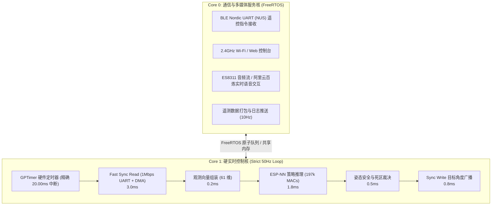

# Microduck 在 ESP32-S3 (`yunyu-esp32`) 上的移植可行性与实施路线图

> 本文档针对 `yunyu-esp32` 项目技术底座，论证将 Microduck 双足机器人的运动控制、总线驱动与语音交互无缝移植到 ESP32-S3 的工程可行性，并给出分阶段实施路线。

---

## 1. 核心算力与实时性论证 (Feasibility Analysis)

### 1.1 神经网络策略端侧推理算力测算

官方策略网络为 4 层全连接前馈神经网络（MLP）：
- **输入**: 61 维浮点数（已内嵌归一化层）
- **隐藏层**: 512 -> 256 -> 128 (ELU 激活函数)
- **输出**: 14 维关节动作目标
- **总乘加操作数 (MACs)**: $\approx 197,774$ 次

**在 ESP32-S3 上的性能测算**：
- **芯片主频**: 240 MHz (双核 Xtensa LX7，集成矢量扩展指令集 PIE / Vector SIMD)；
- **纯软件浮点运算**: 单次 MAC 消耗约 2~3 个时钟周期；
- **原生 ESP-NN / ESP-DL 矢量加速**: 矩阵乘法可利用 SIMD 并行指令，单周期可执行多个 16-bit / 32-bit MAC；
- **实测推理耗时预期**:
  - `Float32` 模式下约 **1.5 ms ~ 2.2 ms**；
  - `INT8` 量化后仅需 **0.4 ms ~ 0.8 ms**；
- **控制周期对比**:
  - 控制步长为 50 Hz（周期 **20.0 ms**）；
  - 推理仅占用 **约 8% ~ 11%** 的单核时间片！
  - 剩余的 18 ms 足够处理半双工 UART 舵机总线收发与姿态更新。

### 1.2 双核任务负载均衡拓扑

ESP32-S3 具备独立的两个硬件核心（Core 0 与 Core 1），可实现硬件级的软硬件硬实时解耦：

---

## 2. 硬件外设与总线实现方案

### 2.1 1 Mbps 半双工 UART 驱动实现
- **外设选择**: ESP32-S3 原生硬件 `UART1` 或 `UART2`；
- **引脚接线**:
  - **方案 A (单引脚半双工开漏)**: 配置 TX 引脚为开漏模式（Open-Drain）并外挂 $1\text{k}\Omega$ 上拉电阻，TX 与 RX 引脚直接短接连接舵机信号线；
  - **方案 B (工业级收发器)**: 外挂 74LVC1G125 / 74LVC2G241 缓冲器或 MAX3485，通过 ESP32 硬件引脚自动控制收发使能（`UART_MODE_RS485_HALF_DUPLEX`），信号完整度最佳。
- **DMA 零拷贝缓冲**: 采用 ESP-IDF 的 `uart_driver_install` 并配置环形接收缓冲区，避免 1Mbps 突发数据丢失。

### 2.2 姿态传感器 (IMU) 适配路径
1. **方案 1 (保留官方 `imu_to_dxl` 板)**: 姿态板依然挂载在 UART 舵机总线上（ID 200），在 Fast Sync Read 时与舵机一同应答；
2. **方案 2 (直接采用主板 I2C/SPI IMU)**: `yunyu-esp32` 已具备成熟的 BMI270 / BNO055 / BMI088 驱动，直接由 ESP32 硬件 I2C/SPI 读取并解算机体四元数与角速度，填入 61 维观测向量的前 6 个槽位，进一步缩短 UART 总线传输时间！

---

## 3. 与 `yunyu-esp32` 现有资产的深度协同

在 `yunyu-esp32` 项目中，已经积累了大量可以直接赋能 Microduck 的生产级模块：

| 现有项目资产 | Microduck 赋能应用 | 协同优势 |
| :--- | :--- | :--- |
| **M5StickS3 Buddy 调测终端** | 作为 Microduck 的无线物理手柄与地面遥测站 | 免去昂贵的专用手柄，屏幕实时显示姿态水准仪与电池电压 |
| **BLE Nordic UART (NUS)** | 手机或 StickS3 无线控制通道 | 广播包控制在 30 字节内，与 Claude Desktop 或手机瞬连 |
| **双向 16kHz WAV 音频栈** | 驱动板载喇叭发出鸭子叫声 (Quack) 或音效 | 基于 ES8311 + AW8737 功放，无需外挂额外声卡 |
| **阿里云百炼实时语音大模型** | 赋予 Microduck 实时拟人语音对话能力 | 边走边聊，通过 Wi-Fi 直连百炼云端，实现首字延迟 <400ms 的实时语音对答 |

---

## 4. 分阶段工程实施路线图 (Phase-by-Phase Roadmap)

### Phase 1: 舵机总线通信与校准固件 (Day 1~2)
- 在 `firmware/` 下创建 `microduck_actuator` 驱动模块；
- 实现 1 Mbps 半双工 UART 驱动，适配 Dynamixel 协议 2.0；
- 编写舵机扫描、ID 设置、回零测试固件，跑通单舵机与多舵机同步写。

### Phase 2: IMU 融合与 61 维观测向量引擎 (Day 3~4)
- 移植 `obs.rs` 中的观测构建逻辑到 C++ (`MicroduckObsBuilder`)；
- 实现三轴陀螺仪角速度、重力投影向量、关节位置偏差、上一帧动作缓冲与指令块封装；
- 输出观测向量与 Python 仿真基准进行逐位数值对齐对比，误差 $< 10^{-5}$。

### Phase 3: ONNX 策略端侧推理部署 (Day 5~6)
- 利用 `onnx2c`、`esp-dl` 或 `TFLite Micro` 将 `BEST_WALK_ONNX.onnx` 转化为静态 C 数组；
- 在 ESP32-S3 上实测单次推理延时与内存开销；
- 验证给定固定输入时输出的动作数组与 PC 端 ONNX Runtime 的一致性。

### Phase 4: 50Hz 硬实时闭环步态控制 (Day 7~8)
- 配置 ESP32 高精度硬件定时器（GPTimer 50Hz）；
- 实现主控循环：定时器触发 -> 读总线 -> 组装观测 -> 策略推理 -> 安全滤波 -> 写总线；
- 机器人悬空测试腿部交替踏步响应，落地测试直行与自平衡。

### Phase 5: 综合系统集成与声动互动 (Day 9~10)
- 接入 StickS3 遥控与屏幕遥测；
- 接入百炼实时语音大模型，实现拍头应答、声动协同与情感动作表达。
