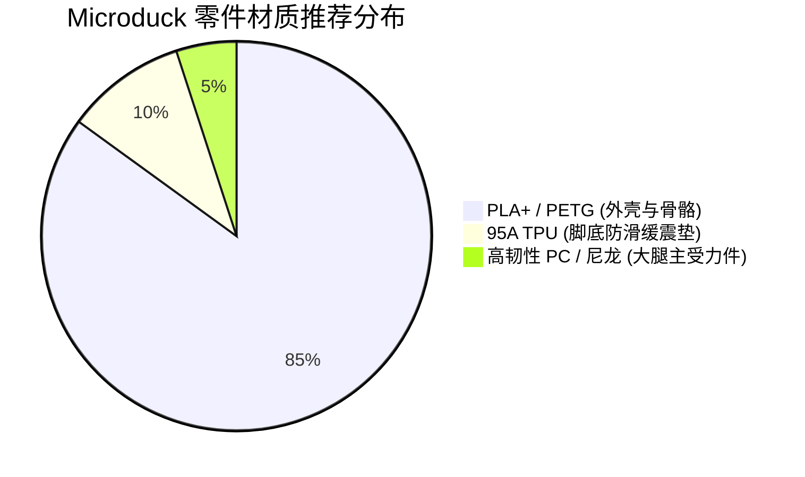
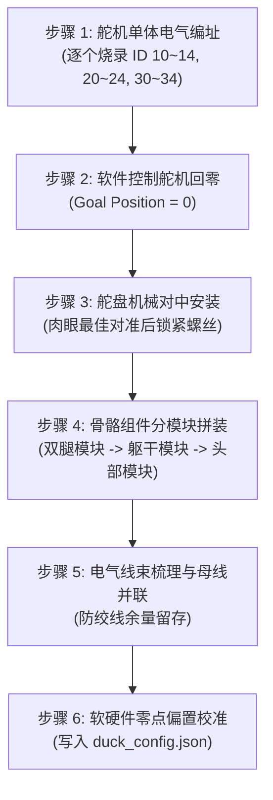

# Microduck 全量物料清单 (BOM)、3D 打印与装配复现指南

> 本文档整合自 `Open_Duck_Mini` 与官方硬件发布说明，整理出国内易采购的标准化物料清单与制造指南。

---

## 1. 硬件物料清单 (Bill of Materials)

整机硬件物料成本约在 **2000 ~ 2800 元人民币**（若采用 Feetech STS 舵机方案，可压缩至 1500 元以内）。

### 1.1 执行机构与动力核心 (Actuators & Power)

| 物料类别 | 推荐型号 | 数量 | 采购参考单价 | 作用与安装位置 |
| :--- | :--- | :---: | :---: | :--- |
| **智能总线舵机** | **Robotis Dynamixel XL330-M288-T** *(或 Feetech 飞特 STS3215 / STS3032)* | 15 个 | ~110~150 元/个 | 左右腿各 5 个，头部脖颈 4 个，嘴巴 1 个 |
| **动力锂电池** | **格氏 / 格式优等 2S 7.4V 1500~2200mAh** *(放电倍率 $\ge 25\text{C}$，带 XT30 插头)* | 1~2 块 | ~60~90 元/块 | 整机动力母线供电，充满 8.4V |
| **高压同步降压模块**| **Mini DC-DC 降压板 (输入 6~24V, 输出 5V 4A/5A)** | 1 块 | ~15 元 | 为主控逻辑电路与传感器提供稳定 5V 电源 |
| **电源开关** | **微型自锁按键开关 / 拨动开关 (额定电流 $\ge 5\text{A}$)** | 1 个 | ~5 元 | 动力母线总电源硬件切断 |

### 1.2 主控与传感器系统 (Compute & Sensors)

| 物料类别 | 推荐型号 | 数量 | 作用说明 |
| :--- | :--- | :---: | :--- |
| **嵌入式主控板** | **ESP32-S3 开发板** (推荐 `M5StickS3` 或自定义 PCBA) | 1 块 | 运行 50Hz 策略推理、总线控制与无线通信 |
| **姿态传感器 (IMU)** | **BMI270 / BNO055 / BMI088 六轴/九轴传感器** | 1 块 | 提供机体角速度与重力加速度投影向量 |
| **激光测距点阵 (可选)**| **VL53L5CX (8x8 区域 ToF 深度传感器)** | 1 块 | 头部视觉避障与地形落差感知 |
| **微型扬声器与功放** | **8Ω 1W 贴片腔体喇叭 + AW8737 / PAM8302** | 1 套 | 发出鸭子叫声 (Quack) 或语音对答应答 |
| **接地检测开关 (可选)**| **微动开关 / 轻触开关 (脚底触地探测)** | 2 个 | 左右脚底物理触地状态反馈 |

### 1.3 标准紧固件与机械轴承 (Fasteners & Bearings)

| 规格型号 | 数量 | 说明 |
| :--- | :---: | :--- |
| **M3 铜热熔滚花螺母 (M3×4×5)** | 50~60 颗 | 电烙铁压入 3D 打印件，用于承受机械螺纹紧固 |
| **M3 圆头内六角螺丝 (M3×6)** | 30 颗 | 脚掌、胸腔框架固定 |
| **M3 圆头内六角螺丝 (M3×10)** | 40 颗 | 舵机盘与骨骼连接件锁紧 |
| **M3 圆头内六角螺丝 (M3×14 / M3×16)** | 20 颗 | 髋关节与大腿骨贯穿固定 |
| **微型深沟球轴承 (6701ZZ, 12×18×4mm)** | 2 个 | 髋关节 roll 轴减摩主轴承 |
| **微型轴承 (MR105ZZ 或 MR126ZZ)** | 4~6 个 | 脖颈与膝盖辅助支撑轴承 |
| **螺纹紧固胶 (Loctite 243 蓝胶)** | 1 支 | **金属螺丝锁入舵机金属孔必须点胶**，防震脱 |

---

## 2. 3D 打印工艺与参数规范

所有打印模型位于 `Open_Duck_Mini/print/` 目录中。

### 2.1 打印参数配置表

| 零件类型 | 推荐线材 | 层高 | 填充率 (Infill) | 轮廓壁数 (Walls) | 注意事项 |
| :--- | :--- | :---: | :---: | :---: | :--- |
| **骨骼与受力件** (髋部、大腿、小腿) | **PLA+ / PETG / ABS** | 0.16~0.20 mm | 35% ~ 45% (Gyroid 螺旋) | $\ge 4$ 层壁 | 必须保证刚性，禁止使用普通脆性 PLA |
| **外壳与装饰件** (头部、面罩、背盖) | **PLA / PLA+ (多色)** | 0.20 mm | 15% ~ 20% | 3 层壁 | 可选用黄色、白橙色等鸭子专属配色 |
| **脚底防滑垫** (`foot_bottom_tpu`) | **TPU 95A (柔性线材)** | 0.20 mm | 20% (Concentric) | 3 层壁 | 提供地面抓地力，吸收触地冲击并减噪 |

---

## 3. 舵机标定与组装次序 (Assembly Workflow)

### 3.1 组装避坑要点指南

1. **绝对不要在未通电回零的情况下安装舵盘**：
   - 舵机出厂位置并不一定是机械零位；
   - 必须先通过代码（`configure_motor.py` 或 ESP32 标定程序）将舵机指令位置设为 `0`，让电机转到电气中心，然后再卡入舵盘并对准标记线。
2. **金属螺丝拧入舵机金属齿必须上蓝胶 (Loctite 243)**：
   - 双足机器人在行走震动时，无锁紧胶的螺丝会在 15 分钟内震松，导致齿轮打滑或骨骼脱落；
   - **注意**：塑料件螺丝切勿使用螺纹胶，否则化学腐蚀会导致塑料碎裂。
3. **线束活动余量与耐磨防护**：
   - 膝盖和大腿俯仰时关节活动范围近 90 度，总线线束必须预留 U 型弯曲余量，严禁紧绷拉扯插头。
