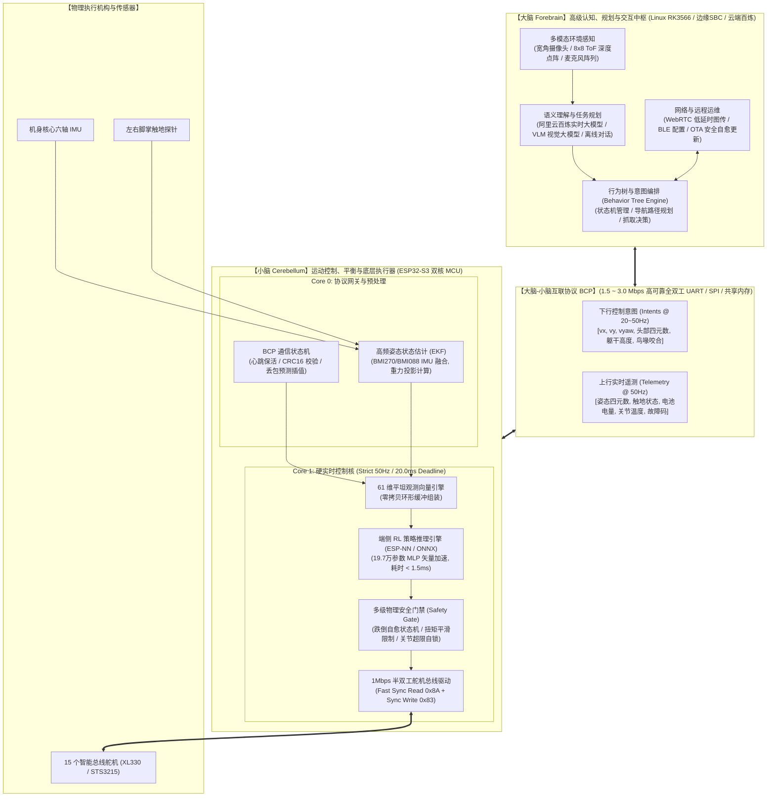
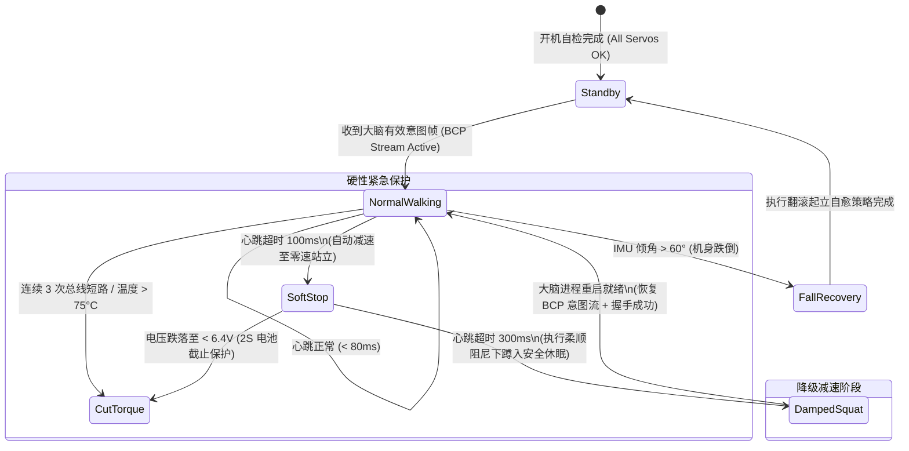

# Microduck 产品化“大脑与小脑”分层架构与控制协议规范

> **工程密级**: 核心产品工程规范 · **适用范围**: `yunyu-esp32` 嵌入式固件 / Microduck 生产级整机架构  
> **设计基准**: 工业级硬实时 (Hard Real-Time) 闭环、高内聚低耦合、单点失效自愈 (Fault-Tolerant)

---

## 1. 大脑与小脑的生理学映射与工程分工

在足式自平衡移动机器人的产品化落地中，将计算负载混杂在单一操作系统（如桌面 Linux）往往会导致致命的非确定性延时抖动（Jitter）。因此，Microduck 采用仿生学的**“大脑（Forebrain）+ 小脑（Cerebellum）”双层异构计算架构**：



### 1.1 职责边界裁决矩阵

| 维度 | 大脑 (Forebrain) | 小脑 (Cerebellum) |
| :--- | :--- | :--- |
| **主控芯片** | Rockchip RK3566 (四核 A55 @ 1.8GHz, NPU) / 移动端 / 云端 | ESP32-S3-PICO-1 (双核 240MHz, 8MB PSRAM, 矢量 SIMD) |
| **操作系统** | Buildroot Linux / Ubuntu Core (非抢占式高带宽) | FreeRTOS (硬实时抢占式内核，微秒级可控) |
| **控制带宽** | 5 Hz ~ 20 Hz (高层次决策) | **严格 50.0 Hz $\pm 0.05\%$ (硬实时闭环，20.0ms 周期)** |
| **关注核心** | 语义理解、避障寻路、声动协同、图传推流、OTA 升级 | 动平衡、足端接触、关节轨迹平滑、总线驱动、热保护 |
| **容灾级别** | 允许崩溃重拉（不影响机体直立与自锁平衡） | **零故障容忍**（崩溃将直接导致摔机，必须具备硬件看门狗） |
| **意图表达** | 输出运动目标向量（如 $v_x = 0.3\,\text{m/s}$，头转 $15^\circ$） | 严禁大脑直接给舵机灌写 PWM 或原始脉冲，由小脑解算关节增量 |

---

## 2. 大脑-小脑通信协议契约 (BCP: Brain-Cerebellum Protocol)

为了确保异构芯片间高频通信的鲁棒性，BCP 废除效率低下的纯 ASCII/NDJSON 串口传输，采用**定长二进制帧（Binary Packed Frame）+ CRC16-CCITT 校验 + 序列号滑窗机制**。

### 2.1 物理层配置
- **物理接口**: 全双工异步串口 (UART) 或 SPI从机模式；
- **波特率**: `1,500,000 Baud` (1.5 Mbps) 或 `3,000,000 Baud` (3.0 Mbps)；
- **位格式**: 8 数据位，1 停止位，无校验位 (8-N-1)；
- **硬件流控**: 可选 CTS/RTS，或采用微秒级固定中断响应。

### 2.2 帧格式定义 (Frame Specification)

```text
+--------+--------+--------+--------+--------+--------+---------...---------+--------+--------+--------+
| 0xAA   | 0x55   | MsgID  | SeqNum | PayLen | Status | Payload (N Bytes)   | CRC16_H| CRC16_L| 0x0D   |
+--------+--------+--------+--------+--------+--------+---------...---------+--------+--------+--------+
  Header   Header    1 Byte   1 Byte   1 Byte   1 Byte       0 ~ 128 Bytes       Checksum       Tail
```

- **帧头 (Preamble)**: `0xAA, 0x55` (2 字节固定同步字)；
- **消息类型 (MsgID)**:
  - `0x01`: 大脑 -> 小脑 运动控制意图帧 (Motion Intent Frame)
  - `0x02`: 小脑 -> 大脑 高频运动遥测帧 (Motion Telemetry Frame)
  - `0x03`: 双向心跳保活帧 (Heartbeat / Ping-Pong)
  - `0x04`: 舵机离线配置与零位校准帧 (Actuator Calibration Frame)
  - `0x05`: 紧急安全自锁/关断指令 (Emergency E-Stop)
- **帧序号 (SeqNum)**: `0x00 ~ 0xFF` 循环递增，用于丢包率统计与时延抖动估算；
- **状态字节 (Status)**: 小脑工作模式（`0=IDLE, 1=WALKING, 2=FALLEN, 3=RECOVERING, 4=CALIBRATING, 5=ESTOP`）；
- **校验和 (CRC16)**: 采用 `CRC16-CCITT` (多项式 `0x1021`, 初始值 `0xFFFF`)。

### 2.3 核心下行数据载荷：运动控制意图帧 (MsgID = 0x01)

下行指令总长度共 **32 字节**，完全覆盖 61 维观测向量所需的全部指令槽位：

```c
typedef struct __attribute__((packed)) {
    // 平移与旋转速度意图 (m/s, rad/s)
    float cmd_vx;           // 前进/后退线速度 (-0.5 ~ +0.5 m/s)
    float cmd_vy;           // 横向平移线速度 (-0.3 ~ +0.3 m/s)
    float cmd_vyaw;         // 偏航角速度 (-1.5 ~ +1.5 rad/s)
    
    // 头部与脖颈目标姿态 (相对中立位的目标弧度 rad)
    float head_neck_pitch;  // 脖颈整体俯仰
    float head_pitch;       // 头部独立俯仰
    float head_yaw;         // 头部偏航 (左右摇头)
    float head_roll;        // 头部滚转 (歪头卖萌)
    
    // 躯干高级姿态微调
    int8_t body_height_offset_mm; // 躯干高度相对标称站立偏差 (-30 ~ +30 mm)
    int8_t body_roll_offset_deg;  // 躯干侧倾调节 (-15 ~ +15 deg)
    int8_t body_pitch_offset_deg; // 躯干俯仰调节 (-15 ~ +15 deg)
    
    // 辅助动作与表情
    uint8_t mouth_open_pct;       // 鸟喙张开百分比 (0~100, 0=闭合, 100=张角30度)
    uint8_t locomotion_mode;      // 步态模式: 0=自适应步态, 1=原地踏步, 2=滚轮轮滑模式, 3=深蹲
    uint8_t flags;                // 特殊标志位: bit0=使能阻尼跌倒自愈, bit1=允许跳跃
    uint8_t reserved[2];          // 预留对齐字节
} BcpMotionIntentPayload_t;
```

### 2.4 核心上行数据载荷：高频运动遥测帧 (MsgID = 0x02)

小脑以 50Hz 持续上报当前动力学状态，供大脑执行 SLAM 航位推算与视觉伺服对齐：

```c
typedef struct __attribute__((packed)) {
    // 机体姿态四元数 (由底层 EKF / Mahony 滤波高频输出, 标称范围 [-1.0, 1.0])
    int16_t quat_w;         // Q15 格式 (数值 x 32767)
    int16_t quat_x;
    int16_t quat_y;
    int16_t quat_z;
    
    // 三轴角速度 (rad/s x 100)
    int16_t gyro_x;
    int16_t gyro_y;
    int16_t gyro_z;
    
    // 动力学状态与足端接触
    uint8_t foot_contacts;  // bit0: 左脚触地, bit1: 右脚触地
    uint8_t system_state;   // 当前运行状态与健康代码
    uint16_t battery_mv;    // 动力锂电池电压 (mV)
    
    // 机械与热负荷
    uint8_t max_motor_temp_c; // 15 个舵机中的最高温度 (°C)
    uint8_t max_motor_id;     // 负载最重/最热舵机 ID
    uint16_t total_current_ma;// 母线总电流消耗 (mA)
} BcpTelemetryPayload_t;
```

---

## 3. 产品级通讯故障容灾与降级机制 (Fail-Safe Matrix)

在恶劣运行环境（如电池强电瞬态干扰、上位机 Linux 进程卡顿、系统 OTA 重启）下，小脑必须具备**自持防御能力**：



### 3.1 降级防御时间梯次 (Defensive Time Ladder)
1. **$t \le 20\,\text{ms}$ (正常运行)**: 小脑接收意图，组装 61 维向量，执行策略推理并下发目标；
2. **$20\,\text{ms} < t \le 100\,\text{ms}$ (单帧偶发丢包)**:
   - 小脑采用**一阶惯性外推器（Dead Reckoning Filter）**保持上一帧速度衰减指令：
     $$\mathbf{v}_{\text{cmd}}(k) = 0.92 \times \mathbf{v}_{\text{cmd}}(k-1)$$
   - 步态不发生顿挫，维持机器人行走平滑度；
3. **$100\,\text{ms} < t \le 300\,\text{ms}$ (大脑通信中断预警)**:
   - 强制将移动线速度与偏航速度清零（$v_x=0, v_y=0, \omega_z=0$）；
   - 切换为静态平地双足自平衡控制（Standstill Balance Policy）；
4. **$t > 300\,\text{ms}$ (通信彻底断开 / 大脑崩溃)**:
   - 启动**平滑阻尼降落规程**：两腿逐渐降低高度（500ms 内缓慢下蹲，收回重心）；
   - 舵机切换至低刚度柔顺力矩保持模式，防止硬性断电直接砸地磕损外壳或减速箱齿轮。

---

## 4. 小脑控制环路实时调度基准 (FreeRTOS Implementation)

在 ESP32-S3 上，严格遵循以下优先级抢占分配规则：

| 任务名称 (Task Name) | 绑定核心 | 优先级 | 周期 / 触发方式 | 最大执行时间 | 职责说明 |
| :--- | :---: | :---: | :---: | :---: | :--- |
| `Timer_50Hz_ISR` | Core 1 | 硬件级 | 严格 20.0ms (GPTimer) | $< 5\,\mu\text{s}$ | 释放二值信号量，唤醒主控制任务 |
| `task_locomotion_loop` | Core 1 | **Priority 24 (最高)** | 信号量驱动 | **6.5 ms** | 读总线 -> 组装观测 -> 策略推理 -> 保护滤波 -> 写总线 |
| `task_bcp_rx_dispatch` | Core 0 | Priority 20 | UART DMA 中断驱动 | $< 0.8\,\text{ms}$ | 接收大脑意图帧，校验 CRC 并更新共享内存 |
| `task_bcp_tx_telemetry`| Core 0 | Priority 15 | 周期 20ms (50Hz) | $< 0.5\,\text{ms}$ | 打包当前四元数与传感器，DMA 异步推回大脑 |
| `task_system_monitor` | Core 0 | Priority 5 | 周期 500ms (2Hz) | $< 1.0\,\text{ms}$ | 电池电量、舵机温度巡查、喂看门狗 |

> [!TIP]
> **Core 1 绝对硬实时保护原则**：Core 1 上严禁挂载任何阻塞性网络 I/O（如 Wi-Fi、BLE 广播扫描、文件写入、格式化串口打印）。所有与外界的通信全部由 Core 0 接管，确保 Core 1 的 20ms 控制周期抖动（Jitter）严控在 $\pm 50\,\mu\text{s}$ 以内。
