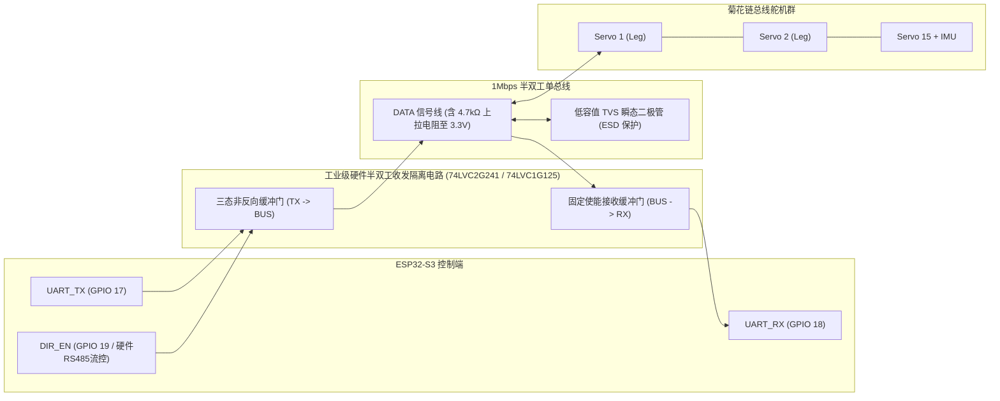
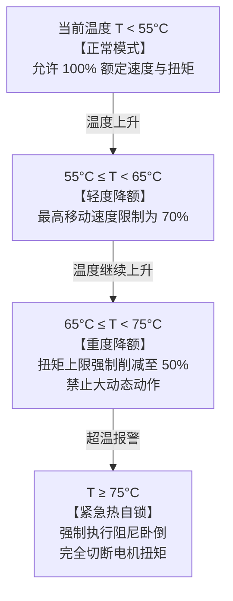

# Microduck 工业级舵机驱动、总线时序与热电保护工程规范

> **工程密级**: 核心产品工程规范 · **适用范围**: 执行机构底层驱动、PCBA 接口设计、产线标定  
> **核心目标**: 消除 1Mbps 舵机串行总线通信丢包、杜绝热过载烧机、提升机械关节轨迹重现精度

---

## 1. 舵机总线物理层架构与信号完整性

Microduck 躯体集成 15 个串行总线智能舵机与 1 个 IMU 板。在 1,000,000 Baud (1 Mbps) 高速率下，单总线菊花链（Daisy-Chain）布线极易遭遇信号反射、电平畸变与瞬态地弹干扰。

### 1.1 物理层收发器电路对比与推荐拓扑



#### 收发器方案评估矩阵：
1. **方案 A: 简易单引脚开漏模式 (Open-Drain + 外部上拉电阻)**
   - *劣势*: 高速 1Mbps 下，由电阻上拉导致的 RC 上升沿时间过长（$t_r > 300\,\text{ns}$），极易发生数据高位判定误码，且抗电磁干扰极弱；
   - *判定*: 仅推荐用于实验室打样，**严禁用于量产产品**。
2. **方案 B: 专用三态逻辑缓冲芯片 (74LVC1G125 / 74LVC2G241)** —— **【量产推荐】**
   - *优势*: 真正的推挽输出（Push-Pull），上升与下降沿 $< 5\,\text{ns}$；
   - 配合 ESP32 硬件原生的 `UART_MODE_RS485_HALF_DUPLEX`，发送时硬件自动拉高使能，发完最后一字节 Stop 位后经 $1\,\mu\text{s}$ 自动切回高阻态释放总线，彻底消除了软件控制延时导致的总线竞争碰撞。

---

## 2. 协议状态机与微秒级通信时序分解

系统支持 **Robotis Dynamixel Protocol 2.0** 与 **Feetech STS 系列** 双协议栈。以下以官方量产采用的 Dynamixel 2.0 为基准进行微秒级时序核算：

### 2.1 20ms 控制周期内的总线时序分解图

```text
时间切片 (50Hz 控制周期 = 20,000 µs):
0 µs      350 µs                                3,500 µs       5,500 µs     6,350 µs                 20,000 µs
├─────────┼────────────────────────────────────────┼──────────────┼────────────┼─────────────────────────┤
│ 下发指令 │  16 个设备串行连续应答                   │ 观测组装与   │ 广播写入   │ 空闲裕量与低优先级任务   │
│ FastSync│  (IMU + 15个舵机, 包含四元数与关节位置)   │ RL策略推理   │ Sync Write │ (Wi-Fi/BLE/日志/温控)    │
│ 0x8A    │                                        │ (ESP-NN)     │ 0x83       │                         │
├─────────┼────────────────────────────────────────┼──────────────┼────────────┼─────────────────────────┤
  350 µs                  3,150 µs                     2,000 µs       850 µs               13,650 µs
  [发送]                   [接收]                       [计算]         [下发]         [安全裕量 = 68.2%]
```

1. **下发快速同步读指令 (`Fast Sync Read`, 0x8A)**:
   - 包含指令包头、读取起始地址 124、长度 12 字节、16 个设备 ID 列表；
   - 指令包总长：$10 + 16 = 26\,\text{Bytes}$；
   - 1 Mbps 下线缆传输耗时：$26 \times 10\,\mu\text{s} = \mathbf{260\,\mu\text{s}}$（计入系统裕量约 $350\,\mu\text{s}$）。
2. **16 个设备高速连续应答**:
   - 每一个设备回传 $12\,\text{Bytes}$ 数据（`present_pwm`, `present_current`, `present_velocity`, `present_position`）；
   - 设备出厂已通过固件将 `return_delay_time` 设为 `0`；
   - 单设备应答帧长：包头 7 字节 + 数据 12 字节 + CRC 2 字节 = $21\,\text{Bytes} \approx 210\,\mu\text{s}$；
   - 16 个设备依次应答总耗时：$16 \times 210\,\mu\text{s} \approx \mathbf{3,360\,\mu\text{s}}$（约 **3.4 ms**）。
3. **下发同步写指令 (`Sync Write`, 0x83)**:
   - 一次性向 15 个关节下发新的目标位置 `goal_position`（每个舵机 4 字节）；
   - 指令包长：$10 + 15 \times (1 + 4) = 85\,\text{Bytes} \approx \mathbf{850\,\mu\text{s}}$；
   - 广播下发，**无需舵机应答**。

---

## 3. 工业级异常容错与总线自愈机制

### 3.1 丢包与 CRC 校验失败滤波 (Packet Error Handling)

1. **单帧丢包 (Packet Loss $\le 1$ 帧 / 20ms)**:
   - 若某单个舵机因电磁干扰导致 CRC 校验失败，**严禁在该 Tick 内重发**（重发会挤占后续推理时序）；
   - **一阶运动学外推补偿**:
     $$P_{\text{est}}(t) = P(t-1) + V(t-1) \times \Delta t$$
     直接使用上一控制周期的角速度对当前位置进行一阶线性外推，充当 61 维观测向量的输入；
2. **连续丢包 ($\ge 3$ 帧 / 60ms)**:
   - 触发总线硬件重置（Bus Power-Cycle / 重新发起 Ping 探活）；
   - 若特定舵机持续失联，小脑立即终止行走策略，锁定其余关节，进入“阻尼跪地”防摔保护。

### 3.2 堵转保护与过流阶梯抑制 (Stall Current Protection)

Microduck 在站立起跳或绊倒时，足端舵机可能发生机械卡死：
- **实时电流采样**: 每次 Fast Sync Read 实时获取舵机的 `present_current`；
- **堵转判定条件**:
  $$|I_{\text{motor}}| \ge 1.4\,\text{A} \quad \text{且} \quad |V_{\text{motor}}| \le 0.05\,\text{rad/s} \quad \text{持续时间 } t \ge 400\,\text{ms}$$
- **保护动作**:
  - 立即向该舵机下发 `Torque Limit = 30%`，将其输出力矩强制降额，避免电机线圈过热烧毁与驱动 H 桥击穿；
  - 同时通过 BCP 向上位机上报 `ERROR_MOTOR_STALL` 报警。

### 3.3 温度热保护阶梯降额曲线 (Thermal Throttling)

在连续行走或高温环境下，15 个舵机发热差异显著（髋关节与膝关节最热）：



---

## 4. 关节机械零位标定与齿隙消除 (Calibration & Backlash)

### 4.1 机械零位软件 Offset 标定算法
由于舵机舵盘齿轮花键（Spline）齿数的物理离散限制，安装时肉眼只能做到 $\pm 3^\circ$ 的粗对准。

必须在产线或初次组装时执行软件校准：
1. **夹具归零**: 机器人置于标准化机械外骨骼标定夹具（Calibration Jig）中，强行固定在理论 Home Pose；
2. **读取原始绝对编码值**: 遍历读取 15 个舵机当前在夹具下的原始物理读数 $P_{\text{raw}, i}$；
3. **计算校准偏置**:
   $$\text{Offset}_i = P_{\text{raw}, i} - P_{\text{theoretical\_home}, i}$$
4. **固化存储**: 将 15 个 `Offset` 浮点数存入 ESP32 的 NVS (Non-Volatile Storage) 或主板 `duck_config.json` 中；
5. **开机加载**: 底层驱动每次读写舵机位置时，自动在应用层透明完成偏置补偿：
   $$P_{\text{norm}} = P_{\text{raw}} - \text{Offset}$$

### 4.2 齿轮箱反向齿隙 (Gear Backlash) 补偿
塑胶与金属粉末冶金减速齿轮普遍存在 $0.5^\circ \sim 1.2^\circ$ 的齿隙（Backlash），当舵机由正转切换为反转时会出现传动空程，导致足端晃动。

**BAM 动力学前馈补偿公式**：
当速度反向（$\text{sgn}(\dot{\theta}_k) \neq \text{sgn}(\dot{\theta}_{k-1})$）时，给目标角增添前馈死区脉冲：
$$\theta_{\text{target}}^* = \theta_{\text{target}} + \frac{1}{2} \delta_{\text{backlash}} \cdot \text{sgn}(\dot{\theta}_k)$$
其中 $\delta_{\text{backlash}}$ 为关节通过离线动力学辨识出的齿隙物理角度，有效消除反向震荡。
