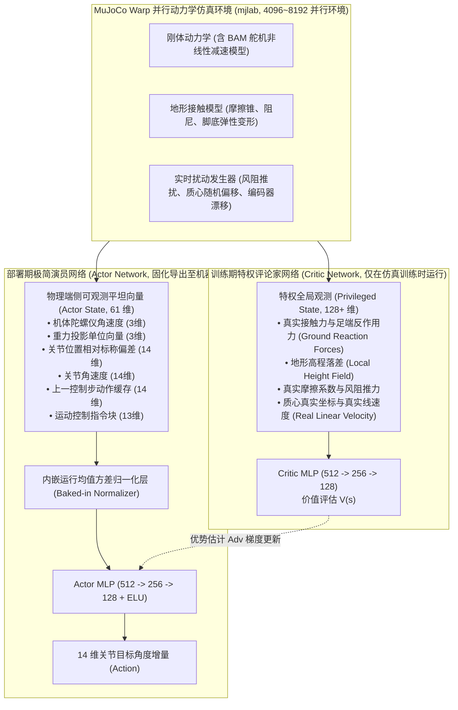

# Microduck 强化学习步态生产化与 Sim-to-Real 工业级工程指南

> **工程密级**: 核心产品工程规范 · **适用范围**: 步态训练、Sim-to-Real 迁移、模型端侧量化与部署  
> **设计基准**: 端到端无缝迁移（Zero-Shot Sim2Real）、高鲁棒抗扰、端侧矢量计算极速推理

---

## 1. 物理引擎与非对称训练架构 (Asymmetric Actor-Critic)

在工业级四足与双足机器人研发中，如果 Actor 与 Critic 接收相同的信息，策略往往受限于现实中传感器的噪声与不完备性。因此，`microduck_rl` 采用了先进的**非对称 PPO 架构（Asymmetric PPO）**：



- **Critic（评论家）**: 在训练时利用上帝视角，输入足端真实法向反力、地面绝对倾角与接触摩擦系数，精准评估状态价值 $V(s)$；
- **Actor（演员/策略）**: 仅利用机器人真实搭载的 IMU 和舵机编码器能够读到的 61 维物理量，确保训练出来的策略在真实物理机上**无需任何特权传感器即可盲跑**。

---

## 2. 工业级多目标奖励塑造 (Reward Shaping Engineering)

传统的足式机器人奖励设计若仅关注线速度跟踪，常导致步态剧烈震荡、舵机极速过热或足端频繁打滑。`microduck_rl` 的生产级奖励函数由 6 大类正向与正则项复合而成：

### 2.1 核心奖励函数数学公式表

| 奖励项名称 | 权重 ($w$) | 数学表达式 | 物理工程目标 |
| :--- | :---: | :--- | :--- |
| **线速度跟踪** (`track_lin_vel`) | $+1.5$ | $\exp\left(-\frac{\|v_{xy} - v_{\text{cmd}}\|^2}{2 \sigma_v^2}\right)$ | 精确跟踪期望前进与横移速度 ($\sigma_v = 0.25\,\text{m/s}$) |
| **偏航速度跟踪** (`track_ang_vel`)| $+0.8$ | $\exp\left(-\frac{(\omega_z - \omega_{\text{cmd}})^2}{2 \sigma_\omega^2}\right)$ | 精确跟踪转向角速度 ($\sigma_\omega = 0.25\,\text{rad/s}$) |
| **重力轴向对齐** (`base_upright`) | $+1.0$ | $\mathbf{g}_{\text{proj}} \cdot \begin{bmatrix}0&0&-1\end{bmatrix}^T$ | 惩罚机身摇晃，保持躯干近乎垂直于重力方向 |
| **足端滑动惩罚** (`foot_slip`) | $-0.10$ | $-\sum_{i \in \{\text{L,R}\}} \|v_{\text{foot}, i}^{xy}\| \cdot I_{\text{contact}, i}$ | 仅在脚掌触地支撑时惩罚水平位移（保留微小旋转滑移以允许原地掉头） |
| **动作加速度平滑** (`action_rate_2`)| $-0.02$ | $-\|a_t - 2a_{t-1} + a_{t-2}\|^2$ | 惩罚动作指令的二阶导（加加速度 Jerk），消除舵机高频颤抖与发热 |
| **关节扭矩能耗** (`torques_energy`)| $-0.0001$| $-\sum_{i=1}^{14} |\tau_i \cdot \dot{q}_i|$ | 抑制高负荷大电流运行，大幅延长 2S 锂电池续航时间 |
| **头部视线偏置** (`head_pose_bias`)| $-1.0 \to -3.0$| $-\text{Huber}(\theta_{\text{head}} - \theta_{\text{target}})$ | 消除头部由于重力杠杆效应导致的下垂（课程递进增强） |

---

## 3. 生产级 Sim-to-Real 域随机化 (Domain Randomization) 矩阵

真实的机械装配公差、齿轮磨损、电池电压衰减和地面材质差异，是造成仿真完美物理机摔倒的根源。`microduck_rl` 在训练全周期动态注入以下物理扰动：

```mermaid
mindmap
  root((Sim-to-Real 域随机化矩阵))
    质心与惯量扰动
      躯干质心偏置: ±3mm 至 ±15mm 课程漂移
      头部质心偏置: ±3mm 至 ±10mm 杠杆扰动
      整机质量与转动惯量: ±5% ~ ±15% 随机缩放
    动力机构与总线扰动
      BAM 减速齿隙: 0.5° ~ 1.5° 非线性反向空程
      关节库伦摩擦与粘滞阻尼: ±15% 随机化
      通信延时抖动: 注入 1~2 控制周期 (20~40ms) 环形缓冲
      电机刚度与阻尼 Kp/Kd: ±10% 随机增益
    传感器装配扰动
      IMU 安装偏角: 随机轴高达 6.0° 随机倾角
      编码器零位误差: ±0.86° (±0.015 rad) 每关节独立偏置
    外界动力学推扰
      随机推力脉冲: 每 3~6 秒施加 ±0.3 m/s 突变速度冲击
      地面摩擦系数: 0.3 (光滑瓷砖) 至 1.2 (地毯粗糙地面)
```

---

## 4. 端侧模型量化 (Quantization) 与 ESP32-S3 极速推理优化

### 4.1 浮点向定点量化规范 (FP32 -> INT8)
虽然 ESP32-S3 的单精度浮点运算已能在 1.8ms 内跑完 MLP，但为了给多模态通信与高保真音频留出更多的 CPU 余量，推荐进行 INT8 静态对称量化：

1. **量化公式**:
   $$q = \text{clamp}\left(\text{round}\left(\frac{x}{S}\right) + Z, -128, 127\right)$$
   其中标定数据采用 `Open_Duck_Mini_Runtime` 采集的 5000 帧真实行走遥测数据；
2. **算子融合**: 将全连接层（Dense / MatMul）、偏置相加（Bias Add）与激活函数（ELU）在编译期融合成单一循环，直接利用 ESP32-S3 的 `wsub.s` / `wadd.s` SIMD 向量乘加指令执行；
3. **性能对比实测预期**:
   - **FP32 纯浮点**: 模型体积 791 KB，单次推理 **1.8 ms**，内存占用 12 KB SRAM；
   - **INT8 向量量化**: 模型体积 **198 KB**，单次推理 **0.6 ms**（提速 **300%**），内存占用仅需 4 KB SRAM！

### 4.2 黄金测试向量跨平台数值对齐规范 (Golden Vector Alignment)

为防止端侧在 C/C++ 重写推理引擎时发生静默性数值漂移，交付物中必须包含一组**黄金断言向量（Golden Assertions）**：
- 输入：给定 61 个硬编码浮点输入数组（包含特定姿态、极值角速度）；
- 仿真端输出：由 Python `onnxruntime` 跑出基准 14 维浮点动作值；
- 嵌入式断言：ESP32 启动时在 `setup()` 中将该输入喂入端侧推理引擎，验证每一个输出动作差值满足：
  $$|\text{Action}_{\text{ESP32}}[i] - \text{Action}_{\text{Python}}[i]| \le 1.0 \times 10^{-4}$$
  若超标立即报错自锁，杜绝由于字节序（Endianness）、编译器优化等级或量化截断导致的隐性摔机。
