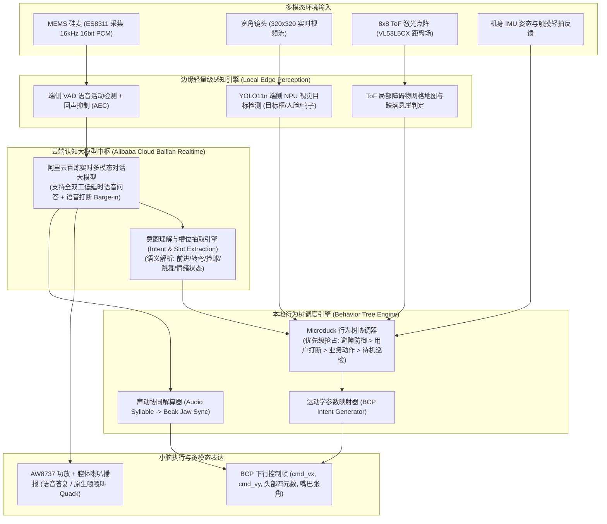
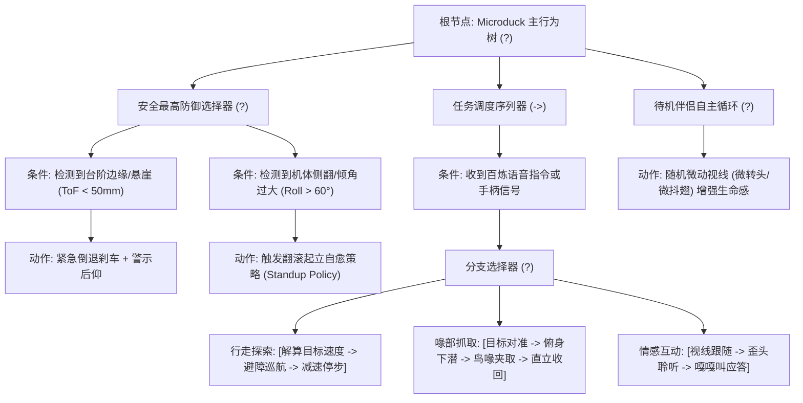

# Microduck 认知规划、多模态语义理解与声动协同交互规范

> **工程密级**: 核心产品工程规范 · **适用范围**: 上位机交互引擎、阿里云百炼大模型联动、行为树调度  
> **核心目标**: 实现拟人化双向实时语音对话、意图到动作的高效分发、声动一体的情感表达与视觉追踪

---

## 1. 认知感知与交互全景流水线 (Cognitive Pipeline)

Microduck 不仅仅是一台机械行走机器，更是一台具备情绪感染力与情境理解能力的智能伴侣。其高级智能由**“云端多模态大模型（大脑）+ 本地行为树编排引擎 + 边缘视觉/深度感知”**三位一体驱动：



---

## 2. 行为树规划架构 (Behavior Tree Hierarchy)

在产品化机器人中，直接用大模型连续控制运动关节会因为网络不可靠与非确定性带来致命安全隐患。因此，大模型仅下发**高层宏语义任务（Macro Intent）**，由**本地轻量级行为树（Behavior Tree）**负责执行的安全性、前置条件校验与中断打断：



### 2.1 原子动作库与运动学参数映射表

| 动作节点 (Action Node) | 触发语义示例 | BCP 控制参数映射 | 持续时间 / 退出条件 |
| :--- | :--- | :--- | :--- |
| `Action_Walk` | "向前走几步" / "过来" | $v_x = 0.25\,\text{m/s}, v_y = 0.0, \omega_z = 0.0$ | 到达目标距离或超时 5s |
| `Action_Spin` | "转个圈" / "向左看" | $v_x = 0.0, \omega_z = \pm 0.8\,\text{rad/s}$ | 完成 $360^\circ$ 转向 |
| `Action_SitDown`| "坐下休息" / "蹲下" | $\text{body\_height\_offset} = -25\,\text{mm}$ | 维持蹲姿直至新指令 |
| `Action_GroundPick`| "把地上的球叼起来" | 调用 `alpha_ground_pick.onnx` 专用抓取网络 | 鸟喙触碰地面闭合后恢复 |
| `Action_BallKick` | "踢球" | 调用 `alpha_ball_kick.onnx` 动态单腿挥踢网络 | 踢球动作完成并恢复平衡 |
| `Action_BeakSync` | 伴随语音输出实时张合 | $\theta_{\text{mouth}} = \text{Envelope}(A_{\text{audio}}) \times 30^\circ$ | 音频播放完毕闭合 |

---

## 3. 声动协同与视线注视追踪 (Gaze & Audio Synchronization)

### 3.1 语音包络与鸟喙开合联运 (Lip-Sync / Beak-Sync)
为了赋予 Microduck 真实的说话生命感，机载音频流播放与鸟喙舵机（ID 34）必须保持毫秒级步调一致：
1. **音频振幅包络提取**: 在音频解码播放缓冲区中，计算每 20ms 音频帧的短时能量均方根（RMS）：
   $$\text{RMS} = \sqrt{\frac{1}{N} \sum_{n=1}^N x^2[n]}$$
2. **非线性动态映射**: 将 RMS 映射到鸟喙张开角度（$0^\circ \sim 30^\circ$）：
   $$\theta_{\text{mouth}} = \text{clamp}\left(K_{\text{gain}} \cdot \log_{10}(1 + \alpha \cdot \text{RMS}), 0.0, 1.0\right) \times 30.0^\circ$$
3. **下发控制**: 将该角度随每一个 20ms BCP 意图帧同步写入小脑，彻底避免“音停嘴还在动”或“嘴不动有声音”的割裂感。

### 3.2 动态视线注视注视算法 (Gaze Target Tracker)
当机器人一边行走一边与用户交谈时，机身因双足交替迈步会有俯仰与侧向颠簸。为了保持摄像头与视线稳定锁定用户面部或目标：
- 视觉算法输出目标在相机坐标系下的归一化偏移量 $(e_x, e_y) \in [-1.0, 1.0]$；
- 头部姿态解算器结合机身当前 IMU 四元数进行**前馈姿态解耦补偿**：
  $$\theta_{\text{head\_yaw}} = K_p \cdot e_x - \text{Yaw}_{\text{trunk}}$$
  $$\theta_{\text{head\_pitch}} = K_p \cdot e_y - \text{Pitch}_{\text{trunk}}$$
- 确保在腿部激烈的步行摆动中，头部如鸡头/鸭头般具备强大的**机械光学稳像效果**。

---

## 4. 8x8 ToF 深度防跌落与避障算法

头顶集成的 VL53L5CX 8x8 多区域激光测距传感器，提供 $64$ 个深度距离像素：

```text
ToF 8x8 区域栅格划分:
[0,0] ... [0,7]  <- 上部视野 (远处障碍物探测: 0.5m ~ 3.0m)
 ...       ...
[7,0] ... [7,7]  <- 下部视野 (地面落差与台阶悬崖探测: 0.1m ~ 0.4m)
```

1. **下部悬崖检测 (Cliff Drop Detection)**:
   - 正常平地行走时，底部第 6~7 行区域返回的对地距离为固定斜角距离（约 $150 \sim 220\,\text{mm}$）；
   - 若某列连续 2 个以上点返回距离突增至 $> 450\,\text{mm}$ 或测量溢出（Out-of-Range），判定为台阶边缘或桌边；
   - 行为树立即切入最高优先级的 `ActEmergencyBrake` 紧急刹车倒退；
2. **虚拟势场局部避障 (Virtual Potential Field)**:
   - 将上部 6 列有效测距点转化为排斥力矢量 $\mathbf{F}_{\text{rep}}$；
   - 与用户下发的期望前进速度 $\mathbf{v}_{\text{cmd}}$ 进行矢量叠加，产生自适应绕障偏航角速度 $\Delta \omega_z$，实现优雅丝滑的绕障移动。
