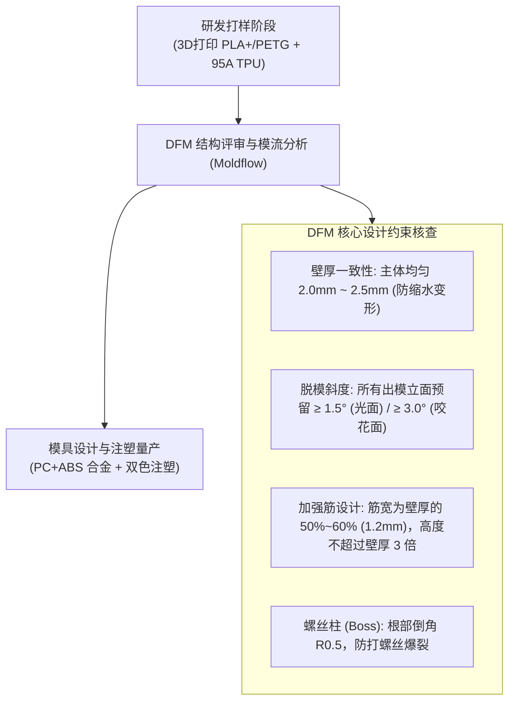
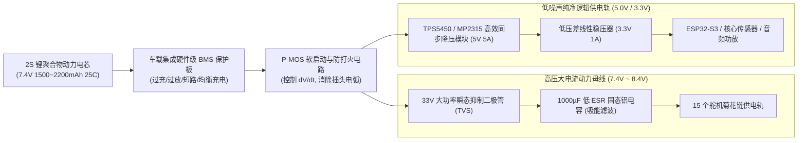
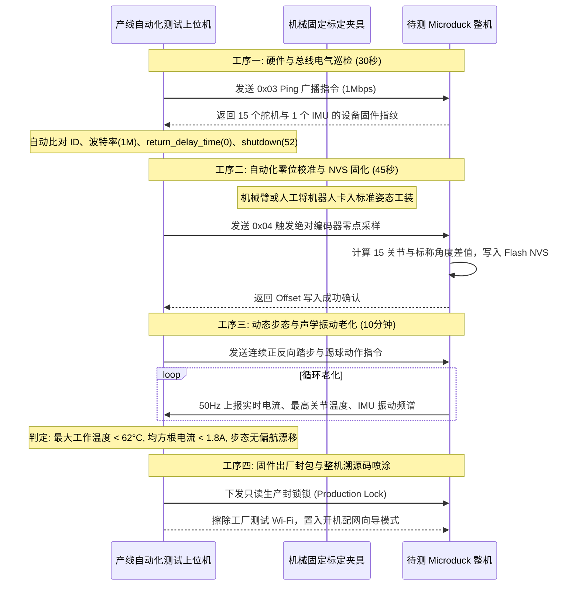

# Microduck 产品化可制造性 (DFM)、电源管理与量产测试标准

> **工程密级**: 核心产品工程规范 · **适用范围**: 结构开模评估、硬件供电安全、自动化量产产线测试 (EOL)  
> **核心目标**: 消除量产批次一致性隐患、确保动力锂电与高压大电流安全、构建严苛出厂质检流水线

---

## 1. 结构可制造性 (DFM) 与注塑量产迁移评估

在产品从 3D 打印试制向注塑模具量产过渡的过程中，必须遵循严格的注塑 DFM 原则：

### 1.1 关键受力零部件材料选型矩阵

| 部件类别 | 试产打样材质 (小批量) | 量产注塑推荐材质 (规模化) | 机械与物理考量 |
| :--- | :--- | :--- | :--- |
| **主承重骨骼** (髋部、大腿、小腿) | **PLA+ (高韧性) / PETG** | **PC+ABS (拜耳/沙伯基础)** 或 **PA66 + 15% 玻纤增强** | 承受足端高频落地冲击脉冲，具备高抗弯刚度与耐疲劳抗蠕变特性 |
| **外观壳体与面罩** (头部外壳、背部电池盖) | **PLA 多色耗材** | **ABS 757 (高光/哑光手感)** | 质轻、着色鲜艳度高、容易超声波焊接或卡扣安装 |
| **脚掌吸震接地底垫** (`foot_bottom`) | **95A TPU (柔性打印)** | **硅胶 (Silicone 50度) / TPE** 采用双色包胶注塑 (Overmolding) | 动态阻尼减震、高摩擦系数防滑，吸收落地震动保护舵机减速齿轮 |

---

## 2. 动力电源管理系统 (BMS) 与电气抗扰设计

Microduck 动力总线由 2S 动力锂电池直接供电（标称 7.4V，满电 8.4V，放电截止 6.0V）。15 个舵机同时大动态起动时，**瞬态冲击电流可突破 8.0A**，极易导致主控逻辑供电塌陷复位。

### 2.1 工业级电源拓扑架构

### 2.2 核心电气安全防护设计规范
1. **防电弧与软启动 (Anti-Spark & Soft-Start)**:
   - 传统大容量电容接通瞬间充入电流达数十安培，插头瞬间氧化打火；
   - 采用大功率 P-MOSFET 配合 RC 栅极积分缓充电路，将动力上电爬升时间控制在 **$15\,\text{ms} \sim 25\,\text{ms}$**，彻底消除打火隐患。
2. **反电动势能量钳位 (Back-EMF Snubber)**:
   - 机器人在摔倒或受外力强行迫退时，15 个电机会反向充当发电机，向母线倒灌高压尖峰脉冲（峰值可达 $16\,\text{V} \sim 20\,\text{V}$）；
   - 在电池输入端并联 **SMBJ12A 瞬态抑制二极管 (TVS)** 与 **$1000\,\mu\text{F}$ 固态铝电解电容**，吸收泵升电压，保护 5V 降压芯片免遭过压击穿。
3. **电芯欠压硬切断 (Brownout Latch)**:
   - 当单串电芯电压低于 $3.0\,\text{V}$（总电压 $< 6.0\,\text{V}$）时，BMS 硬件比较器在 $100\,\text{ms}$ 内切断输出，防止锂电过放膨胀损坏。

---

## 3. 产线自动化测试规范 (End-of-Line HIL Testing)

为保障批量生产出来的每一个 Microduck 具备完全一致的零位和步态，必须在装配车间执行 4 道标准化测试工序：

### 3.1 出厂合格判定技术指标 (Go/No-Go Criteria)

| 检测项目 | 标准合格阈值 | 超标处置规则 |
| :--- | :--- | :--- |
| **总线丢包率 (PER)** | 连续 10,000 帧通信，丢包数 $\le 1$ 帧 ($< 0.01\%$) | 更换线束或收发器芯片 |
| **零位静态偏置** | 15 个关节绝对编码偏置 $|\text{Offset}| \le 4.5^\circ$ | 重新调整舵盘花键对中安装 |
| **静态待机功耗** | 逻辑供电电流 $\le 120\,\text{mA}$，舵机静止电流 $\le 250\,\text{mA}$ | 排查短路、微短路或电机虚接 |
| **平地直行偏航度** | 盲跑直行 3 米，侧向偏航绝对值 $\le 15\,\text{cm}$ | 检查左右腿舵机刚度或脚底耐磨垫磨损 |
| **麦克风/喇叭声学** | 1kHz 纯音频测试信号，总谐波失真 $\text{THD} \le 3\%$ | 检查腔体密封胶垫与硅麦防尘网 |
