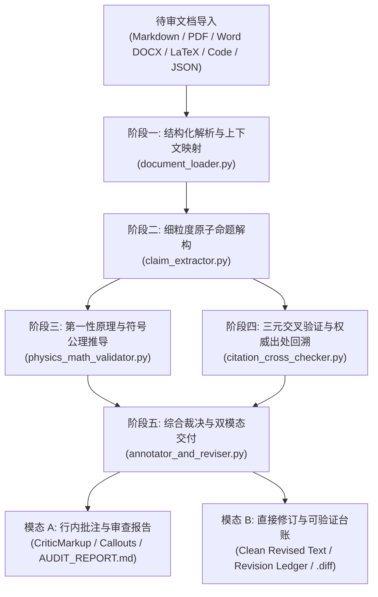

# 第一性原理与公理化文档内容交叉复核技能 (Document Content Verifier)

本技能定义了针对 AI 生成内容（技术报告、科研论文、系统架构设计、工程规范、算法证明及代码文档）的**第一性原理公理化交叉复核、学术证据溯源、行内批注与可验证修订标准作业程序 (SOP)**。

当面对复杂技术文档时，本技能彻底摒弃“以语言模型的主观感觉评价语言模型”的脆弱模式，而是将**不可撼动的自然科学公理（质量/能量守恒、热力学定律、量纲齐次性）、数理逻辑基本定律（不矛盾律、排中律）、计算复杂度下界及国际权威规范（ISO/IEEE/RFC/CODATA）**作为最高裁决基准，对每一处推导与事实陈述实施三元交叉溯源，确保“改动必有出处、批注必有公理、结论绝对可验证”。

---

## 一、 核心哲学与五阶复核流水线 (Core Philosophy & Architecture)



### 1. 核心公理底座 (Foundational Pillars)
1. **公理与物理守恒为先 (Axioms Precede Assertions)**：自然科学定理（热力学第二定律、光速极限、量纲齐次性）高于任何文献断言。违背公理的陈述一律定性为 `FATAL_AXIOM_VIOLATION`。
2. **三元去偏交叉验证 (Decoupled Triangulation)**：客观事实必须经由至少两个独立权威来源（或国家/国际一级标准）相互印证，杜绝“循环引用”与“单一二手博客误导”。
3. **审查者零次生幻觉 (Zero Secondary Hallucination)**：复核者自身严禁伪造文献、猜测页码。若无权威实证，必须诚实标记为 `UNVERIFIABLE (待证)`。
4. **全改动透明可溯源 (Total Traceability)**：所有的文字修改、参数修正、公式重构必须在《可验证修订台账》中逐行登记，列明公理依据与规范链接。

---

## 二、 全格式文档导入规范 (Multi-Format Ingestion Protocol)

本技能内置原生多格式结构化解析引擎（`scripts/document_loader.py`），支持零环境摩擦解析以下文档类型：

| 文档格式 | 扩展名 | 解析引擎与机制 | 段落/元数据映射保障 |
| :--- | :--- | :--- | :--- |
| **Markdown** | `.md`, `.markdown`, `.qmd` | 原生状态机词法分析器 | 精准捕捉标题层级、LaTeX 块公式（`$$`）、表格与行内代码 |
| **PDF** | `.pdf` | PyMuPDF (`fitz`) 块级几何流提取 | 保留页面编号、双栏排版顺序、文本边界框 Bounding Box |
| **Word** | `.docx` | 原生 `zipfile` + XML 树 (`document.xml`) | 零第三方重型依赖，提取段落样式、大纲标题、批注与嵌入表 |
| **LaTeX** | `.tex`, `.latex` | TeX 词法解析器 | 提取 `equation` / `align` 环境、`\cite{}` 键值、节标题 |
| **代码与笔记本** | `.py`, `.ipynb` | AST 与 JSON Cell 解析器 | 提取模块级文档注释、算法声明、单元测试断言与数学公式 |
| **结构化数据** | `.json`, `.yaml`, `.txt` | 结构解析器 | 展开键值对与纯文本行流 |

---

## 三、 第一性原理与公理化复核准则 (Axiomatic Auditing Protocols)

在审查 AI 生成的科学、数学与工程内容时，必须按以下公理层级严格执行自动化或形式化推演：

### 1. 量纲齐次性公理 (Dimensional Homogeneity & Buckingham $\pi$)
- **公理定义**：物理定律的代数形式在基本量纲变换下保持不变。方程两边及所有加和项必须拥有完全相同的 7 维 SI 基本量纲指数向量：
  $$[M^a L^b T^c I^d \Theta^e N^f J^g]$$
- **必查硬性红线**：
  - 加和/减法运算：严禁不同量纲项相加（例如将力 $[M L T^{-2}]$ 与动量 $[M L T^{-1}]$ 相加）；
  - 先验超越函数：指数 $\exp(x)$、对数 $\ln(x)$、三角函数 $\sin(x)$ 的自变量 $x$ 必须为**绝对无量纲量** ($[x] = [1]$)；
  - 导数与积分：微分 $\frac{dy}{dx}$ 量纲为 $[y]/[x]$，积分 $\int y\,dx$ 量纲为 $[y] \cdot [x]$。

### 2. 守恒律与极端物理壁垒 (Physical Invariants & Boundary Limits)
- **能量守恒与热力学极限**：
  - 孤立系统总能量变化 $\Delta E = 0$；
  - 任何热机综合热效率严格受卡诺极限约束：$\eta \le 1 - \frac{T_C}{T_H} < 100\%$；
  - 严禁出现“零能耗维持”、“自发无耗散做功”等第一类/第二类永动机表述。
- **狭义相对论因果律**：
  - 静止质量 $m_0 > 0$ 的物理实体，其宏观运动速度必须严格满足 $v < c = 299\,792\,458\ \text{m/s}$；
  - 能量动量色散关系：$E^2 = (m_0 c^2)^2 + (p c)^2$。
- **绝对零度下界**：
  - 热力学绝对温标 $T \ge 0\text{ K}$（宏观连续物质严禁出现负开尔文温标或低于 $-273.15^\circ\text{C}$）。
- **微观与信息物理下界**：
  - 朗道尔原理：室温下擦除 1 比特信息最小能耗 $E_{\min} \ge k_B T \ln 2 \approx 2.87 \times 10^{-21}\ \text{J}$；
  - 香农信道容量极限：连续信道传输速率 $C = B \log_2(1 + S/N)$，不可违背。
- **机械力学几何尺度律 (Square-Cube Law)**：
  - 特征长度放大 $k$ 倍，表面积按 $k^2$ 缩放，体积、质量与热容按 $k^3$ 缩放，转动惯量按 $k^5$ 缩放。

### 3. 数理逻辑与概率测度公理 (Mathematical & Logical Invariants)
- **柯尔莫哥洛夫概率公理**：
  - 任意事件概率非负：$P(E) \ge 0$；
  - 全样本空间测度为 1：$P(\Omega) = 1.0 \implies P(E) \le 1.0$；
  - 任何宣称“自愈概率为 1.45”或各互斥事件概率和 $\ne 1.0$ 的推导直接判定为伪科学。
- **经典命题逻辑三公理**：
  - 同一律 ($A \equiv A$)、不矛盾律 ($\neg(A \wedge \neg A)$)、排中律 ($A \vee \neg A$)；
  - 严禁“肯定后件”、“否定前件”、“循环论证”与“以偏概全”。
- **代数展开与符号恒等性**：
  - 严禁“初学者之梦”谬误：$(a + b)^n \ne a^n + b^n$（当 $n \ge 2$ 且乘法非零特征时）；
  - 矩阵与算子乘法的非对易性：一般情况下 $AB \ne BA$。

### 4. 计算机科学复杂度下界公理 (CS Complexity Bounds)
- **基于比较的排序下界**：任何基于键两两比较的排序算法，最坏情况时间复杂度下界为 $\Omega(N \log N)$。声称实现 $O(N)$ 纯比较排序必属虚构。
- **分布式系统 CAP 定理**：一致性、可用性、分区容错性不可兼得。
- **阿姆达尔定律**：并行加速比受串行瓶颈 $1/(1-p)$ 绝对约束。

---

## 四、 三元交叉验证与权威证据分级体系 (Evidence Tiering & Verification)

在对事实陈述、技术指标与文献引用进行核验时，必须根据以下金字塔层级建立证据链：

```
Tier 1 (绝对权威):
  - 国际/国家法定标准 (ISO/IEC, IETF RFC, IEEE Std, GB/T)
  - 国际物理常数委员会 (CODATA 2022)
  - 顶尖同行评议期刊正刊 (Nature, Science, Cell, IEEE Trans, ACM Trans)
  - 经典权威教材专著 (Landau, Goldstein, Knuth, Cormen)

Tier 2 (高度可信):
  - 顶级学术会议论文 (ACL, NeurIPS, ICML, CVPR, SIGCOMM, SOSP)
  - 官方厂商技术白皮书与数据手册 (SpaceX 遥测发布, Intel/ARM/NVIDIA 原厂手册, Python 官方文档)

Tier 3 (开放索引/需交叉印证):
  - arXiv 未出版预印本、开源代码库 Release、大学公开讲义
  - 【规则】必须满足至少 2 个无从属关系的独立 Tier 3 来源一致确认方可采信！
```

### 证据溯源必填字段
任何判定必须给出以下四元组：
$$\langle \text{标准/文献名}, \text{作者/编制机构}, \text{发表年份}, \text{DOI / 规范URL / 标准编号} \rangle$$

---

## 五、 双模态交付标准 (Dual-Mode Deliverables)

复核技能支持根据实际工作场景，输出两种互补的成果形式：

### 模态 A：批注与审查报告模式 (Annotation & Audit Matrix)
适用于：**专家同行评审、论文终审、合规性审计**。
- **行内批注 (CriticMarkup)**：
  - 文本高亮与注记：`{==原文摘录==}{>>[VERDICT] [SEVERITY] 依据: 出处 | 证伪推导<<}`
  - GitHub 语义化警示块 (`> [!CAUTION]`, `> [!WARNING]`, `> [!NOTE]`)
- **审计报告 (`*_audit_report.md`)**：
  - 执行摘要与严谨性量化评分（$0 \sim 100$ 分）；
  - 形式化复核矩阵（包含 Claim ID、原文、分类、判定状态、严重等级、公理反驳推导、权威出处）；
  - 致命与严重问题行动项清单。

### 模态 B：直接修订与台账模式 (Direct Revision & Verifiable Ledger)
适用于：**文稿一键修缮、直接交付出版物、工程方案修正**。
- **干净修订正文 (`*_revised.ext`)**：
  - 纠正违背公理的物理量纲与参数，修正数学推导，替换虚假引用，补充权威标准；
  - 保持原文档排版格式与风格不变。
- **可验证修订台账 (`*_revision_ledger.md`)**：
  - 逐行记录所有变更点：
    | 修订编号 | 所属段落/章节 | 原文内容 (Before) | 修订后内容 (After) | 第一性原理 / 公理化推导依据 | 权威可验证出处 (DOI/标准/URL) |
- **补丁文件 (`*.diff`)**：
  - 标准 Unified Diff 补丁文件，便于 Git 版本控制与自动化合并。

---

## 六、 命令行执行参考指南 (CLI Reference)

技能在 `scripts/` 目录下提供了完整的 Python 命令行工具链：

```bash
# 1. 运行完整复核流水线（双模态输出）
python d:/workspace/code/microUnit/skills/document-content-verifier/scripts/verify_pipeline.py \
    --input ./technical_report.md \
    --mode all \
    --output-dir ./audit_results

# 2. 仅生成审查报告与 CriticMarkup 批注 (Mode A)
python d:/workspace/code/microUnit/skills/document-content-verifier/scripts/verify_pipeline.py \
    --input ./paper.pdf \
    --mode audit

# 3. 仅执行直接修订并导出可验证修订台账 (Mode B)
python d:/workspace/code/microUnit/skills/document-content-verifier/scripts/verify_pipeline.py \
    --input ./architecture_doc.docx \
    --mode revise
```

---

## 七、 Agent 协作提示词模板 (Agentic Workflow Prompts)

当作为自主 Agent 执行复核任务时，应遵循以下专业思维链角色设定：

### 提示词模板：第一性原理公理化审查员
```markdown
你是严苛的自然科学与数理逻辑第一性原理审查员。你绝不盲从权威，也绝不容忍 AI 生成的学术幻觉与伪科学。

请按照以下四步审视输入文档中的每一段落：
1. 【量纲与符号展开】：写出文中所述方程的 7 维 SI 量纲向量，验证两侧是否严格齐次；
2. 【极端边界与物理守恒】：检验 $T \to 0K$、$v \to c$、$t \to \infty$ 以及能量/动量/电荷守恒与热力学第二定律；
3. 【逻辑因果链】：提取前件 $P$ 与后件 $Q$，排查肯定后件、循环论证与尺度缩放谬误；
4. 【出处确证】：验证文中所提标准编号（RFC/ISO）、DOI 及学者论文是否真实存在。严禁自我伪造文献！

输出时，必须同时提供：
- 严格遵循 CriticMarkup 语法的行内批注；
- 包含“第一性原理反驳推导”与“权威来源出处”的复核矩阵表；
- 一份每一处改动均可溯源的《可验证修订台账》。
```
