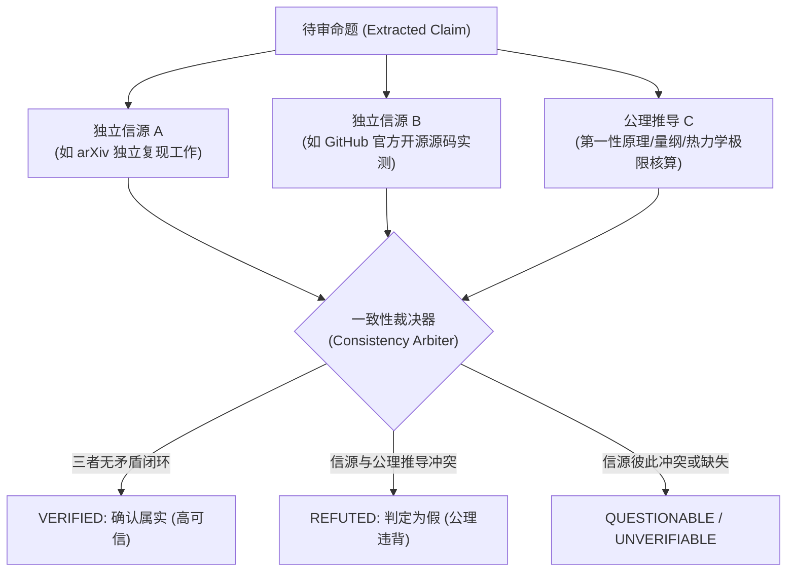

# 证据分级体系与交叉验证引文规范 (Evidence & Citation Standards)

本规范制定了本技能在对任何 AI 生成产物进行复核、证据溯源与修订时的**强制性证据准则**。其核心宗旨为：**杜绝二次幻觉、确保每一条修改皆可追溯、每一条批注皆有确凿出处**。

---

## 一、 证据可信度等级金字塔 (Evidence Hierarchy Tiering)

在进行信息交叉验证时，外部信源必须按照以下层级进行信度加权：

```
       ▲  [Tier 1: 绝对权威基准 - 终极裁决]
      / \  国家/国际标准 (ISO/IEEE/RFC/IETF/NIST)、CODATA 2022 物理常数、
     /   \ 经典教科书 (Landau/Goldstein/Knuth)、Nature/Science/IEEE 顶刊正刊、官方标准库源码
    /-----\
   / Tier 2\  [Tier 2: 高度可信来源 - 需交叉比对]
  /         \ 经同行评审的顶级会议论文 (ACL/NeurIPS/ICLR/SIGCOMM)、
 /           \ 官方厂商规范文档 (ARM/Intel/NVIDIA/Python.org)、顶尖高校公开讲义 (MIT/Stanford)
/-------------\
/   Tier 3     \ [Tier 3: 待证参考来源 - 严禁作为独立裁决证据]
/               \ arXiv 预印本 (未发表)、企业营销白皮书、技术博客 (Medium/CSDN)、维基百科 (仅作索引)
-----------------
[Tier 4: 零信度来源 - 坚决废弃] 匿名论坛言论、无署名文章、AI 生成的无引用摘要 (可能含幻觉污染)
```

### 1. Tier 1: 绝对权威基准 (Definitive Ground Truth)
- **适用场景**：数理定律定义、国际物理常数、通信与网络协议规范、官方硬件物理极限。
- **采信标准**：
  - **标准规范**：IETF RFC (如 RFC 9110 HTTP 语义)、ISO/IEC (如 ISO/IEC 9899 C 语言标准)、IEEE (如 IEEE 754 浮点数表示法)。
  - **物理与化学基准**：NIST物理测量实验室、CODATA 2022 推荐值、IUPAC 元素周期表数据。
  - **经典学术专著**：如 Landau & Lifshitz 理论物理学教程、Knuth《计算机程序设计艺术》、Cormen《算法导论》。
  - **判定效力**：单一条目即可作为直接判定真伪的终极依据。

### 2. Tier 2: 高度可信学术与工业级来源 (Peer-Reviewed & Official Docs)
- **适用场景**：最新算法基准 (SOTA)、前沿工程实现、经过实测检验的硬件功耗/算力数据。
- **采信标准**：CCF-A 类学术会议/期刊正式发表的论文、芯片厂商原厂官方技术规格白皮书（Datasheet/Reference Manual）。
- **判定效力**：需要至少 1 篇 Tier-2 文献提供明确数据点，或与第一性原理推导相互印证。

### 3. Tier 3: 需交叉比对的开放来源 (Open Repositories & Secondary Literature)
- **适用场景**：新兴学术方向、尚未正式出版的开源项目文档。
- **采信标准**：必须执行**三元交叉验证协议 (Triangulation Protocol)**：必须找到至少 2 个来自不同团队、互无从属关系的独立来源给出一致结论，方可采纳。

---

## 二、 三元交叉验证协议 (Triangulation Protocol)

为彻底消灭“以假纠假”、“误采信网络虚假谣言”的问题，本技能执行严格的**三元独立交叉验证闭环**：



### 交叉验证操作准则
1. **信源独立性排查**：信源 A 与信源 B 不得互为转载关系（例如媒体 B 仅仅复制了媒体 A 的通稿）。必须穿透追溯至原始实验记录、原始发布会或第一作者论文。
2. **反向搜索法 (Adversarial Search)**：不仅要搜索“证明该主张正确的材料”，必须强制性进行反向检索（如添加 `refutation`、`flaw`、`dispute`、`correction`、`errata`、`勘误`、`质疑` 等关键词），排查是否存在已知的撤稿 (Retraction) 或勘误说明。

---

## 三、 引文格式与标识符验证规范

任何在审核报告中列出的出处与来源，必须符合现代学术规范，杜绝含糊其辞的“网上资料显示”。

### 1. 数字对象唯一标识符 (DOI) 格式规范
- 标准格式：`https://doi.org/10.XXXX/XXXXX`
- 正则表达式：`^10\.\d{4,9}/[-._;()/:A-Za-z0-9]+$`
- 必须包含：第一作者姓氏、刊物名称、发表年份、卷号与起始页码。

### 2. 标准规范标识符格式
- **IETF RFC**：`RFC [编号]`，附官方链接 `https://www.rfc-editor.org/rfc/rfc[编号].html`
- **ISO 标准**：`ISO/IEC [标准号]:[年份]`
- **国家标准**：`GB/T [标准号]-[年份]`

### 3. 代码仓库与版本提交指纹
- 若引用开源代码作为实现依据，必须精确到：
  - 仓库名称 (如 `github.com/sympy/sympy`)
  - Commit SHA 或 Release 标签 (如 `v1.13.2`)
  - 文件路径与代码行号 (如 `sympy/physics/units/quantities.py#L45-L60`)

---

## 四、 审查者“零自幻觉”防范铁律 (Auditor Anti-Hallucination Guardrails)

本技能作为**裁判与审核者**，其自身输出的准确性必须高于待审文档。任何参与复核的 AI 代理必须无条件遵守以下戒律：

1. **严禁编造引文与页码**：
   - 如果记忆中存在某项知识，但无法给出确切的 DOI、书名、章节号或官方 URL，**严禁自行拼凑虚假的作者与年份**！
   - 此时必须给出形式化第一性公理推导，并在引文栏如实注明：`[由能量守恒定律/白金汉π定理直接推导，无需经验引文]`。
2. **存疑标注原则 (Principle of Honest Uncertainty)**：
   - 若外部证据链不足以 100% 证实或证伪，标记必须为 `QUESTIONABLE (存疑)` 或 `UNVERIFIABLE (待证)`，并给出需要补充的第一手材料清单。
3. **保护原文正确逻辑 (No Hyper-Correction)**：
   - 不得将原文正确的专业表述或学术行话，误当成语法错误或幻觉进行“过度纠正”；
   - 所有标红与修改，必须列出充分且不可辩驳的公理或证据链支撑。
