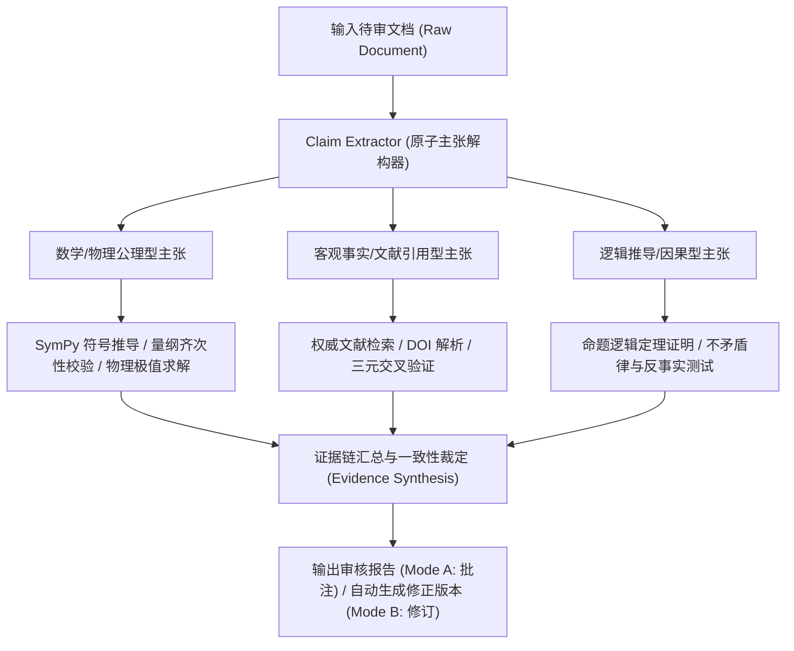

# 开源事实核查与第一性原理复核系统参考库 (Prior Art & Benchmarks)

本参考文档系统梳理了当代（截至 2026 年）事实核查、大语言模型幻觉消除、科学计算形式化验证及学术文献溯源领域的标杆开源项目与学术前沿，为本技能（`document-content-verifier`）的工程架构与方法论奠定基石。

---

## 一、 开源事实核查与幻觉检测框架演进矩阵

| 项目/框架 | 主导机构 / 论文 | 核心方法论 | 核心优势 | 对本技能的吸收与启发 |
| :--- | :--- | :--- | :--- | :--- |
| **FacTool** | 复旦/GAIR-NLP (*ACL 2024*) | **5 阶段工具增强核查**：原子主张提取 $\to$ 检索查询生成 $\to$ 多工具协同调用 $\to$ 证据链汇集 $\to$ 最终一致性判决 | 覆盖通用 QA、代码执行、数学证明及学术文献多领域 | **主张解耦与多工具流水线设计**：将复杂文本拆解为独立可验证的原子事实，分别调度符号求解器与文献检索 |
| **FActScore** | 斯坦福大学 (*EMNLP 2023*) | **原子事实分解与支持率量化** (Factual Precision Score) | 将长文本拆解为最小粒度不可再分的 Atomic Facts，统计支持率 | **最小原子事实解构准则**：避免多重从句与复合判断造成的逻辑混淆，精准定位微小幻觉 |
| **SAFE** | Google DeepMind / Stanford (*2024*) | **检索增强事实性评估器** (Search-Augmented Factuality Evaluator) | 自动化多轮搜索、自主拓展关键词，人类一致性达 72% 并显著超越单一审稿人 | **自适应去偏检索**：生成中立、不含诱导倾向的检索词，杜绝“预设结论”导致的确认偏差 (Confirmation Bias) |
| **CoVe** | Meta AI (*ACL 2024*) | **验证链推理** (Chain-of-Verification) | 4 步解耦：生成草稿 $\to$ 拟定验证问题 $\to$ 独立回答验证问题 $\to$ 纠偏生成 | **去偏反思机制**：在执行交叉验证时，将验证问题与原始陈述上下文解耦，避免模型自我附和 |
| **PaperQA2** | FutureHouse (*Nature/ArXiv 2024*) | **科学文献证据链深度对齐与矛盾检测** (LitQA2) | 基于 RCS 上下文重排与严格段落级 DOI 锚定，在生物医学文献中自动发现矛盾 | **学术文献金标准溯源**：每一处事实断言必须精确到 DOI、页码、公式编号或权威标准编号 |
| **CriticGPT** | OpenAI (*2024*) | **基于代码与推理链的纠错模型** | 专门捕捉模型细微逻辑错误、量纲倒置与隐蔽 bug，解决人类评审盲区 | **对抗性审查与第一性原理推导**：重点审查边界条件、量纲守恒与极端情况 |
| **MiniCheck** | UT Austin (*EMNLP 2024*) | **轻量级文档对齐事实核查器** | 极低延迟判断生成内容是否严格忠于依据文档（Yes/No/Partial） | **基准上下文无损保真审计**：快速判定模型是否篡改或超出了给定材料的边界 |
| **RAGAS / TruLens** | 工业级开源评测框架 | **三元可信度评估**：忠实度 (Faithfulness)、上下文相关度 (Context Precision)、答案相关度 | 工业级 CI/CD 评测，结构化数值指标 | **复核矩阵与定量台账**：将审核结果结构化输出为严重级别分级矩阵 |

---

## 二、 标杆系统核心机制深度剖析

### 1. FacTool：多领域工具级协同验证
FacTool 的核心洞察在于：**通用文本生成与科学/数学生成的验证逻辑完全不同**。
- **事实型陈述 (Factual Claims)**：调度搜索引擎（Google Search / Tavily / Wikipedia API）获取外部共识；
- **数学与物理推导 (Mathematical/Physical Derivations)**：调度 Python 解释器、SymPy 符号求解器进行边界值代入与方程等价性测试；
- **代码与算法复杂度 (Algorithmic Logic)**：通过抽象语法树（AST）静态分析及测试用例执行验证。

### 2. PaperQA2：科学文献与严谨引用的反幻觉协议
AI 在生成学术文档时最常见的恶性幻觉是：**伪造假文献、张冠李戴（真实作者匹配虚假结论）、混淆因果与相关性**。
PaperQA2 的防范规范：
1. **DOI 物理实体存在性校验**：通过 Crossref / OpenAlex / PubMed API 验证 DOI 是否真实存在，比对标题、作者、刊物与发表年份。
2. **全文证据锚定 (Passage Grounding)**：断言必须有文献正文的原句或原图表数据支撑，严禁仅凭 Abstract 的推测性结论作为第一性论据。
3. **学术文献矛盾检测 (Contradiction Triangulation)**：若某一主张在科学界存在争议（例如特定常数的测量精度、新材料超导转变温度），必须明确指出不同学术阵营的权威来源，而非单向断言。

### 3. Google SAFE：去偏自适应搜索与多轮追问
传统的 LLM 自我反思往往陷入“自我确认偏差”：当模型被问到“《流浪地球》里引力弹弓效应的公式对不对？”时，模型往往顺应提问倾向回答“是对的”。
SAFE 引入的**中立查询解耦准则 (Neutral Decoupled Query Formulation)**：
- 将待审主张：`“SpaceX 星舰猛禽3发动机的室压达到了 350 bar”`
- 转换为中立反向查询：
  - 查询 1（正向事实）：`"Raptor 3" chamber pressure official specifications`
  - 查询 2（参数比对）：`Raptor 2 vs Raptor 3 chamber pressure bar MPa`
  - 查询 3（权威来源）：`SpaceX Elon Musk Raptor 3 official test fire post telemetry`
- 综合多个独立来源的交叉比对，判定是否属于未经实证的传闻或混淆了猛禽2代与3代数据。

---

## 三、 第一性原理与形式化公理验证系统的融合

在传统事实核查之上，本技能重点突破**自然科学、工程学与数理逻辑的第一性原理验证**：

### 1. 符号计算与量纲公理 (SymPy & Dimensional Analysis)
- 借鉴经典物理学量纲齐次性原理（Buckingham $\pi$ 定理）：任何物理方程两侧的量纲必须完全相同。
- 绝大多数 AI 伪造的伪科学公式（例如擅自将速度与加速度相加，或遗漏了光速 $c$ / 普朗克常数 $\hbar$ 的幂次）在符号量纲展开时立即暴露。

### 2. 热力学与守恒公理 (Conservation Laws & Thermodynamic Invariants)
- 无论 AI 编造何种复杂的系统架构，其宏观能量平衡方程必须严格遵守：
  $$\dot{E}_{\text{in}} = \dot{E}_{\text{out}} + \dot{E}_{\text{stored}} + \dot{E}_{\text{dissipated}}$$
- 热机效率极限必须受卡诺定理约束：
  $$\eta \le \eta_{\text{Carnot}} = 1 - \frac{T_C}{T_H}$$
- 违反热力学第二定律（自发熵减、无耗散做功、超光速超因果通信）直接判定为 **FATAL_AXIOM_VIOLATION (致命公理违背)**。

### 3. 数理逻辑与形式化方法 (Propositional & SMT Verification)
- 提取待审文本中的因果推理链：$P_1 \wedge P_2 \implies Q$；
- 检查是否存在逻辑谬误（如肯定后件、否定前件、循环论证、以偏概全）；
- 结合 SMT 求解思想（如同 Z3 / Lean 4 的轻量规则引擎），验证在给定前提公理集合下，结论是否存在不可满足的逻辑冲突。

---

## 四、 本技能工程落地的关键取舍与架构规范

为了在保障极致学术与工程严谨性的同时，实现全格式文档的零门槛无感导入与双模态输出，本技能确立以下工程架构标准：

1. **模块完全解耦**：
   - `document_loader.py`：负责全格式结构化解析，保持原文档段落与行号映射；
   - `claim_extractor.py`：负责原子命题切分与主张类型标记；
   - `physics_math_validator.py`：负责基于符号计算的第一性原理、量纲齐次性与物理极值计算；
   - `citation_cross_checker.py`：负责权威知识库、开放学术接口与三元交叉验证；
   - `annotator_and_reviser.py`：负责生成 CriticMarkup 批注版、审查矩阵及带修订台账的干净正文。
2. **零二次幻觉铁律 (Zero Secondary Hallucination)**：
   - 复核者自身严禁伪造证据！任何纠错必须附带明确的公理推导过程，或精确到权威标准（ISO/IEEE/RFC/CODATA）及学术文献；
   - 遇到缺乏权威证据支撑的新兴领域主张，必须诚实标记为 `UNVERIFIABLE (待证)`，坚决杜绝“用臆想纠正臆想”。
