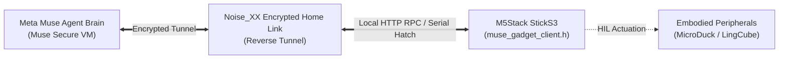

# Meta Muse Gadgets Companion Skill

Use this skill when developing, testing, or deploying Meta Muse Gadgets integrations for the M5Stack StickS3 LingBuddy companion and robotics peripherals.

---

## 1. Architectural Overview

Meta Muse Gadgets (open-sourced October 2, 2026, under Apache-2.0 at `facebookincubator/muse-gadget-sdk`) allows physical edge devices to connect to personal AI agents running in cloud-based Muse Secure VMs.



---

## 2. Key Integration Components

### 1. Serial Hatch Protocol (`muse_gadget_client.h`)
- Connects directly to the Meta Muse local console interface.
- Protocol commands:
  - `>chat=...`: Submits complete user text prompt to the agent.
  - `>chat+=...`: Appends streaming token chunks.
  - `>face=listening|speaking|thinking|happy|error`: Dynamically maps Muse agent states to StickS3 avatar micro-expressions.
  - `>robot=...`: Issues hardware locomotion and reflex actions.

### 2. HTTP REST & RPC Bridge (`simulation/bridge/muse_gadget_bridge.py`)
- Standardized endpoints exposed on local port 8000:
  - `GET /health`: Liveness probe.
  - `GET /api/device/info`: Device identity and battery telemetry.
  - `GET /api/robot/telemetry`: Real-time IMU posture and subsystem health.
  - `POST /api/robot/roll`: Dynamic locomotion commands.
  - `POST /api/robot/epm`: Dual-state magnetic latching pulses.
  - `POST /api/robot/morphology`: Morphology reconfigurations.
  - `POST /api/robot/reflex`: Bio-neuromorphic reflex triggering.

### 3. Embodied Device Skills
Registered under `skills/`:
- `gadget-lingcube-msrr`: Meta Muse skill descriptor for physical modular robot actuation.
- `gadget-lingmatrix-sim`: Meta Muse skill descriptor for MuJoCo simulation & HIL pre-flight checks.

---

## 3. Verification & Testing

Run the automated integration test suite:
```powershell
python -m pytest tests/test_muse_gadget_integration.py -v
```
Verifies skill descriptors, device state kinematics, HTTP REST bridge contracts, and Hatch protocol parser.

---

## 4. Key Source Files Reference

- [`muse_gadget_client.h`](file:///d:/workspace/code/yunyu-esp32/firmware/m5sticks3_buddy/include/muse_gadget_client.h): C++ Hatch parser and avatar state mapping.
- [`muse_gadget_bridge.py`](file:///d:/workspace/code/yunyu-esp32/simulation/bridge/muse_gadget_bridge.py): Python HTTP/RPC bridge server.
- [`test_muse_gadget_integration.py`](file:///d:/workspace/code/yunyu-esp32/tests/test_muse_gadget_integration.py): 5 automated integration tests.
- [`Doc 31`](file:///d:/workspace/code/yunyu-esp32/docs/31_Meta_Muse_Gadgets微型自重构机器人与物理伴侣全栈接入方案与工程实施详案.md): Full technical specification.
