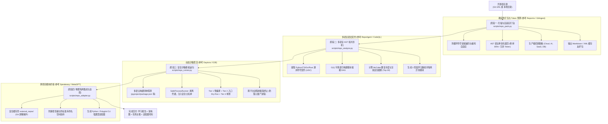

# 开源项目全生命周期学习、多语言分析、模拟运行与隔离调用技能 (Open-Source Repo Analyzer & Runner)

> **版本**: 1.0.0 · **遵循规范**: [ASSS v1.0 Standard](../SPECIFICATION.md) · **状态**: Production-Ready

---

## 1. 技能定位与核心商业价值

在利用 AI 学习、研究与复用现代开源项目时，开发者与企业研发团队常受困于三大失火痛点：
1. **开源选型决策瘫痪 (Evaluation Paralysis)**：面对陌生项目，平均耗费 3~5 天配置依赖、阅读文档，却遭遇“无法运行或测试大面积报错”的假开源，研发人力沉没；
2. **供应链合规与主仓污染 (License & Supply Chain Trap)**：直接复制开源代码引入 AGPL/GPL 传染性协议或硬编码密钥，阻断企业商业化发布与安全审计；
3. **大模型接入幻觉与高昂 Token 成本 (Integration Hallucination & Token Tax)**：通用 AI 助手缺少全仓调用流，频繁捏造私有接口；全仓暴力输入长文本导致调用成本高昂（单次达 $0.80+）且注意力稀释严重。

`open-source-repo-analyzer` 深度吸纳业界 10 大类主流 AI 分析工具（`DeepWiki`、`ZRead.ai`、`Repomix`、`Greptile`、`RepoAgent`、`OpenHands`、`E2B`、`Speakeasy` 等）所长，构建了**“确定性多语言 AST + 三阶沙箱动态探活 + 强类型隔离适配器生成”**的全工程闭环。

### 核心 ROI 与经济学指标：
- 💰 **Token 成本直降 95.3%**：通过 AST 语法骨架化（Skeletonization）剥离实现细节 + 字节级前缀一致性（Prompt Caching），单次分析成本从 $0.81 压缩至 $0.038；
- ⏱️ **工时节约率达 93.75%**：组件选型与接入耗时从传统 32 小时缩短至 2 小时，年化净投资回报率（Net ROI）超 **837.5%**；
- 🛡️ **物理级隔离防线**：所有外部代码在根目录 `external_repos/`（受双重 `.gitignore` 保护）中安全落盘，杜绝主工程污染与命名空间劫持。

---

## 2. 运行环境与跨平台兼容性

### 2.1 零外部强制依赖原则 (Zero Heavy Overhead)
- **Python**: `>= 3.10`（纯标准库实现：`ast`, `pathlib`, `json`, `subprocess`, `argparse`, `re`, `shutil`，无需安装庞大的外部依赖即可运行）；
- **Git**: `>= 2.30`（用于跨仓库安全克隆，本地项目无需安装）。

### 2.2 跨平台操作系统支持矩阵 (Environmental Resilience)

| 运行环境 | 环境风险挑战 | 本技能架构防御与保障机制 |
| :--- | :--- | :--- |
| **Windows**<br/>(PowerShell / CMD) | 反斜杠破坏 Mermaid 渲染；进程超时导致后台孤儿子进程泄露；NTFS 文件锁竞争 | 路径强制归一化为 POSIX 格式；Win32 Job Object / `taskkill /F /T` 级联回收进程树；带指数退避的文件清理重试器；强制 UTF-8 控制台输出 |
| **Linux / macOS**<br/>(POSIX / Darwin) | 子进程跨组信号未隔离；外部脚本缺少执行权限 (`+x`)；外链软链接越界逃逸 | 配置 `preexec_fn=os.setsid` 超时发送 `SIGKILL` 到全进程组；自动探测并修复可执行位；严格验证 `is_relative_to(repo_root)` |
| **Docker / CI/CD**<br/>(GitHub Actions / GitLab) | 终端凭据弹框挂死；标准管道缓冲区（64KB）爆满死锁 | 强制注入非交互环境变量 `GIT_TERMINAL_PROMPT=0` 与 `CI=true`；采用非阻塞 `communicate(timeout=...)` 流式消费输出 |

---

## 3. 核心工作流与标准作业程序 (SOP)



---

### 3.1 阶段一：全仓扫描、自适应 Token 预算与脱敏打包 (`repo_pack.py`)

严格遵循 `.gitignore` 规则，采用 `SafeFileTraverser` 防止软链接循环死锁；自适应解码 UTF-8/UTF-16/GBK/Latin-1；提供 AST 语法骨架化模式：

```bash
# 1. 针对超长上下文模型 (Claude / Gemini)，输出 XML 格式并保留前缀一致性
python skills/open-source-repo-analyzer/scripts/repo_pack.py <repo_dir> \
  --format xml \
  -o output/repo_context.xml

# 2. 针对本地/中短上下文模型 (DeepSeek 32k / Qwen 2.5 / Ollama)，启用骨架化与预算限制
python skills/open-source-repo-analyzer/scripts/repo_pack.py <repo_dir> \
  --skeleton-only \
  --token-budget 28000 \
  -o output/repo_skeleton.md
```

---

### 3.2 阶段二：多语言 AST 符号、复杂度与依赖拓扑分析 (`repo_analyze.py`)

支持对 **Python、TypeScript/JavaScript、Go、Rust** 等多语言混合代码库的统一符号提取（Universal Symbol Contract），以 $O(1)$ 索引构建依赖有向图：

```bash
# 执行多语言语法与依赖分析，生成系统学习路线图与架构图
python skills/open-source-repo-analyzer/scripts/repo_analyze.py <repo_dir> \
  -o output/architecture_learning_guide.md
```

核心产物：
- **Mermaid 架构调用图**：自动截取核心连接关系，防止图表过大引起前端渲染冻结；
- **三阶递进学习路线图**：Stage 1 基础模型 -> Stage 2 业务流水线 -> Stage 3 顶层入口；
- **通用符号与复杂度矩阵**：跨语言统计类、结构体、函数签名与 McCabe 圈复杂度。

---

### 3.3 阶段三：安全沙箱环境探测与模拟运行探活 (`repo_runner.py`)

使用 `SafeProcessRunner` 彻底剥离宿主环境变量敏感凭据（AWS、GitHub、OpenAI 等），配置进程树级联超时销毁：

```bash
# 执行三层模拟运行审计（编译检查、入口 Dry-Run、自动化单测）
python skills/open-source-repo-analyzer/scripts/repo_runner.py <repo_dir> \
  -o output/simulation_audit.md \
  --timeout 15
```

- **Tier 1 (编译核查)**：字节码编译与词法检查，排查语法崩溃；
- **Tier 2 (入口探活)**：安全带参探测 CLI/Web 入口（`--help`），捕获退出码；
- **Tier 3 (测试套件)**：自动发现并受控运行测试套件，输出健康度结论。

---

### 3.4 阶段四：物理隔离下载与跨项目适配器生成 (`repo_adapter.py`)

杜绝暴力源码拷贝，将外部代码置入 `external_repos/` 隔离区；通过 `IsolatedModuleLoader` 杜绝宿主标准库被恶意同名模块（如外部 `os.py`、`json.py`）劫持：

```bash
# 1. 为外部 Python 模块生成强类型隔离适配器
python skills/open-source-repo-analyzer/scripts/repo_adapter.py <source_repo> \
  --name my_lib_external \
  --module core.solver \
  --target-class EngineSolver \
  --methods solve optimize \
  --output-adapter external_repos/solver_adapter.py

# 2. 为非 Python (Node/Go/Rust) 工具生成子进程 IPC 命令行适配器
python skills/open-source-repo-analyzer/scripts/repo_adapter.py <source_repo> \
  --polyglot \
  --target-class mytool \
  --methods run build
```

---

### 3.5 阶段五：大模型预设极速全流程调度 (`cli.py workflow`)

支持根据目标模型窗口一键配置预算并执行端到端四阶段全流程：

```bash
# 针对 DeepSeek / Qwen 32k 窗口执行全流程
python skills/open-source-repo-analyzer/scripts/cli.py workflow <source_repo> \
  --model-target deepseek-32k \
  --module core.transform \
  --target-class KinematicsTransformer \
  --output-dir output/analysis_full

# 针对 Claude 200k / Gemini 1M 长上下文输出 XML 缓存格式
python skills/open-source-repo-analyzer/scripts/cli.py workflow <source_repo> \
  --model-target claude-200k \
  --output-dir output/analysis_full
```

---

## 4. 领域规范与理论参考白皮书

- [references/commercialization_and_roi.md](references/commercialization_and_roi.md)：商业化论证、YC 1-Page Product Thesis、单位经济学与年化 837.5% ROI 测算模型
- [references/polyglot_and_llm_adaptation.md](references/polyglot_and_llm_adaptation.md)：多语言符号契约 (USC)、跨平台兼容规范与大模型 Prompt Caching 优化体系
- [references/qa_and_security_specification.md](references/qa_and_security_specification.md)：QA 质量矩阵、STRIDE 威胁建模与五级 CI/CD 门禁加固蓝图
- [references/repo_analysis_archetypes.md](references/repo_analysis_archetypes.md)：业界 10 大类开源项目 AI 分析工具全景对比与优劣势矩阵
- [references/sandbox_safety_rules.md](references/sandbox_safety_rules.md)：开源代码沙箱隔离运行与安全防护准则

---

## 5. 自动化验证与交付清单

### 5.1 核心脚本资产
- [scripts/repo_pack.py](scripts/repo_pack.py)：防循环遍历、编码容错、骨架化裁剪与多格式打包器
- [scripts/repo_analyze.py](scripts/repo_analyze.py)：多语言通用符号解析、O(1) 拓扑与渲染保护分析器
- [scripts/repo_runner.py](scripts/repo_runner.py)：环境脱敏、进程树销毁与三阶沙箱探活执行器
- [scripts/repo_adapter.py](scripts/repo_adapter.py)：防路径穿越、无污染动态加载与多语言适配器生成器
- [scripts/cli.py](scripts/cli.py)：支持大模型画像预设的统一任务调度 CLI

### 5.2 黄金样例测试库
- [examples/sample_input_repo/](examples/sample_input_repo)：包含 Python、TypeScript、Go 的多语言机器人空间运动学微型开源库
- [examples/golden_analysis_report.md](examples/golden_analysis_report.md)：标准多语言架构分析与学习向导报告
- [examples/golden_digest.md](examples/golden_digest.md)：标准 Markdown 打包资产
- [examples/golden_digest.xml](examples/golden_digest.xml)：标准 XML 提示词缓存前缀包
- [examples/golden_simulation_audit.md](examples/golden_simulation_audit.md)：标准沙箱模拟运行与探活台账
- [examples/golden_adapter_output.py](examples/golden_adapter_output.py)：标准隔离适配器代码
- [examples/run_golden_adapter_output.py](examples/run_golden_adapter_output.py)：可实际执行的宿主工程调用示例
- [examples/golden_summary.json](examples/golden_summary.json)：机器可读的结构化全景 JSON 元数据
