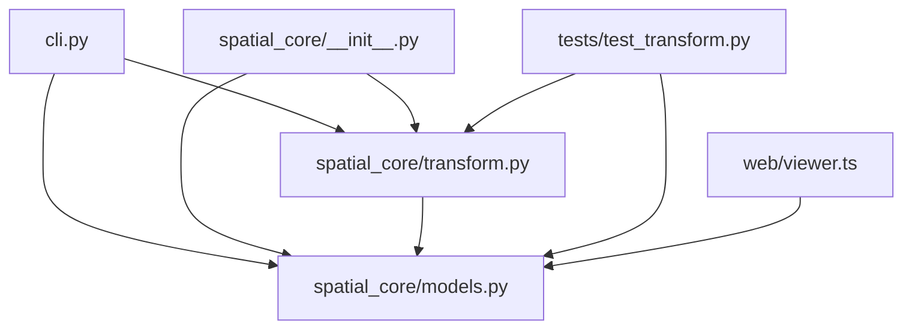

# Architectural Analysis & Learning Guide: sample_input_repo

> 自动化生成的开源项目架构全景图、多语言符号契约与递进式学习路线图。

## 1. 核心技术栈与外部依赖
- **源码模块总数**: 8
- **外部第三方库**: argparse, dataclasses, math, pathlib, sys, typing, unittest

## 2. 系统架构调用拓扑图 (Mermaid Topology)

## 3. 递进式学习与精读路线图 (Progressive Learning Roadmap)

### 📍 Stage 1: Core Primitives & Foundation Models (核心实体与基础数据模型)
*Start here to understand data schemas, interfaces, and atomic utilities.*

- [x] `spatial_core/__init__.py`
- [x] `tests/__init__.py`

### 📍 Stage 2: Business Logic & Processing Pipelines (核心算法与逻辑处理)
*Understand core domain state machines, algorithms, and orchestration logic.*

- [x] `cli.py`
- [x] `native/kinematics.go`
- [x] `web/viewer.ts`

### 📍 Stage 3: Entrypoints & Client Interfaces (系统入口与外部接口)
*Trace main application lifecycles, CLI runners, and consumer API surfaces.*

- [x] `tests/test_transform.py`
- [x] `spatial_core/transform.py`
- [x] `spatial_core/models.py`

## 4. 关键导出符号与公共 API 矩阵 (Universal Symbols & Complexity)

| 模块文件 | 语言 | 类/结构体 | 关键函数/方法 | 圈复杂度总计 |
| :--- | :---: | :--- | :--- | :---: |
| `cli.py` | Python | - | `main()` | 1 |
| `native/kinematics.go` | Go | `SpatialVector` | `Magnitude()`, `ComputeForwardKinematics()` | 3 |
| `spatial_core/__init__.py` | Python | - | - | 0 |
| `spatial_core/models.py` | Python | `Point3D`, `Quaternion` | `Point3D.magnitude()`, `Point3D.normalize()`, `Quaternion.is_unit()` | 7 |
| `spatial_core/transform.py` | Python | `KinematicsTransformer` | `KinematicsTransformer.__init__()`, `KinematicsTransformer.set_euler_angles()`, `KinematicsTransformer.rotate_point()` (+2) | 6 |
| `tests/__init__.py` | Python | - | - | 0 |
| `tests/test_transform.py` | Python | `TestKinematics` | `TestKinematics.test_point_magnitude()`, `TestKinematics.test_translation()`, `TestKinematics.test_rotation_yaw_90()` | 4 |
| `web/viewer.ts` | TypeScript/JavaScript | `ViewerOptions`, `PoseViewer` | `createDefaultViewer()` | 3 |
