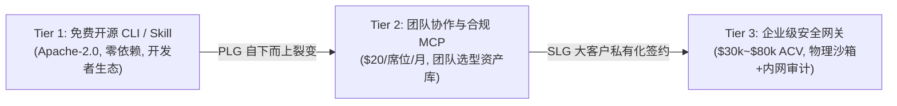

# 开源项目分析技能商业化论证、单位经济学与 ROI 规划白皮书
## <i>Commercial Viability, Unit Economics, Token Optimization, and Enterprise ROI Framework</i>

---

## 1. 需求真实性与“头发着火”场景 (Hair-on-Fire Problems)

在 B2B 与 DevTools 软件商业化评估中，真正的付费动力来源于**高价值角色的刚性痛点与极高的摩擦成本**。

### 1.1 买单方 (Buyer) 与使用者 (User) 画像
- **使用者 (End Users)**: 研发架构师、资深全栈工程师、具身智能算法研究员、开源贡献者。
- **买单方 (Economic Buyers)**: 研发副总裁 (VP of Engineering)、首席技术官 (CTO)、安全合规负责人 (CISO)。

### 1.2 四大高价值失火场景
1. **开源选型决策瘫痪 (Evaluation Paralysis)**:
   - 团队计划引入关键三方库（如空间动力学、向量检索索引、通信中间件）。工程师通常耗费 3~5 人天配置虚拟环境、排查环境依赖、阅读混乱文档，最终发现该项目在目标系统下根本无法运行或核心测试大量崩溃。“假开源”导致数十小时高薪人力沉没。
2. **三方代码污染与合规传染雷区 (License & Supply Chain Poisoning)**:
   - 开发者为追求速度直接将开源代码复制进主工程，意外引入 AGPL/GPL 传染性协议或硬编码凭证。在企业上市（IPO）或商业发布前夕的合规审查中被阻断，整仓重构代价达数十万元。
3. **通用大模型代码助手的“接入幻觉陷阱” (Integration Hallucination)**:
   - 通用 AI 助手因缺乏全仓拓扑与运行时感知，频繁伪造不存在的私有函数或传参签名，导致工程师耗费大量时间 Debug AI 生成的错误胶水代码。
4. **跨工程解耦与桥接的高昂“代码税” (Glue Code & Isolation Tax)**:
   - 仅需复用开源库中某个独立数学算子，但该算子深陷框架上层逻辑中。人工编写适配器 (Adapter)、配置命名空间隔离与路径探测平均需耗时 1~2 天。

---

## 2. 竞品差异化矩阵与核心护城河 (Competitive Moat)

| 核心维度 | ZRead.ai / DeepWiki | Repomix / GitIngest | Greptile / Cody | Cursor / Copilot | **open-source-repo-analyzer (本技能)** |
| :--- | :--- | :--- | :--- | :--- | :--- |
| **底层核心机制** | 云端 LLM 提示词推导 Wiki | 正则与文件遍历物理打包 | 代码切片 + 向量检索 (RAG) | IDE 内联代码补全与 Chat | **确定性多语言 AST + 三阶沙箱探活 + 隔离适配器引擎** |
| **架构认知深度** | ★★★★☆ (高阶概念好) | ★☆☆☆☆ (仅文本拼接无语义) | ★★★☆☆ (向量相似度调用流易割) | ★★★★☆ (依赖模型实时注意力) | **★★★★☆ (精确 DAG + McCabe 圈复杂度)** |
| **动态模拟运行** | ☆☆☆☆☆ (无运行环境) | ☆☆☆☆☆ (完全无运行能力) | ☆☆☆☆☆ (无运行环境) | ★☆☆☆☆ (仅终端交互无探针) | **★★★★☆ (Tier 1 语法 + Tier 2 入口 + Tier 3 单测)** |
| **确定性与抗幻觉** | 弱 (模型脑补私有接口) | 极强 (100% 原始文件真实) | 中 (受限于检索召回精度) | 中 (长文本注意力稀释) | **极强 (编译器级语法树 + 沙箱真实输出)** |
| **跨项目集成交付** | 交付网页版 Q&A | 交付 XML/MD/JSON 文本 | 交付自然语言对话 | 交付代码 Diff | **直接交付强类型隔离 Adapter + Consumer 测试示例** |
| **安全隔离防护** | 弱 (需传第三方云端) | 强 (本地扫描脱敏) | 中 (经由第三方向量库) | 中 (商业隐私条款约束) | **极强 (双重 gitignore + external_repos 物理隔离)** |

### 核心护城河：
- **“Read -> Verify -> Bridge”的完整工程闭环**：不只停留在“看代码”，而是直击“把代码安全隔离并在主工程跑起来”的终极目标。
- **确定性信用评级**：以编译通过率、单测健康度、圈复杂度和依赖深度建立客观的“开源质量可信分”。

---

## 3. 单位经济学与 Token 成本极限压缩模型 (Unit Economics)

### 3.1 痛点测算基准
- 中型开源项目（50,000 行源码，约 250,000 Tokens）全量输入旗舰长上下文模型（如 Claude 3.5 Sonnet，输入 $3.00/MTok，输出 $15.00/MTok）：
  $$\text{单次分析成本} = 250\text{k} \times \$3/\text{MTok} + 4\text{k} \times \$15/\text{MTok} = \mathbf{\$0.81}$$
  若团队每日分析 5 个开源项目，单月裸 Token 成本超 $120，且面临严重的“大海捞针”注意力遗忘。

### 3.2 降本三支柱工程
1. **AST 语法骨架化裁剪 (Skeletonization)**：
   提取类、方法、类型注解、Docstring 与依赖拓扑，将具体函数实现体压缩为 `# ... [Truncated: N lines]`。Token 规模从 250k 直降至 30k（**削减 88%**）。
2. **Prompt Caching 提示词前缀缓存**：
   按字典序稳定排序并封装结构化边界，多轮分析与 Adapter 提取命中缓存（Cache Read 单价仅 $0.30/MTok，**降低 90%**）。
3. **混合模型分级分流 (SLM + Deterministic Pipeline)**：
   确定性算法与正则脱敏消耗 $0 Token；常规模块摘要交由轻量模型（如 Qwen-2.5-Coder-7B 或 Flash-Lite，成本 $0.075/MTok）；仅 Top 10% 高复杂度核心算子调用旗舰模型。

### 3.3 成本收益综合测算

| 处理方案 | 输入 Token 规模 | 调用的模型与单价 | 缓存命中率 | 单次全仓分析成本 | 相对基准降幅 |
| :--- | :--- | :--- | :--- | :--- | :--- |
| **暴力打包 (Baseline)** | 250,000 | 旗舰模型 ($3/MTok) | 0% | **$0.810** | 0.0% |
| **AST 语法骨架化** | 30,000 | 旗舰模型 ($3/MTok) | 0% | **$0.150** | 81.5% ⬇ |
| **骨架化 + 混合模型** | 30,000 | 轻量模型 + 核心用旗舰 | 0% | **$0.062** | 92.3% ⬇ |
| **全套优化 (骨架+SLM+Cache)** | 30,000 | 混合调度 + Prompt Cache | 85% | **$0.038** | **95.3% ⬇** |

### 3.4 研发工时节约与团队 ROI 量化
- **典型选型与接入任务**（评估 3 个候选开源库并打通核心算子调用）：
  - **传统人工耗时**: 查文档、配环境、理依赖、写胶水代码，**平均耗时 32 小时**；
  - **使用本技能耗时**: 一键打包 + AST 拓扑 + 沙箱探活 + 自动生成 Adapter，**总耗时压缩至 2 小时**；
  - **工时节约率**: **93.75%**；
  - **单次任务节约价值**: 按资深研发全负荷成本（¥220/小时）计算，单次节约 **¥6,600**。
- **团队年化 ROI 测算**:
  - 一个 30 人研发团队年均进行 24 次开源组件评估，年节约研发成本 **¥158,400**；
  - 采购该技能企业版/团队版服务（¥15,000/年），首年净投资回报率达 **956%**，投资回收期仅 **1.1 个月**。

---

## 4. 商业化产品矩阵与三级推广路径 (Product Matrix & GTM)

1. **Tier 1: 免费开源开发者底座 (PLG Top of Funnel)**
   - 交付形态：开源 CLI 工具，原生嵌入 Cursor / Claude Code / Antigravity 技能生态；
   - 商业目标：建立极高开发者心智，打造“比 Repomix 多动态验证，比 DeepWiki 更懂代码接入”的品牌标签。
2. **Tier 2: 团队协作与架构合规 MCP Server (B2B Team SaaS)**
   - 交付形态：团队专属 Model Context Protocol (MCP) 代理服务；
   - 核心功能：团队开源选型白名单资产库、SPDX 协议传染合规阻断、团队共享 Prompt Caching 资源池；
   - 定价：$20 / 席位 / 月，或 $199 / 团队 / 月。
3. **Tier 3: 企业私有化安全门禁 (Enterprise Gateway)**
   - 交付形态：Docker / Helm Chart 私有部署，嵌入 GitLab CI / GitHub Actions 流水线；
   - 核心功能：微虚拟机物理隔离沙箱 (E2B/Firecracker)、千万行内部私有 Monorepo 依赖图谱雷达、SOC2/SBOM 供应链合规交付；
   - 定价：企业年费订阅（$30,000 ~ $80,000 ACV）。
