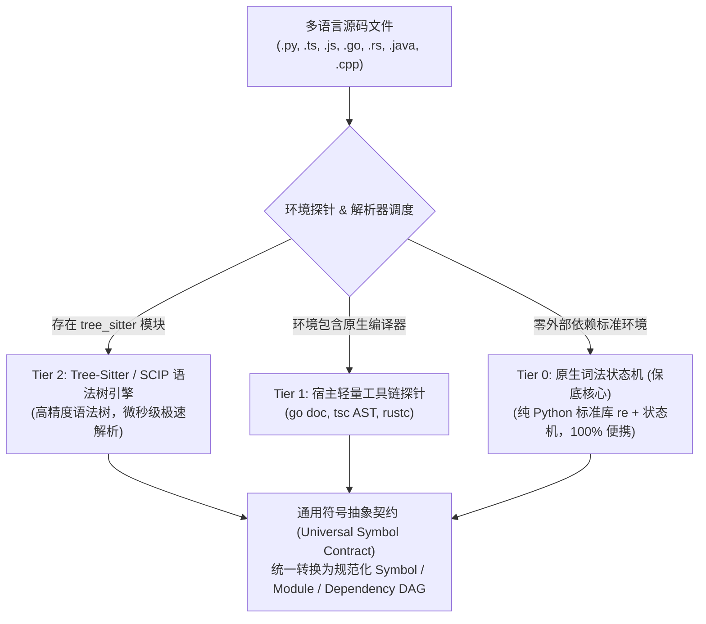
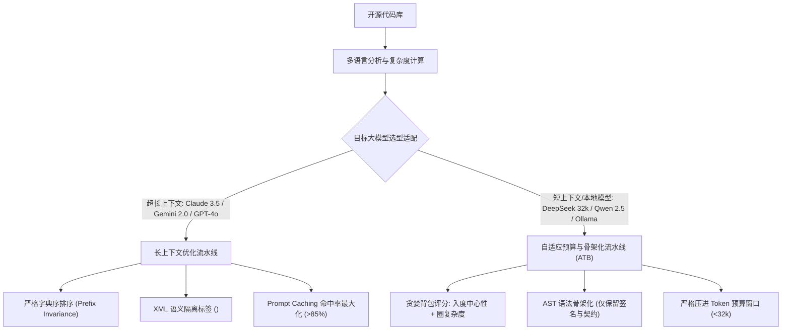

# 多语言解析、跨平台环境兼容与大模型上下文适配指南
## <i>Polyglot Parsing, Environmental Resilience, and LLM Context Engineering Architecture</i>

---

## 1. 多语言支持体系 (Polyglot Support Architecture)

为了贯彻 ASSS 标准“零强制三方依赖、开箱即用”原则，本技能采用**分层渐进式降级体系 (Multi-Tier Progressive Degradation)**：



### 1.1 通用符号抽象契约 (Universal Symbol Contract - USC)
无论是哪种编程语言，最终统一映射为标准数据模型：
- **符号类型 (SymbolKind)**: `MODULE`, `CLASS`, `INTERFACE`, `STRUCT`, `ENUM`, `TRAIT`, `FUNCTION`, `METHOD`, `TYPE_ALIAS`
- **可见性 (Visibility)**: `PUBLIC` (如 Go 首字母大写, Rust `pub`, TS `export`), `PRIVATE`, `PROTECTED`
- **通用符号 (UniversalSymbol)**:
  - `name`: 符号标识符；
  - `kind`: 符号类别；
  - `visibility`: 公共或私有；
  - `line_span`: 起止行号；
  - `parameters`: 参数名列表及类型注解；
  - `return_type`: 返回值类型标注；
  - `docstring`: 注释与文档说明；
  - `complexity`: 圈复杂度评估 (McCabe Metric)。

### 1.2 多语言依赖提取与状态机规则
词法状态机首先剥离行注释（`//`, `#`）、多行注释（`/* ... */`）和字符串字面量（`"..."`, `'...'`, `` `...` ``），杜绝注释中的关键词引起误判：
1. **Python**: 使用标准库 `ast` 进行编译器级深度解析；
2. **TypeScript / JavaScript**:
   - 解析 `export [default] (class|interface|type|enum|function|const) <Name>`；
   - 解析 `import ... from './path'` 与 `require('./path')`，映射本地相对路径；
3. **Go**:
   - 解析 `package <name>`, `import ( ... )`；
   - 解析 `type <Name> (struct|interface)` 与 `func [(receiver)] <Name>(...)`；
   - 首字母大写自动标记为 `PUBLIC`，其余为 `PRIVATE`；
4. **Rust**:
   - 解析 `mod <name>`, `use crate::...` 与 `use super::...`；
   - 解析 `[pub] (struct|enum|trait|fn) <Name>` 与 `impl <Name>`；
5. **Java / C++**:
   - 解析 `[public] (class|interface) <Name>`, `[public] <Type> <methodName>(...)`；
   - 解析 `import package.*` 与 `#include "local_header.h"`。

---

## 2. 跨平台运行环境兼容性 (Environmental Resilience)

### 2.1 操作系统兼容矩阵与防护

| 操作系统 | 核心潜在风险 | 架构防御机制 |
| :--- | :--- | :--- |
| **Windows**<br/>(PowerShell / CMD) | 1. 路径反斜杠导致 Mermaid 转义崩溃<br/>2. 子进程超时后遗留孤儿僵尸进程<br/>3. NTFS 动态文件锁（WinError 32）竞争<br/>4. GBK 默认终端打印 Emoji 乱码崩裂 | 1. 全量路径强制执行 `.as_posix()` 归一化为正斜杠 `/`<br/>2. 引入 Win32 Job Object 或 `taskkill /F /T` 级联回收进程树<br/>3. 文件清理引入带指数退避的重试器 + 只读权限重置<br/>4. CLI 入口显式配置 `sys.stdout.reconfigure(encoding='utf-8')` |
| **Linux / macOS**<br/>(Bash / Zsh / Darwin) | 1. 跨进程组信号无法穿透<br/>2. 外部脚本缺失可执行权限 (`chmod +x`)<br/>3. 恶意外链符号链接突破沙箱根目录 | 1. 子进程配置 `preexec_fn=os.setsid`，超时发送 `SIGKILL` 到全组<br/>2. 执行前自动探测并修复可执行权限<br/>3. 路径校验严格执行 `is_relative_to(repo_root)` |
| **Docker / CI/CD**<br/>(GitHub Actions / GitLab) | 1. Git 凭据或终端交互弹框挂死<br/>2. 标准流缓冲区（64KB）满载导致管道死锁 | 1. 强制注入环境变量 `GIT_TERMINAL_PROMPT=0` 与 `CI=true`<br/>2. 统一使用非阻塞 `communicate(timeout=...)` 排空输出 |

---

## 3. 大模型调用矩阵与上下文经济学适配 (LLM Economics)

不同大模型的上下文窗口、计费策略与注意力机制差异极大，必须实施差异化预处理：



### 3.1 超长上下文模型适配 (Claude 3.5 Sonnet, Gemini 1.5 Pro / 2.0, GPT-4o)
1. **XML 语义边界隔离**：
   相比 Markdown，XML 对嵌套代码更具鲁棒性，杜绝多重三反引号引发的格式截断：
   ```xml
   <repository_context name="spatial_core" total_tokens="42500">
     <architecture_overview>
       <!-- Mermaid DAG & Public API Matrix -->
     </architecture_overview>
     <source_files>
       <file path="core/transform.py" language="python" complexity="12">
         <![CDATA[ ... code content ... ]]>
       </file>
     </source_files>
   </repository_context>
   ```
2. **Prompt Caching 字节级前缀一致性策略**：
   - 彻底移除生成时间戳、临时 UUID 等动态前置噪音；
   - 全仓文件按 POSIX 相对路径进行全局字典序排序；
   - 保证底层代码包的文本哈希恒定，使大模型服务商（Anthropic / Google）稳定命中 KV 缓存，调用成本暴降 **90%**。

### 3.2 短上下文与本地开源模型适配 (DeepSeek-V3/R1 32k-64k, Qwen-2.5-Coder 32k, Ollama)
1. **自适应 Token 预算算法 (Adaptive Token Budgeting - ATB)**：
   - 用户设定 `--token-budget 28000`；
   - 分配策略：目录拓扑与元数据 5%，全仓符号骨架 35%，核心关键算子全量展开 45%，交互缓冲 15%。
2. **AST 语法骨架化裁剪器 (Skeletonizer)**：
   - 对非核心模块执行骨架化：保留类、继承、方法签名、参数类型、返回值与 Docstring；
   - 函数内部具体实现替换为 `# ... [Truncated: N lines, McCabe=M]`；
   - 消除大量无用语法噪音，使本地模型（7B/14B/32B）在极小的窗口内依然具备全仓系统级掌控力。
3. **基于入度中心性与圈复杂度的贪婪背包升级算法**：
   $$Score(M) = 0.4 \cdot \text{InDegree}(M) + 0.4 \cdot \text{Complexity}(M) + 0.2 \cdot \mathbb{I}_{\text{Public}}(M)$$
   优先将得分最高的 Top 核心文件展开为完整源代码。

### 3.3 Model Context Protocol (MCP) 兼容性
技能原生输出符合 JSON Schema (Draft 2020-12) 规范的结构化资产，支持直接作为 MCP Server Tool 返回给 Agent 客户端。
