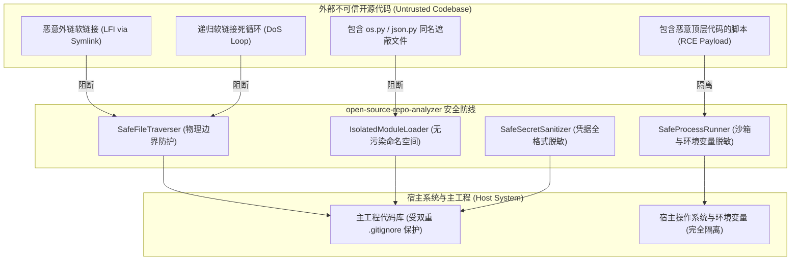

# 开源项目分析质量工程、安全性与可靠性审计规约
## <i>QA Reliability Matrix, STRIDE Threat Modeling, and CI/CD Quality Gates</i>

---

## 1. 威胁建模与风险等级裁决 (STRIDE Threat Model)

针对开源项目分析工具面临的“不受信代码输入（Untrusted Code Inputs）”，实施 STRIDE 威胁建模：



### STRIDE 风险应对矩阵

| STRIDE 威胁分类 | 潜在攻击场景 | 防护加固技术方案 |
| :--- | :--- | :--- |
| **Spoofing (模块仿冒/劫持)** | 外部恶意仓库包含 `os.py` 或 `json.py`，通过 `sys.path.insert(0)` 劫持宿主标准库 | **严禁修改全局 `sys.path[0]`**；采用 `importlib.util.spec_from_file_location` 或在调用时临时挂载并立即弹出 |
| **Tampering (数据篡改)** | 通过 `--output-adapter ../../evil.py` 实施相对路径穿越，覆盖宿主重要文件 | **强制安全边界校验**：严格校验目标路径必须位于工作区内部，严禁逃逸 |
| **Information Disclosure (凭据泄漏)** | 子进程继承宿主敏感环境变量；源码中硬编码私钥随打包流出 | **环境变量白名单过滤**（仅保留 `PATH` 等必要键）；部署生产级多格式密钥脱敏正则库 |
| **Denial of Service (DoS 拒服)** | 递归软链接导致栈溢出；超大仓库造成内存 OOM；超大图表压垮渲染器 | **已访问 Inode 去重**；文件流式读取；拓扑图节点截断聚合保护 (Top 30) |
| **Elevation of Privilege (提权/RCE)** | 模拟运行 `--help` 时脚本顶层语句包含恶意命令，在宿主直接执行 | **非破坏性静态参数解析优先**；子进程执行剥离特权并施加硬超时与进程树销毁 |

---

## 2. 核心漏洞加固规范 (Remediation Specifications)

### 2.1 物理边界与符号链接防逃逸 (`SafeFileTraverser`)
1. **防止文件读取越界**:
   对所有待读取文件执行 `path.resolve()`，必须满足 `resolved.is_relative_to(repo_root)`；若符号链接指向仓库外部，必须立即跳过并记录安全告警。
2. **防止软链接循环死锁**:
   维护已遍历目录的 `(st_dev, st_ino)` 元组集合。遇到重复 Inode 时立即中断递归，从根源消除 `RecursionError`。

### 2.2 子进程安全隔离与进程树回收 (`SafeProcessRunner`)
1. **环境变量强制脱敏**:
   ```python
   SAFE_ENV_KEYS = {"PATH", "SYSTEMROOT", "TEMP", "TMP", "PYTHONPATH", "LANG", "LC_ALL", "CI"}
   sanitized_env = {k: v for k, v in os.environ.items() if k.upper() in SAFE_ENV_KEYS}
   ```
   宿主包含的 `AWS_*`, `GITHUB_TOKEN`, `OPENAI_API_KEY`, `DATABASE_URL` 等密钥被 100% 剥离。
2. **跨平台进程树彻底清理**:
   - **Windows**: 在创建进程时配置 `CREATE_NEW_PROCESS_GROUP`，超时后调用 `taskkill /F /T /PID {pid}` 级联终止；
   - **Linux / macOS**: 配置 `preexec_fn=os.setsid`，超时后向进程组发送 `os.killpg(os.getpgid(proc.pid), signal.SIGKILL)`。

### 2.3 自适应编码探测与容错
不再盲目通过首字节 `b"\x00"` 判定二进制，增加对 **UTF-16LE / UTF-16BE (含 BOM)** 的前置识别：
```python
# 编码探测优先次序:
# 1. UTF-8 (最常见)
# 2. UTF-16 (通过 BOM 或成对 null 字符判定)
# 3. GBK / GB18030 (中文主流代码)
# 4. Latin-1 (西欧保底，保证不抛出 Decode 异常)
```

### 2.4 生产级密钥脱敏规则集
覆盖主流云厂商密钥、大模型 API Key（OpenAI, Anthropic, Google）、GitHub PAT、Slack、私钥块及内网 IP 地址，确保分析产物不造成机密外泄。

---

## 3. 五级 CI/CD 质量工程门禁 (Quality Gates)

所有代码提交与发布必须通过以下五道门禁：

```text
Gate 1: 静态语法与代码规范 (Ruff / py_compile: 0 Errors, 0 Warnings)
Gate 2: 严格类型约束校验 (MyPy: 核心数据模型类型完备)
Gate 3: 安全与漏洞扫描 (Bandit: 0 High/Medium 漏洞)
Gate 4: 单元测试覆盖率 (pytest: 核心模块行覆盖率 >= 90%)
Gate 5: 极端边界渗透测试 (针对空仓、超巨型、符号链接、乱码等边界用例 100% 通过)
```
