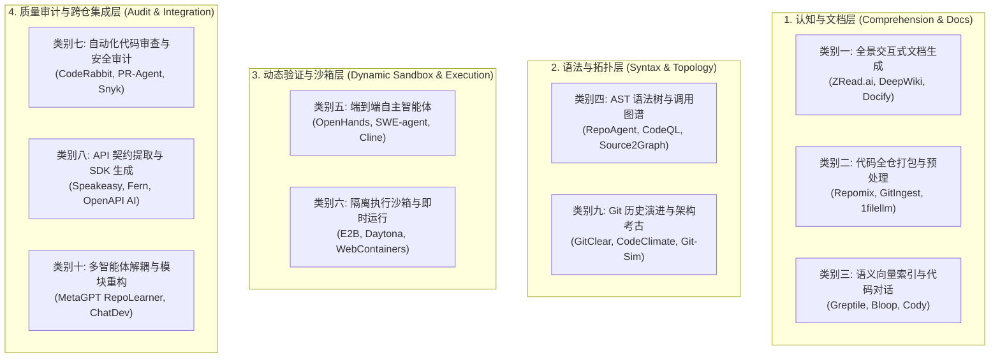
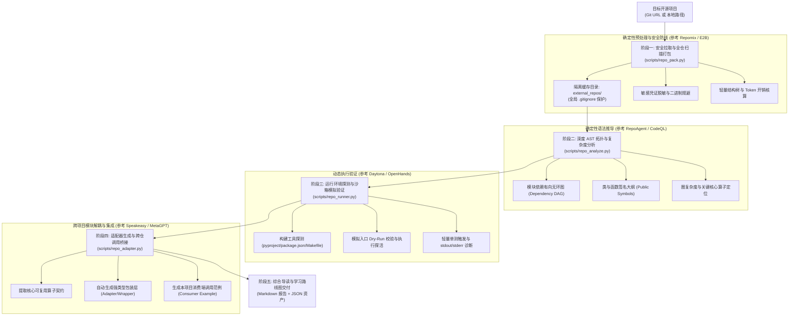

# AI 驱动的开源项目分析体系白皮书：十大流派解构与融合范式
## <i>A Comprehensive Taxonomy and Comparative Analysis of AI-Powered Codebase Comprehension, Simulation, and Integration Platforms</i>

---

## 1. 摘要与行业演化背景 (Executive Summary)

随着以大语言模型（LLM）为核心的软件工程辅助技术从简单的代码补全（Tab Completion）迈向全生命周期智能体（Agentic Software Engineering），如何高效“读懂、分析、验证并复用”复杂的开源项目成为了现代软件开发的核心议题。

开发者面对一个陌生的高复杂度开源代码仓库（如包含数十万行代码、复杂构建链、隐式环境变量依赖以及交错调用拓扑），通常面临四大认知鸿沟：
1. **全景认知断层 (Architecture Blindness)**：缺乏高维架构鸟瞰图，难以快速理清核心分层、设计模式与数据流走向；
2. **上下文过载 (Context Bloat & Cognitive Overload)**：全量代码无法直接塞入有限的 LLM 注意力窗口，简单的文件拼接极易引发“大海捞针”式的注意力稀释与幻觉；
3. **运行时盲区 (Execution Black Hole)**：静态阅读代码无法获知其动态运行行为、环境变量依赖、外部服务拓扑及潜在的运行崩溃；
4. **孤岛复用阻碍 (Integration Barrier)**：想要借鉴或调用开源项目的核心算子，却面临复杂的强耦合依赖、私有接口调用以及缺乏适配层（Adapter）的问题。

为此，业界涌现了形态各异的开源项目分析工具与 AI 服务。本文系统性解构当前主流的 **10 大技术流派**，深度剖析其核心机制、优势劣势及落地瓶颈，并提出取长补短的“认知-分析-模拟-适配”四阶融合工程规范。

---

## 2. 业界十类开源项目分析与 AI 服务深度解构 (The 10 Archetypes)

---

### 类别一：全景交互式文档与 Wiki 知识库生成类
- **代表项目/服务**：`ZRead.ai`（智谱生态）、`DeepWiki`（Cognition / Devin 团队出品及开源镜像 `AsyncFuncAI/deepwiki-open`）、`Docify.ai`、`Readme.com AI`
- **核心工作原理**：
  通过 URL 解析目标仓库（如将 `github.com/user/repo` 替换为 `zread.ai/user/repo` 或 `deepwiki.com/user/repo`），利用自顶向下的分层 Prompt 编排，扫描根目录 `README.md`、包管理文件及主要目录，生成交互式功能导读、架构概览、模块依赖树和按需 Q&A 知识库。提供基于 Model Context Protocol (MCP) 的 Server 插件供 IDE 接入。
- **核心优势 (Pros)**：
  1. **零配置、极速上手**：用户无需本地配置任何环境即可在 Web 端获得结构化导读；
  2. **高阶概念提炼**：擅长将晦涩的代码逻辑转化为人类易于理解的设计模式与业务价值表述；
  3. **生态集成便利**：通过官方提供的 MCP Server，可将结构化项目知识无缝引入 Cursor、Claude Code 等本地智能体。
- **核心缺陷与瓶颈 (Cons)**：
  1. **静态黑盒与次生幻觉**：完全基于静态文本和模型先验推导，不具备真实运行环境，常在细节参数、私有接口契约上产生幻觉；
  2. **深度不足**：对底层调用链（Call Graph）和边界异常无法做到可验证的代码级追踪；
  3. **无法脱机使用**：强依赖云端商业 SaaS 服务，对于私有或离线内网项目支持成本高。

---

### 类别二：代码全仓打包、上下文压缩与 LLM 提示词预处理类
- **代表项目/服务**：`Repomix`（原 `Repopack`，GitHub 20k+ stars）、`GitIngest`（`gitingest.com`）、`Code2Prompt`、`1filellm`
- **核心工作原理**：
  严格遵循 `.gitignore` 和安全敏感词过滤规则（去除 `.git`、二进制文件、构建缓存、环境变量密钥），将整个代码仓库的目录树拓扑与各源文件内容，序列化并打包为一个规整的单文件（支持 XML、Markdown 或 JSON 格式）。提供 Token 压缩机制（去除空行与冗余注释）及 Token 数量精确计数。
- **核心优势 (Pros)**：
  1. **极高确定性与高保真**：纯确定性算法扫描，不改变代码字符，绝无模型幻觉；
  2. **隐私安全与安全防线**：内置敏感信息检测（Secret Scanning），杜绝将私钥或凭证泄露给 LLM；
  3. **生态通用**：打包产物为纯文本，可直接喂给任意长上下文模型（如 Gemini 1.5 Pro / Claude 3.5 Sonnet）。
- **核心缺陷与瓶颈 (Cons)**：
  1. **无语义提炼能力**：仅做物理层面的文件收集与拼接，无法直接告诉开发者“核心业务流程是什么”；
  2. **受限上下文上限与注意力稀释**：对于中大型项目（超 100 万行代码），全仓打包产物动辄数百万 Token，直接超出上下文窗口或引发严重注意力衰减（Lost in the Middle）。

---

### 类别三：代码库语义向量索引、全仓 RAG 与代码对话类
- **代表项目/服务**：`Bloop.ai`、`Greptile`、`Sourcegraph Cody`、`Augment Code`、`GitHub Copilot Chat (Repository Context)`
- **核心工作原理**：
  在代码提交或初始化时，将仓库切片为代码块（Code Chunks），通过专用代码 Embedding 模型生成向量索引，并结合关键词全文检索（BM25）与 AST 符号依赖图构建多路混合检索（Hybrid RAG）。当用户提问时，动态召回最相关的代码片段拼接成上下文后交由 LLM 生成回答。
- **核心优势 (Pros)**：
  1. **横向扩展能力强**：能够轻松索引数千万行代码的超巨型单体仓库（Monorepo）；
  2. **问答精准**：针对“某个特定的报错信息在哪个模块处理”、“某个函数在哪里被定义”等问题定位迅速；
  3. **实时增量更新**：支持基于 Webhook 的增量索引同步。
- **核心缺陷与瓶颈 (Cons)**：
  1. **切片割裂执行流**：单纯依靠向量相似度，容易将原本连续的调用链路（函数 A -> 函数 B -> 函数 C）割裂，忽略深层隐式依赖；
  2. **部署与维护成本昂贵**：构建与维护高质量向量数据库和嵌入管道需要较高的计算资源与专有基础设施；
  3. **依赖云端厂商**：主流优秀工具多为闭源商业平台。

---

### 类别四：AST 抽象语法树解析、依赖拓扑与代码图谱类
- **代表项目/服务**：`RepoAgent`（基于 AST 的自维护代码文档智能体）、`Source2Graph`、`CodeQL`（GitHub 静态安全分析引擎）、`Joern`、`Dependency-Cruiser`、`SCIP/LSIF`
- **核心工作原理**：
  脱离自然语言文本层面，直接利用语言原生编译器解析器（如 Python `ast`、Tree-sitter、Babel、Roslyn），构建 AST、控制流图（CFG）与数据流图（DFG）。提取出类、函数、变量、导入包的完全限定名称（FQN），计算模块入度/出度（In-degree/Out-degree）、拓扑排序以及圈复杂度（Cyclomatic Complexity）。
- **核心优势 (Pros)**：
  1. **绝对数学精度**：函数调用链路与继承层级 100% 真实确定，没有由于概率联想产生的虚假引用；
  2. **逆向架构利器**：能够通过拓扑排序自动理出“底层基础依赖模块 -> 核心业务逻辑 -> 顶层调用入口”的清晰层次；
  3. **量化指标丰富**：提供圈复杂度、代码行数、代码耦合度等客观工程度量。
- **核心缺陷与瓶颈 (Cons)**：
  1. **动态特性盲区**：对动态语言（Python/JavaScript）的反射、动态 `getattr`、动态代理或网络 RPC 调用难以做全静态解析；
  2. **认知门槛高**：输出通常为复杂的有向图或底层符号表，缺乏业务意图与人类可读的架构向导。

---

### 类别五：端到端自主代码智能体与任务执行类
- **代表项目/服务**：`OpenHands`（原 OpenDevin，开源社区标杆）、`SWE-agent` / `mini-swe-agent`（普林斯顿大学 SWE-bench 官方标杆）、`Cline`、`Devv.ai`、`Aider`
- **核心工作原理**：
  构建 ReAct（Reasoning + Acting）或 Reflexion 自主智能体循环。为模型配备完整的计算机控制工具链（终端 Bash 命令行执行、多光标编辑、文件遍历、浏览器检索）。智能体自主阅读任务说明，通过运行测试复现 Bug，在沙箱中探索代码，并在多次试错纠偏后完成工程交付。
- **核心优势 (Pros)**：
  1. **端到端解决能力**：不仅仅是“分析代码”，而是能够自主“修改代码”、“运行验证”并生成 Pull Request；
  2. **动态闭环反馈**：遇到语法错误或测试断言失败，能够自动解析 `stderr` 堆栈并自我纠错（Self-Correction）；
  3. **工具链全面**：能够像真实人类工程师一样调用 git、pip、npm、pytest 等一切系统工具。
- **核心缺陷与瓶颈 (Cons)**：
  1. **计算与 Token 消耗巨大**：执行一次复杂的仓库排查往往需要数十甚至上百次模型推理与多轮系统调用；
  2. **偏向战术修补而非战略理解**：设计目标通常是“解决特定 Issue”，缺乏对整个项目架构的系统化导学与提炼能力；
  3. **偶发失控风险**：在复杂命令行环境中，若无严密的沙箱限制，可能执行破坏性指令。

---

### 类别六：隔离执行沙箱与即时虚拟运行类
- **代表项目/服务**：`E2B`（基于 Firecracker microVM 的 AI 代码解释器）、`Daytona`（开源标准化开发环境管理器）、`StackBlitz WebContainers`（基于 WASM 的浏览器原生 Node.js 运行时）、`Docker / DevContainer`
- **核心工作原理**：
  提供毫秒级冷启动的物理或虚拟隔离环境。E2B 利用 Linux KVM 和 Firecracker 构建轻量级微虚拟机；Daytona 利用 Docker 容器编排标准化开发工作区；WebContainers 利用浏览器端 WASM 编译的 POSIX 仿真内核运行无特权环境。提供完整的进程生命周期管理、文件系统挂载与标准流重定向。
- **核心优势 (Pros)**：
  1. **绝对安全性**：在沙箱中运行未知开源项目的任何代码，即使包含恶意脚本（如 `rm -rf` 或后门挖掘），也不会对宿主系统造成任何破坏；
  2. **运行时确定性**：能够真实安装依赖、运行单元测试、监听端口并捕获 stdout/stderr 输出；
  3. **环境一次性与快照**：支持状态冻结（Snapshot）、秒级重置与会话销毁。
- **核心缺陷与瓶颈 (Cons)**：
  1. **底层基础设施属性**：本身只提供“算力与环境”，不具备上层的智能语义分析与代码理解能力；
  2. **宿主资源与平台依赖**：Firecracker 依赖 Linux KVM 硬件虚拟化；Windows 或嵌套虚拟化环境往往需要降级为普通进程隔离或容器化。

---

### 类别七：自动化代码审查、静态审计与安全合规类
- **代表项目/服务**：`CodeRabbit`、`CodiumAI PR-Agent`、`SonarQube AI`、`Snyk Code`、`Sweep.ai`
- **核心工作原理**：
  在代码合并（PR/MR）阶段触发。结合静态分析规则库（Linters、SAST）、CVE 漏洞库与大语言模型，审查代码变更是否符合安全规范（OWASP Top 10）、许可证合规性（检测 GPL 传染风险）、异常捕获完整性以及单元测试覆盖率。
- **核心优势 (Pros)**：
  1. **生产级安全把关**：快速识别硬编码 Token、SQL 注入、越界访问、缓冲区溢出等高危缺陷；
  2. **开源合规审计**：精确识别开源协议（MIT, Apache-2.0, BSD, GPL, AGPL），评估商业化二次分发法律风险；
  3. **自动化建议精准**：直接提供符合规范的修订代码补丁（Patch）。
- **核心缺陷与瓶颈 (Cons)**：
  1. **局部视野局限**：高度聚焦于增量 Diff，难以对整个开源项目的宏观设计与领域模型做出长远洞察；
  2. **无跨项目调用集成能力**：不负责提取模块或生成跨项目接口包装层。

---

### 类别八：API 契约提取、SDK 逆向与接口客户端生成类
- **代表项目/服务**：`Speakeasy`、`Fern`、`OpenAPI Generator AI`、`Kiota`
- **核心工作原理**：
  自动扫描目标代码库中的接口声明（FastAPI 装饰器、Express 路由、Spring Controller 注解、gRPC `.proto` 或 GraphQL Schema），逆向推导或标准化出 OpenAPI 3.0/3.1 规范或 JSON Schema，随后通过代码生成引擎自动构建类型安全的客户端 SDK（TypeScript、Python、Go 等）。
- **核心优势 (Pros)**：
  1. **跨语言直接复用**：将一个开源服务直接降维为一个开箱即用的 SDK 库；
  2. **类型安全**：生成的代码自带完整的类型声明（Type Hinting / `.d.ts`），杜绝参数类型错误；
  3. **自动化测试套件**：自动配套生成对应端点的 Mock 测试与集成调用示例。
- **核心缺陷与瓶颈 (Cons)**：
  1. **仅适用于 Web/RPC 服务类开源项目**：若目标项目为本地算法库、几何求解器、固件代码或单机 CLI 工具，则完全无法套用；
  2. **忽略内部算子复用**：无法提取非 Web 路由的内部核心算法函数与底层工具类。

---

### 类别九：Git 历史演进、提交意图与架构考古类
- **代表项目/服务**：`GitClear`、`CodeClimate Quality`、`Git-Sim`、`GitHub Copilot Timeline / Octoverse`
- **核心工作原理**：
  利用 Git 原生底层对象（Commits, Trees, Blobs, Tags）与版本差异，计算代码流失率（Code Churn）、修改频次热点（Hotspots）、关键贡献者分布（Bus Factor）以及重大重构节点（Refactoring Commits）。结合提交信息（Commit Messages）与 PR 讨论链，还原架构设计的决策历程（ADR）。
- **核心优势 (Pros)**：
  1. **揭示隐藏意图**：解释代码“为何长成现在这个样子”，揭开历史技术债务与设计权衡背后的真相；
  2. **识别脆弱热点**：高频被修改且测试覆盖率低的模块往往是系统的最大故障温床；
  3. **辅助评估项目健康度**：为开源项目的技术选型提供活跃度、社区治理结构与生命周期状态的科学依据。
- **核心缺陷与瓶颈 (Cons)**：
  1. **信噪比极低**：包含大量格式化提交（Linting）、依赖更新（Dependabot）或无意义的“fix typo”；
  2. **对静态分析无直接助益**：无法直接产出模块调用关系与当前版本的运行可达性证明。

---

### 类别十：多智能体架构逆向与模块解耦重构类
- **代表项目/服务**：`MetaGPT` (RepoLearner / DataInterpreter)、`ChatDev`、`CrewAI Codebase Analyst`、`AutoGen Studio`
- **核心工作原理**：
  基于软件工程角色模型（Software Process Simulation），编排多个垂直智能体进行协作：
  - **架构师 Agent (Architect)**：提炼系统总体抽象边界、技术栈与分层；
  - **分析师 Agent (Analyst)**：逐个模块梳理输入输出与状态转移；
  - **重构工程师 Agent (Refactoring Engineer)**：提取目标算子，解除与原项目全局状态的紧耦合；
  - **测试工程师 Agent (QA Engineer)**：生成跨工程适配层（Adapter）并编写端到端调用的测试用例。
- **核心优势 (Pros)**：
  1. **复杂问题分解**：通过多角色辩论与交叉审查，极大减少单一提示词的理解偏差；
  2. **高阶代码重构与解耦**：能够将开源项目中深度耦合在框架内部的优质算法与工具函数独立抽取出来，生成独立的包装器（Wrapper）。
- **核心缺陷与瓶颈 (Cons)**：
  1. **通信开销高昂与死锁风险**：智能体之间多轮长对话容易导致上下文膨胀、重复发散或在分支条件上陷入死循环；
  2. **必须依赖确定性验证底座**：若各 Agent 的动作没有在真实的宿主沙箱与 AST 语法树上进行强制物理验证，生成的重构代码往往“看似优雅却无法运行”。

---

## 3. 十大流派全景多维对比矩阵 (Comprehensive Comparison Matrix)

| 流派分类 | 代表项目 | 核心输入形式 | 输出交付资产 | 架构认知深度 | 运行模拟能力 | 模块提取与调用 | 确定性保障 |
| :--- | :--- | :--- | :--- | :---: | :---: | :---: | :---: |
| **1. 交互式文档生成** | `ZRead.ai`, `DeepWiki` | GitHub URL | 结构化导读 / Web Wiki | ★★★★☆ | ☆☆☆☆☆ | ★★☆☆☆ | 弱 (纯模型推导) |
| **2. 代码全仓打包** | `Repomix`, `GitIngest` | 本地/远程仓库 | 单一 XML/MD 上下文包 | ★☆☆☆☆ | ☆☆☆☆☆ | ★☆☆☆☆ | 极强 (100% 确定) |
| **3. 语义向量索引** | `Greptile`, `Bloop` | 全仓索引库 | 对话回答 / 代码引用片段 | ★★★☆☆ | ☆☆☆☆☆ | ★★☆☆☆ | 中 (依赖检索质量) |
| **4. AST 图谱与调用拓扑** | `RepoAgent`, `CodeQL` | 源码语法树 | DAG / 符号表 / 复杂度 | ★★★★☆ | ★☆☆☆☆ | ★★★☆☆ | 极强 (数学编译器级) |
| **5. 端到端自主智能体** | `OpenHands`, `SWE-agent` | Issue / 任务 Prompt | PR / 修复补丁 / 执行日志 | ★★★☆☆ | ★★★★★ | ★★★☆☆ | 强 (依赖测试反馈) |
| **6. 隔离沙箱与虚拟运行** | `E2B`, `Daytona` | 代码容器 / 镜像 | 独立隔离环境 / 执行结果 | ☆☆☆☆☆ | ★★★★★ | ★★★☆☆ | 极强 (硬件/容器隔离) |
| **7. 自动化审计与审查** | `CodeRabbit`, `PR-Agent` | Git Diff / 源码 | 漏洞清单 / 改进补丁 | ★★☆☆☆ | ★★☆☆☆ | ★☆☆☆☆ | 强 (结合 SAST) |
| **8. API 契约与 SDK 生成** | `Speakeasy`, `Fern` | 路由声明 / 注解 | OpenAPI / 跨语言 SDK | ★★☆☆☆ | ★★★☆☆ | ★★★★★ | 极强 (基于契约) |
| **9. Git 历史与架构考古** | `GitClear`, `Git-Sim` | `.git` 提交日志 | Churn 图 / 演进时序图 | ★★★☆☆ | ☆☆☆☆☆ | ☆☆☆☆☆ | 极强 (Git 元数据) |
| **10. 多智能体解耦重构** | `MetaGPT`, `ChatDev` | 源码 + 重构目标 | 适配器代码 / 解耦子模块 | ★★★★☆ | ★★★☆☆ | ★★★★★ | 中 (依赖提示词协同) |

---

## 4. 取长补短：开源项目分析与调用技能 (open-source-repo-analyzer) 架构设计

为了彻底克服现有工具“文档工具不能跑、沙箱工具看不懂、打包工具超窗口、多智能体常发散”的痛点，本仓库依据 **ASSS v1.0** 协议，设计并落地 **`open-source-repo-analyzer`** 技能，构建四大能力闭环：

### 关键设计取舍与工程突破：
1. **安全隔离第一性原则**：
   所有通过 Git 克隆或解压的第三方外部仓库，统一存放于本项目根目录下的 **`external_repos/`** 隔离文件夹内。该目录在全局 `.gitignore` 与目录内 `.gitignore` 中双重标明忽略，严禁第三方未经审计代码混入主工程 Git 历史。
2. **算法确定性优先**：
   语法树分析、依赖图生成、Token 计数、复杂度计算均采用纯 Python 原生算法（`ast`、`pathlib`、`re`、`subprocess`）编写，不依赖概率型 LLM 生成虚构调用链。
3. **零侵入式沙箱探活**：
   模拟运行优先采用非破坏性的 Dry-Run（如 `python -m py_compile` 语法校验、`pytest --collect-only` 测试搜集、`importlib` 动态探测），避免任意命令执行危害宿主机。
4. **即插即用的调用包装**：
   不仅告诉用户“这个开源库是做什么的”，更自动生成规范的适配器文件（Adapter），使主工程能够像调用本地模块一样优雅调用外部开源项目。
