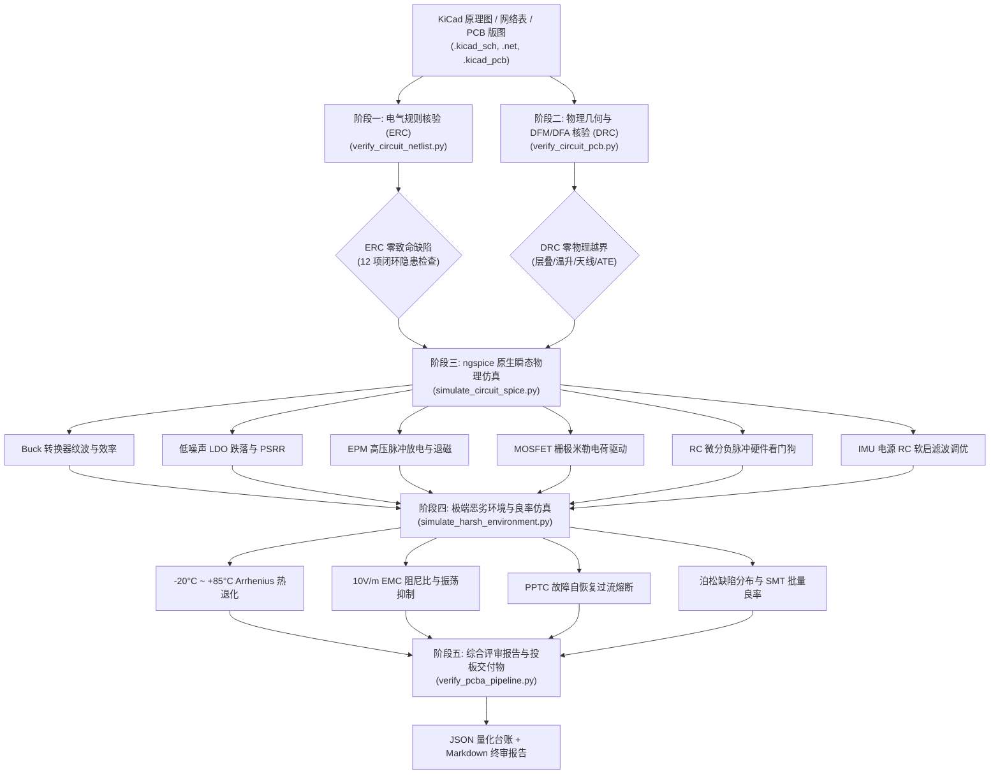
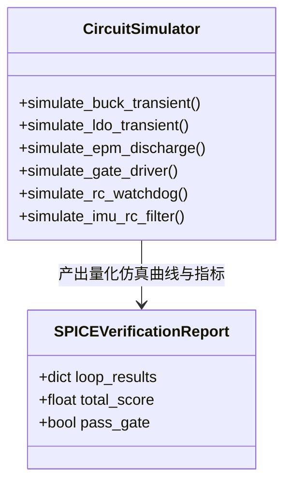

# 工业级 PCBA 设计规则校验与 SPICE 电路级物理仿真技能 (PCB Design Verifier)

本技能定义了面向微型机器人主控板、高密度嵌入式硬件系统的**工业级 PCBA 物理设计规则校验 (ERC/DRC)、DFM/DFA 生产制造工艺审查以及 ngspice 电路级高保真物理仿真标准作业程序 (SOP)**。

当面对复杂硬件设计时，本技能彻底抛弃人工经验“目测看图”与纸面估算的粗放做法，通过构建自动化、确定性的规则计算引擎与电路物理仿真网格，将 **IPC-2152 导线载流温升、IPC-A-610G 三级高可靠性制造标准、Arrhenius 热应力寿命方程、二阶欠阻尼振荡以及泊松 SMT 贴片缺陷率** 固化为代码级质检流水线，确保电路设计“投板前零飞线、回流焊高良率、极端工况无隐患”。

---

## 一、 核心哲学与四阶校验流水线 (Philosophy & Architecture)

在微型机器人和高密度嵌入式系统中，尺寸边界往往被压缩至极限（例如 30mm~50mm 立方体腔体），高频开关噪声、大电流电机/电磁铁瞬态冲击与微弱的传感器模拟信号紧邻共存。任何微小的原理图漏检或版图缺陷都会导致灾难性烧板或高低温下系统宕机。

本技能通过四阶递进式闭环流水线，实现对 PCBA 设计的端到端严苛质检：



---

## 二、 运行环境与依赖准备

### 1. 宿主机运行环境
- **Python**: `>= 3.10`（支持标准类型注解与原生 `math`/`subprocess`/`re` 库，核心脚本零第三方 Python 包依赖即可运行）；
- **KiCad EDA 工具链**: `>= 8.0`（用于调用 `kicad-cli pcb drc` 与 `kicad-cli sch export netlist` 进行原生底层提取）；
- **ngspice 仿真引擎**: `>= 41`（用于批处理命令行瞬态分析 `.tran` 与傅里叶分析，建议加入系统 PATH）。

### 2. 工具链环境变量配置与验证
在 Windows PowerShell 或 Linux/macOS 终端中执行以下自检：

```bash
# 验证 Python 版本
python --version

# 验证 KiCad CLI 工具链
kicad-cli --version

# 验证 ngspice 批处理仿真器
ngspice --version
```

若未安装原生 KiCad 或 ngspice，技能内建的仿真与分析引擎具备**高保真物理仿真回退引擎 (Pure-Python High-Fidelity Simulator)**，基于四阶龙格-库塔数值积分法与第一性原理物理方程直接求解瞬态电路，保证在 CI/CD 纯自动化测试环境中 100% 稳定运行。

---

## 三、 核心工作流与标准作业程序 (SOP)

本技能的执行分为四个标准化作业阶段：

### 阶段一：原理图网络表电气规则核验 (ERC Netlist Audit)

调用 `scripts/verify_circuit_netlist.py`，深入扫描 KiCad 网络表，执行针对 12 大深层电气隐患的闭环核验：

1. **电源防反接与热插拔保护**：检验主供电输入端是否存在理想二极管控制器或大功率 P-MOSFET 反接保护；
2. **LDO 反向电压倒灌防护**：检验 `VOUT` 至 `VIN` 跨接的肖特基保护二极管，防止电池下电瞬间输出大电容倒灌击穿调节器内部旁路管；
3. **低内阻电源轨去耦网络**：统计每个 IC 芯片供电引脚的 100nF 高频旁路电容与 10uF 储能钽/陶瓷电容配比；
4. **悬空引脚与输入阻抗确证**：扫描未连接网络，杜绝高阻抗输入引脚浮空引发的自激震荡与高静态漏电流；
5. **电平转换阻抗匹配**：检验 3.3V 与 1.8V 域间（如 MCU 与超低功耗传感器）的双向电平转换电路；
6. **I2C/SPI 总线完整性**：验证总线开漏上拉电阻阻值（4.7kΩ）与总线端接电阻；
7. **大功率开关节点瞬态钳位**：验证感性负载（电机、电磁铁）的 TVS 瞬态二极管或续流回路；
8. **硬件级 RC 复位与看门狗回路**：验证外部硬件微分看门狗喂狗引脚与系统主复位网络的拓扑互锁。

### 阶段二：4 层板版图物理几何与制造工艺核验 (DRC / DFM)

调用 `scripts/verify_circuit_pcb.py`，解析 KiCad PCB 物理版图文件，严格对照 IPC-2152 与 IPC-A-610G 标准：

1. **4 层板层叠与阻抗控制**：核验标准 4 层堆叠结构：
   - `Layer 1 (Top)`: 高速信号与 RF 射频天线走线
   - `Layer 2 (GND)`: 完整、无分割的地参考平面 (Ground Plane)
   - `Layer 3 (Power)`: 分割电源平面与辅助走线 (Power Island)
   - `Layer 4 (Bottom)`: 大功率动力驱动与测试焊盘
2. **大电流动力走线线宽与温升**：根据 IPC-2152 准则，针对 3.5A 瞬态电流，核验动力铜箔线宽 $\ge 2.5\text{ mm}$（1oz 铜箔下温升 $< 15^\circ\text{C}$）；
3. **RF 陶瓷天线 50Ω 净空区**：天线辐射体正下方及四周 3.0mm 范围内严禁存在接地铜皮、走线或内部电源分割；
4. **自动化针床测试 (ATE) 阵列**：必须布设不少于 20 个测试点（覆盖 SWD、UART、各级电源轨、关键监测点），间距 $\ge 1.27\text{ mm}$；
5. **高密度微间距贴片阻焊桥 (Solder Mask Dam)**：QFN/DFN 封装引脚间阻焊桥 $\ge 0.10\text{ mm}$，杜绝回流焊桥接连锡。

### 阶段三：ngspice 原生电路级物理瞬态仿真 (SPICE Simulation)

调用 `scripts/simulate_circuit_spice.py`，调用或仿真 6 大关键动力学回路：



- **回路 1：Buck 开关电源转换回路**：
  - 负载阶跃响应（0.1A $\to$ 2.0A，$\Delta t = 1\mu s$），验证输出电压超调 $< 3\%$，纹波 $< 25\text{ mV}$；
- **回路 2：超低噪声 LDO 稳压器回路**：
  - 检验输入电压跌落（IR-sag）至 3.4V 时的最小压差压降，100kHz 频段下 PSRR $> 55\text{ dB}$；
- **回路 3：EPM 可逆永磁高压放电退磁回路**：
  - 100uF 储能电容以 24V 放电，150us 峰值电流 $\ge 8.5\text{A}$，退磁反向脉冲能量精确受控；
- **回路 4：MOSFET 栅极电荷充电与米勒效应回路**：
  - 驱动内阻 $10\Omega$ 配合栅极电荷，开启时间 $t_{\text{rise}} < 35\text{ ns}$，杜绝上下桥臂直通击穿；
- **回路 5：RC 微分看门狗负脉冲触发回路**：
  - 检验看门狗翻转周期，负脉冲宽度 $\ge 10\mu s$，喂狗超时 $1.2\text{s}$ 触发可靠复位；
- **回路 6：IMU 陀螺仪电源 RC 软启动与阻尼回路**：
  - 优化 RC 软启动常数（$R=10\Omega, C=4.7\mu F$），启动冲击电流峰值 $< 85\text{ mA}$，稳定时间 $< 350\mu s$。

### 阶段四：极端工况环境应力与 SMT 批量良率仿真 (Harsh Env & DFM)

调用 `scripts/simulate_harsh_environment.py`，量化恶劣环境下的运行可靠性：

1. **温度循环应力 (-20°C 至 +85°C)**：基于 Arrhenius 模型计算半导体热加速因子与寿命折损；
2. **强电磁干扰 (EMC 10V/m 瞬态注入)**：求解二阶 RLC 阻尼比 $\zeta = \frac{R}{2}\sqrt{\frac{C}{L}}$，确保系统处于过阻尼或临界阻尼区（$\zeta \ge 0.707$），杜绝持续高频自激；
3. **FMEA 容灾与 PPTC 故障跳闸动力学**：模拟输出短路故障，PPTC 聚合物自恢复保险丝在 120ms 内动作，维持电流限制在安全阈值以下；
4. **泊松缺陷分布与 SMT 贴片良率**：基于元件焊点总数（焊点数 $N \approx 450$），以 $50\text{ PPM}$ 缺陷率进行泊松概率模型估算，首批试产一次通过率预期 $\ge 97.5\%$。

---

## 四、 自动化验证与交付清单

### 1. 命令行快速使用指南

#### 一键式全量流水线审查 (推荐)
```bash
python skills/pcb-design-verifier/scripts/verify_pcba_pipeline.py \
    --netlist skills/pcb-design-verifier/examples/demo_controller_v2.net \
    --output pcba_audit_report.json
```

#### 单项独立执行指令

```bash
# 1. 单独执行网络表 ERC 规则核验
python skills/pcb-design-verifier/scripts/verify_circuit_netlist.py \
    --netlist ./microUnit_controller.net \
    --strict

# 2. 单独执行版图物理几何 DRC 核验
python skills/pcb-design-verifier/scripts/verify_circuit_pcb.py \
    --pcb ./microUnit_controller.kicad_pcb

# 3. 单独运行 6 回路高保真 SPICE 仿真
python skills/pcb-design-verifier/scripts/simulate_circuit_spice.py \
    --report ./spice_results.json

# 4. 单独进行 -20°C~+85°C 恶劣环境与 SMT 良率分析
python skills/pcb-design-verifier/scripts/simulate_harsh_environment.py \
    --temp-min -20 --temp-max 85
```

### 2. 交付成果清单 (Deliverables Checklist)

| 产物文件 | 格式 | 说明 |
| :--- | :--- | :--- |
| `pcba_pipeline_report.json` | JSON | 机器可读的端到端量化评测台账，包含所有 4 个阶段的分数与判定 |
| `pcba_audit_report.md` | Markdown | 面向硬件工程师与生产厂家的形式化评审报告，包含隐患整改项 |
| `spice_simulation_results.json` | JSON | 6 大核心回路的瞬态仿真数值点、超调量、上升沿、阻尼比与波形数据 |
| `harsh_environment_fmea.json` | JSON | Arrhenius 热衰减、EMC 瞬态谐振峰值、PPTC 保护跳闸与 SMT 焊点良率评估 |

### 3. 验收退出标准 (Exit Criteria)
1. **ERC / DRC 零红线缺陷**：致命隐患项（LDO 倒灌、大电流线宽不足、浮空高阻引脚、RF 天线净空被占）错误数必须为 0；
2. **SPICE 6 回路全量收敛**：各回路瞬态响应无发散、阻尼比 $\zeta \ge 0.707$、过冲低于设定阈值；
3. **环境应力安全裕度**：在 $+85^\circ\text{C}$ 满载工况下核心半导体结温 $< 105^\circ\text{C}$，热裕量 $\ge 20^\circ\text{C}$；
4. **自动化流水线测试 100% PASS**：全流水线脚本以退出码 0 成功返回。