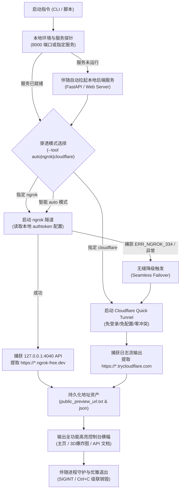

# Public Service Tunnel Skill (公网服务在线预览与内网穿透通用技能)

本技能定义了本地服务（Web 应用、3D 可视化仿真平台、Gradio/Streamlit 交互界面、REST/WebSocket API 等）**跨公网快速在线预览、全自动多通道内网穿透部署与生命周期协同管理**的标准工程协议与工具套件。

无论宿主机处于复杂局域网、多层 NAT、企业防火墙还是无公网 IP 环境，本技能均可实现**免系统管理员权限、零人工干预、智能容灾降级**的秒级公网 HTTPS 访问链路生成。

---

## 一、 痛点分析与双轨容灾架构 (Architecture & Pain Points)

在进行软硬件在环（HIL/SIL）仿真或全栈 Web 效果预览时，开发者常遭遇三大工程瓶颈：

1. **权限受限**：多数生产或企业 Windows/Linux 终端没有系统 root 或管理员提权权限，传统包管理器（如 `choco`、`apt`）会因权限受阻而报错失败。
2. **ngrok 免费域名排他性冲突 (`ERR_NGROK_334`)**：
   - ngrok 官方免费账号仅分配 1 个固定静态域名（如 `xxx.ngrok-free.dev`）。
   - 若用户在另一台机器或旧项目中已有活跃 ngrok 进程占用了该端点，新启动的实例将直接抛出 `ERR_NGROK_334: endpoint is already online` 并异常退出。
3. **安全拦截与客户端白屏**：ngrok 免费域名首次通过浏览器访问时存在反钓鱼拦截页（`ERR_NGROK_6024`），若未自动注入 `ngrok-skip-browser-warning` 头或未明确告知用户点击 `[Visit Site]`，常导致第三方访问者误判服务宕机。

### 双轨智能路由架构 (Multi-Channel Failover)



---

## 二、 核心工具矩阵与对比 (Tooling Matrix)

| 特性维度 | ngrok (官方标准) | Cloudflare Quick Tunnel | localtunnel |
| :--- | :--- | :--- | :--- |
| **安装方式** | 绿色免安装单文件 (`ngrok.exe`) | 绿色免安装单文件 (`cloudflared.exe`) | Node.js npm / npx |
| **账户依赖** | 需注册并绑定 Authtoken | **完全免注册、免登录、免配置** | 免注册 |
| **域名稳定性** | 账户绑定单专属静态域名 | 每次生成随机子域名 | 随机或指定子域名 |
| **并发多实例** | 免费版受限 (多实例抛 ERR_NGROK_334) | **无并发数量限制 (高可用零冲突)** | 容易被限流 |
| **国内/国际网络** | 依赖官方 CDN 节点 | Cloudflare 全球边缘 Anycast 网络 | 节点延迟波动较大 |
| **首访拦截页** | 存在安全提示页 (需跳过) | **直接穿透，无任何拦截提醒页** | 需输入公网 IP 确认 |

---

## 三、 脚本工具链与目录规范 (Directory Structure)

所有自动化核心逻辑统一归集在 `skills/public-service-tunnel/scripts/` 中，保持与宿主业务完全解耦：

```text
skills/public-service-tunnel/
├── SKILL.md                          # 技能规范、架构图与工程指引
├── examples/
│   ├── config.example.json           # 项目配置样例文档
│   └── quick_start.py                # Python API 极简调用范例
└── scripts/
    ├── install_tools.py              # 跨平台 (Win/Linux/macOS) 自动下载解压器
    ├── tunnel_manager.py             # 通用穿透管理引擎 (主入口)
    └── service_probe.py              # 本地与公网服务健康状态与延迟探针
```

---

## 四、 快速使用指南 (Usage Guide)

### 1. 自动智能模式 (推荐)
自动检测端口 8000，优先尝试 ngrok 专属域名；若被其他设备占用则在 2 秒内秒级无缝切换至 Cloudflare 隧道：
```bash
python skills/public-service-tunnel/scripts/tunnel_manager.py --tool auto --port 8000
```

### 2. 指定使用 Cloudflare 极速免登录隧道
完全不需要任何 Token，即开即用：
```bash
python skills/public-service-tunnel/scripts/tunnel_manager.py --tool cloudflare --port 8000
```

### 3. 指定配置 ngrok Token 并启动
```bash
python skills/public-service-tunnel/scripts/tunnel_manager.py --tool ngrok --token "YOUR_NGROK_AUTHTOKEN" --port 8000
```

### 4. 伴随拉起本地服务 (One-Command All-In-One)
若本地服务尚未启动，可传入 `--cmd` 命令，管理引擎将先拉起服务，等待端口开放后再接管公网映射：
```bash
python skills/public-service-tunnel/scripts/tunnel_manager.py \
  --tool auto \
  --port 8000 \
  --cmd "python simulation/server.py"
```

### 5. 服务与公网健康自检探针
```bash
# 检测本地端口
python skills/public-service-tunnel/scripts/service_probe.py http://127.0.0.1:8000

# 检测公网穿透 URL
python skills/public-service-tunnel/scripts/service_probe.py https://mortgage-cooperative-honor-moral.trycloudflare.com
```

---

## 五、 工程集成最佳实践 (Engineering Best Practices)

1. **大二进制文件版本隔离 (`.gitignore`)**：
   `tools/bin/*.exe`、`*.zip` 等编译产物不可直接入库 Git，需在 `.gitignore` 中声明屏蔽；项目团队成员通过 `python skills/public-service-tunnel/scripts/install_tools.py` 即可在数秒内自动恢复工具链。
2. **WebSocket 跨域与协议升级**：
   三维仿真平台（如 Three.js / MuJoCo Telemetry）使用 WebSocket 时，后端 FastAPI / Tornado 需配置 `allow_origins=["*"]`，前端 WebSocket URL 需依据当前页面协议动态转换（`window.location.protocol === 'https:' ? 'wss://' : 'ws://'`）。
3. **前端资源相对路径规范**：
   HTML/JS 内引用的静态 CSS、三维模型（GLTF/OBJ）、纹理贴图必须使用相对路径（如 `./css/style.css` 而非 `/css/style.css`），确保反向代理路径挂载与多层 URL 重写下正常寻址。
4. **进程级联终止**：
   穿透进程退出时，必须捕获系统 `SIGINT` 与 `SIGTERM` 信号，连同伴随子进程一并显式杀死，避免本地 8000 端口被僵尸进程霸占。
